# Week 6

## Purpose: Image Sentiment Classification

本次作业为人脸表情情绪分类，总共有七种可能的表情（0：生气, 1：厌恶, 2：恐惧, 3：高兴, 4：难过, 5：惊讶, 6：中立(难以区分为前六种的表情))。

本次作业利用 training dataset 训练一个 CNN model，预测出每张图片的表情 label（同样地，为 0~6 中的某一个)，并跟参数个数差不多的 DNN model 去进行比较。

## Data 简介

* training dataset 为两万八千张左右 48x48 pixel的图片，以及每一张图片的表情 label（注意：每张图片都会唯一属于一种表情）。

* Testing dataset 则是七千张左右 48x48 的图片

* 如下图，由左至右依序为生气、厌恶、恐惧、高兴、难过、惊讶、中立

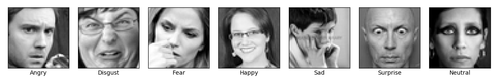

* 各类别数量
<table style="width:50%">
  <tr>
    <td>**0：生气** </td> 
    <td> 3995 </td> 
  </tr>
  
  <tr>
    <td>**1：厌恶**</td>
    <td> 436 </td> 
  </tr>
  
  <tr>
    <td>**2：恐惧**</td>
    <td> 4097 </td> 
  </tr>

  <tr>
    <td>**3：高兴**</td>
    <td> 7215 </td> 
  </tr>

  <tr>
    <td>**4：难过**</td>
    <td> 4830 </td> 
  </tr>

  <tr>
    <td>**5：惊讶**</td>
    <td> 3171 </td> 
  </tr>

  <tr>
    <td>**6：中立**</td>
    <td> 4965 </td> 
  </tr>
  
</table>

## Summary 总结

在资料处理的部分，先将 training data 进行标准化，并取出最后 5000 资料当作 validation data (大约 20% 资料量)。

首先 CNN model 模型架构如下图所示，其中 C1、C2、C3、C4 为 Convolution block，包含 Convolution2D()、BatchNormalization()、Activation()、MaxPooling2D() 和 Dropout()。

- Convolution2D() : Filter Size 均为 (3,3)，Strides 均为 1
- BatchNormalization() : 让每批量的数据分布相似并达到加速收敛的效果，另一个目的为让 training data、validation data 和 testing data 数据分布相似，提高模型的泛化能力和避免 overfitting
- Activation() : 均使用 Relu
- MaxPooling2D() : Pooling size 均为 (2,2)，Strides 均为 2
- Dropout() : C1、C2、C3、C4、FC1、FC2 的 dropout rate 依序为 0.3, 0.3, 0.3, 0.4, 0.5, 0.5

模型总参数数量为 4,183,815，其中有 3968 个是 BatchNormalization() 的 non-trainable 个数。

在 CNN model 训练过程中，可以观察到大约在 20 个 epoch 左右，validation loss 来到了低点，validation accuracy 似乎也到了极限 (63.86%)。在 20 个 epoch 之后 validation accuracy 只有稍为的提升，最好的 validation accuracy 为 65.54% 。

DNN model 模型架构如图下所示，其中 FC1、FC2、FC3、FC4 为 Fully Connection layer，包含 BatchNormalization()、Activation() 和 Dropout()。

- BatchNormalization() : 目的为加速收敛和避免 overfitting
- Activation() : 均使用 Relu
- Dropout() : FC1、FC2、FC3 的 dropout rate 均为 0.5

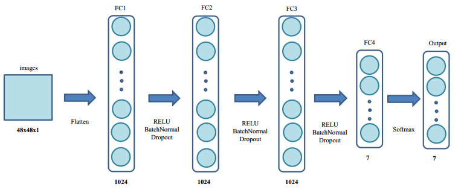

模型总参数数量为 4,478,983，其中有 6,144 个是 BatchNormalization() 的 non-trainable 个数。

在 DNN model 训练过程中，我观察到与 CNN model 差异点有:

- DNN model 的 validation accuracy 完全无法跟 CNN model 相比。
- 训练速度上 DNN model 速度完胜于 CNN model 。 DNN model 一个 epoch 大约 20sec 而 CNN model 约 200sec。个人猜测主要原因为 Convolution 需要消耗比较多的运算。
- 在 validation loss 部分似乎不是很乐观，在 40 个 epoch 之后甚至有上升的趋势。

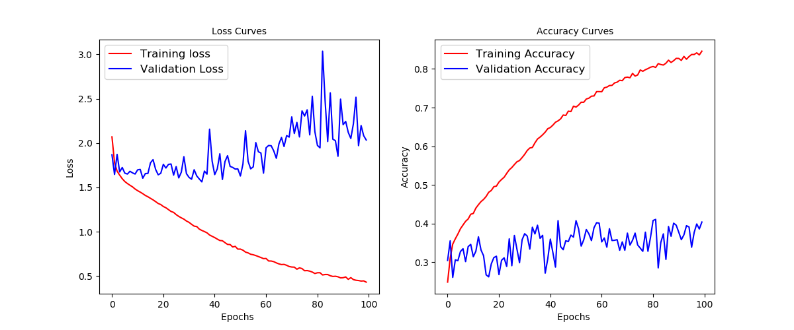

### Confusion Matrix

这个部分分别针对 DNN 和 CNN model 计算 confusion matrix 并且利用视觉化的方式呈现结果。

DNN model 的部分，根据 confusion matrix (下左图) 可以知道，

- 唯独开心 (Hppy) 模型的正确辨识程度高过于 50%，这类刚好也是资料数量最多的类别。
- 模型似乎捕捉不到在各种情绪上的细微差异，导致各类别容易误判。

 CNN model，根据 confusion matrix (下右图) 来看，

- 很清楚的知道各类别预测状况相对于 DNN model 来说进步很多。
- 害怕 (Fear) 很容易会误判成伤心 (Sad)，误判机率大约 22%。
- 中立 (Neutral) 和伤心 (Sad) 相对于模型来说不容易分辨，彼此误判的机率差不多 20%。
- 生气 (Angry) 会被误判成伤心 (sad)，误判机率大约 17%。
- 厌恶 (Disgust) 会被误判成生气 (Angry)，误判机率大约 16%。
- 在开心 (Hppy) 和惊讶 (Surprise) 这种表情鲜明的类别，模型的辨识状况相对而言就会比较好，而生气 (Angry)、厌恶 (Disgust)、害怕 (Fear) 这种複杂的情绪对模型来说相对而言也比较难辨识其中差异，甚至连人类都不太容易分辨出差异点。

    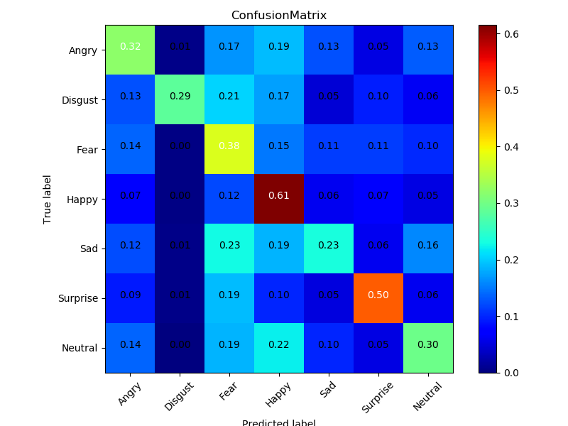
    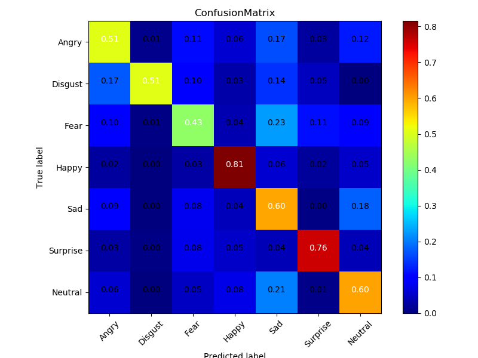

下图我们将各类别预测错误且预测信心最高的图片找出来，可以发现一些有趣的现象:

- 我个人觉得一、三、六、七张测得都相对比 label 好，猜测是 label 标记错误
- 从三、四、六、七隐约可以发现模型判断 Happy 和 Surprise 之间的差别，Surprise 有点像是情绪放大版的 Happy，其中如果嘴巴形状又是接近圆形更可能被判定为 Surprise
- 第五张很难办定是 Neutral 还是 Sad，好像也都可以。

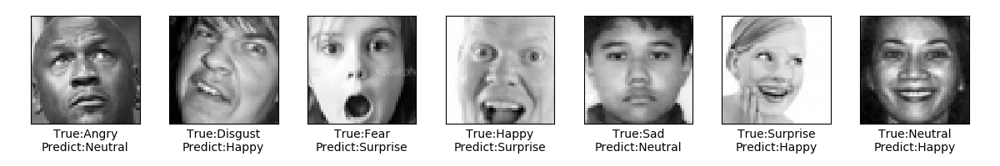

### Saliency Map

这部份主要是要观察图片每个 pixel 对于 CNN model 预测结果的影响力，藉此来了解模型在做分类时主要是 focus 在图片哪个部分。

做法其实很简单，只要针对图片的预测结果对每个 pxiel 进行微分，再取绝对值，就知道哪个 pxiel 对模型预测的影响力比较大。另外先定义符号， 为模型预测的 label， 为图片， 为图片的 pixel ，数学上的表达为  简单说就是该值越大，代表影响力越大。

以下为将上述的内容用视觉化的方式表达出来。下列图中最左边的原图分别从 5000 笔 validation data 中选出的各类别预测正确照片，由上到下 label 分别为 生气 (Angry)#23、厌恶 (Disgust)#189、害怕 (Fear)#53、开心 (Happy)#2、伤心 (Sad)#6、惊讶 (Surprise)#15、中立 (Neutral)#4。

从第四张类别 Happy 的 heatmap 可以发现在嘴巴部分有较高的值，可见模型在做分类时，是将重点放在侦测嘴巴的部分，而这张图被判定为 Happy 的主要依据也是因为嘴巴的笑容。第七张类别 Surprise 的 heatmap 可以发现眼睛和嘴巴部位的值相对于其他部位来的高，很清楚的知道模型再对这类别做分类的重点是在眼睛和嘴巴，其他类别虽然没有特别明显的部位，但主要都将重点放在脸部。

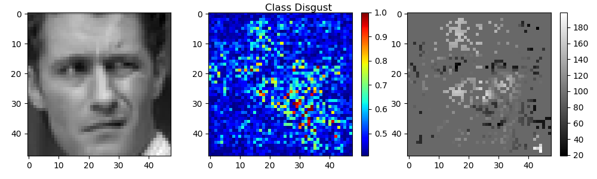

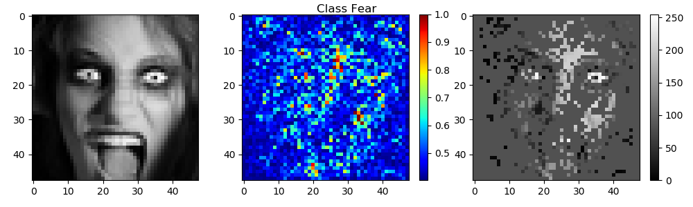

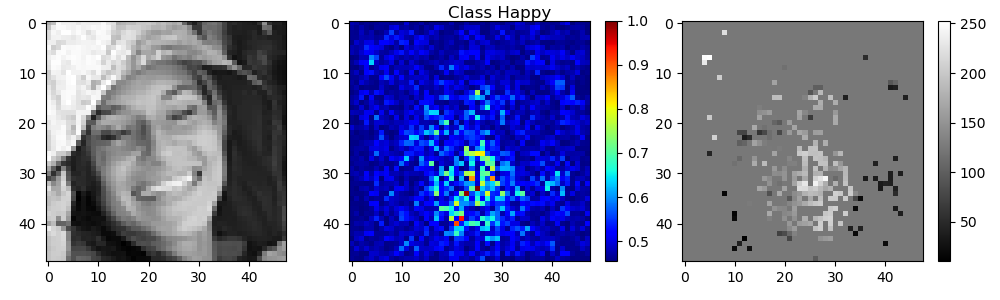

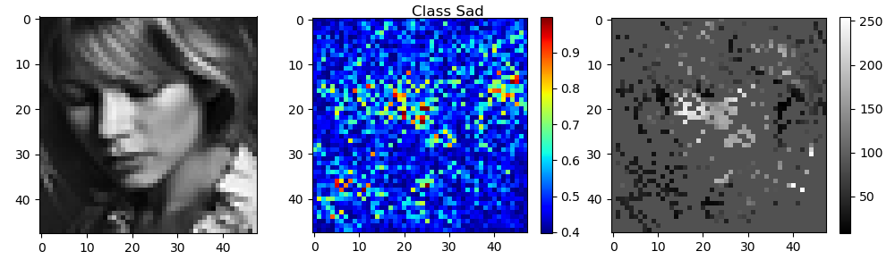

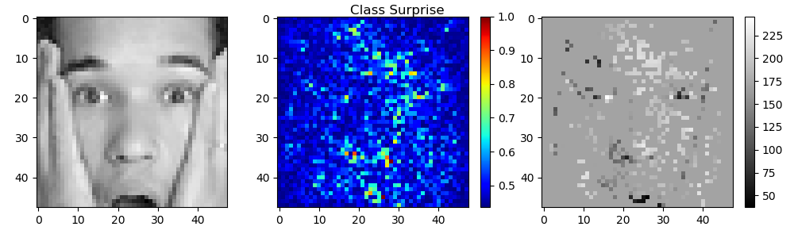

### Visualizing Filters

利用 gradient ascent，观察 filter 被 activate 的情况，以及图片经过 filter 的结果。

下图左边为第一层 convolution 后的 filter，右边为 validation data 中的第二笔资料 (Saliency Map Happy 类别的原图) 经过第一层 convolution 的结果。

    <figcaption>&nbsp;&nbsp;&nbsp;&nbsp;&nbsp;&nbsp;&nbsp;&nbsp;&nbsp;&nbsp;&nbsp;第一层 convolution 后的 filter &nbsp;&nbsp;&nbsp;&nbsp;&nbsp;&nbsp;&nbsp;&nbsp;&nbsp;&nbsp;&nbsp;&nbsp;&nbsp;&nbsp;&nbsp;&nbsp;&nbsp;&nbsp;&nbsp;&nbsp;&nbsp;&nbsp;&nbsp;&nbsp;&nbsp;&nbsp;&nbsp;&nbsp;&nbsp;&nbsp;&nbsp;&nbsp;&nbsp;&nbsp;&nbsp;&nbsp;&nbsp;&nbsp; 第一层 validation data convolution 后的结果</figcaption>
    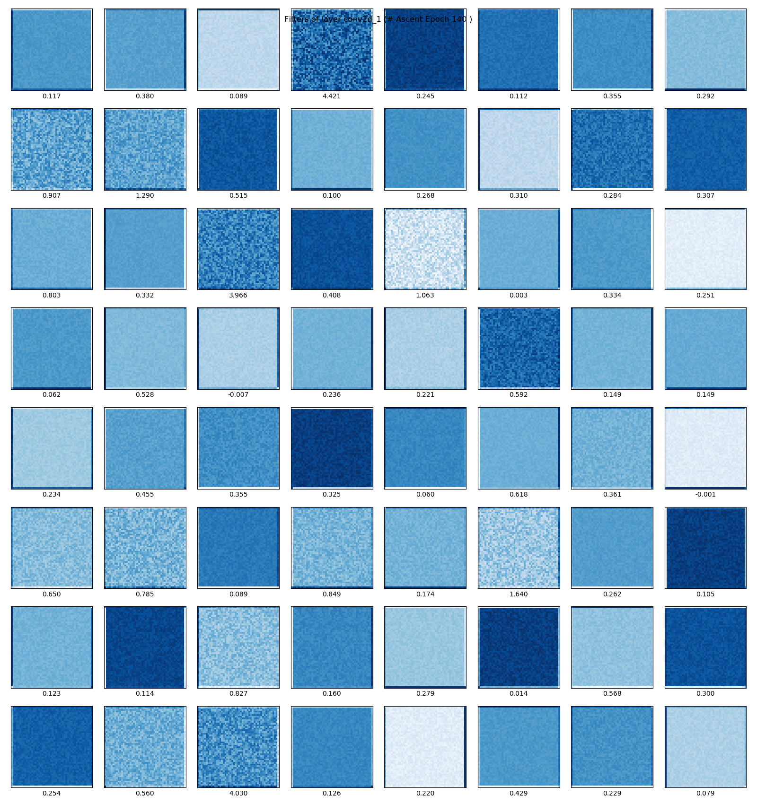
    

接下来将经过完整的 convolution + batch normalization + activation 后的 filter 取出来 (下图左)。发现其实每个 filter 都是由基本的线条所组成且看起来很相似，但可以观察到有个现象是，filter 中的线条似乎倾斜角度有不同(旋转)，猜测可能是因为照片脸的角度有正脸、侧脸等因素造成的，最后可以将这个 layer 理解成被基本的纹理所 activate。右图则为图片经过相对应的 layer 所产生的结果。

    <figcaption>第一层 convolution + batch normalization + activation 后的 filter&nbsp;&nbsp;&nbsp;&nbsp;&nbsp;&nbsp;&nbsp; 第一层 validation data convolution block 后的结果</figcaption>
    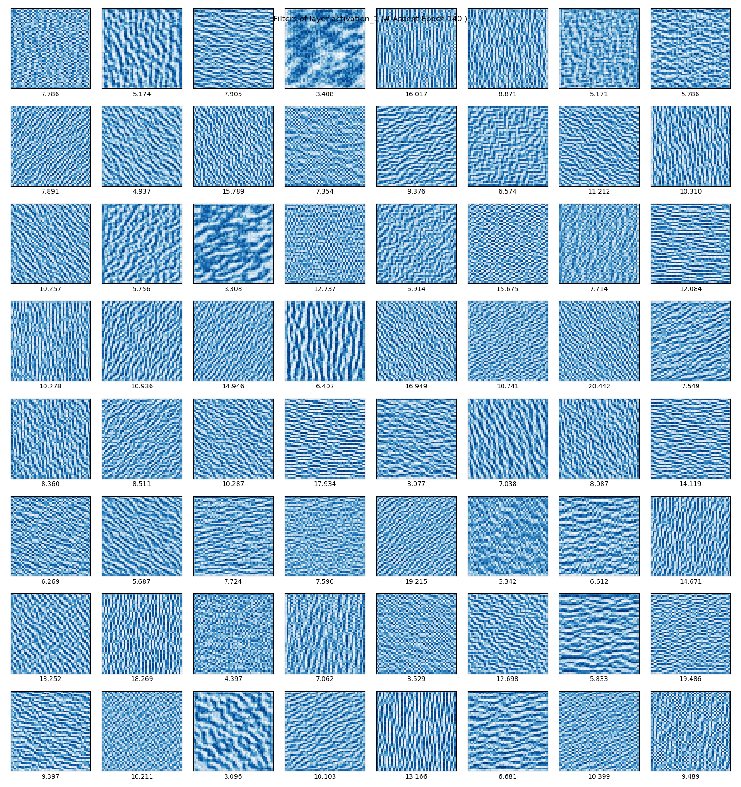
    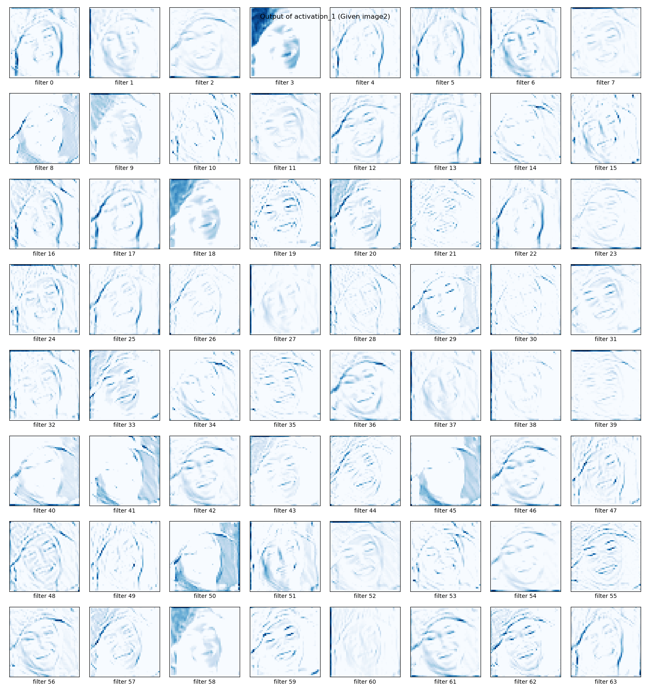

之后数层 convolution 后的 filter 和 convolution block 后的 filter 以及 validation data 中的第二笔资料相对应该层的输出结果如下列所示:

    <figcaption>&nbsp;&nbsp;&nbsp;&nbsp;&nbsp;&nbsp;&nbsp;&nbsp;&nbsp;&nbsp;&nbsp;&nbsp;&nbsp;第二层 convolution 后的 filter &nbsp;&nbsp;&nbsp;&nbsp;&nbsp;&nbsp;&nbsp;&nbsp;&nbsp;&nbsp;&nbsp;&nbsp;&nbsp;&nbsp;&nbsp;&nbsp;&nbsp;&nbsp;&nbsp;&nbsp;&nbsp;&nbsp;&nbsp;&nbsp;&nbsp;&nbsp;&nbsp;&nbsp;&nbsp;&nbsp; 第二层 validation data convolution 后的结果</figcaption>
    
    

    <figcaption>第二层 convolution + batch normalization + activation 后的 filter &nbsp;&nbsp;&nbsp;&nbsp;&nbsp;&nbsp;&nbsp;&nbsp;&nbsp;&nbsp;&nbsp;&nbsp; 第二层 validation data convolution block 后的结果</figcaption>
    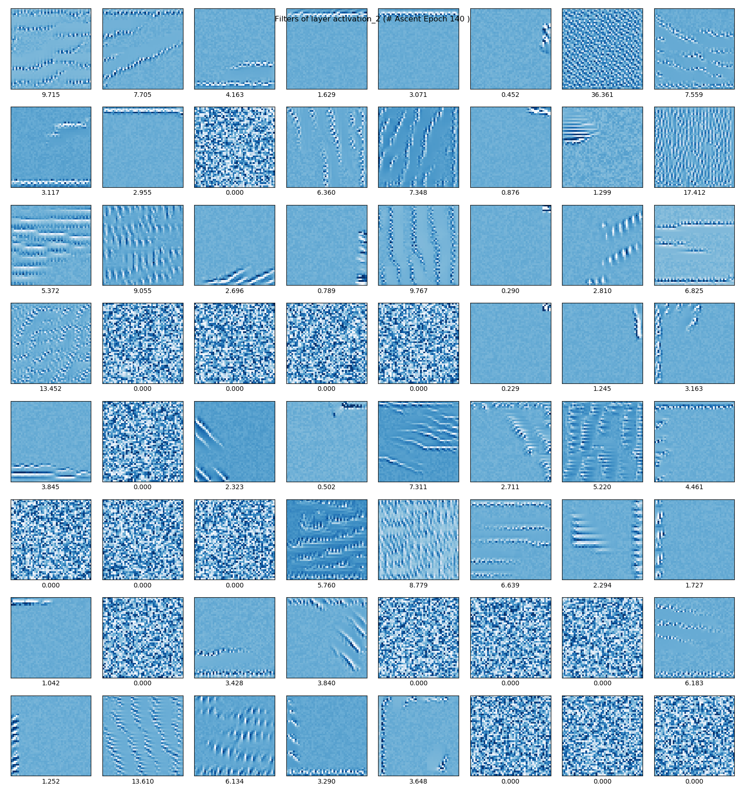
    

    <figcaption>&nbsp;&nbsp;&nbsp;&nbsp;&nbsp;&nbsp;&nbsp;&nbsp;&nbsp;&nbsp;&nbsp;&nbsp;&nbsp;第三层 convolution 后的 filter &nbsp;&nbsp;&nbsp;&nbsp;&nbsp;&nbsp;&nbsp;&nbsp;&nbsp;&nbsp;&nbsp;&nbsp;&nbsp;&nbsp;&nbsp;&nbsp;&nbsp;&nbsp;&nbsp;&nbsp;&nbsp;&nbsp;&nbsp;&nbsp;&nbsp;&nbsp;&nbsp;&nbsp;&nbsp;&nbsp; 第三层 validation data convolution 后的结果</figcaption>
    
    

    <figcaption>第三层 convolution + batch normalization + activation 后的 filter&nbsp;&nbsp;&nbsp;&nbsp;&nbsp;&nbsp;&nbsp;&nbsp;&nbsp;&nbsp;&nbsp;&nbsp; 第三层 validation data convolution block 后的结果</figcaption>
    
    

    <figcaption>&nbsp;&nbsp;&nbsp;&nbsp;&nbsp;&nbsp;&nbsp;&nbsp;&nbsp;&nbsp;&nbsp;&nbsp;&nbsp;第四层 convolution 后的 filter &nbsp;&nbsp;&nbsp;&nbsp;&nbsp;&nbsp;&nbsp;&nbsp;&nbsp;&nbsp;&nbsp;&nbsp;&nbsp;&nbsp;&nbsp;&nbsp;&nbsp;&nbsp;&nbsp;&nbsp;&nbsp;&nbsp;&nbsp;&nbsp;&nbsp;&nbsp;&nbsp;&nbsp;&nbsp;&nbsp; 第四层 validation data convolution 后的结果</figcaption>
    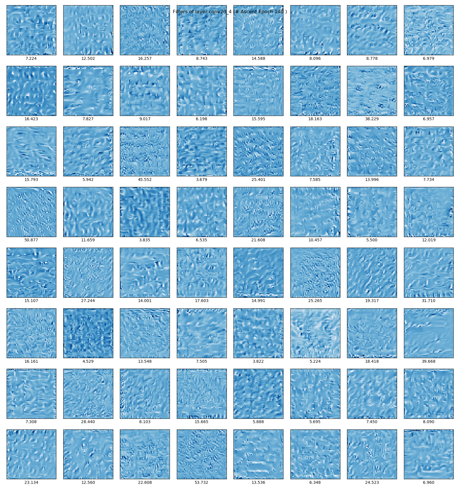
    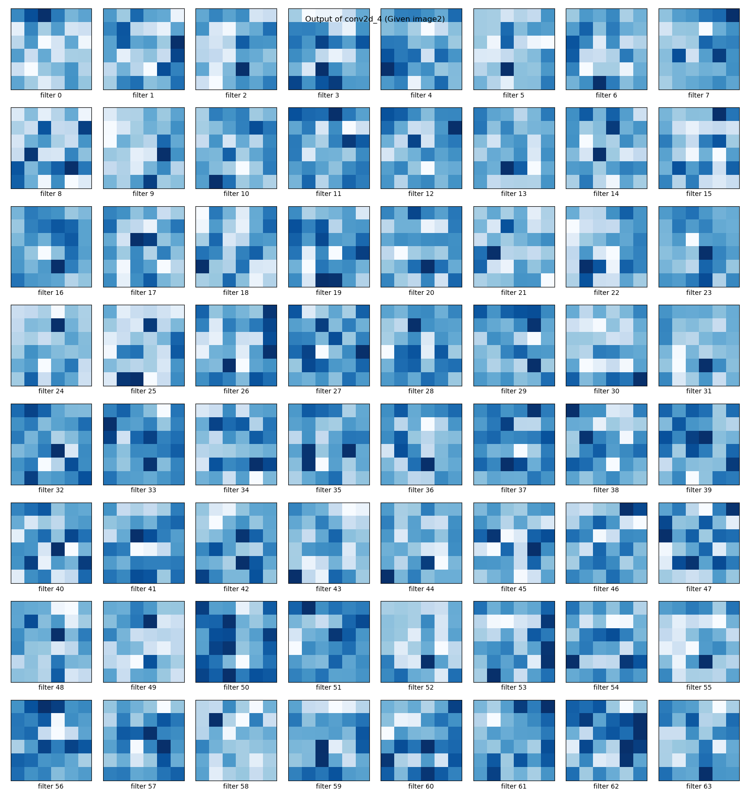

    <figcaption>第四层 convolution + batch normalization + activation 后的 filter &nbsp;&nbsp;&nbsp;&nbsp;&nbsp;&nbsp;&nbsp;&nbsp;&nbsp;&nbsp;&nbsp;&nbsp; 第四层 validation data convolution block 后的结果</figcaption>
    
    

由上面左边一系列的图可以得知越深层 convolution 的 filter 已经从之前的直线纹理演变成曲线纹理，意味著 filter 捕捉的特徵越来越複杂，convolution block 的 filter 也有相同的趋势，但却出现了许多不被激活的 filter (图片下方 loss 为 0)，目前猜测是因为原本 convolution 的 filter 数值变化可能就不大又经过 BatchNormalization 之后将数值归一化所导致(待验证)。

右边一系列的图，我们发现在第一层的 layer 中，filter 捕捉较大的范围，人脸相当清晰，而第二层 layer 则捕捉人脸的轮廓、眼睛、头髮、嘴巴...等等，更深层的 layer 则捕捉更局部更细微的特徵。在第四层 layer 可以很清楚的知道每个 filter 只针对特定的小方格去做特徵的提取。

### Data Augmentation

这个部份我们针对原来 CNN Model 的部分，对训练资料多做 Data Augmentation，藉此来说明 Data Augmentation 的效果。Data Augmentation 就是对图片做平移、翻转、选转、缩放、推移...等等，进而获得更多且更多元的训练资料，使模型更强健和减少过拟和的状况。
由于使用 data augmentation 的缘故，我们设定在每一次 epoch 时所训练的资料数为没有使用 data augmentation 的三倍，让模型可以完整的训练完原来的资料和新生成的资料。

训练过程如下图所示，可以观察到经过 100 个 epoch，validation loss 和 validation accuracy 似乎还在递减，虽然预测精准度大约只提升到 68%，但持续训练下去或许就会突破 70%。另外训练过程的曲线相较于没有使用 data augmentation 来的完美，也间接说明模型训练得比较好，很清楚地可以知道是 data augmentation 的功劳。
最后如果希望预测精准度可以再提高，个人建议可以增加每一次 epoch 训练资料的倍数(3倍提高到5倍之类的)，但这方法所需要付出的代价为花更多时间训练模型。

### 心得:

在做这份作业的过程中，如果没有将pixel除以255，模型训练效果会非常差，主要原因是因为没有除以255导致模型训练速度过慢，在没有良好的设备和时间的情况下，结果都不会太优。而除以255之后 pixel 数值会分布在0~1之间，这样可以加速模型的训练，以至于在同样的模型相同的训练次数结果会差很多。###要在验证

随著 Convolution 越来越多层，模型在训练集的预测正确率可以高达90%以上，但在验证集始终无法突破 55% 的预测正确率，这现象意味著模型过拟和训练资料。面对这样的问题我们採用 droupout 来抑制过拟合现象，首先在 fully connection 的部分採用 droupout，在验证集的表现似乎有提升 3% ~ 5% 左右，但就是过不了 60% 。随著 droupout 的强度越来越强，甚至对 Convolution 也进行 droupout 的过程中我们也可以发现在验证集的正确预测率可以达到 65% 。

1. 照片需要除255 效果影响很大 50%以下

2. 3 个 conv + 2-3个 fc vail data ~50%~55%

3. 4 个 conv + 2-3个 fc vail data ~55%~60% basic droupout 0.2 on fc

4. 4 个 conv + 2-3个 fc vail data ~57%~63% basic droupout 0.2 on all layer                     15epoch

5. 4 个 conv + 2-3个 fc vail data ~60%~65% basic droupout 0.5 on fc layer 0.2 0.3 0.3 onconv   20epoch

## Reference

* [Keras Image Data Augmentation 个参数详解](https://zhuanlan.zhihu.com/p/30197320)

* [BatchNormalization](http://blog.csdn.net/hjimce/article/details/50866313)

* [How convolutional neural networks see the world](https://blog.keras.io/how-convolutional-neural-networks-see-the-world.html)