# 机器学习简介

这门课，我们预期可以学到什么呢？我想多数同学的心理预期就是你可以学到一个很潮的人工智慧。我们知道，从今年开始，人工智慧这个词突然变得非常非常非常的热门，讲大家、政府通都在讲人工智慧这个词。

但人工智慧是什么呢？人工智慧其实一点都不是新的词，人工智慧这个词、AI这个词、Artificial Intelligence这个词，在1950年代就有了。那这个词意味着什么呢？这个词意味着一个人类长久以来的目标，希望机器可以跟人一样的聪明，那在科幻小说里面，我们看要很多这样的幻想和期待。但很长段时间里面，人们并不知道怎么做到人工智慧这件事情，直到后来，大概1980年代以后，有了机器学习的方法。那么机器学习顾名思义，从名字就可以被猜出，就是让机器具有学习的能力。所以机器学习跟人工智慧，他们之间什么关系呢？

人工智慧是我们想要达成的目标，而机器学习是想要达成目标的手段，希望机器通过学习方式，他跟人一样聪明。而深度学习和机器学习有什么关系呢？深度学习就是机器学习的其中一种方法。

在有深度学习、机器学习之前，人们用什么样的方式来做到人工智慧这件事呢？我记得高中生物学告诉我们说，生物的行为取决于两件事，一个是后天学习的结果，不是后天学习的结果，就是先天的本能。对于机器来说也是一样，他怎么样表现的有智慧，要么就是通过后天学习的手段表现的很有智慧，要么就是他的先天的本能。机器为什么会有先天的本能，那可能就是他的创造者，其实都是人类，帮他事先设立好的。

那么先来看一下生物的本能，讲一个跟机器学习一点都没有关系的，生物的本能。这个是河狸，那河狸的特色呢，就是他会筑水坝把水挡起来。但是河狸怎么知道要筑水坝呢？河狸筑水坝能力是天生的。也就是说，假设河狸他在实验室出生，他没有父母叫他怎么筑水坝。但是他一生下来，他心里就有个冲动，就是他想要筑水坝。那如果我们要程序语言来描述他的话，他那的程序语言就是这样的：

If 他听到流水声

Then 他就筑水坝直到他听不到流水声。

所以呢，生物学家就可以欺负河狸，他就用一个扬声器来播放流水声啊，如果他把扬声器流放在水泥墙里面，然后河狸就会在水泥墙上面的放很多的树枝，在水泥墙上面筑堤，想把扬声器的声音盖住。如果你把扬声器放在地上，河狸就会用树枝把他盖住直到你听不见扬声器的声音为止。这就是生物的本能，那机器的本能跟生物的本能其实也很像。 

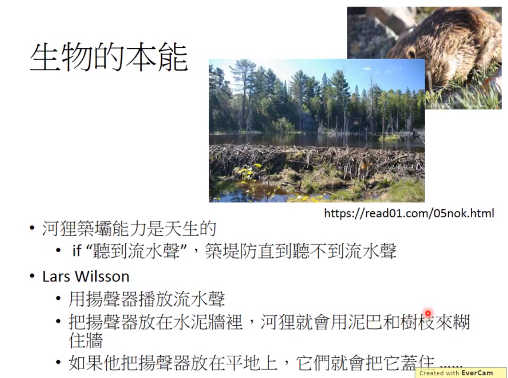

假设有一天，你想要作一个chat-bot、如果你不是用机器学习的方式，而是给他天生的本能的话，那像是什么样子呢？你可能就会在这个chat-bot里面，在这个聊天机器人里面的设定一些规则。这些规则我们通常称hand-crafted rules，叫做人设定的规则。那假设你今天要设计一个机器人，他可以帮你打开或关掉音乐的话，那你的做法可能是这样，设立一条规则，就是写方程式，如果输入的句子里面看到turn off这个词汇，那chat-bot要做的事情呢，就是把音乐关掉。这个时候呢，你之后对chat-bot说，please turn off the music  或can you turn off the music, please? 他就会帮你把音乐关掉。看起来好像很聪明。人家就会觉得果然这就是人工智慧。但是如果你今天想要欺负chat-bot的话，你就可以说please don‘t turn off the music，但是他还是会把音乐关掉。这是个真实的例子，你可以看看你身边有没有这种类似的chat-bot，然后你去真的对他说这种故意欺负他的话，他其实是会答错的。这是真实的例子，但是不告诉他是哪家公司产品，这家公司也是号称他们做很多AI的东西的。不要让你发现是哪家产品免得被告。

用hand-crafted rules有什么样的坏处呢，他的坏处就是，你没办法，考虑到所有的可能性，他非常的僵化，而用hand-crafted rules创造出来的machine，他永远没有办法超过创造他的人类。人类想不到东西，就没办法写规则，没有写规则，机器就不知道要怎么办。所以如果一个机器，他只能够按照人类所设定好的hand-crafted rules，他就他这个行为都是被规定的，都没有办法freestyle。如果是这样的话，他就没有办法超越创造他的人类。

那你可能会说，但是你好像看到很多chat-bot看起来非常的聪明，这些chat-bot，如果你是有个是一个非常大的企业，他给以派给成千上万的工程师，他用血汗的方式来建出数以万计的规则，然后让他的机器看起来好像很聪明。但是对于中小企业来说，这样建规则的方式反而是不利的。所以我认为机器学习发展，对比较小规模企业反而是更有利的，因为接下，不需要非常大量的人来帮你想各式各样的规则。只要手上有data，你可以机器来帮你做这件事情，当然怎么收集data又是另外一个问题。
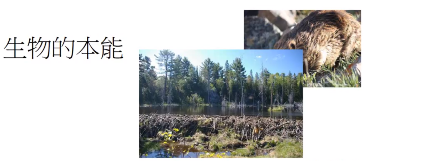

这不是我们今天要讨论的主题，那我知道说，因为AI这个词现在非常非常非常非常的热门，所以会有各式各样，奇奇怪怪的东西，我觉得现在非常经常碰到的一个问题，也许可用以下这个漫画来说明，这是个四格漫画，而这个漫画并不是随随便便的一个四格漫画。

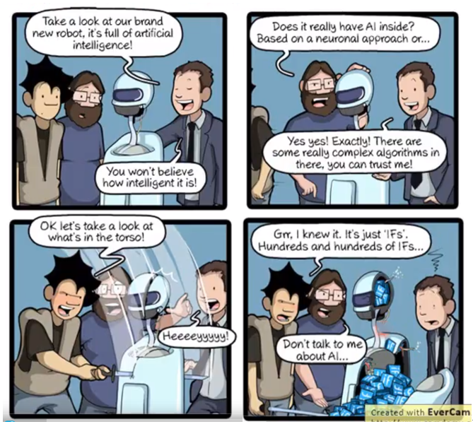

这个漫画是facebook上的漫画，这个漫画说的是，现在你一定常常新闻或者是商场上看到这个讯息，有一个seller说看看我们最新的人工智慧机器人，他就是非常的人工智慧。这个系统搭配一个能言善道seller，加上一个非常非常潮的前端和外壳，里面是什么没有人知道，外面的观众就问说，他是用什么neural做的？反正就是最好的AI的技术。但是你把他剖来看一看，里面通通都是if掉出来。现在我政府，企业都说想要推广的AI，可是他们想要推广AI其实是这种AI。那这个其实都不是我们现在应该做的事，如果你要推动，如果你要推广的是这种hand craft AI的话，你怎么五十年前不推广，一直到今天才出来做呢？今天，我们要走的不是目前这个路线，如果是这个路线他应该是要被diss，那我们要做的其实是让机器他有自己学习的能力。也就我们要做的应该machine learning的方向。讲的比较拟人化一点，所谓machine learning的方向，非常拟人化的想法，你就写个方程式，然后让机器人变得了很聪明，他就能够有学习的能力，接下来呢，你就像教一个婴儿、教一个小孩一样的教他。你并不是写方程式让他做到这件事，你就写方程式让他具有学习的能力，然后接下来呢，你就可以用像教小孩的方式，教他告诉他说。假设你要叫他学会做语音辨识，你就告诉他这段声音就是Hi，这段声音就是How are you，有这段声音就是Good bye，希望接下他就学会了。你给他一个新的声音，他就可以帮你产生语音辨识的结果。

 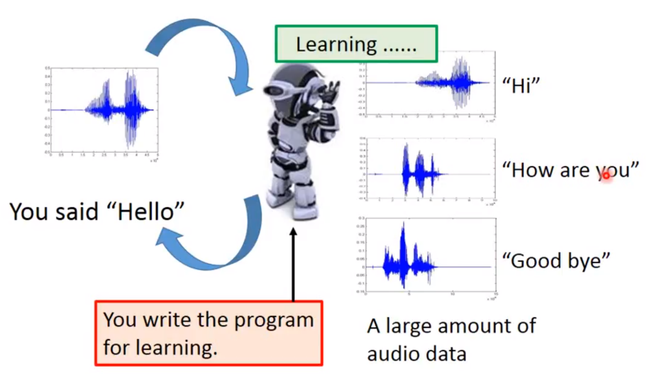

或者是如果你希望他学会怎么做影像辨识的话，那你可能不太需要改太多的方程式。因为他本身就有这种学习的能力，你只是需要交换，就告诉他说，我看到这张图片，你要说这是猴子；看到这张图片，然后说是猫；看到这张图片，可以说是狗。他是要具有影像辨识的能力，接下来看到他没有看过猫，希望他可以认识。

 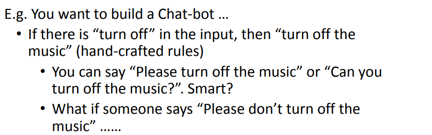

这是比较拟人化的说法，如果讲的更务实一点的话呢，machine learning做的事情，你可以想成就是在寻找一个function，要让机器具有一个能力，这种能力是根据你提供给他的资料，他去寻找出我们要寻找的function。还有很多关键问题都可以想成是我们就是需要一个function。举例来说，语音辨识，在语音辨识这个问题里面，我们要找一个function，他的输入声音讯号，他的输出是语音辨识的文字。这个function非常非常的复杂，有人会想说我来用一些写规则的方式，读很多语言学文献，然后写一个规则，然后做语音辨识。这件事情，60年代就有人做，但到现在都还没有做出来。语音辨识太过复杂，这个function太过的复杂，不是人类所可以写出来，可以想象的，所以我们需要凭借的机器的力量，帮我们把这个function找出来。那或者说，假设你要做影像辨识，那就是找一个function，输入一张图片，然后输出图片里面有什么样的东西。或者是大家都一直在说的Alpha GO，如果你要做一个可以下围棋machine，其实你需要的也就是找一个function，这个function，输入围棋上19*19的棋盘。告诉机器棋盘上，哪些位置有黑子，哪些位置有白子。然后机器就会告诉你，接下来下一步应该落子在哪。或者是你要做一个聊天机器人，那你需要的是一个function，这个function的输入，就是使用者的input，他的输出，就是机器的回应。

 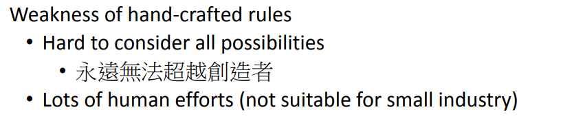

那以下我们先很简短的跟大家说明，怎么样找出这个function，找出function的framework是什么呢？我们以影像辨识为例。我们找个function输入一张图片，他告诉我们，图片里面有什么样的东西。在做这件事，他的起手事是你要先准备一个function的set。这个function里面有成千上万的function举例来说，这个function在里面,有一个f1，你给他看一只猫，他就告诉你输出猫，看一只狗就输出狗。有一个function f2他很怪，你给他看猫他说是猴子，给他看狗，他说是蛇。那你要准备一个function set，这个function set里面有成千上万的function。那这件事情讲讲有点抽象啊，你可能很怀疑说有成千上万的function，我怎么把成千上万的function收集起来，变成一个function的池呢，这个我们之后会再讲。总之呢，我们先假设你手上有一个function set，这个function set就叫做model。有了这个function set，接下来第二步，继续要做的事情是他有一些训练的资料，这些训练资料告诉机器说一个好的function，它的输入输出应该长什么样子，有什么样关系。你告诉机器说呢，现在在这个影像辨识的问题里面，如果看到这个猴子，看到这个猴子图也要输出猴子，看到这个猫的图也要输出猴子猫，看到这个狗的图，就要输出猴子猫狗，这样才是对。只有增加训练资料，你拿出一个function，机器就可以判断说，这个function是好的，还是不好的。机器可以判断一个function，根据训练资料判断一个function是好的，还是不好的。举例来说，在这个例子里面，显然f1，他比较符合training data的叙述，比较符合我们的知识。所以f1看起来是比较好的。F2，就看起来是一个荒谬的function。我们今天讲的这个task叫做supervise learning。如果你告诉机器input和output这就叫做supervise learning，之后我们也会讲到其他不同的学习场景。现在机器有办法决定一个function的好坏。但光能够决定一个function的好坏是不够的，因为在你的function的set里面，他有成千上万的function，他又会无穷无尽的function，所以我们需要一个有效率的演算法，有效率的演算法可以从function的set里面挑出最好的function。一个一个衡量function的好坏太花时间，实际上做不到。所以我们需要有一个好的算法，从function set里面挑出一个最好的。
 
 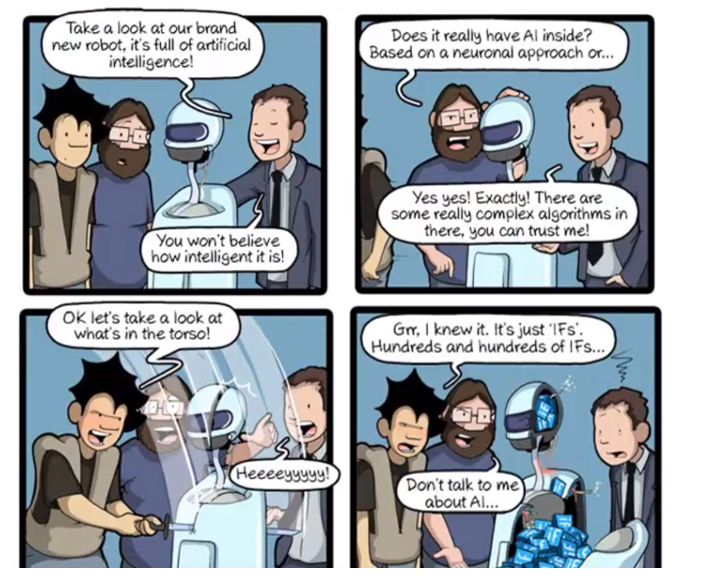

便是输入一张在机器没有看过的猫，然后希输出的也是猫，希望机器有举一反三的能力。左边这个部分叫training，就是学习的过程，右边这个部分叫做testing，学好以后，你就可以拿它做应用。所以在整个machine learning framework整个过程分成了三个。第一个步骤就是找一个function，定出一个function set，第二个步骤让machine可以衡量一个function是好还是不好，第三个步骤是让machine有一个自动的方法，有一个好演算法可以挑出最好的function。所以机器学习到这边，我们就说完了。

 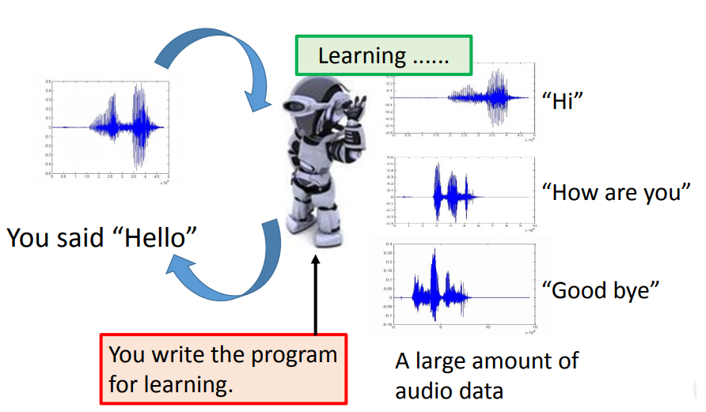

简化整个机器学习只有三个步骤，类比，如果我们把大象塞进冰箱，其实也是三个步骤。大家知道吗，就是你怎么把大象塞进冰箱，就是把门打开，把大象塞进去，然后把门关起来，然后就结束了。所以说，机器学习三个步骤，就好像是说把大象放进冰箱，也只需要三个步骤，意思是一样的好。

 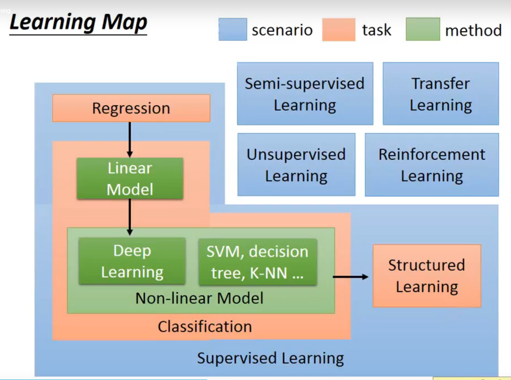

#  machine learning相关的技术
##  监督学习

 （1）regression
那接下来的时间，我们要讲一下，在这门课里面，你可以学到哪些和machine learning相关的技术。这个是这学期的learning map，然后看起来是有点复杂的，我们一块一块来解释。

我们先从这个图的左上角开始，这个图的左上角，是regression。Regression是一种machine learning的task，当我们说，我们要做regression的时候，一直是说我们今天要machine找的function，他的输出是一个scalar，是一个数值，这个叫做regression。举例来说，在作业一里面，我们会要你做pm2.5的预测 ，也就是说你要找一个function，这个function的输出呢，就是未来某一个时间pm2.5的一个数值，这个是一个regression的问题。那机器要判断说，这个function要输出，说明天上午的pm2.5，你要给他一些资讯，他才能够猜出来嘛，那你给他资讯，可能是今天上的pm2.5，昨天上午的pm2.5等等，这就是一个function，他吃的是我们给他的过去的资料，他输出的是预测未来的pm2.5。那你要训练这种machine，如同我们刚才讲的，你要准备一些训练资料，什么样的训练资料？你就告诉他说，今天根据我们过去的从政府的open data上搜集下来的资料，九月一号上午的pm2.5是这个样子，九月二号，九月三号是这个样。所以一个好的function输入，这样子的pm2.5，他应该输出这样的pm2.5。给他九月十二号、九月十三号的pm2.5，他应该输出九月十四号的pm2.5。你收集到许多的data，你就可以做一个气象预报的系统。

 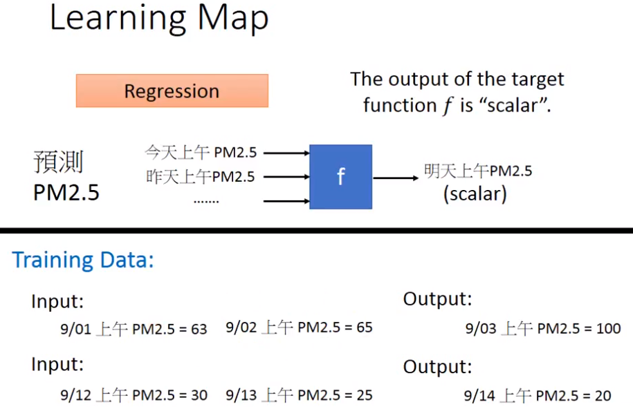

（2）classification
那接下来讲的是classification，分类的问题。那这regression和classification的差别就是我们要机器输出的东西的类型是不一样。在为regression里面机器输出的是一个数值，在classification里面机器输出的是分类。假设classification问题，分成两种，一种叫做二分类，输出的是是或否。另一类叫做多分类，等于是让机器做一个选择题，等于是给他数个选项，每个选项都是一个类别，让他从数个类别里选择正确的类别。

举例来说，二分类里面鉴别垃圾邮件，将其放到垃圾箱。那怎么做到呢？就是将function输入一个邮件，输出邮件是垃圾邮件，还是不是垃圾邮件。你要训练这样的function很简单，就给他一大堆的data告诉他说，现在输入这封邮件，你应该说是垃圾邮件，输入这封邮件，他应该说它不是垃圾邮件。你给他够多的这种资料去学，它就可以自动找出一个可以政策垃圾邮件的function。，

  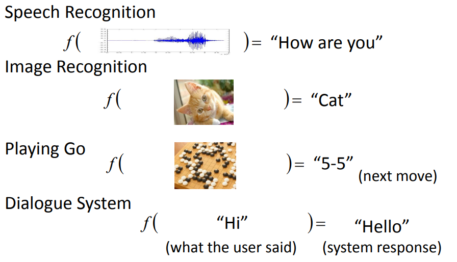

多分类的举一个文章分类的例子，现在网络上有非常非非常多的新闻，也许没有人会把所有的新闻看完，很希望机器自动帮一把新闻做分类。怎么做？你需要的是一个function，你输出的那个类别，就是哪个选项。政治、经济、体育都是不同的选项。你要做的事情就是解这个选择题啊。收集资料训练后发现，这篇文章叫做政治。然后给他新的文章，希望他就可以给你正确的结果。

 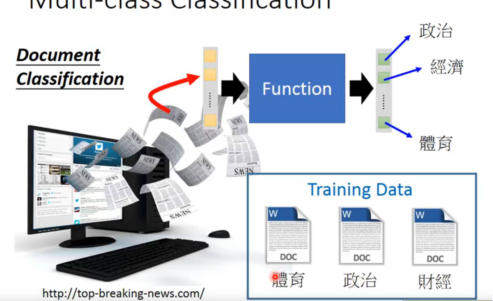

那刚选择不同的function set 你会得到不同的结果。选不同的function set就是选不同的model。Model有很多种，举例来说，最简单的就是线性的模型，我们会花很多时间线性的模型上。在非线性的模型中最耳熟能详的就是deep learning。在做deep learning时，他的function是特别复杂的，所以他可以做特别复杂的事情。举例他可以做影像辨识，也可以用deep learning的技术下围棋。

 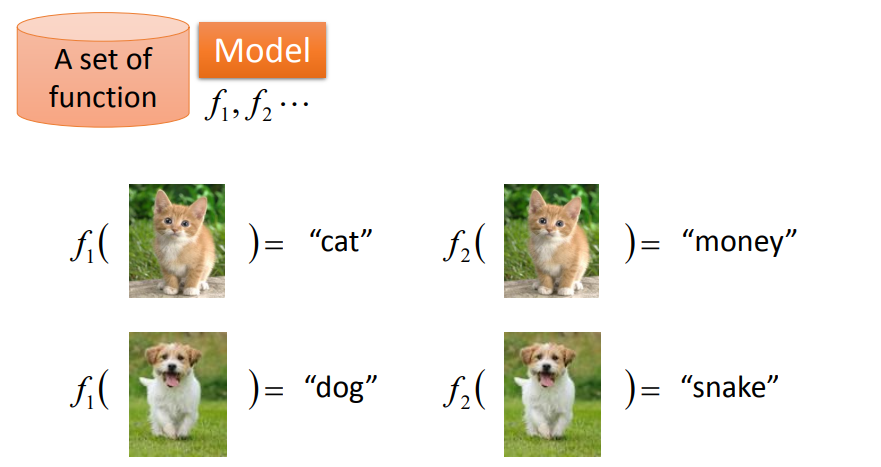

下围棋这个task 其实就是一个分类的问题。对分类问题我们需要一个很复杂的function。输入是一个棋盘的格子，输出就是下一步应该落子的位置。那我们知道，一个棋盘上就是有十九乘十九的位置可以落子，所以今天下围棋这件事情，你就可以把它想成是一个十九乘十九个类别的分类问题，或者是你可以把它想成是一个有十九乘十九个选项的选择题。那你要怎么训练机器？让他学会下围棋呢？你要搜集训练资料，告诉机器现在这个function输入输出分别应该是什么。就看到某样的盘式，我们应该输出什么样结果。那怎么收集资料呢？你可以从人类过去下的棋库里面搜集。举例来说，你收集了进藤光和社新春下的那一盘棋的棋谱。社新春出手先下5之五，进藤光次手下天元，三手社新春下五之5。所以现在如果有人下5之五，就输出天元；如果有人下5之五然后下天元，就输出五之5。然后你给他足够多的棋谱，他就会下围棋了。

  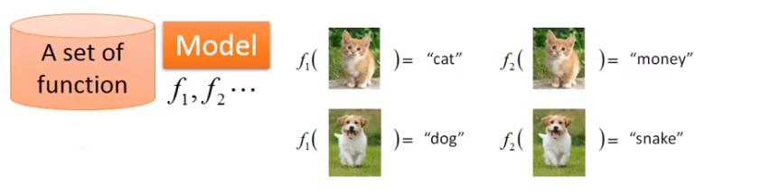

除了deep learning 以外还有很多machine learning的model，也是非线性的模型，这学期会请吴佩云老师来帮我们讲SVM。

##  半监督学习

好，那刚才我们讲的都是监督学习，监督学习的问题是我们需要大量的training data。training data告诉我们要找的function的input和output之间的关系。那这个output的我们常叫做label，做机器学习要大量的label。就是说，如果我们用的监督学习，我们需要告诉机器function的input和output是什么。这个output往往没有办法用很自然的方式取得，需要人工的力量把它标注出来。这些function的output叫做label。那有没有办法减少label需要的量呢？是有办法的，就是半监督学习。意思是说，举例来说，假设你先想让机器鉴别猫狗的不同。你想做一个分类器，让他告诉你，图片上是猫还是狗。-你有少量的猫和狗的data，但是同时你又有大量的猫和狗的图片，但是你没有力气去告诉机器说哪些是猫哪些是狗。那在半监督学习的技术里面，这些没有label的data，他可能也是对学习有帮助。这个我们之后会讲为什么这些没有label的data对学习会有帮助。

  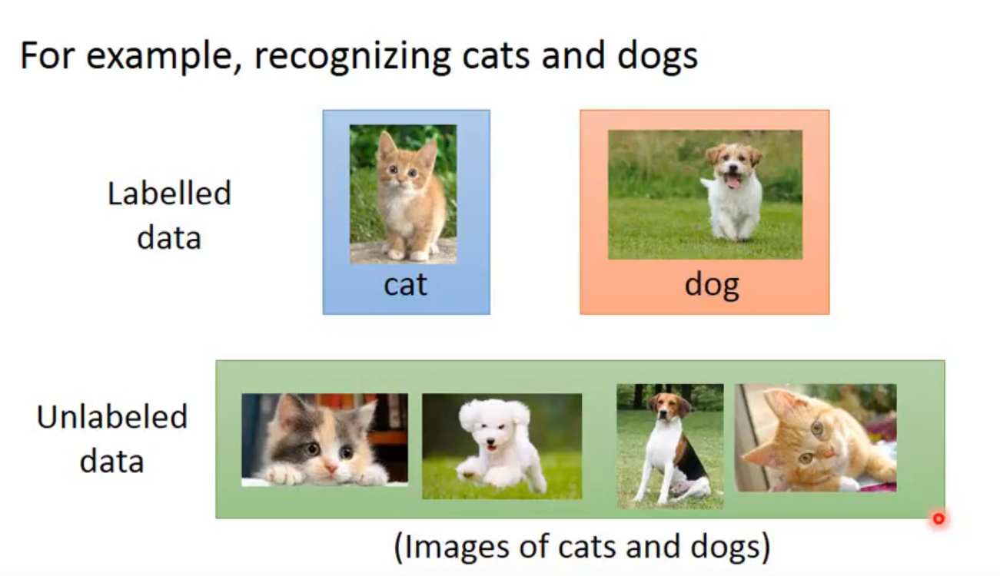

##  迁移学习
那另外一个减少data用量的方向是迁移学习。迁移学习的意思是，假设一样，我们要做猫和狗的分类问题，我们也一样，只有少量的有label的data。但是我们现在有大量的data，可能有label也可能没有label。但是他跟我们现在要考虑的问题是没有什么特别的关系的，我们要分辨的是猫和狗的不同。但是这边有一大堆其他动物的图片还是动画图片，这个是凉宫春日啊，这个是御坂美琴，你有这一大堆不相干的图片，他到底可以带来什么帮助。那这个就是迁移学习要讲的问题。

  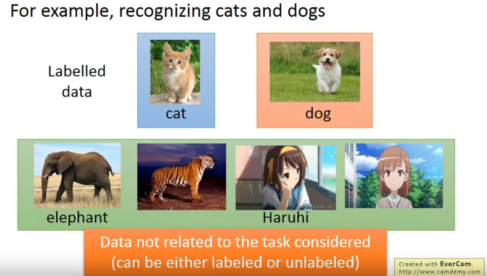

##  无监督学习
更加进阶的就是无监督学习，我们这希望机器学到无师自通，如果在完全没有任何label的情况下，到底机器可以学到什么样的事情。举例来说，如果我们给机器看大量的文章，在去网络上收集站文章很容易，网络上随便爬，让机器看过大量的文章以后，他到底可以学到事情。他能不能够学会每一个词汇的意思，那要让机器学会每一个词汇的意思，你可以想成是我们找一个function，然后你把一个词汇丢进去。比如说你把apple丢进这个function里面，机器要输出告诉你说，这个词会是什么意思。也许他用一个向量来表示这个词汇的各种不同的特性不同的attribute。但现在讲是无监督学习的问题，你现在只有一大堆的文章，也就是说，你只有词汇，你只有function的输入，没有任何的输出。那你到底要怎么解决这个问题。

  

或者是我们举另外一个无监督学习的例子，假设我们今天带机器去动物园，让他看一大堆的动物，他能不能够在看了一大堆动物以后，他就学会自己创造一些动物。那这个都是真实例子。仔细看了大量的动物以后，他就可以自己的画一些狗出来。有眼睛长在身上的狗、还有乳牛狗。这个task也是一个无监督学习的问题。这个function的输入不知道是什么，只有输出但是没有输入，这问题在之后也会具体讲述。

##  监督学习中的structured learning
接下来还有一类比较少提及的就是structured learning。structured learning 中机器输出的是有结构性的结构。举例来说，在语音辨识里面，机器输入是声音讯号，输出是一个句子，句子是要很多词汇拼凑完成。他是一个有结构性的object。或者是说在机器翻译里面你说一句话，你输入中文希望机器翻成英文，他的输出就也是有结构性的。或者是说你今天要做的，是人脸辨识，来给机器拍张图片还有知道说呢，最左边是长门，中间是凉宫春日，右边是另一个人。然后机器要把这些东西标出来，这也是一个structure learning问题。 

 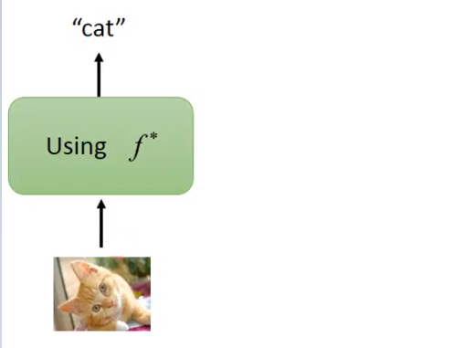

 其实多数人可能都听过regression，也听过classification，你可能不见得听过structure learning。很多教科书都直接说，machine learning是两大类的问题，regression，和classification。其实还应该包括structure learning，这里面还有很多问题是没有探究的。

最后一部分就是reinforcement learning，reinforcement learning其实是一个已经发展了很久的技术，但近期受到大家的关注是因为data mining将reinforcement learning技术用来玩一些小游戏。另外一个就是Alpha Go。

##  强化学习
我们将他和监督学习进行比较，在监督学习中我们会告诉机器正确答案是什么。举例说，你要用监督学习的方法来训练一个聊天机器人，那你的训练方式是，你就告诉机器，现在使用者说了hello，你就说hi。现在使用者说了byebye ，你就说good bye。所以机器有一个人，当他家教在他旁边手把手的教他每件事情，这就是监督学习。reinforcement learning是什么呢？在reinforcement learning里面，我们没有告诉机器正确的答案是什么，机器所拥有的只有一个分数，就是他做的好，还是不好。举例来说我们现在要用reinforcement learning方法来训练一个聊天机器人的话，他训练的方法会是这样：你就把机器发到线下，让他的和面进来的客人对话，然后想了半天以后呢，最后仍旧勃然大怒，就把电话挂掉了。那机器就学到一件事情，就是刚才做错了。但是他不知道哪边错了，他就要回去自己想道理，是一开始就不应该打招呼吗？还是中间不应该在骂脏话了之类。他不知道，也没有人告诉他哪里做的不好。他要回去反省检讨哪一步做的不好。机器要在reinforcement learning的情况下学习，机器是intelligence的。 

 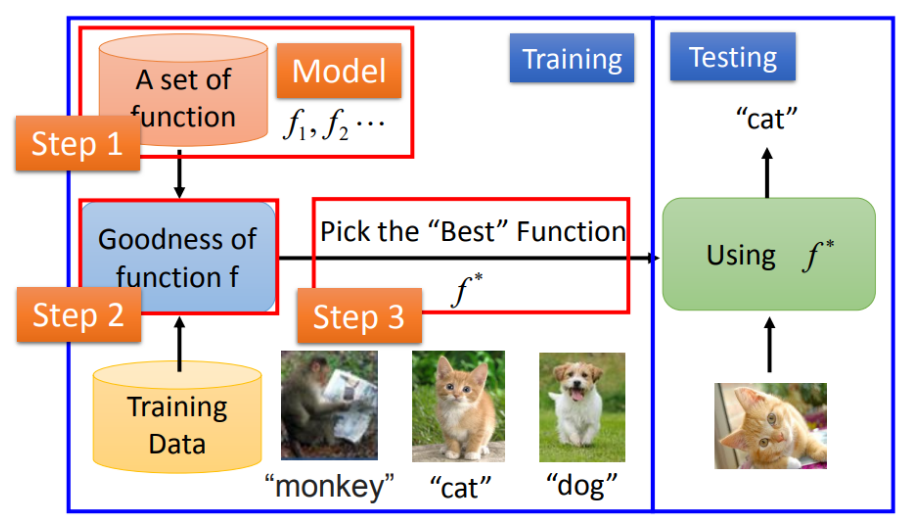

在监督学习中是有老师的，老师会告诉他每个问题的答案。那reinforcement learning 是learning from critics，他是从评价中去学习的。他只知道他做的好，或者不好。但是他不知道他哪里做得好，还不知道哪做的不好。reinforcement learning受到重视，就是他比较符合我们人类真正的学习的情景。这是你在学校里面的学习老师会告诉你答案，但在真实社会中没人回告诉你正确答案。你只知道你做得好还是做得不好，如果机器可以做到reinforcement learning，那确实是比较intelligence。那或者是我们用Alpha Go当做例子，对于监督学习就是说，你看到一个下棋的情况，就应该下哪里。对于reinforcement learning就是，机器会不断的下棋，最后赢了，机器就会知道下的不错，但是究竟是哪里可以使他赢，他其实是不知道的。我们知道Alpha Go其实是用监督学习和reinforcement learning去学习的。先用棋谱做监督学习，然后在做reinforcement learning，但是reinforcement learning需要一个对手，如果使用人当对手就会很让费时间，所以我们采用另一个机器当他的对手。

  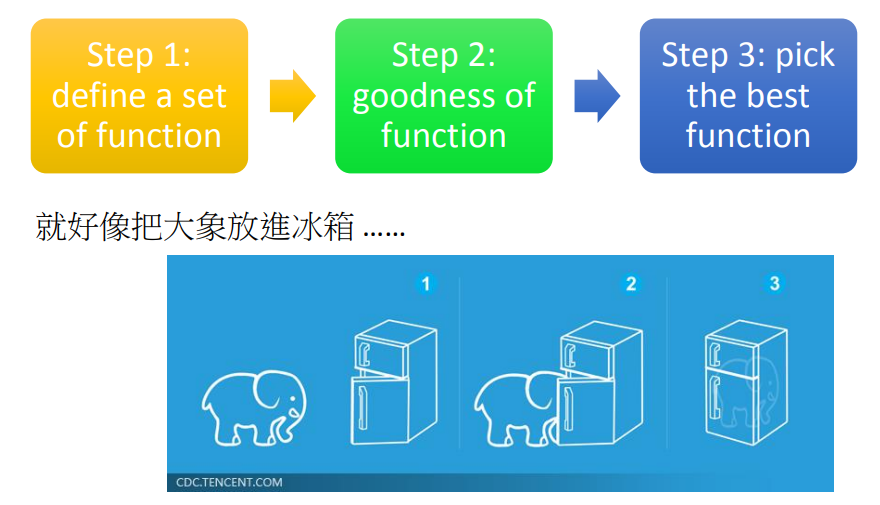

##  tips

  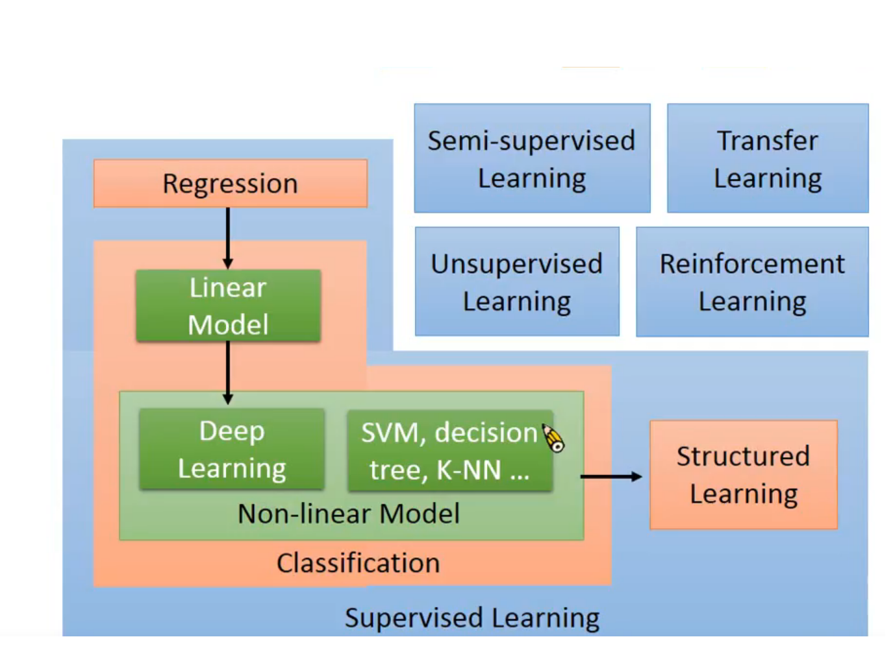

 大家注意一下这个不同的方块，我是用不同的颜色来表示。同样的颜色代表，不同的方块是同一个类型的。这边的蓝色的方块，指的是学习的情景，通常学习的情景是你没有办法控制的。比如，因为我们没有data做监督学习，所以我们才做reinforcement learning。现在因为Alpha Go比较火，所以Alpha Go中用到的reinforcement learning会被认为比较潮。所以说有学生去面试，说明自己是做监督学习的，就会被质疑为什么不做reinforcement learning。那这个时候你就应该和他说，如果我今天可以监督学习，其实就不应该做reinforcement learning。reinforcement learning就是我们没有办法做监督学习的时候，我们才做reinforcement learning。红色的是指你的task，你要解的问题，你要解的这个问题随着你用的方程的不同，有regression，有classification，有structured。所以在不同的情境下，都有可能要解这个task。最后，在这些不同task里面有不同的model，用绿色的方块表示。

