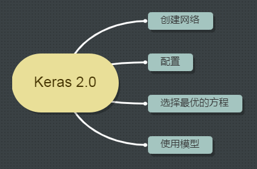
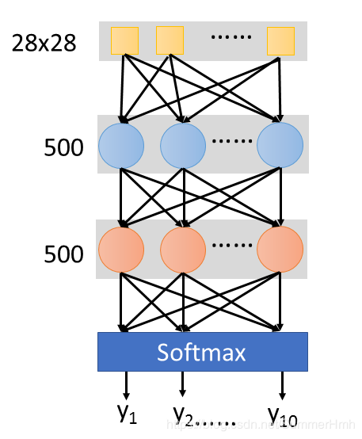
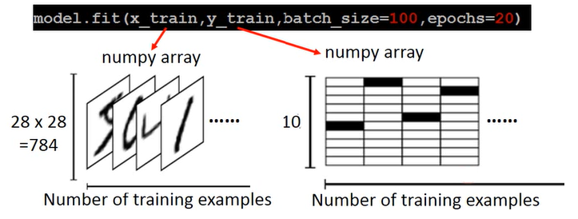

# Keras

## 创建网络-Building Network

假设我们要做的事情是手写数字辨识，那我们要建一个Network scratch，input是$28\ast 28$的dimension，其实就是说这是一张image，image的解析度是*$28\ast28$，我们把它拉成长度是$28\ast 28$维的向量。output呢？现在做的是手写数字辨识，所以要决定它是0-9的哪个数字，output就是每一维对应的数字，所以output就是10维。中间假设你要两个layer，每个layer有500个hidden neuro，那么你会怎么做呢。

)

如果用keras的话，你要先宣告一个Network，也就是首先你先宣告
```
model=Sequential()
```
再来，你要把第一个hidden layer 加进去，你要怎么做呢？很简单，只要add就好
```
model.add(Dense(input_dim=28*28,units=500,activation='relu'))
```
Dense意思就是说你加一个全连接网络，可以加其他的，比如加Con2d，就是加一个convolution layer，这些都很简单。input_dim是说输入的维度是多少，units表示hidden layer的neuro 数，activation就是激活函数，每个activation是一个简单的英文缩写，比如relu，softplus，softsign，sigmoid，tanh，hard_sigmoid，linear
再加第二个layer，就不需再宣告input_dim，因为它的输入就是上一层的units，所以不需要再定义一次，在这，只需要声明units和activation
```
model.add(Dense(units=500,activation='relu'))
```
最后一个layer，因为output是10维，所以units=10，activation一般选softmax，意味着输出每个dimension只会介于0-1之间，总和是1，就可以把它当做为一种几率的东西。
```
model.add(Dense(units=10,activation='softmax'))
```
## 配置-Configuration
第二过程你要做一下configuration，你要定义loss function，选一个optimizer，以及评估指标metrics，其实所有的optimizer都是Gradent descent based，只是有不同的方法来决定learning rate，比如Adam，SGD，RMSprop，Adagrad，Adalta，Adamax ，Nadam等，设完configuration之后你就可以开始train你的Network
```
model.compile(loss='categorical crossentropy',optimizer='adam',metrics=['accuracy'])
```

## 选择最好的方程-Pick the best function
```
model.fit(x_train,y_train,batch_size=100,epochs=20)
```
call model.fit 方法，它就开始用Gradent Descent帮你去train你的Network，那么你要给它你的train_data input 和label，这里x_train代表image，y_train代表image的label，关于x_train和y_train的格式，你都要存成numpy array。那么x_train怎样表示呢，第一个轴表示example，第二个轴代表每个example用多长vecter来表示它。x_train就是一个matrix。y_train也存成一个二维matrix，第一个维度一样代表training examples，第二维度代表着现在有多少不同的case，只有一维是1，其他的都是0，每一维都对应一个数字，比如第0维对应数字0，如果第N维是1，对应的数字就是N。




## 使用模型

- 存储和载入模型-Save and load models
参考keras的说明，http://keras.io/getting-started/faq/#how-can-i-save-a-keras-model
- 模型使用
接下来你就要拿这个Network进行使用，使用有两个不同的情景，这两个不同的情景一个是evaluation，意思就是说你的model在test data 上到底表现得怎样，call evaluate这个函数，然后把x_test，y_test喂给它，就会自动给你计算出Accuracy。它会output一个二维的向量，第一个维度代表了在test set上loss，第二个维度代表了在test set上的accuracy，这两个值是不一样的。loss可能用cross_entropy，Accuraccy是对与不对，即正确率。
	- case1
	```
	score = model.evaluate(x_test,y_test)
	print('Total loss on Testiong Set : ',score[0])
	print('Accuracy of Testiong Set : ',score[1])
	```
	第二种是做predict，就是系统上线后，没有正确答案的，call predict进行预测
	- case 2
	```
	result = model.predict(x_test)
	```

