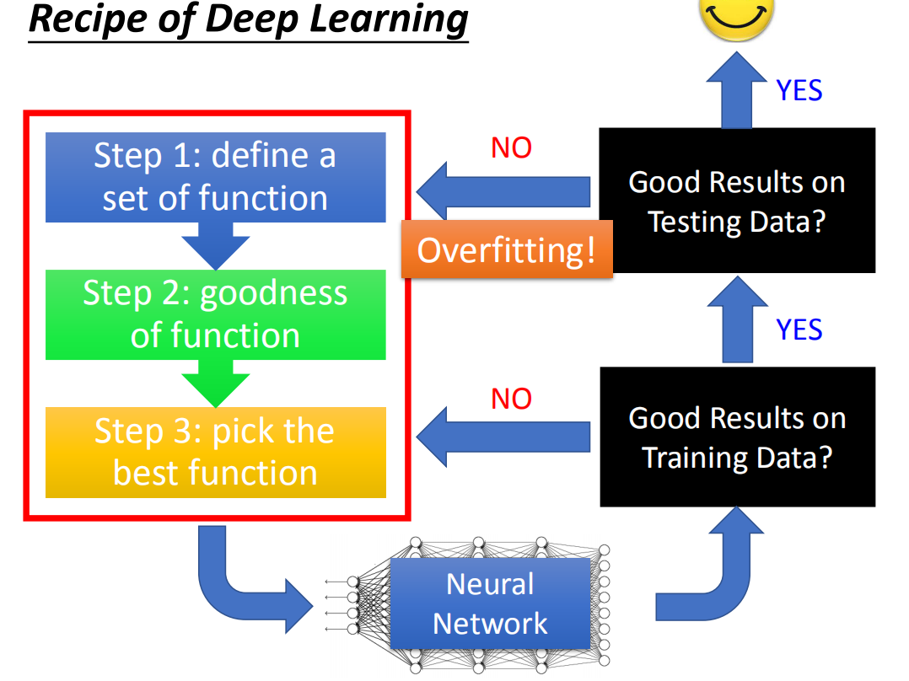

当你的模型表现不好，应该怎么处理？

如上图建立deep learning的三个步骤

•	define a set function

•	goodness of function

•	pick the best function

做完这些事情后，你会得到一个neural network。在得到neural network后。
##  神经网络的表现
（1）首先你要检查的是，这个neural network在你的training set有没有得到好的结果（是否陷入局部最优），没有的话，回头看，是哪个步骤出了什么问题，你可以做什么样的修改，在training set得到好的结果。

（2）假如说你在training set得到了一个好的结果了，然后再把neural network放在你的testing data，testing set的performance才是我们关心的结果。

如果在testing data performance不好，才是overfitting（注：training set上结果就不好，不能说是overfitting的问题）。

**小结：如果training set上的结果变现不好，那么就要去neural network在一些调整，如果在testing set表现的很好，就意味成功了。**

（tips：很多人容易忽视查看在training set上结果，是因为在机器学习中例如是用SVM等模型，很容易使得training set得到一个很好的结果，但是在深度学习中并不是这样的。所以一定要记得查看training set 上的结果。不要看到所有不好的performance都是overfitting。）

 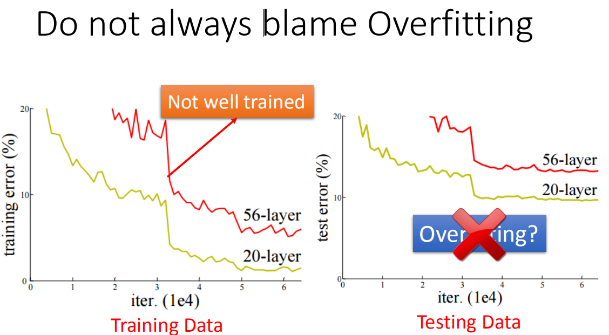

例如：在testing data上看到一个56-layer和20-layer，显然20-layer的error较小，那么你就说是overfitting，那么这是错误的。首先你要检查你在training data上的结果。

在training data上56-layer的performance本来就比20-layer变现的要差很多，在做neural network时，有很多的问题使你的train不好，比如local mininmize等等，56-layer可能卡在一个local minimize上，得到一个不好的结果，这样看来，56-layer并不是overfitting，只是没有train的好。
 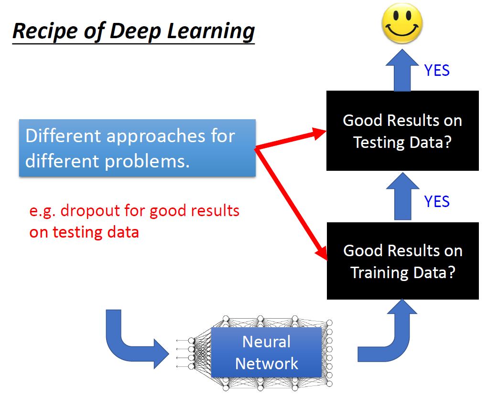
 在deep learning文件上，当你看到一个方式的时候，你首先要想一下说，它是要解什么样的问题，是解决在deep learning 中一个training data的performance不好，还是解决testing data performance不好。

当一个方法要被approaches时，往往都是针对这两个其中一个做处理，比如，你可能会听到这个方法(dropout),dropout是在training data表现好，testing data上表现不好的时候才会去使用，当training data 结果就不好的时候用dropout 往往会越训练越差。
##  如何改进神经网络？
###  新的激活函数
 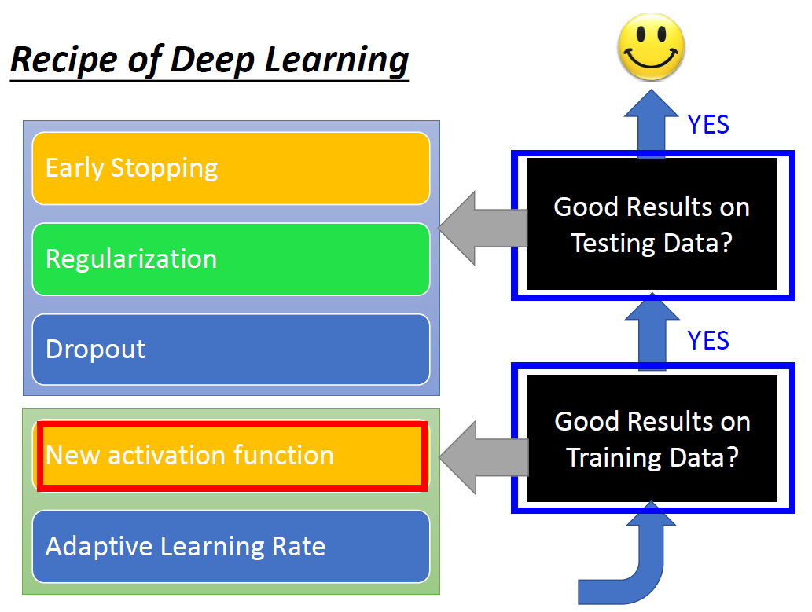
 现在你的training data performance不好的时候，是不是你在做neural的架构时设计的不好，举例来说，你可能用的activation function不够好。
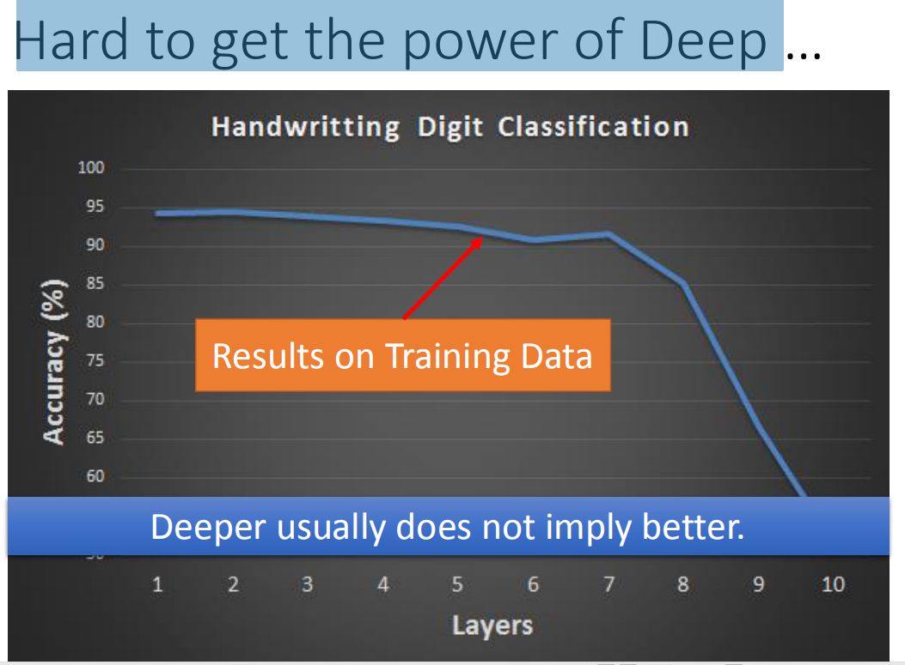

在2006年以前，如果将网络叠很多层，往往会得到上图的结果。上图，是手写数字识别的训练准确度的实验，使用的是sigmoid function。可以发现当层数越多，训练结果越差，特别是当网络层数到达9、10层时，训练集上准确度就下降很多。但是这个不是当层数多了以后就overfitting，因为这个是在training set上的结果。

（在之前可能常用的activation function是sigmoid function,今天我们如果用sigmoid function，那么deeper usually does not imply better,这个不是overfitting）
###  梯度消失
 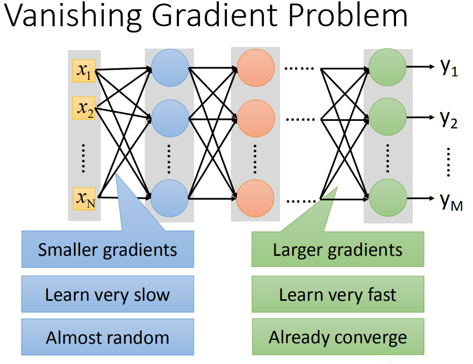
当网络比较深的时候会出现vanishing Gradient problem

比较靠近input 的几层Gradient值十分小，靠近output的几层Gradient会很大，当你设定相同的learning rate时，靠近input layer 的参数updata会很慢，靠近output layer的参数updata会很快。当前几层都还没有更动参数的时候（还是随机的时候），随后几层的参数就已经收敛了。

 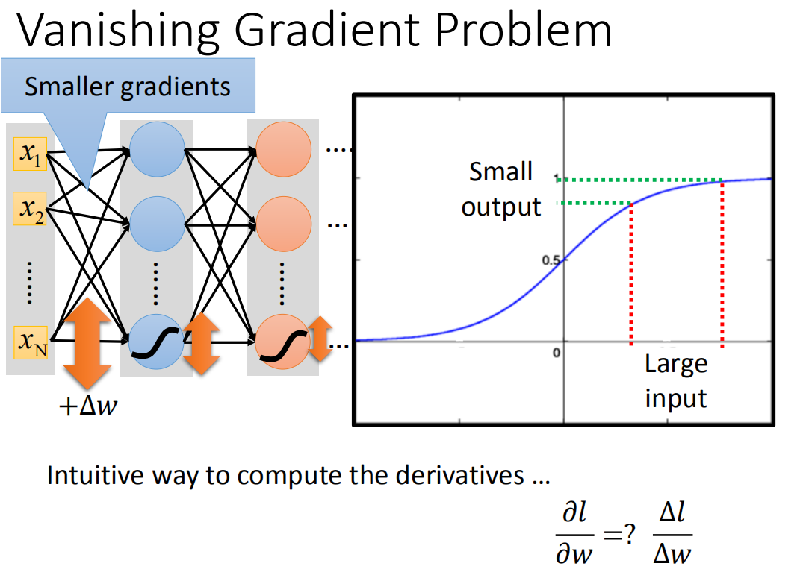

为什么靠近前几层的参数会特别小呢？

怎么样来算一个参数w对 total loss做偏微分，实际上就是对参数做一个小小的变化，对loss的影响，就可以说，这个参数gradient 的值有多大。

给第一个layer的某个参数加上△w时，对output与target之间的loss有什么样的变化。现在我们的△w很大，通过sigmoid function时这个output会很小(一个large input，通过sigmoid function，得到small output)，每通过一次sogmoid function就会衰减一次（因为sogmoid function会将值压缩到0到1之间，将参数变化衰减），hidden layer很多的情况下，最后对loss 的影响非常小(对input 修改一个参数其实对output 是影响是非常小)。

理论上我们可以设计dynamic的learning rate来解决这个问题，确实这样可以有机会解决这个问题，但是直接改activation function会更好，直接从根本上解决这个问题。
###  怎么样去解决梯度消失？
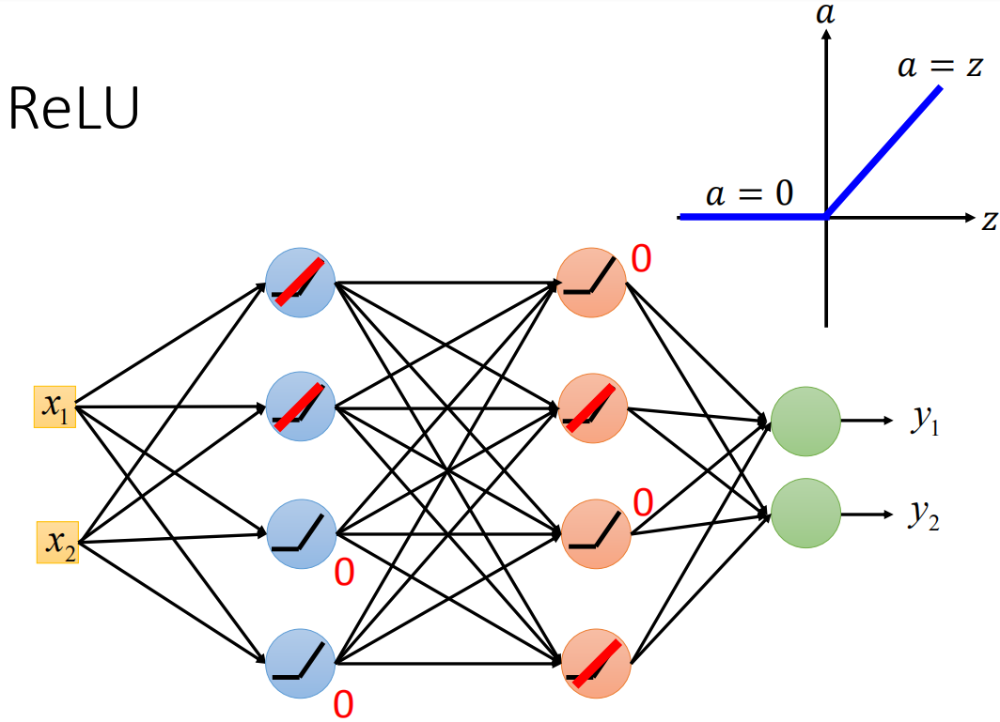

 修改activation function，ReLU input 大于0时，input 等于 output，input小于0时，output等于0

选择这样的activation function有以下的好处：

•	比sigmoid function比较起来是比较快的

•	生物上的原因

•	无穷多的sigmoid function叠加在一起的结果(不同的bias)

•	可以处理 vanishing gradient problem
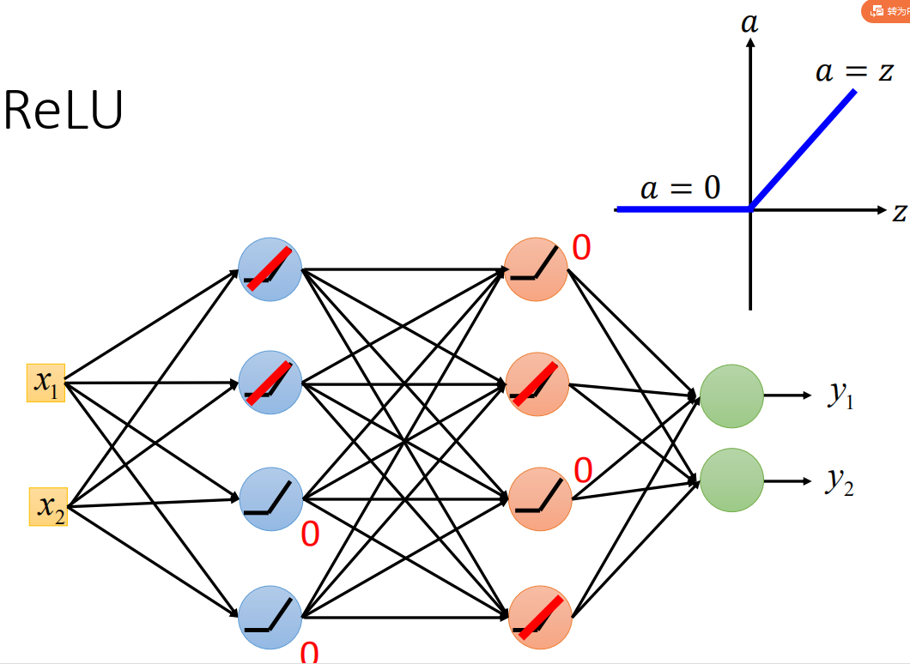

ReLU activation function 作用于两个不同的range，一个range是当activation input大于0时，input等于output，另外一个是当activation function小于0是,output等于0。

那么对那些output等于0的neural来说，对我们的network一点的影响都没。加入有个output等于0的话，你就可以把它从整个network拿掉。(下图所示)  剩下的input等于output是linear时，你整个network就是a thinner linear network。

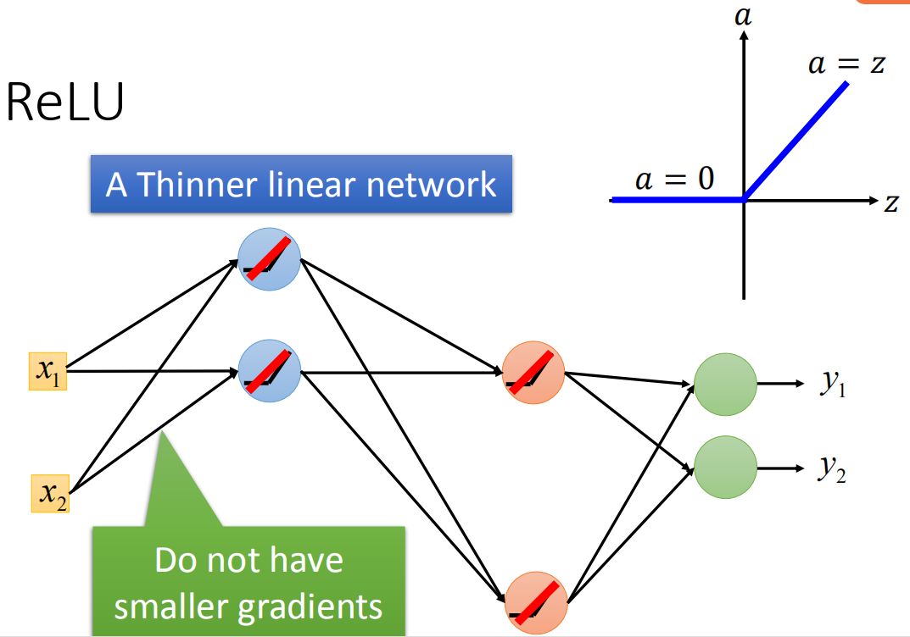

我们之前说，GD递减，是通过sigmoid function，sigmoid function会把较大的input变为小的output，如果是linear的话，input等于output,你就不会出现递减的问题。

我们需要的不是linear network（就像我们之所以不使用逻辑回归，就是因为逻辑回归是线性的），所以我们才用deep learning ，就是不希望我们的function不是linear，我们需要它不是linear function，而是一个很复杂的function。对于ReLU activation function的神经网络，只是在小范围内是线性的，在总体上还是非线性的。

如果你只对input做小小的改变，不改变neural的activation range,它是一个linear function，但是你要对input做比较大的改变，改变neural的activation range，它就不是linear function。

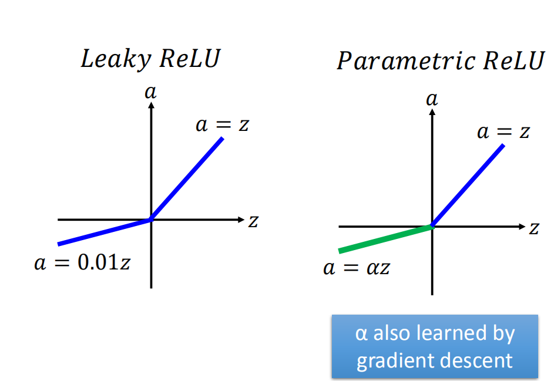

1、改进1 leaky ReLU
ReLU在input小于0时，output为0，这时微分为0，你就没有办法updata你的参数，所有我们就希望在input小于0时，output有一点的值(input小于0时，output等于0.01乘以input)，这被叫做leaky ReLU。

2、改进2 Parametric ReLU

Parametric ReLU在input小于0时，output等于\alpha zαz\alphaα为neural的一个参数，可以通过training data学习出来，甚至每个neural都可以有不同的\alphaα值。

那么除了ReLU就没有别的activation function了吗，所以我们用Maxout来根据training data自动生成activation function。

3、改进3Exponential linear Unit (ELU)
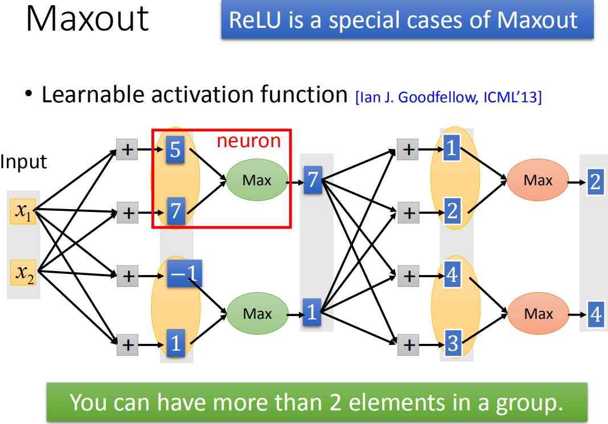

让network自动去学它的activation function，因为activation function是自动学出来的，所有ReLU就是一种特殊的Maxout case。

input是x1,x2，x1,x2乘以weight得到5,7,-1,1。这些值本来是通过ReLU或者sigmoid function等得到其他的一些value。现在在Maxout里面，在这些value group起来(哪些value被group起来是事先决定的，如上图所示)，在组里选出一个最大的值当做output(选出7和1，这是一个vector 而不是一个value)，7和1再乘以不同的weight得到不同的value，然后group，再选出max value。

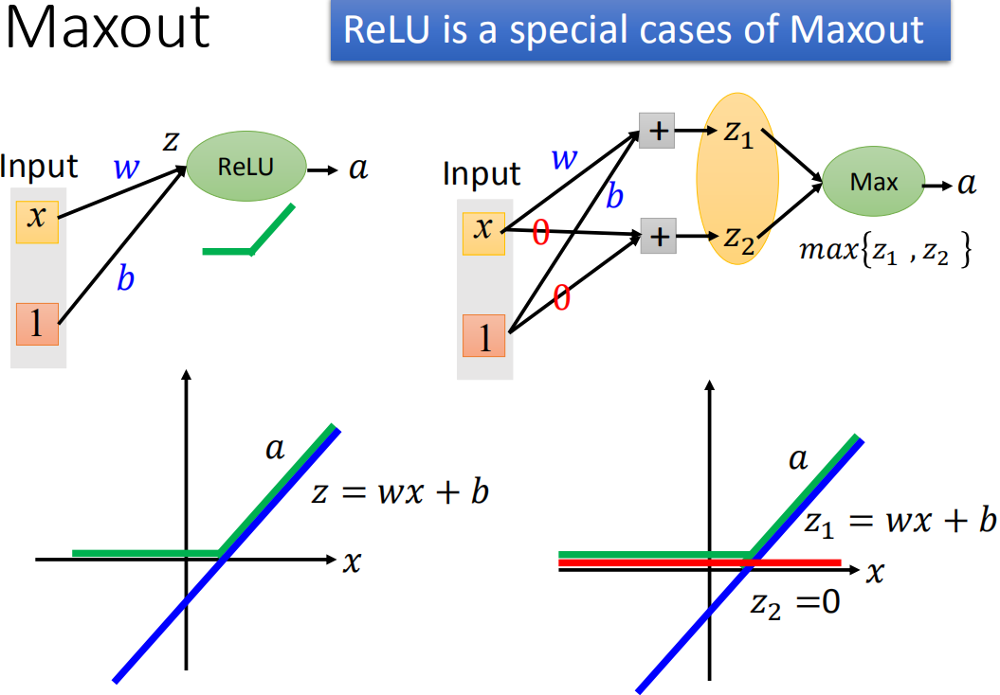
Maxout network 是怎么样产生不同的activation function，Maxout有办法做到跟ReLU一样的事情。

对比ReLu和Maxout

ReLu：input乘以w,b，再经过ReLU得a。

Maxout：input中x和1乘以w和b得到z1，z2，x和1乘以w和b得到z2，z2(现在假设第二组的w和b等于0，那么z2,z2等于0)，在两个中选出max得到a(如上图所示)
现在只要第一组的w和b等于第二组的w和b，那么Maxout做的事就是和ReLU是一样的。

当然在Maxout选择不同的w和b做的事也是不一样的(如上图所示)，每一个Neural根据它不同的wight和bias，就可以有不同的activation function。这些参数都是Maxout network自己学习出来的，根据数据的不同Maxout network可以自己学习出不同的activation function。

上图是由于Maxout network中有两个pieces，如果Maxout network中有三个pieces，Maxout network会学习到不同的activation function如下图。
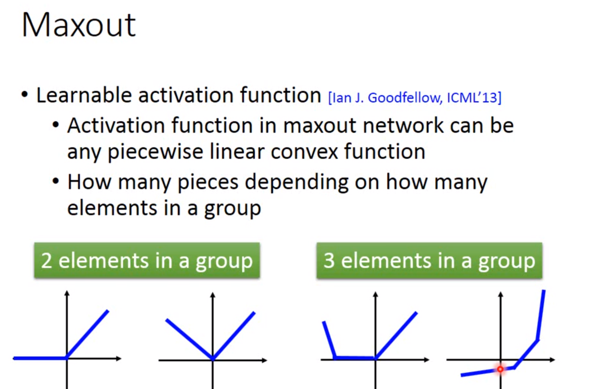

面对另外一个问题，怎么样去training，因为max函数无法微分。但是其实只要可以算出参数的变化，对loss的影响就可以用梯度下降来train网络。
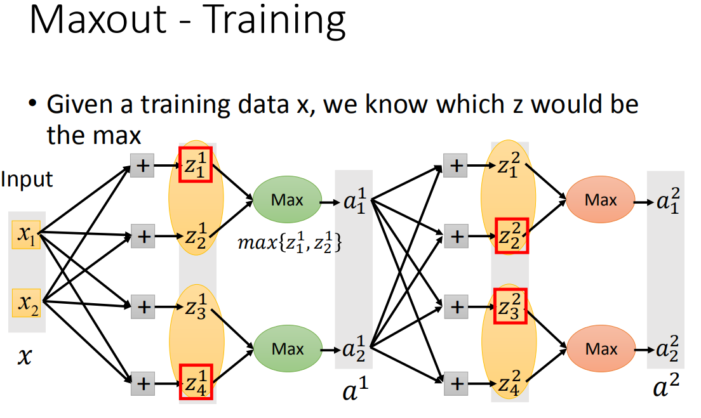

 max operation用方框圈起来，当你知道在一组值里面哪一个比较大的时候，max operation其实在这边就是一个linear operation，只不过是在选取前一个group的element。把group中不是max value拿掉。
 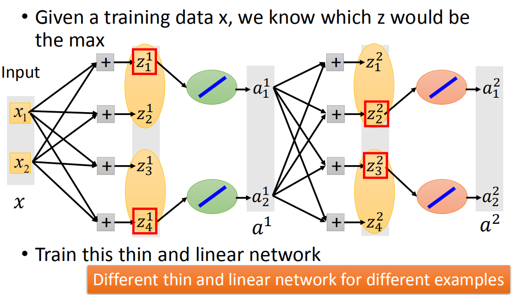
 没有被training到的element，那么它连接的w就不会被training到了，在做BP时，只会training在图上颜色深的实线，不会training不是max value的weight。这表面上看是一个问题，但实际上不是一个问题。

当你给到不同的input时，得到的z的值是不同的，max value是不一样的，因为我们有很多training data，而neural structure不断的变化，实际上每一个weight都会被training。
###  Adaptive Learning Rate

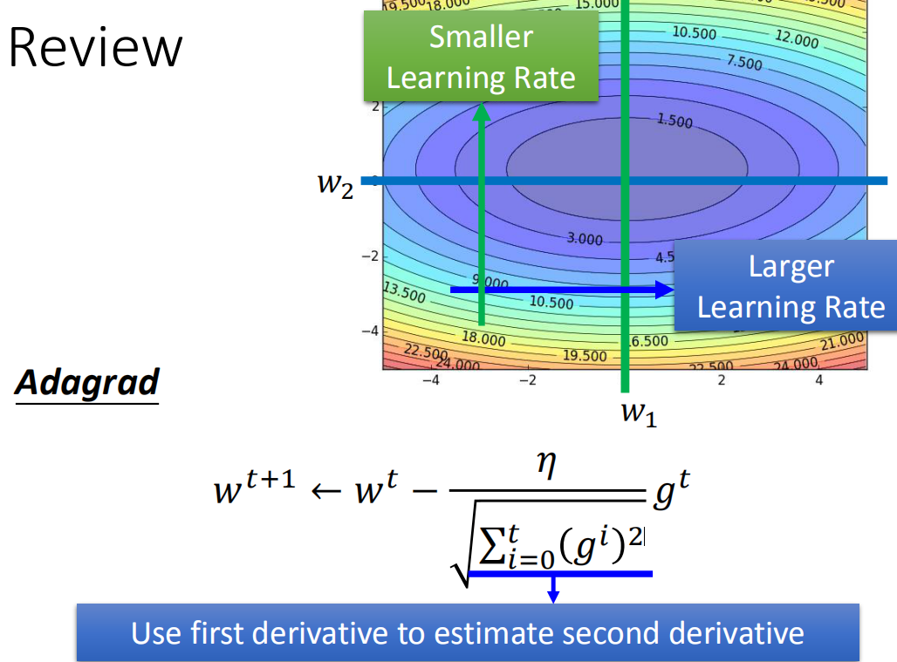
 每一个parameter 都要有不同的learning rate，这个 Adagrd learning rate 就是用固定的learnin rate除以这个参数过去所有GD值的平方和开根号，得到新的parameter。

我们在做deep learnning时，这个loss function可以是任何形状。
 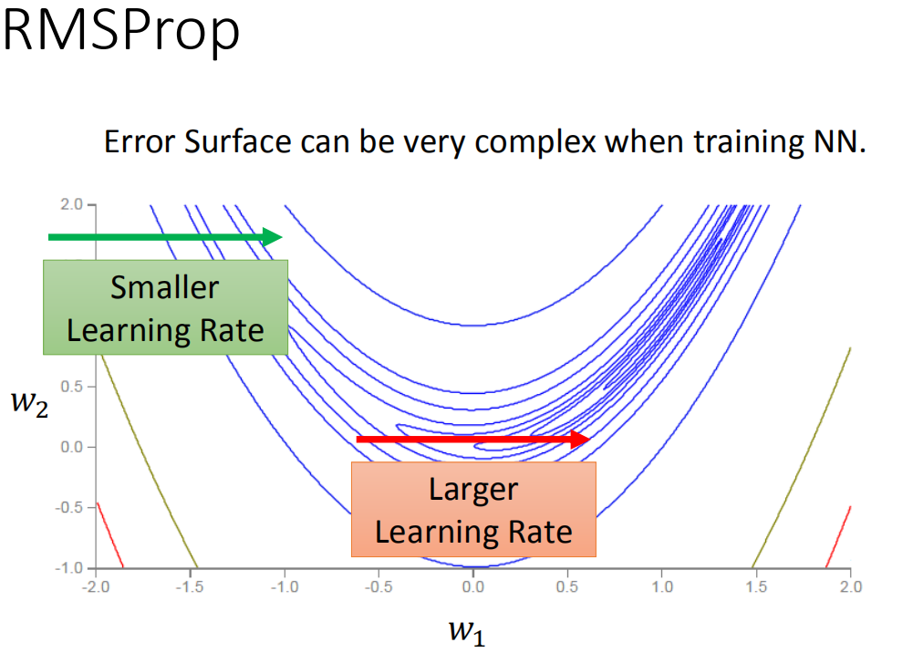
考虑同一个参数假设为w1，参数在绿色箭头处，可能会需要learning rate小一些，参数在红色箭头处，可能会需要learning rate大一些。

你的error surface是这个形状的时候，learning rate是要能够快速的变动.

在deep learning 的问题上，Adagrad可能是不够的，这时就需要RMSProp（该方法是Hinton在上课的时候提出来的，找不到对应文献出处）。
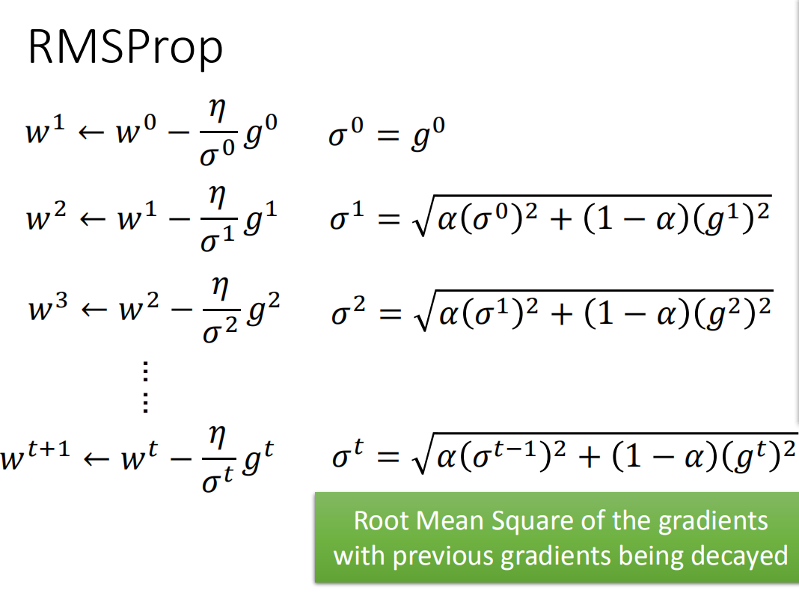
 一个固定的learning rate除以一个\sigmaσ(在第一个时间点，\sigmaσ就是第一个算出来GD的值)，在第二个时间点，你算出来一个g^1g1，\sigma^1σ1(你可以去手动调一个\alphaα值，把\alphaα值调整的小一点，说明你倾向于相信新的gradient 告诉你的这个error surface的平滑或者陡峭的程度。
 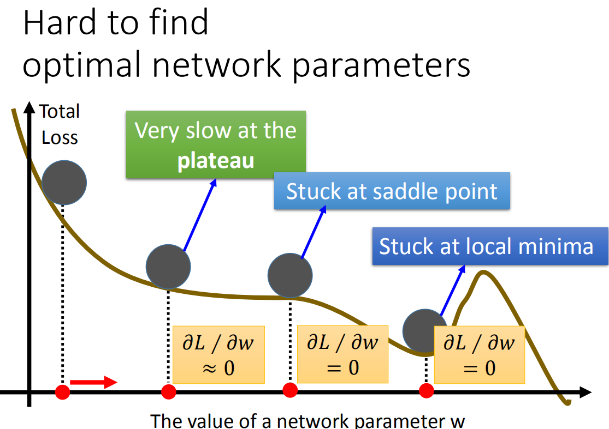
除了learning rate的问题以外，我们在做deep learning的时候，有可能会卡在local minimize，也有可能会卡在 saddle point，甚至会卡在plateau的地方。

其实在error surface上没有太多的local minimize，所以不用太担心。因为，你要是一个local minimize，你在一个dimension必须要是一个山谷的谷底，假设山谷的谷底出现的几率是P，因为我们的neural有非常多的参数(假设有1000个参数，每一个参数的dimension出现山谷的谷底就是各个P相乘)，你的Neural越大，参数越大，出现的几率越低。所以local minimize在一个很大的neural其实没有你想象的那么多。
  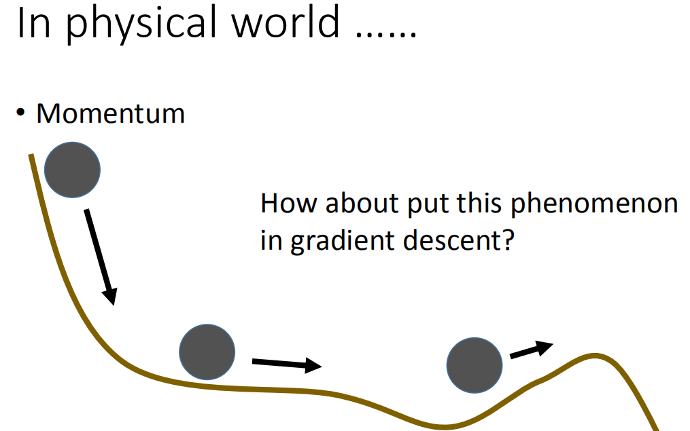
有一个方法可以处理下上述所说的问题

在真实的世界中，在如图所示的山坡中，把一个小球从左上角丢下，滚到plateau的地方，不会去停下来(因为有惯性)，就到了山坡处，只要不是很陡，会因为惯性的作用去翻过这个山坡，就会走到比local minimize还要好的地方，所以我们要做的事情就是要把这个惯性加到GD里面(Mometum)。
现在复习下一般的GD
 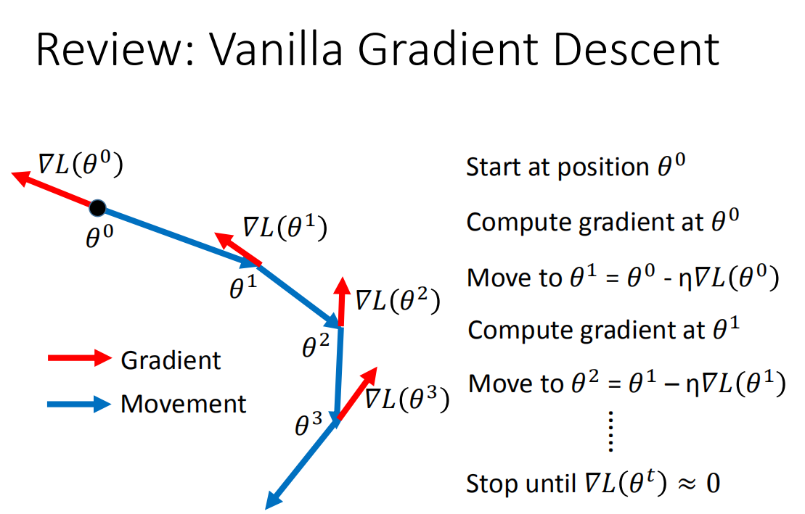
 选择一个初始的值，计算它的gradient，G负梯度方向乘以learning rate，得到θ1，然后继续前面的操作，一直到gradinet等于0时或者趋近于0时。

当我们加上Momentu时
 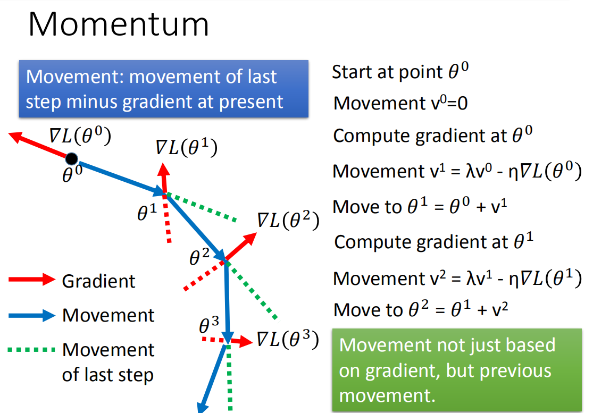

 我们每次移动的方向，不再只有考虑gradient，而是现在的gradient加上前一个时间点移动的方向

（1）步骤

选择一个初始值\theta……0θ……0然后用v^0v0去记录在前一个时间点移动的方向(因为是初始值，所以第一次的前一个时间点是0)接下来去计算在\theta^0θ0上的gradient，移动的方向为v^1v1。在第二个时间点，计算gradient\theta^1θ1，gradient告诉我们要走红色虚线的方向(梯度的反方向)，由于惯性是绿色的方向(这个\lambdaλ和learning rare一样是要调节的参数，``$\lambda$`会告诉你惯性的影响是多大)，现在走了一个合成的方向。以此类推...

（2）运作
 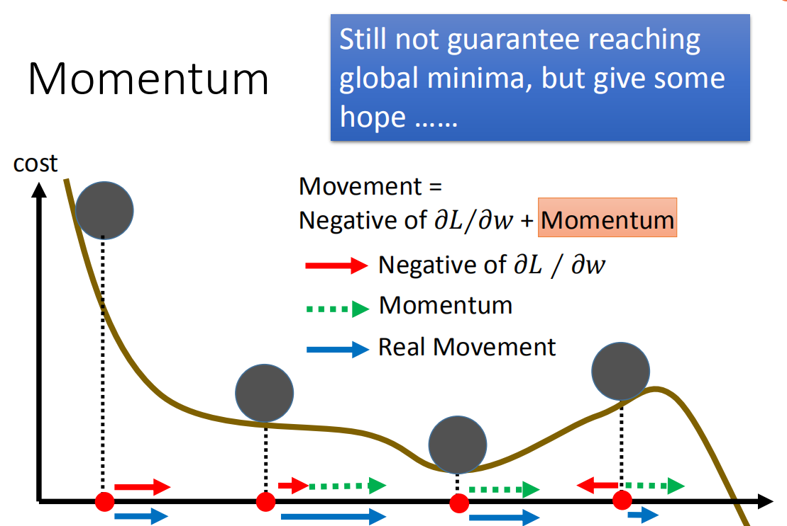

 加上Momentum之后，每一次移动的方向是 negative gardient加上Momentum的方向(现在这个Momentum就是上一个时间点的Moveing)。

现在假设我们的参数是在这个位置(左上角)，gradient建议我们往右走，现在移动到第二个黑色小球的位置，gradient建议往红色箭头的方向走，而Monentum也是会建议我们往右走(绿的箭头)，所以真正的Movement是蓝色的箭头(两个方向合起来)。现在走到local minimize的地方，gradient等于0(gradient告诉你就停在这个地方)，而Momentum告诉你是往右边的方向走，所以你的updata的参数会继续向右。如果local minimize不深的话，可以借Momentum跳出这个local minimize

Adam：RMSProp+Momentum
 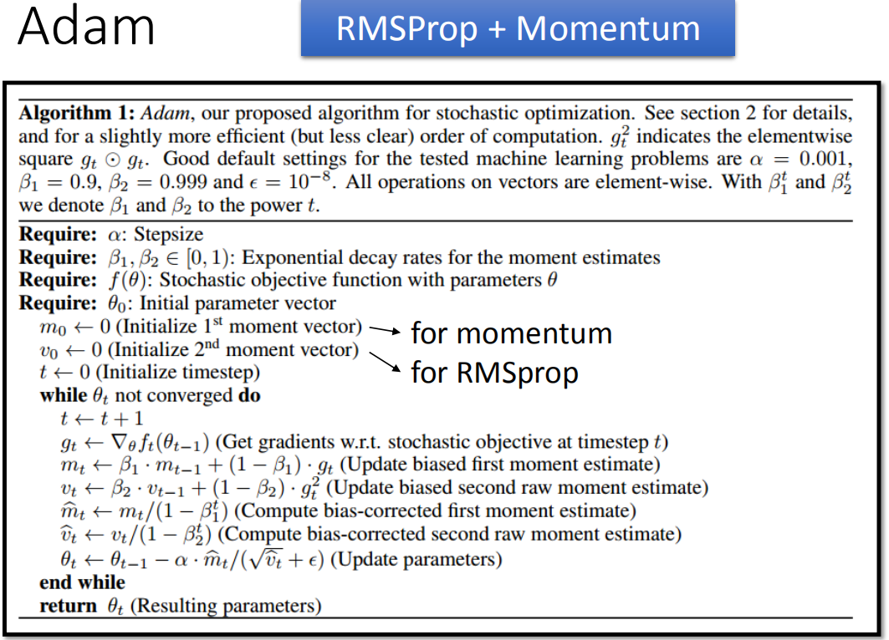

**如果你在training data已经得到了很好的结果了，但是你在testing data上得不到很好的结果，那么接下来会有三个方法帮助解决。**

###  Early Stopping
  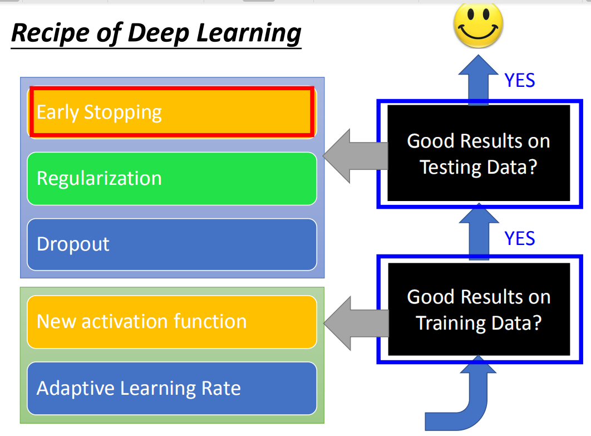
   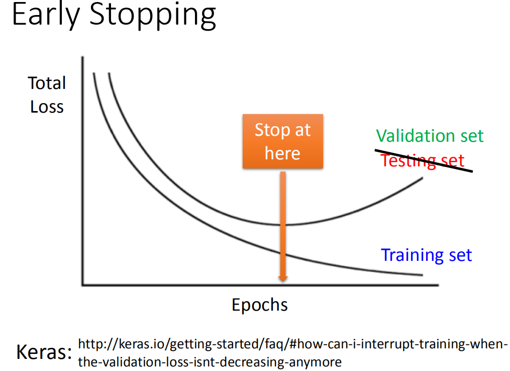

随着你的training，你的total loss会越来越小(learning rate没有设置好，total loss 变大也是有可能的)，training data和testing data的distribute是不一样的，在training data上loss逐渐减小，而在testing data上loss逐渐增大。理想上，假如你知道testing set 上的loss变化，你应该停在不是training set最小的地方，而是testing set最小的地方(如图所示)，可能training到这个地方就停下来。但是你不知道你的testing set(有label的testing set)上的error是什么。所以我们会用validation会 解决

会validation set模拟 testing set，什么时候validation set最小，你的training 会停下来。

###  Regularization
类似与大脑的神经，刚刚从婴儿到6岁时，神经连接变多，但是到14岁一些没有用的连接消失，神经连接变少。
  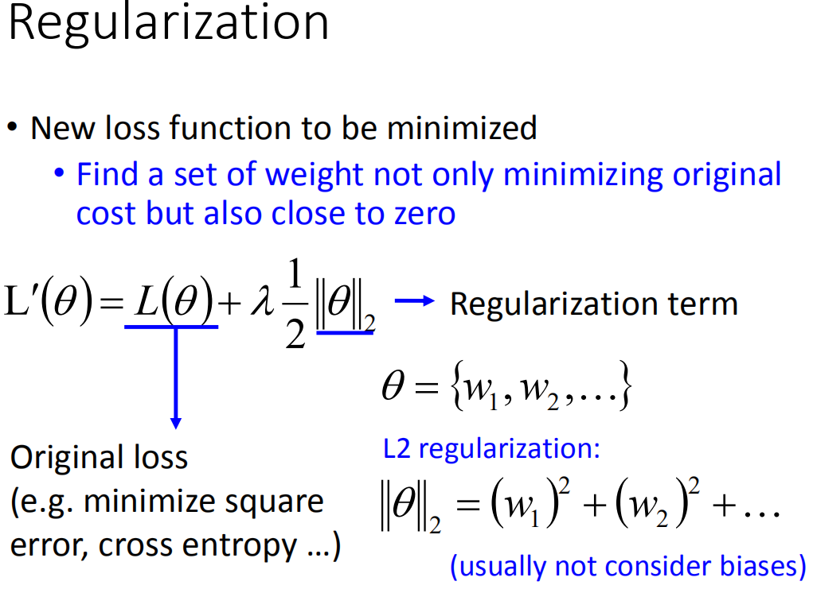
重新去定义要去minimize的那个loss function。

在原来的loss function(minimize square error, cross entropy)的基础上加一个regularization term(L2-Norm)，在做regularization时是不会加bias这一项的，加regularization的目的是为了让线更加的平滑(bias跟平滑这件事情是没有任何关系的)。

  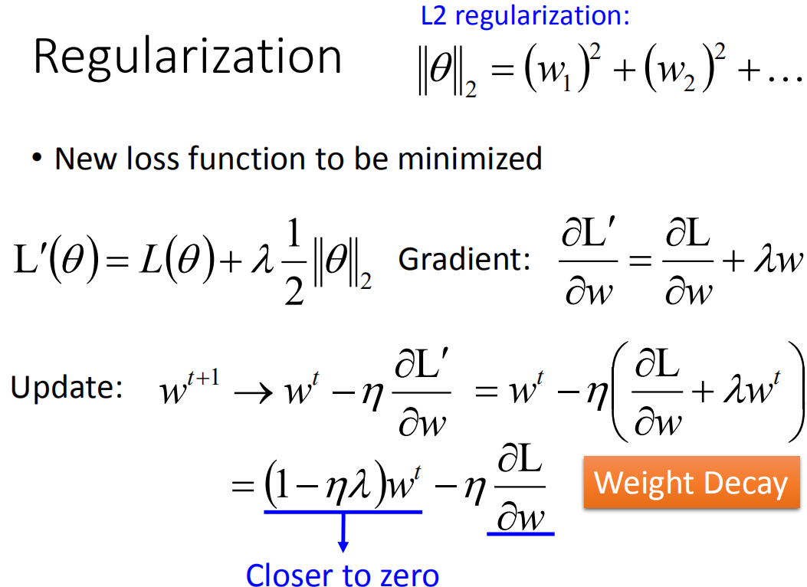

在update参数的时候，其实是在update之前就已近把参数乘以一个小于1的值(\eta \lambdaηλ都是很小的值)，这样每次都会让weight小一点。最后会慢慢变小趋近于0，但是会与后一项梯度的值达到平衡，使得最后的值不等于0。L2的Regularization 又叫做Weight Decay，就像人脑将没有用的神经元去除。

regularization term当然不只是平方，也可以用L1-Norm

  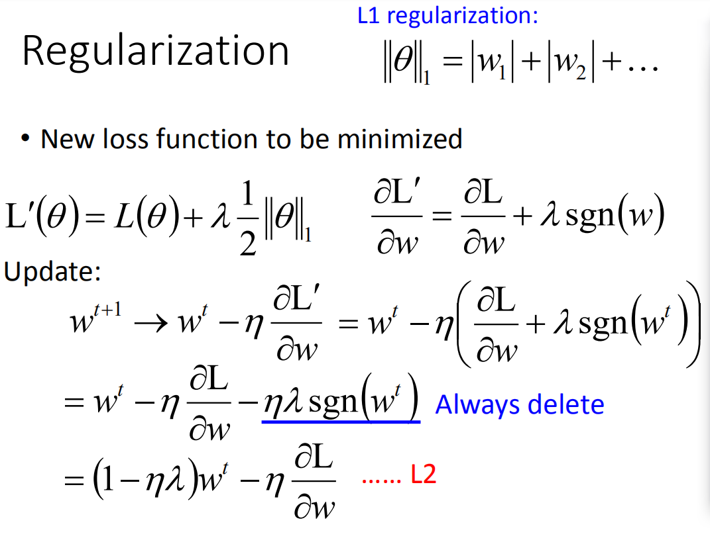

w是正的微分出来就是+1，w是负的微分出来就是-1，可以写为sgn(w)。

每一次更新时参数时，我们一定要去减一个\eta \lambda sgn(w^t)ηλsgn(wt)值(w是正的，就是减去一个值；若w是负的，就是加上一个值，让参数变大)。

L2、L1都可以让参数变小，但是有所不同的，若w是一个很大的值，L2下降的很快，很快就会变得很小，在接近0时，下降的很慢，会保留一些接近01的值；L1的话，减去一个固定的值(比较小的值)，所以下降的很慢。所以，通过L1-Norm training 出来的model，参数会有很大的值。
##  Dropout

### How to train?

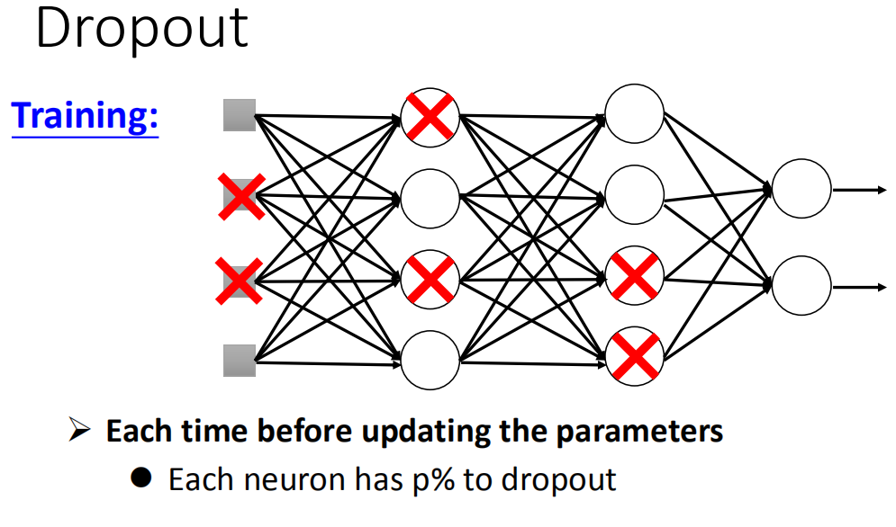

在train的时候，每一次update参数之前，对network里面的每个neural(包括input)，做sampling（抽样）。 每个neural会有p%会被丢掉，跟着的weight也会被丢掉。

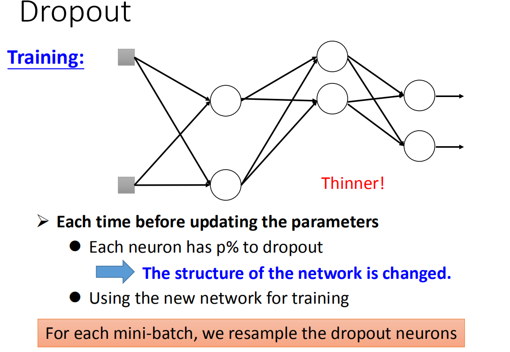

你在training 时，performance会变的有一点差(某些neural不见了)，加上dropout，你会看到在testing set会变得有点差，但是dropout真正做的事就是让你testing 越做越好

  
 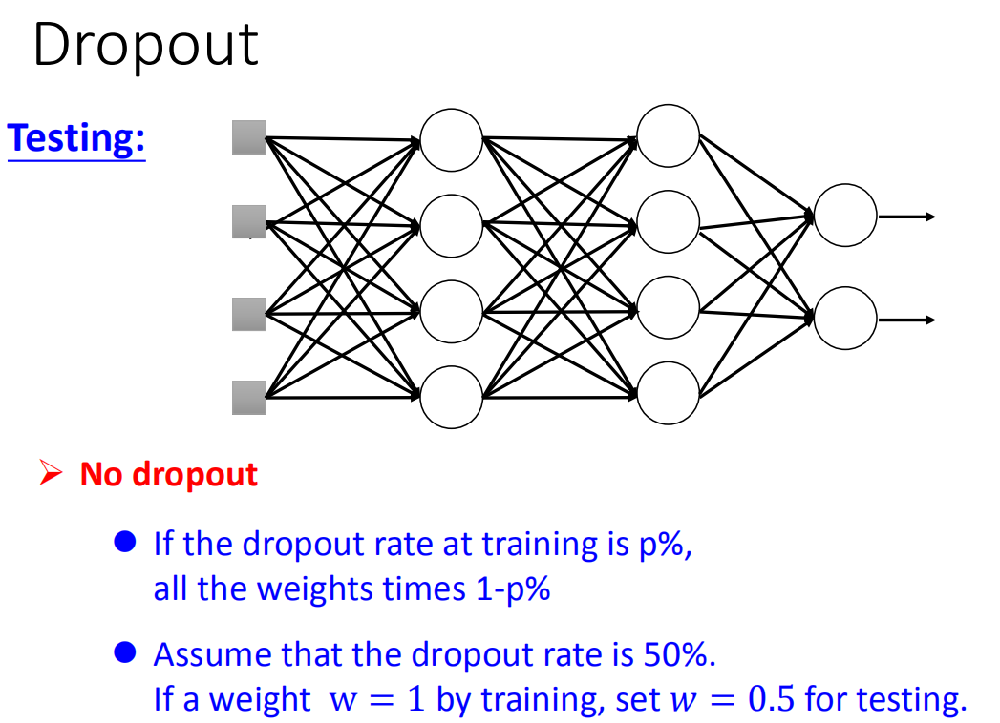
  
在testing上注意两件事情：
- 第一件事情就是在testing上不做dropout。
- 在dropout的时候，假设dropout rate在training是p%，all weights都要乘以（1-p%）

假设training时dropout rate是p%，在testing rate时weights都要乘以（1-p）%。（假定dropout rate是50%，在training的时候计算出来的weights等于1，那么testing时的rate设为0.5

### 为什么Dropout会有用

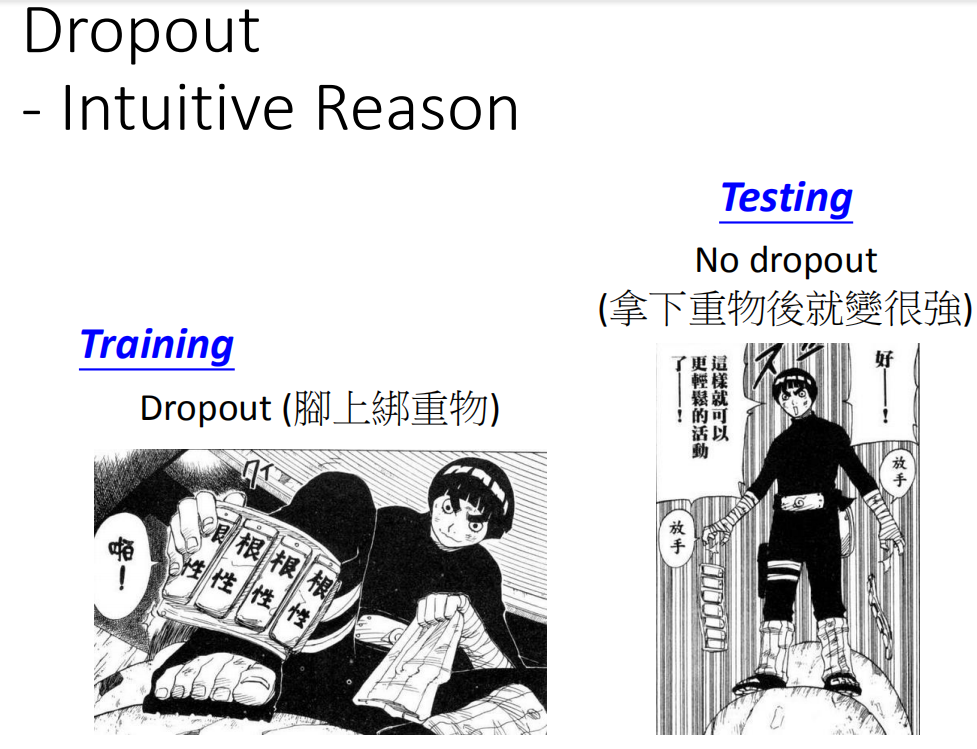

为什么在训练的时候要dropout，但是测试的时候不dropout。

training的时候会丢掉一些neural，就好像使在练习轻功一样在脚上绑上一些重物，然后实际上战斗的时候把重物拿下来就是testing时（没有进行dropout），那时候你就会变得很强

  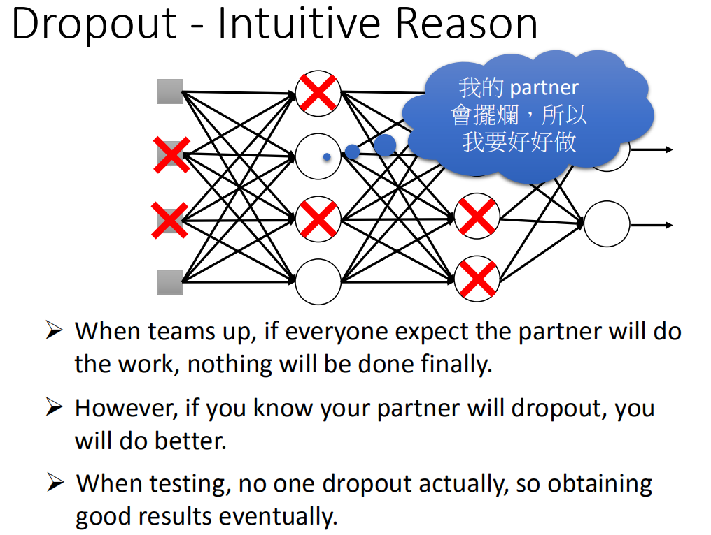

另外一个很直觉的理由是：在一个团队里面，总是会有人摆烂（摆烂，指事情已经无法向好的方向发展,于是就干脆不再采取措施加以控制而是任由其往坏的方向继续发展下去），这是会dropout的。

假设你觉得你的队友会摆烂，所以这个时候你就想要好好做，你想要去carry他。但实际上在testing的时候，大家都是有在好好做，没有需要被carry，因为每个人做的很努力，所以结果会更好。

### testing时为什么要乘以（1-p）%

   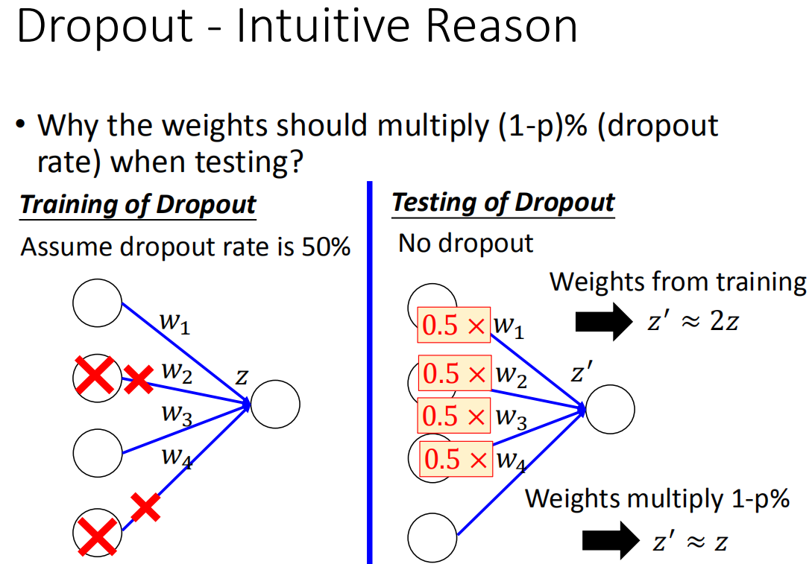

还有一个要解释的是：在做dropout任务时候要乘以（1-p）%，为什么和training时使用的training不相同呢？很直觉的理由是这样的：

假设dropout rate是50 percent，那在training的时候总是会丢掉一般的neural。假设在training时learning好一组weight($w1,w2,w3,w4$)，但是在testing时没有dropout，对同一组weights来说：在training时得到z，在testing是得到$z'$。但是training和testing得到的值是会差两倍的，所以在做testing时都乘以0.5，这样得到的结果是比较match：$z=z'$。

上述的描述是很直觉的解释

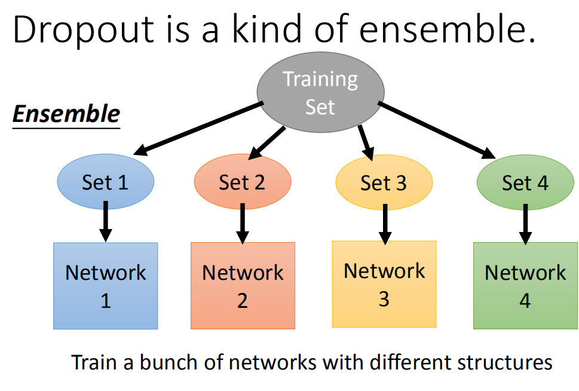

其实dropout还是有很多的理由，这个问题还是可以探讨的问题，你可以在文献上找到很多不同的观点来解释dropout。我觉得我比较能接受的是：dropout是一个终极的ensemble方法

ensemble的意思是：我们有一个很大的training set，每次从training set里面只sample一部分的data。我们之前在讲bias和variance时，打靶有两种状况：一种是bias很大，所以你打准了；一种是variance很大，所以你打准了。如果今天有一个很复杂的model，往往是bias准，但variance很大。若很复杂的model有很多，虽然variance很大，但最后平均下来结果就很准。所以ensemble做的事情就是利用这个特性。

我们可以training很多的model（将原来的training data可以sample很多的set，每个model的structures不一样）。虽然每个model可能variance很大，但是如果它们都是很复杂的model时，平均起来时bias就很小。

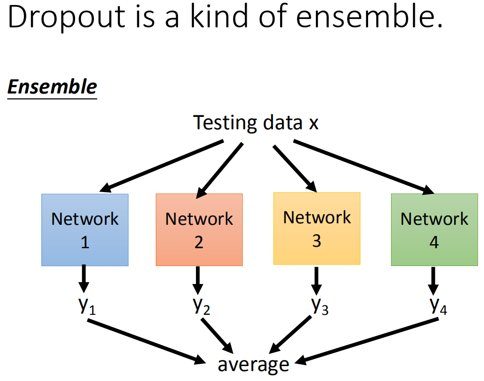

在training时train了很多的model，在testing时输入data x进去通过所有的model（$Network1, Network2, Network3, Network4$），得到结果（$y_1, y_2, y_3, y_4$），再将这些结果做平均当做最后的结果。

如果model很复杂时，这一招是往往有用的

###  为什么说dropout是终极的ensemble方法

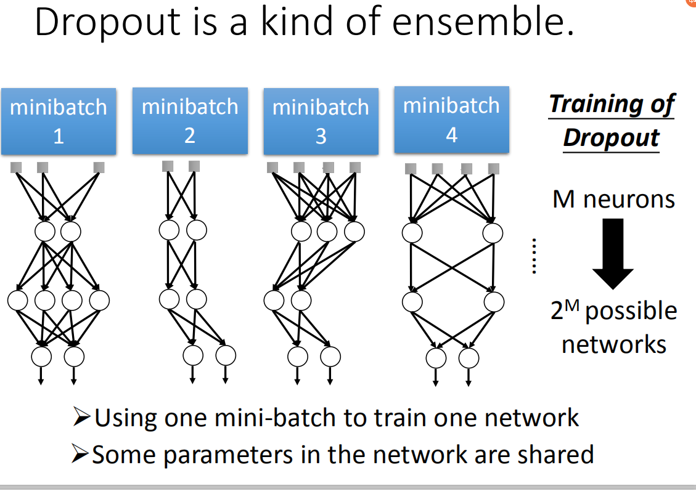

为什么说dropout是终极的ensemble方法？在进行dropout时，每次sample一个minibatch update参数时，都会进行dropout。

第一个、第二个、第三个、第四个minibatch如图所示，所以在进行dropout时，是一个终极ensemble的方式。假设有M个neurons，每个neuron可以dropout或者不dropout，所以可能neurons的数目为$2^M$，但是在做dropout时，你在train$2^M$neurons。

每次只用one mini-batch去train一个neuron，总共有$2^M$可能的neuron。最后可能update的次数是有限的，你可能没有办法把$2^M$的neuron都train一遍，但是你可能已经train好多的neurons。

每个neuron都用one mini-batch来train，每个neuron用一个batch来train可能会让人觉得很不安（一个batch只有100笔data，怎么可能train整个neuron呢）。这是没有关系的，因为这些不同neuron的参数是共享的。

 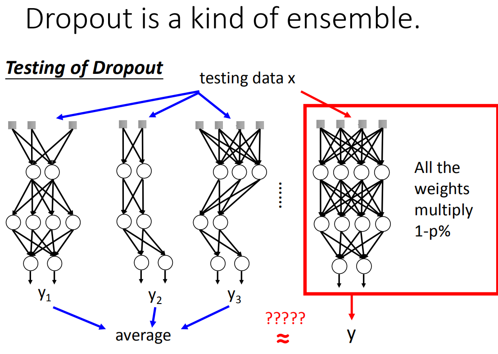

在testing的时候，按照ensemble方法，把之前的network拿出来，然后把train data丢到network里面去，每一个network都会给你一个结果，这些结果的平均值就是最终的结果。但是实际上没有办法这样做，因为network太多了。所以dropout最神奇的是：当你把一个完整的network不进行dropout，但是将它的weights乘以（1-p）percent，然后将train data输入，得到的output y。神奇的是：之前做average的结果跟output y是approximated

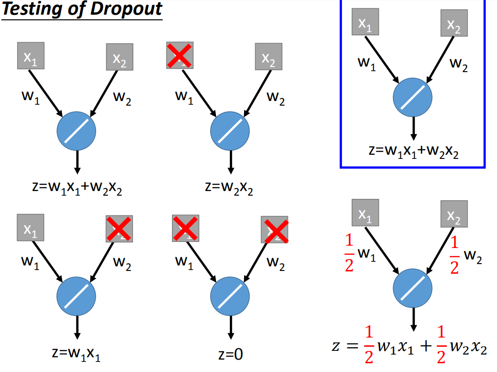

你可能想说何以见得？接下来我们将来举一个示例：若我们train一个很简单的network（只有一个neuron并且不考虑bis），这个network的activation是linear的。

这个neuron的输入是$x_1, x_2$，经过dropout以后得到的weights是$w_1, w_2$，所以它的output是$z=w_1x_2+w_2x_2$。如果我们要做ensemble时，每个input可能被dropout或者不被dropout，所以总共有四种structure，它们所对应的结果分别为$z=w_1x_1, z=w_2x_2, z=w_1x_1, z=0$。因为我们要进行ensemble，所以要把这四个neuron的output要average，得到的结果是$z=\frac{1}{2}w_1x_1+\frac{1}{2}w_2x_2$。

如果我们现在将这两个weights都乘以$\frac{1}{2}$（$\frac{1}{2}w_1x_1+\frac{1}{2}w_2x_2$）,得到的output为$z=\frac{1}{2}w_1x_1+\frac{1}{2}w_2x_2$。在这个最简单的case里面，不同的neuron structure做ensemble这件事情跟我们将weights multiply一个值，而不做ensemble所得到的output其实是一样的。

只有是linear network，ensemble才会等于weights multiply一个值。 

