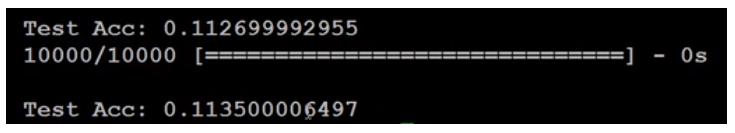
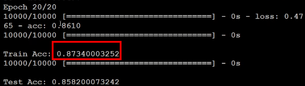
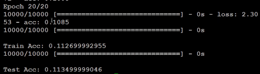
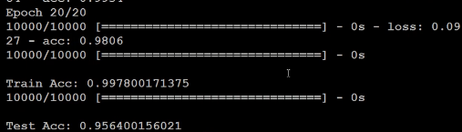
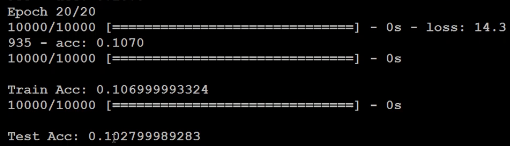
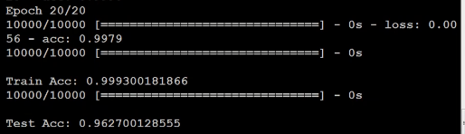
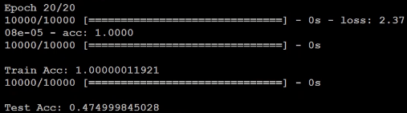
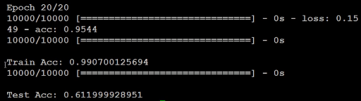

## 上一次失败的例子
deep learning这么潮的东西，实现起来也很简单。首先是load_data进行数据载入处理。
```
import numpy as np
from keras.models import Sequential
from keras.layers.core import Dense,Dropout,Activation
from keras.optimizers import SGD,Adam
from keras.utils import np_utils
from keras.datasets import mnist

def load_data():
	(x_train,y_train),(x_test,y_test)=mnist.load_data()
	number=10000
	x_train=x_train[0:number]
	y_train=y_train[0:number]
	x_train=x_train.reshape(number,28*28)
	x_test=x_test.reshape(x_test.shape[0],28*28)
	x_train=x_train.astype('float32')
	x_test=x_test.astype('float32')
	y_train=np_utils.to_categorical(y_train,10)
	y_test=np_utils.to_categorical(y_test,10)
	x_train=x_train
	x_test=x_test
	x_train=x_train/255
	x_test=x_test/255
	return (x_train,y_train),(x_test,y_test)

(x_train,y_train),(x_test,y_test)=load_data()

model=Sequential()
model.add(Dense(input_dim=28*28,units=633,activation='sigmoid'))
model.add(Dense(units=633,activation='sigmoid'))
model.add(Dense(units=633,activation='sigmoid'))
model.add(Dense(units=10,activation='softmax'))

model.compile(loss='mse',optimizer=SGD(lr=0.1),metrics=['accuracy'])

model.fit(x_train,y_train,batch_size=100,epochs=20)

result= model.evaluate(x_test,y_test)

print('TEST ACC:',result[1])
```


结果是差的，那么该怎么办。首先先看你在train data的performer，如果它在train data上做得好，那么可能是过拟合，如果在train data上做得不好，怎么能让它做到举一反三呢。所以我们至少先让它在train data 上得到好的结果。
```
model.evaluate(x_train,y_train,batch_size=10000)
```


train data acc 也是差的，就说明train没有train好，并不是overfiting
## 调参过程
### loss function
```
model.compile(loss='categorical_crossentropy',optimizer=SGD(lr=0.1),metrics=['accuracy'])
```
分类问题mse不适合，将loss mse function 改为categorical_crossentropy，看看有怎样的差别



当我们一换categorical_crossentropy，在train set上的结果就起飞了。得到87.34%的正确率，现在就比较有train起来了。
### batch_size
再试一下batch_size对结果的影响，现在我们的batch_size是100，改成10000试试看

```
model.fit(x_train,y_train,batch_size=10000,epochs=20)
```


batch_size 设10000，跑超快，然而一样的架构，batch_size太大的时候performer就坏掉。再把10000改为1
```
model.fit(x_train,y_train,batch_size=1,epochs=20)
```
GPU没有办法利用它的并行运算，所以跑得超慢~
### deep layer
再看看deep layer，我们再加10层
```
for _ in range(10):
	model.add(Dense(units=689,activation='sigmoid'))
	
```


没有train 起来~~接着改下activation function
### activation function
我们把sigmoid都改为relu，发现现在train的accuracy就爬起来了，train的acc已经将近100分了，test 上也可以得到95.64%


### normalize
现在的图片是有进行normalize，每个pixel我们用一个0-1之间的值进行表示，那么我们不进行normalize，把255拿掉会怎样呢？
```
	# x_train=x_train/255
	# x_test=x_test/255
```


你会发现你又做不起来了，所以这种小小的地方，只是有没有做normalizion，其实对你的结果会有关键性影响。

### optimizer
把SGD改为Adam，然后再跑一次，你会发现说，用adam的时候最后收敛的地方查不到，但是上升的速度变快。



### Random noise
在test set上每个pixel上随机加noise，再看看结果会掉多少
```
x_test=np.random.normal(x_test)
```



结果就烂掉了，over fiting 了~
### dropout
我们再试试dropout能带来什么效果
```
model.add(Dense(input_dim=28*28,units=689,activation='relu'))
model.add(Dropout(0.7))
model.add(Dense(units=689,activation='relu'))
model.add(Dropout(0.7))
model.add(Dense(units=689,activation='relu'))
model.add(Dropout(0.7))
model.add(Dense(units=10,activation='softmax'))

```

dropout 加在每个hidden layer，要知道dropout加入之后，train的效果会变差，然而test的正确率提升了



不同的tip对效果有不同的影响，应该要多试试
