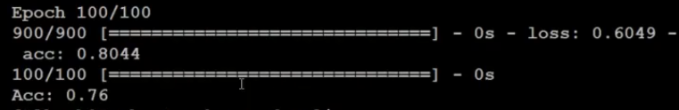

## 数据
对数字101到1000做了labeling，即训练数据xtrain.shape=(900,10)，每一个数字都是用二进位来表示，第一个数字是101，用二进位来表示即为[1,0,1,0,0,1,1,0,0,0]，每一位表示$2^{n-1}$，$n$表示左数第几位。现在一共有四个case，[一般，Fizz，Buzz，Fizz Buzz]，所以y_train.shape=(900,10)，对应的维度用1表示，其他都为0

## 代码
```
from keras.layers.normalization import BatchNormalization
from keras.models import Sequential
from keras.layers.core import Dense,Dropout,Activation
from keras.optimizers import SGD,Adam
import numpy as np

def fizzbuzz(start,end):
	x_train,y_train=[],[]
	for i in range(start,end+1):
		num = i
		tmp=[0]*10
		j=0
		while num :
			tmp[j] = num & 1
			num = num>>1
			j+=1		
		x_train.append(tmp)
		if i % 3 == 0 and i % 5 ==0:
			y_train.append([0,0,0,1])
		elif i % 3 == 0:
			y_train.append([0,1,0,0])
		elif i % 5 == 0:
			y_train.append([0,0,1,0])
		else :
			y_train.append([1,0,0,0])
	return np.array(x_train),np.array(y_train)

x_train,y_train = fizzbuzz(101,1000) #打标记函数
x_test,y_test = fizzbuzz(1,100)

model = Sequential()
model.add(Dense(input_dim=10,output_dim=100))
model.add(Activation('relu'))
model.add(Dense(output_dim=4))
model.add(Activation('softmax'))

model.compile(loss='categorical_crossentropy',optimizer='adam',metrics=['accuracy'])

model.fit(x_train,y_train,batch_size=20,nb_epoch=100)

result = model.evaluate(x_test,y_test,batch_size=1000)

print('Acc：',result[1])

```


	
结果并没有达到百分百正确率，然而并不会放弃，所以我们首先开一个更大的neure，把hidden neure 从100改到1000

```
model.add(Dense(input_dim=10,output_dim=1000))
```

再跑一跑，跑起来了，跑到100了，正确率就是100分


