# Ensemble
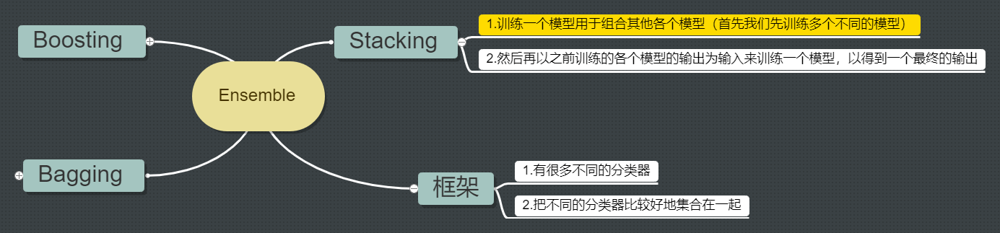

Ensemble

Bagging

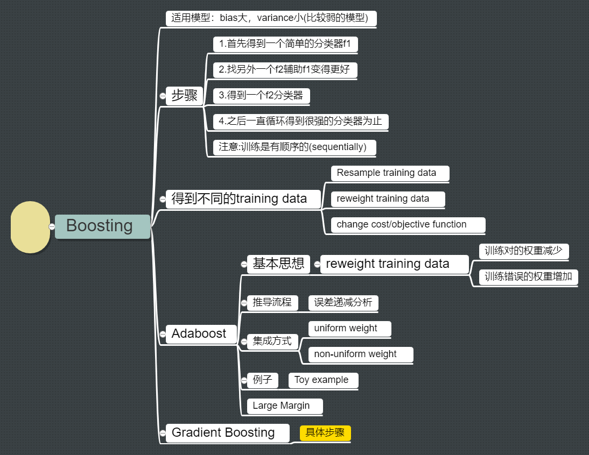

Boosting

## Ensemble的框架
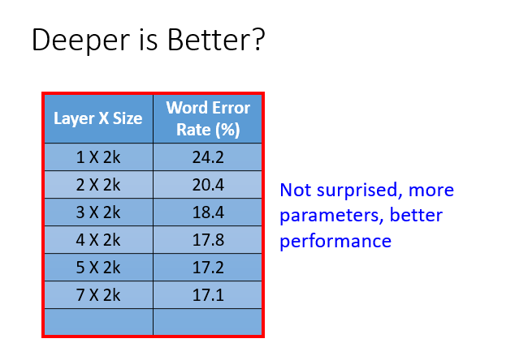
Ensemble的方法就是一种团队合作，好几个模型一起上的方法。

- 第一步：通常情况是有很多的classifier，想把他们集合在一起发挥更强大的功能，这些classifier一般是diverse的，这些classifier有不同的属性和不同的作用。举个例子，就像大家一起出团去打王的时候，每个人都有自己需要做的工作，比如有人扮演坦，有人扮演补，有人扮演DD（输出）。
- 第二步：就是要把classifier用比较好的方法集合在一起，就好像打王的时候坦和DD都站不同的位置，通常用ensemble可以让我们的表现提升一个档次，一般在kaggle之类的比赛中，ensemble用的最多的也是效果最好的，一般前几名都需要用ensemble。
## Bagging
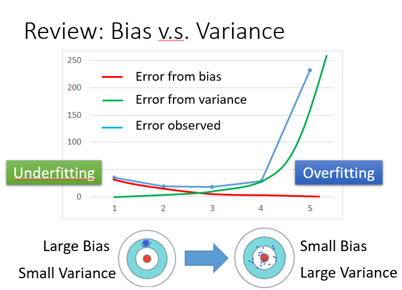
我们先来回顾一下bias和variance，对于简单的模型，我们会有比较大的bias但是有比较小的variance，如果是复杂的模型，我们则是比较小的bias但是有比较大的variance。从上图上看，在这两者的组合下，我们最后的误差（蓝色的线）会随着模型数目的增加，先下降后逐渐上升。
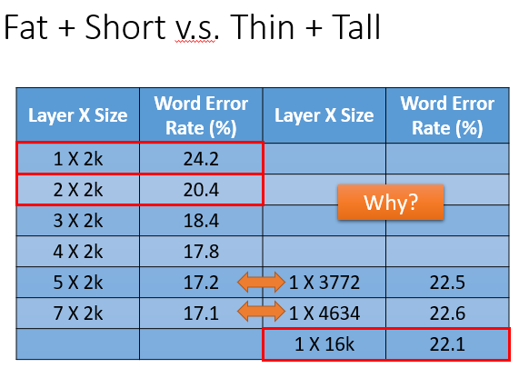
在之前的宝可梦例子中，根据不同的事件我们会得到一个模型，如果一个复杂的模型就会有很大的variance。这些模型的variance虽然很大，但是bias是比较小的，所以我们可以把不同的模型都集合起来，把输出做一个平均，得到一个新的模型$\hat{f}$，这个结果可能和正确的答案就是接近的。Bagging就是要体现这个思想。
Bagging就是我们自己创造出不同的dataset，再用不同的dataset去训练一个复杂的模型，每个模型独自拿出来虽然方差很大，但是把不同的方差大的模型集合起来，整个的方差就不会那么大，而且偏差也会很小。
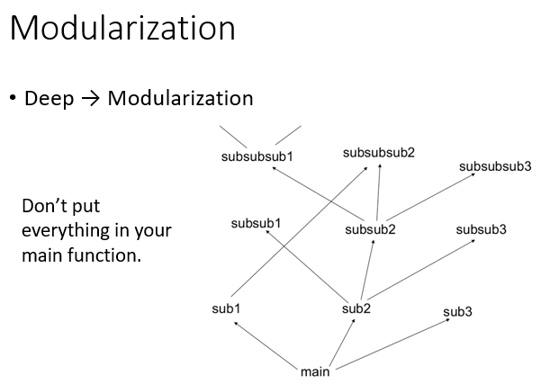
上图表示了用自己采样的数据进行Bagging的过程。在原来的N笔训练数据中进行采样，过程就是每次从N笔训练数据中取N‘（通常N=N’）建立很多个dataset，这个过程抽取到的可能会有重复的数据，但是每次抽取的是随机形成的dataset。每个dataset都有N'笔data，但是每个dataset的数据都是不一样的，接下来就是用一个复杂的模型对四个dataset都进行学习得到四个function，接下来在testing的时候，就把这testing data放到这四个function里面，再把得出来的结果做平均（回归）或者投票（分类），通常来说表现（variance比较小）都比之前的好，这样就不容易产生过拟合。
做Bagging的情况：模型比较复杂，容易产生过拟合。（容易产生过拟合的模型：决策树）目的：降低方差

## Decision Tree
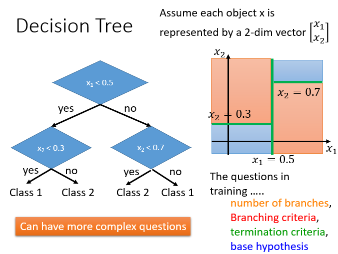
Random Forest就是decision tree做Bagging的版本。假设给定的每个Object有两个feature，我们就用这个training data建立一颗树，如果$x_{1}$小于0.5就是yes（往左边走），当$x_{1}$大于0.5就是no（往右边走），接下来看$x_{2}$，当$x_{2}$小于0.3时就是class1（对应坐标轴图中左下角的蓝色）当大于0.3时候就是class2（红色）；对右边的当$x_{2}$小于0.7时就是红色，当$x_{2}$大于0.7就是蓝色。这是一个比较简单的例子，其实可以同时多个dimension，可以变得更复杂。
做决策树时会有几个地方需要注意：比如每个节点分支的数量，用什么样的标准来进行分支，什么时候停止分支，基本的假设等等问题。
### 决策树的实际例子：初音问题
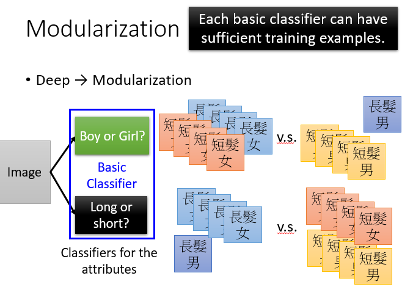
描述：输入的特征是二维的，红色的部分是class1，蓝色的部分是class2，其中class1分布的和初音的样子是一样的。我们用决策树对这个问题进行分类。
### 实验结果：
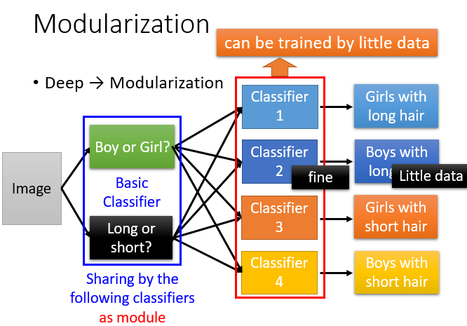
上图可以看到，深度是5的时候效果并不好，图中白色的就是class1，黑色的是class2.当深度是10的时候有一点初音的样子，当深度是15的时候，基本初音的轮廓就出来了，但是一些细节还是很奇怪（比如一些凸起来的边角）当深度是20的时候，就可以完美的把class1和class2的位置区别开来，就可以完美地把初音的样子勾勒出来了。对于决策树，理想的状况下可以达到错误是0的时候，最极端的就是每一笔data point就是很深的树的一个节点，这样正确率就可以达到100%（树够深，决策树可以做出任何的function）但是决策树很容易过拟合，如果只用决策树一般很难达到好的结果。

用决策树做Bagging就是Random Forest（随机森林）
传统的随机森林是通过之前的重采样的方法做，但是得到的结果是每棵树都差不多（效果并不好）。比较多的是随机的限制一些特征或者问题不能用，这样就能保证就算用同样的dataset，每次产生的决策树也会是不一样的，最后把所有的决策树的结果都集合起来，就会得到随机森林。
如果是用Bagging的方法的话，用out-of-bag可以做验证。用这个方法可以不用把label data划分成training set和validation set，一样能得到同样的效果。
具体做法：假设我们有training data是$x^{1}$,$x^{2}$,$x^{3}$,$x^{4}$,$f_{1}$我们只用第一笔和第二笔data训练（圆圈表示训练，叉表示没训练），$f_{2}$我们只用第三笔第四笔data训练，$f_{3}$用第一，第三笔data训练，$f_{4}$表示用第二，第四笔data训练，我们知道，在训练$f_{1}$和$f_{4}$的时候没用用到$x^{1}$，所以我们就可以用$f_{1}$和$f_{4}$Bagging的结果在$x^{1}$上面测试他们的表现，同理，我们可以用$f_{2}$和$f_{3}$Bagging的结果来测试$x^{2}$，下面几个也是同样的道理。
最后用把每个测试的结果取平均的error，就作为最后的error。虽然我们没有明确的切出一个验证集，但是我们做测试的时候所有的模型并没有看过那些测试的数据。所有这个输出的error也是可以作为反映测试集结果的估测效果。
接下来是用随机森林做的实验结果：
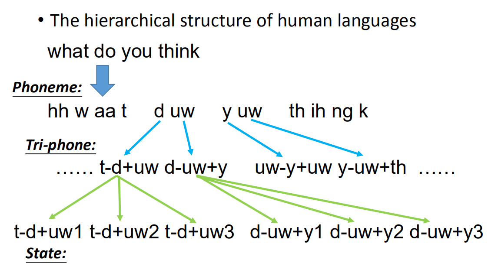
强调一点是做Bagging更不会使模型能fit data，所有用深度为5的时候还是不能fit出一个function，所有就是5颗树的一个平均，相当于得到一个比较平滑的树。当深度是10的时候，大致的形状能看出来了，当15的时候效果就还不错，但是细节没那么好，当20 的时候就可以完美的把初音分出来。
## Boosting

Boosting是用在很弱的模型上的，当我们有很弱的模型的时候，不能fit我们的data的时候，我们就可以用Boosting的方法。
Boosting有一个很强的保证：如果你的机器学习算法能产生错误率小于50%的分类器，这个方法可以保证错误率达到0%。
Boosting的结构：

- 首先要找一个分类器$f_1{(x)}$
- 接下再找一个辅助$f_1{(x)}$的分类器$f_2{(x)}$（注意$f_2{(x)}$如果和$f_1{(x)}$很像，那么$f_2{(x)}$的帮助效果就不好，所以要尽量找互补的$f_2{(x)}$，能够弥补$f_1{(x)}$没办法做到的事情）
- 得到第二个分类器$f_2{(x)}$
- 最后就结合所有的分类器得到结果
注意：Boosting的训练是有顺序的（sequentially），Bagging是没有顺序的（可以同时train）
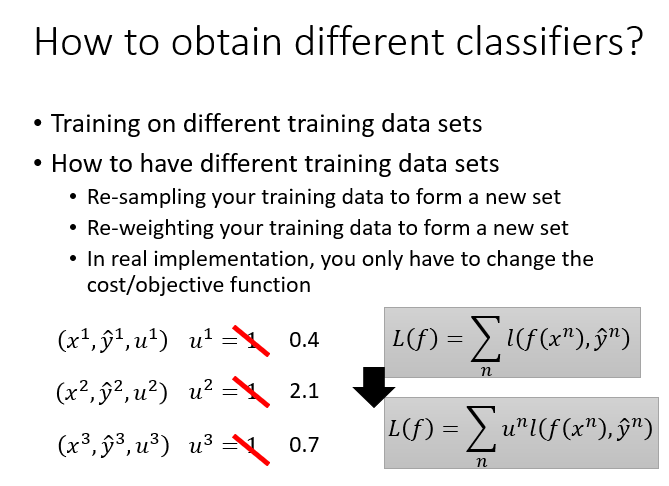
### 如何得到不同的分类器？
- 制造不同的训练数据来得到不同的分类器
—— 用重采样的方法来训练数据得到新的数据集
—— 用重新赋权重的的方法来训练数据得到新的数据集，上图中用u来代表每一笔data的权重，可以通过改变weight来制造不同的data，举例来说就是刚开始都是1，第二次就分别改成0.4,2.1,0.7，这样就制造出新的data set。但是在实际中，就算改变权重，对训练没有太大影响。在训练时，原来的loss function是$L(w)=\sum\limits_{n}l(f(x^n),\hat{y}^n)​$其中$l​$可以是任何不同的function，只要能衡量$f(x^n)​$和$\hat{y}^n​$之间的差距就行，然后用gradient descent 的方法来最小化这个L（total loss function）当加上权重后，变成了$L(w)=\sum\limits_{n}u_nl(f(x^n),\hat{y}^n)​$,相当于就是在原来的基础上乘以$u​$。这样从loss function来看，如果有一笔data的权重比较重，那么在训练的时候就会被多考虑一点。
## Adaboost
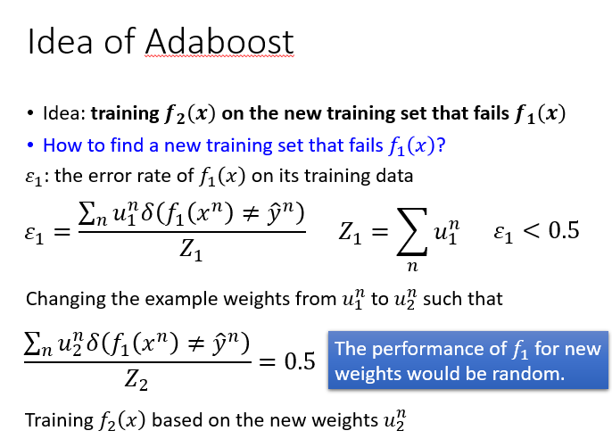
#### 想法：先训练好一个分类器$f_1(x)$，要找一组新的training data，让$f_1(x)$在这组data上的表现很差，然后让$f_2(x)$在这组training data上训练。
怎么找一个新的训练数据集让$f_1(x)​$表现差？
上图中的$\epsilon_1​$就是训练数据的error rate，这个就是对所有训练的样本求和，$\delta(f_1(x^n)\neq\hat{y}^n)​$是计算每笔的training sample分类正确与否，用0来表示正确，用1来表示错误，然后乘以一个weight$u​$，然后做normalization，这个$Z_1​$标准化就是对所有的weight,这里的$\epsilon_1<0.5​$
然后我们用$u_2​$的权重来进行计算得到error rate恰好等于0.5。这个过程相当于重新给训练数据赋权重，原来用u1作为训练数据的权重，现在用u2作为训练数据的权重，在新的权重上，$f_1(x)​$的表现就是随机的，接下来我们拿这组新的训练数据集再去训练$f_2(x)​$，这样的$f_2(x)​$和$f_1(x)​$就是互补的。

### 实际的例子：

假设我们上面的四组训练数据，权重就是$u_1$到$u_4$，并且每个初始值都是1，我们现在用这四组训练数据去训练一个模型$f_1(x)$，假设$f_1(x)$只分类正确其中的三笔训练数据，所以$\epsilon_1=0.25$
然后我们改变每个权重，把对的权重改小一点，把第二笔错误的权重改大一点（就比如当你做完考卷，老师说把你错误题目的分数增大，你就会很生气，这里对应的就是让$f_1(x)$在新的训练集上表现差）这样一来，$f_1(x)$在新的训练数据集上表现就会变差$\epsilon_1=0.5$。
然后在得到的新的训练数据集上训练得到$f_2(x)$，这个$f_2(x)$训练完之后得到的$\epsilon_2$会比0.5小。
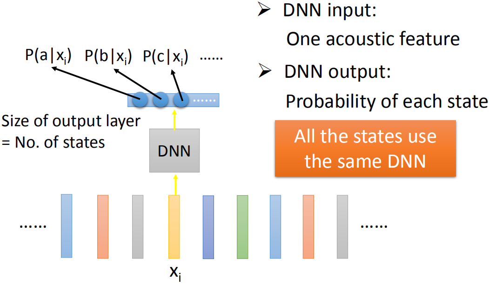
### Reweight的具体流程：
假设训练数据$x^n$会被$f_1(x)$分类错，那么就把第n笔data的$u^n_1$乘上$d_1$变成$d_2$，这个$d_1$是大于1的值（也就是把错误分类的data权重提高）
如果$x^n$正确的被$f_1(x)$分类的话，那么就用$u^n_1$除以$d_1$变成$d_2$（也就是把正确分类的data的权重减少）
$f_2(x)$就会在新的权重$u^n_2$上进行训练。
对于$d_1$
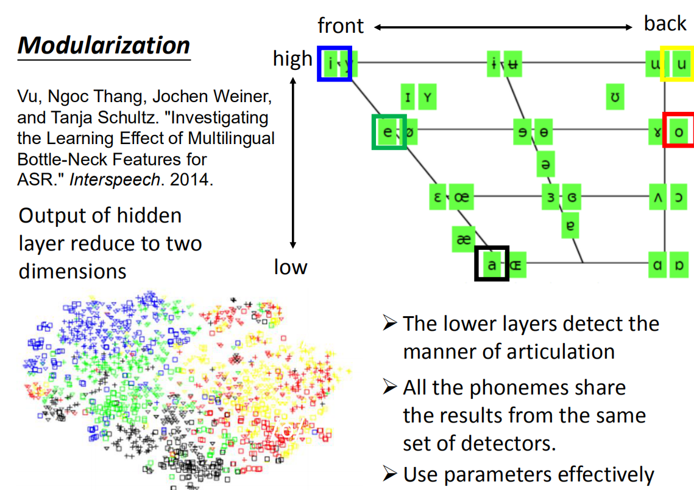
对于图中分子部分分类错误的$f_1(x^n)\neq\hat{y}^n$对应的$u^n_1$就乘上$d_1$，再看分母的部分，$Z_2$就等于$\sum\limits_n{u^n_2}$，同时也等于后面分类错误和分类正确的两个$u^n_1$的权重和。所以结合一下然后再取个倒数就可以得到图中最后一个式子。
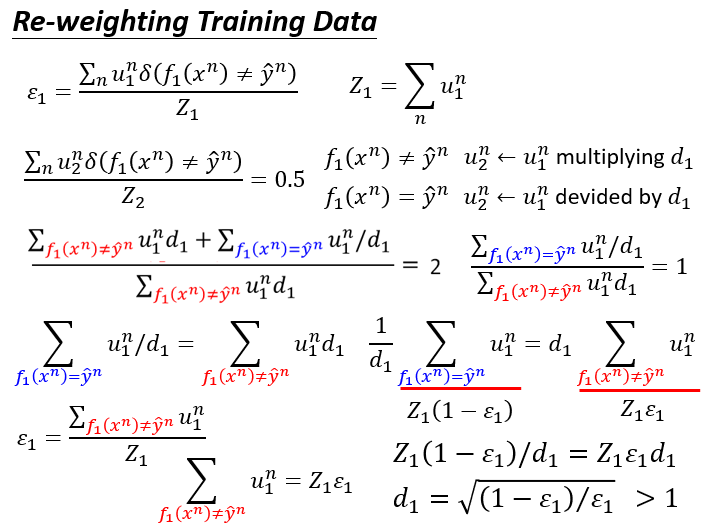
最后能得到结果是$d_1=\sqrt{(1-\epsilon_1)/\epsilon_1}$,然后用这个$d_1$去乘或者除权重，就能得到让$f_2(x)$表现不好的新的训练数据集。
注意：$d_1$是大于1的，因为$\epsilon_1$是小于0.5，所以该式子会大于1
### 总结AdaBoost
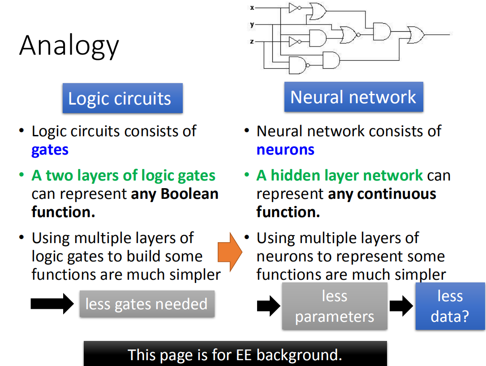
给定一笔训练数据以及其权重，设置初始的权重为1，接下来用不同的权重来进行很多次迭代训练弱分类器，然后再把这些弱的分类器集合起来就变成一个强的分类器。其中在每次迭代中，每一笔训练数据都有其对应的权重。
用每个弱分类器对应的权重训练出每个弱分类器$f_t(x)​$，计算$f_t(x)​$在各自对应权重中的错误率$\epsilon_t​$。
然后就可以重新给训练数据赋权值，如果分类错误的数据，就用原来的$u^n_t​$乘上$d_t​$来更新其权重，反之就把原来的$u^n_t​$除以$d_t​$得到一组新的权重，然后就继续在下一次迭代中继续重复操作。（其中$d_1=\sqrt{(1-\epsilon_1)/\epsilon_1}​$）
或者对$d_t​$我们还可以用$\alpha_t=ln\sqrt{(1-\epsilon)/\epsilon}​$来代替，这样我们就可以直接统一用乘的形式来更新$u^n_t​$，变成了乘以$exp(\alpha_t)​$或者乘以$exp(-\alpha_t)​$，这里的正负1用$-\hat{y}^nf_t(x^n)​$来取正负号(当分类错误该式子就是正的，分类正确该式子就是负的)这样表达式子就会更加简便。
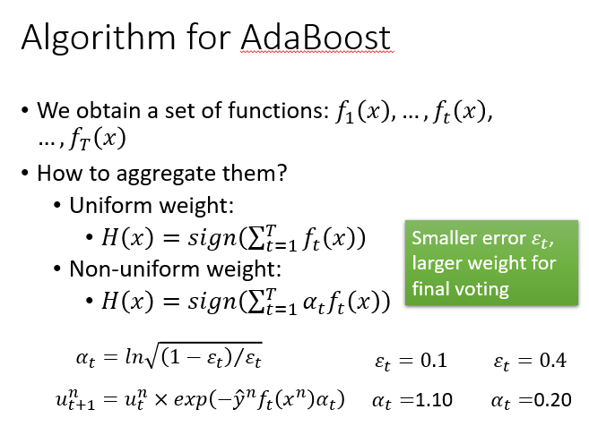
经过刚才的训练之后我们就得到了$f_1(x)​$到$f_T(x)​$，
一般有两种方法进行集合：
Uniform weight：我们把T个分类器加起来看其结果是正的还是负的（正的就代表class1，负的就代表class2），这样可以但不是最好的，因为分类器中有好有坏，如果每个分类器的权重都一样的，显然是不合理的。
Non-uniform weight:在每个分类器前都乘上一个权重$\alpha_t​$,然后全部加起来后取结果的正负号，这种方法就能得到比较好的结果
这里的$\alpha_t=ln\sqrt{(1-\epsilon)/\epsilon}​$从后面的例子可以看到，错误率比较低的$\epsilon_t​$=0.1得到最后的$\alpha_t​$=1.10就比较大，反之，如果错误率比较高的$\epsilon_t​$=0.4得到最后的$\alpha_t​$=0.20就比较小。
总结：错误率比较小的分类器，最后在最终结果的投票上会有比较大的权重。
## Toy example
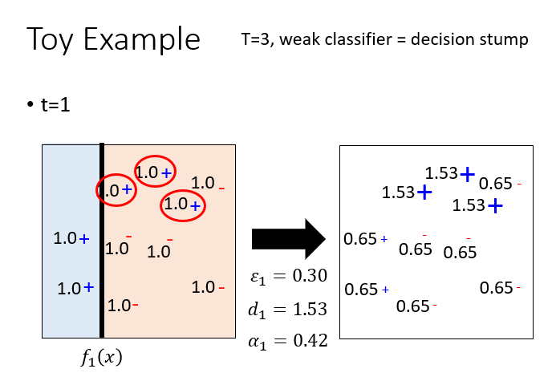
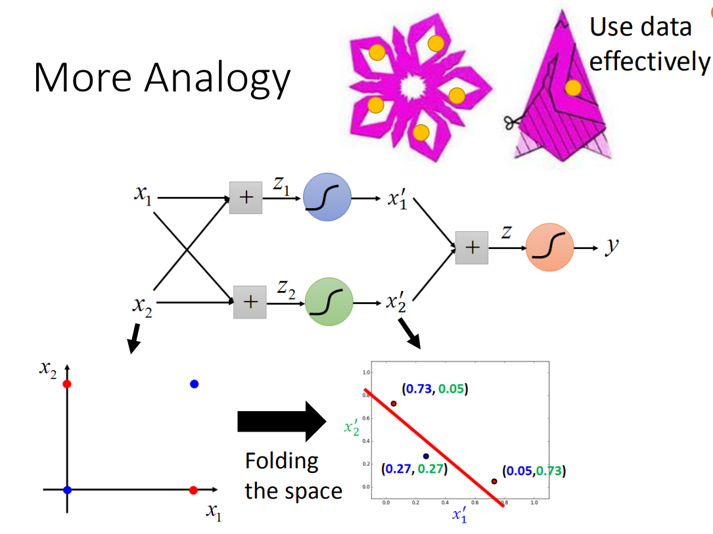
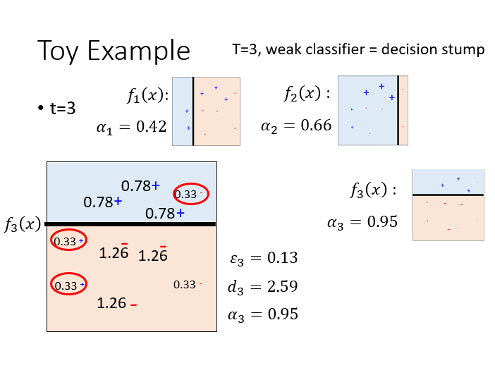
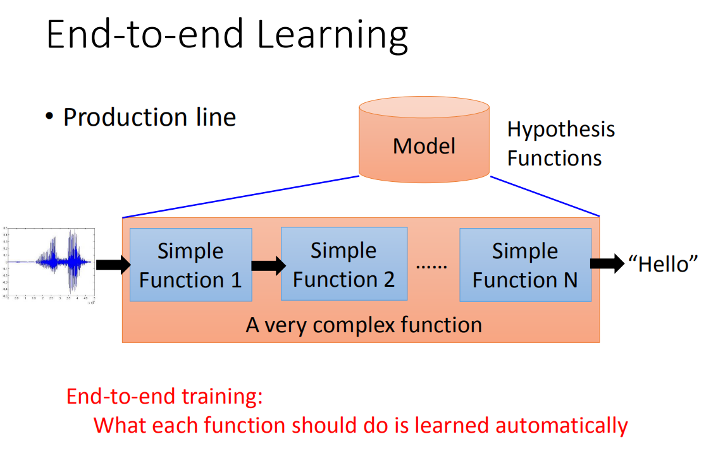
Decision stump：假设所有的特征都分布在二维平面上，在二维平面上选一个维度切一刀，其中一边当做class1，另外一边当做class2。
上图中t=1时，我们先用decision stump找一个$f_1(x)$，左边就是正类，右边就是负类，其中会发现有三笔data是错误的，所以能得到错误率是0.3，$d_1$=1.53(训练数据更新的权重),$\alpha_1$=0.42（在最终结果投票的权重）
然后改变每笔训练数据的权重，分类错误的权重就要变大（乘以1.53），分类对的权重就变小(0.65)
t=2和t=3按照同样的步骤,就可以得到第二和第三个分类器。由于设置了三次迭代，这样训练就结束了，用之前每个分类器乘以对应的权重，就可以得到最终分类器。
结果整合：这个三个分类器把平面分割成六个部分，左上角三个分类器都是蓝色的，那就肯定就蓝色的。上面中间部分第一个分类器是红色的，第二个第三个是蓝色的，但是后面两个加起来的权重比第一个大，所以最终中间那块是蓝色的，对于右边部分，第一个第二个分类器合起来的权重比第三个蓝色的权重大，所以就是红色的。下面部分也是按照同样道理，分别得到蓝色，红色和红色。所以这三个弱分类器其实本事都会犯错，但是我们把这三个整合起来就能达到100%的正确率了。
## AdaBoost证明推导

上式中的$H(x)​$是最终分类结果的表达式，$\alpha_t​$是权重(与$\epsilon_t​$有关)，$\epsilon_t​$是错误率。
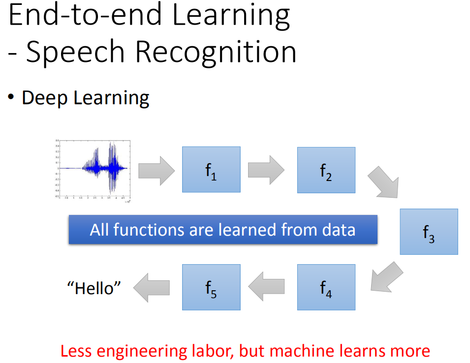
先计算总的训练数据集的错误率，也就是$\frac{1}{N}\sum\limits_{n}\delta{H(x^n)\neq\hat{y^n}}​$其中$H(x^n)\neq\hat{y^n}​$得到的就是1，反之如果$H(x^n)=\hat{y^n}​$就是0
进一步，可以把$H(x^n)\neq\hat{y^n}​$写成$\hat{y^n}g(x^n)<0​$,如果$\hat{y^n}g(x^n)​$是同号的代表是正确的，如果是异号就代表分类错误的。整个错误率有一个上界就是$\frac{1}{N}\sum\limits_{n}exp(-\hat{y}^ng(x^n))​$
上图中横轴是$\hat{y^n}g(x^n)​$，绿色的线代表的是$\delta​$的函数，蓝色的是$exp(-\hat{y}^ng(x^n))​$也就是绿色函数的上限。
### 证明上界函数会越来越小
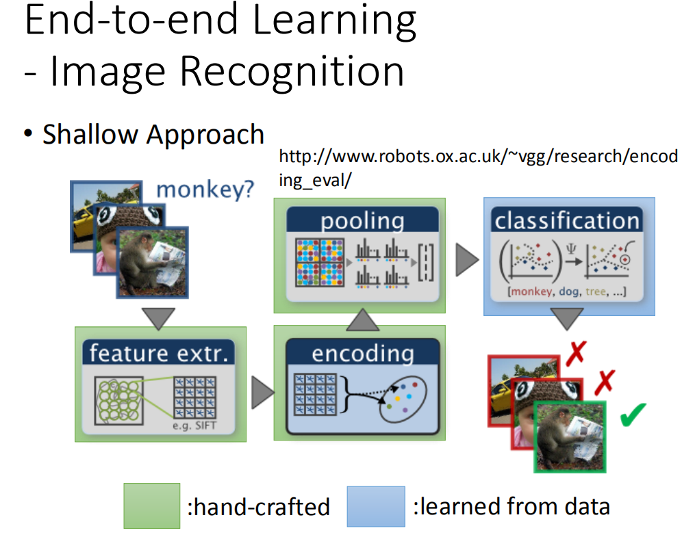
上式证明中，思路是先求出$Z_T+1​$(也就是第T+1次训练数据集权重的和),就等于$\sum\limits_{n}u_{T+1}^n​$,而$u_{t+1}^n​$与$u_{t}^n​$有关系，通过联立$u_{1}^n​$到$u_{t+1}^n​$的式子，能得到就是T次连乘的$exp(-\hat{y}^nf_t(x^n)\alpha_t)​$,也就是$u_{T+1}^n​$然后在累加起来得到$Z_T+1​$
同时把累乘符号放到exp里面去变成了累加，由于$\hat{y}^n​$是迭代中第n笔的正确答案，所以和累乘符号没有关系，就会发现后面的$\sum\limits_{t=1}f_t(x^n)\alpha_t​$恰好等于图片最上面的$g(x)​$
这样就说明了，训练数据的权重的和会和训练数据的错误率有关系。
接下来就是证明权重的和会越来越小就可以了。
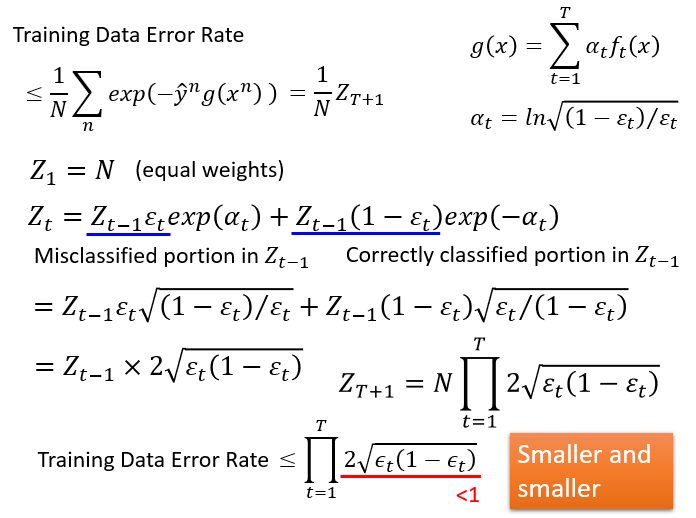
$Z_1​$的权重就是每一笔初试权重的和N，然后这里的$Z_{t}​$就是要根据$Z_{t-1}​$来求出；对于分类正确的，用$Z_{t-1}​$乘以$exp(\alpha_t)​$乘以$\epsilon_t​$,对于分类错误的就乘以$exp(-\alpha_t)​$再乘以$1-\epsilon_t​$。
然后再把$\alpha_t​$代入到这个式子中化简得到得到$Z_{t-1}\times{2\sqrt{\epsilon_t(1-\epsilon_t)}}​$
其中，$\epsilon_t​$是错误率，肯定小于0.5，所以$2\sqrt{\epsilon_t(1-\epsilon_t)}​$最大值是当$\epsilon_t=0.5​$时，最大值为1，所以$Z_t​$小于等于$Z_{t-1}​$。
$Z_{T+1}​$就是N乘以T个$2\sqrt{\epsilon_t(1-\epsilon_t)}​$
最后我们知道，这样的一来训练数据的错误率就会越来越小
## AdaBoost的神秘现象
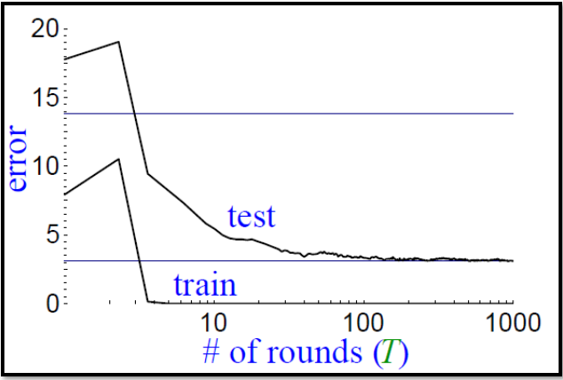
其中图中x轴是训练的次数，y轴是错误大小，从这张图我们发现训练数据集上的错误率其实很快就变成了0（大概在第五次左右就是0），但是测试数据集上错误一直在不断下降。
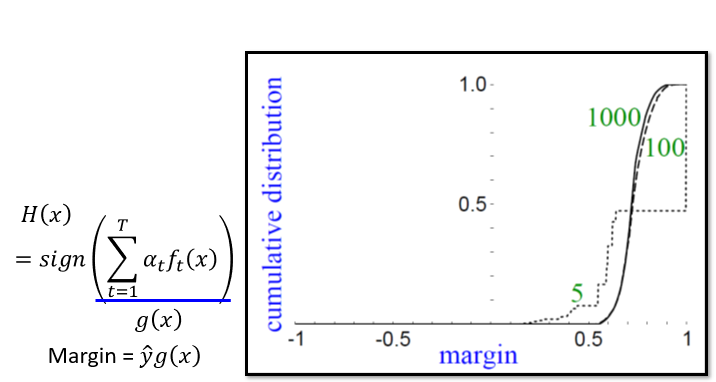
#### 我们把$\hat{y}g(x)$定义为margin
原因：图中是5，100,1000个权重的分类器结合在一起时的分布图，当5个分类器结合的时候，其实margin已经大于0了，但是当增加弱分类器的数量的时候，margin还会一直变大，增加margin的好处就是增加这个方法鲁棒性，也就是在测试集上能得到比较好的结果。
为什么margin会增加？
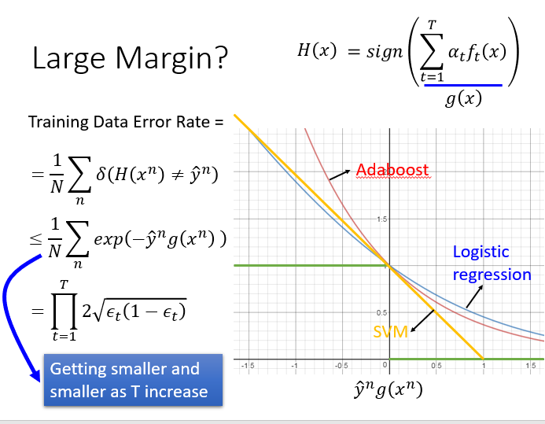
该图是$\hat{y}^ng(x^n)$的函数图像，红色的线就是AdaBoost的目标函数，从图中可以看出AdaBoost的在$\hat{y}$为0时，依然能不断的下降，也就是让$\hat{y}^ng(x^n)​$(margin)能不断增大，得到更小的错误。

### AdaBoost+Decision Tree做初音的例子
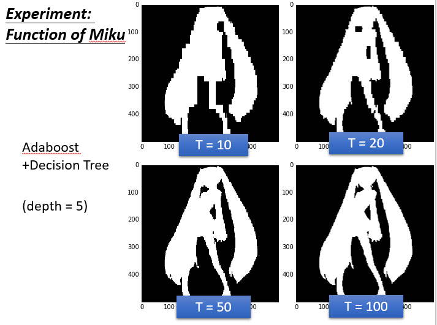
本来深度是5的决策树是不能做好初音的分类（只能通过增加深度来进行改进），但是现在有了AdaBoost的决策树是互补的，所以用AdaBoost就可以很好的进行分类。T代表AdaBoost运行次数，图中可知用AdaBoost，100棵树就可以很好的对初音进行分类。
## Gradient Boosting
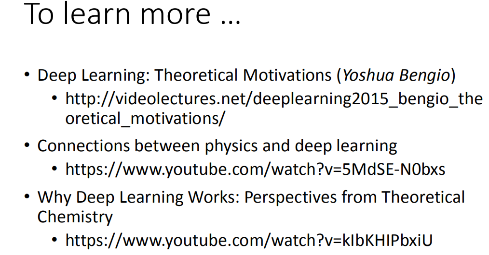
Gradient Boosting是Boosting的更泛化的一个版本。
具体步骤：
- 初始化一个$g_{0}(x)=0$,
- 现在进行很多次的迭代，找到一组$f_t(x)$和$\alpha_t$来共同改进$g_{t-1}(x)$
- $g_{t-1}(x)$就是之前得到所有的$f(x)$和$\alpha$乘积的和
- 把找到的一组$f_t(x)$和$\alpha_t$（与$g_{t-1}(x)$互补）加上原来的$g_{t-1}(x)$得到新的$g_{t}(x)$，这样$g_{t}(x)$就比原来的$g_{t-1}(x)$更好
- 最后再得到T个迭代的$H(x)$
这里的cost function是$L(g)=\sum\limits_{n}l(\hat{y}^n,g(x^n))$,其中$l$是$\hat{y}^n$和$g(x^n)$的差异（loss function，这个函数可以直接选择，可以是交叉熵，也可以是均方误差）这里定义成了$exp(-\hat{y}^ng(x^n))$
接下来我们要最小化损失函数，我们就需要用梯度下降来更新每个$g(x)$
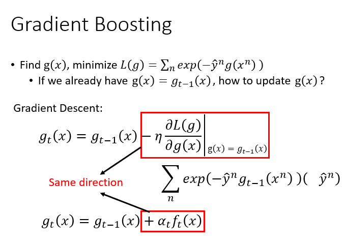
从梯度下降角度考虑：上图式子中，我们需要用函数$g(x)$对$L(g)$求梯度，然后用这个得到的梯度去更新$g_{t-1}$,得到新的$g_{t}$
这里对$L(g)$求梯度的函数$g(x)$就是可以想成包含很多参数的，通过调整参数就能改变函数的形状，这样就可以对$L(g)$做偏微分
从Boosting角度考虑，红色框的两部分是同方向的，如果$f_t(x)$和微分的方向是一致的话，那么就可以把$f_t(x)$加上$g_{t-1}(x)$，就可以让新的损失减少。

我们希望$f_t(x)$和$\sum\limits_{n}exp(-\hat{y}^ng_t(x^n))(\hat{y}^n)$方向越一致越好。所以我们构造一个函数让两个式子相乘求其最大值，这样就能保证这两个式子方向很一致。对于得到的新式子，$exp(-\hat{y}^ng_t(x^n))$就是权重，经过计算之后发现这个权重恰好就是AdaBoost上的权重。

这里找出来的$f_t(x)$，其实也就是AdaBoost找出来的$f_t(x)$,所以在AdaBoost的时候，找一个弱的分类器$f_t(x)$的时候，就相当于用梯度下降更新损失，值得损失会变小。
由于求$f_t(x)$是很不容易才找到的，所以我们这里就会给$f_t(x)$配一个最好的$\alpha_t$，把$f_t(x)$的价值发挥到最大。
对于$\alpha_t$,$\alpha_t$就很像学习率，但是这里有点不一样，我们是固定$f_t(x)$，穷举所有的$\alpha_t$，找到一个$\alpha_t$使得$g_{t}(x)$的损失更小
实际中就是求解一个最优化问题，找出一个$\alpha_t$，让$L(g)$最小。
巧合的是找出来的$\alpha_t$就是$\alpha_t=ln\sqrt{(1-\epsilon_t)/\epsilon_t}​$
AdaBoost其实可以想成在做梯度下降，只是这个梯度是一个函数，然后有一个很好的方法来决定学习率的这样一个问题。
Gradient Boosting有一个好的就是我们可以任意更改目标函数。这样就可以创造出很多新的方法。
## Stacking

上图中，把一笔数据x输入到四个不同的模型中，然后每个模型输出一个y，然后用投票法决定出最好的（对于分类问题）

但是有个问题就是并不是所有系统都是好的，有些系统会比较差，但是如果采用之前的设置低权重的方法又会伤害小毛的自尊心，这样我们就提出一种新的方法：
把得到的y当做新的特征输入到一个最终的分类器中，然后再决定最终的结果。
对于这个最终的分类器，应当采用比较简单的函数（比如说逻辑回归），不需要再采用很复杂的函数，因为输入的y已经训练过了。
在做stacking的时候我们需要把训练数据集再分成两部分，一部分拿来学习最开始的那些模型，另外一部分的训练数据集拿来学习最终的分类器。原因是有些前面的分类器只是单纯去拟合training data，比如小明的代码可能是乱写的，他的分类器就是很差的，他做的只是单纯输出原来训练数据集的标签，但是根本没有训练。如果还用一模一样的训练数据去训练最终分类器，这个分类器就会考虑小明系统的功能。所以我们必须要用另外一部分的数据来训练最终的分类器，然后最终的分类器就会给之前的模型不同的权重。

