# 1-of-N Encoding

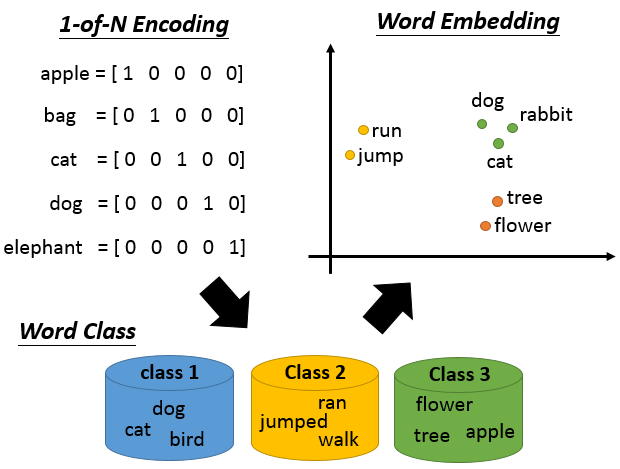

word embedding是dimension reduction的一个广为人知的应用。如果今天要你用一个vector来表示word，你会怎么做？最difficult的做法叫做：1-of-N Encoding。

每一个word用一个vector来表示，这个vector的dimension就是这个世界上可能有的word的数目。假设世界上可能有10w个word，那1-of-N Encoding的 dimension就是10w维，那每一个word就对应到其中一维。那apple就是第一维是1其它为0，bag就是第一维是1其它是0，以此类推。如果你用这种方式来描述一个word，你的每一个word的这个vector都是不一样的，所以你从这个vector里面没有办法得到任何的咨询，比如说：cat跟dog都是动物这件事，你没有办法知道。

那怎么办呢？有一个方法叫做word class。也就是你把不同的word，但有同样性质的word，把他们class成一群一群的，然后用那个word所属的class来表示这个word。比如说dog跟cat都是class1，ran jumped,walk是class2，flower,tree,apple是class3等等。但是用class是不够的(少了一些information)，比如说class1是动物，class2是植物，都是属于生物，但是在class里面没有办法来呈现这件事情。或者说：class1是动物，class2是动物可以做的行为，可以看出是有一些关联的，但是用class没有办法来呈现出来。

所以我们需要word Embedding：把每一个word都project到high dimension sapce上面(但是远比1-of-N Encoding的dimension要低，比如说有10w个word，那1-of-N Encoding就是10w维。但是project到high dimension，通常是100维左右)我们希望可以从这个word Embedding图上可以看到的结果是：类似同一个语义的词汇，在这个图上是比较接近的。而且在这个high dimension space里面，每一个dimension可能都有它特别的含义。假设我们做完word Embedding以后，每一个word Embedding的feature vector长这个样子，那你可能就知道说这个dimension代表了生物和其它东西之间的差别(横轴)，那个dimension就代表了跟动作有关的东西(纵轴)

# 词嵌入

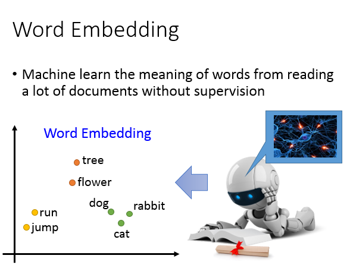

那怎么做word Embedding呢？word Embedding是Unsupervised 。我们怎么让machine知道每一个词汇的含义是什么呢，你只要透过machine阅读大量的文章，它就可以知道每一个词汇它的embeding feature vector应该长什么样子。

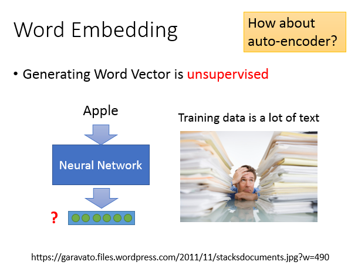

我们要做的是：learn一个neural network，找一个function，你的input是一个词汇，output就是那个词汇对应的word Embedding。我们手上有的train data是一大堆的文字，所以我们只有input，但是我们没有output(我们不知道每一个word Embedding应该长什么样子)。所以我们要找的function只是单向(只知道输入，不知道输出)，这是一个Unsupervised的问题。

那这个问题要怎么解呢？我们之前讲过一个deep learning base dimension reduction的方法叫做auto-encoder，这个问题是没有办法用auto-encoder来解。

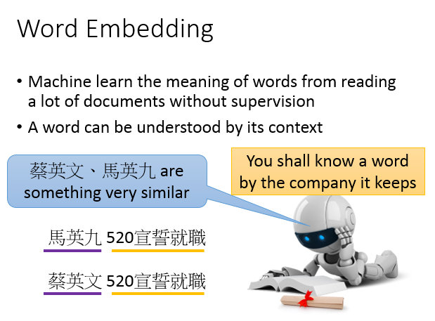

那怎么样找这个word Embedding呢？精神：你要如何了解一个词汇的含义呢，你要看它的context(每一个词汇的含义，可以根据它的上下文来得到)

举例来说：假设机器读了一段文字：“马英九520宣誓就职”，它又读了一段新文字：“蔡英文520宣誓就职”。对机器来说，它不知道马英九和蔡英文指的是什么，但是马英九和蔡英文后面有接520宣誓就职。对机器来说，它只要读了大量的文章，发现马英九和蔡英文后面有类似的context，机器就会推论说：蔡英文和马英九代表了某种有关系的物件(不知道他们是人，但机器知道说：蔡英文和马英九这两个词汇代表是同样地位的东西)

## 基于计数的词嵌入

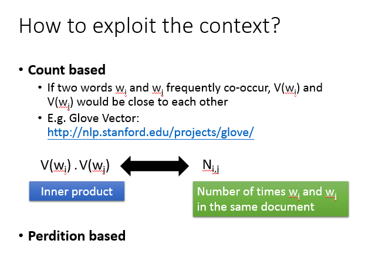

怎样用这个精神来找出这word Embedding呢？有两个不同体系的做法，一个做法是：count based。count based：如果我们现在有两个词汇$w_i,w_j$，他们的word vector(用V($w_i$,)V($w_j$来表示)，如果$w_i,w_j$它们常常在同一个文章出现，那他们的V($w_i$,)V($w_j$)会比较接近。这个方法一个很代表性的例子叫做Glove vector。

这个方法的原则是这样，假设我们知道$w_i$的word vector是$V(w_i)$,$w_j$的word vector是$V(w_j)$,我们可以计算V($w_i$,)V($w_j$)它的inner product，假设$N_{i,j}$是$w_i$,$w_i$他们在同一个document的次数，那我们就希望这两件事情（内积和同时出现的次数）越接近越好。你会发现说：这个概念跟我们之前将的matrix factorozation的概念其实是一样的

## 基于预测的词嵌入

另外一个方式是：prediction based方法，据我所知，好像没有人很认真的比较过prediction based方法跟counting based 方法有什么样非常不同的差异或者是谁优谁略。

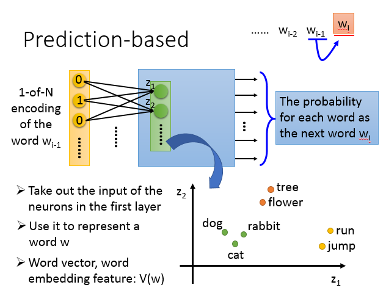

### 具体步骤

prediction based想法是这样子的：我们来learn一个neural network，这个neural network做的就是given$w_{i-1}$(w就代表一个word)，prediction下一个可能出现的word是什么。每一个word可以用1-of-N encoding表示成一个feature vector，所以我们要做prediction这件事情的话，我们就是learning一个neural network，它的input就是$w_{i-1}$的1-of-N encoding feature vector，它的output就是下一个word$w_i$是某一个word的几率。也就是说，这个model它的output dimension就是word(假设世界上有10w个word，这个model 的output就是10w维)，每一维代表了某一个word是下一个word($w_i$)的几率。

假设这是一个multiple layer perceptron neural network，那你把feature vector丢进去的时候，通过一些hidden layer，就会得到output。接下来我们把第一个hidden layer的input拿出来，第一个dimension是$z_1$，第二个dimension是$z_2$，以此类推。那我们用这个z就可以代表一个word，input不同的1-of-N encoding，这边的z就会不一样。所以我们把z拿来代表一个词汇，就可以得到这个vector。

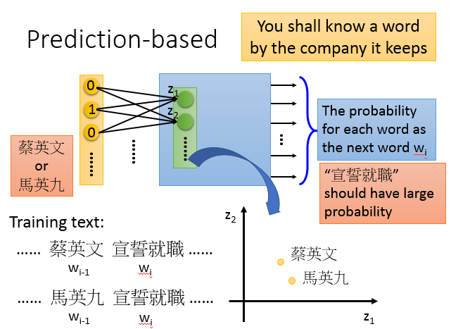

prediction based的方法是怎么体现：根据一个词汇的上下文来了解一个词汇的含义这件事情呢？假设我们的train data里面有一个文章是“蔡英文宣誓就职”，另一和文章是“马英九宣誓就职”，在第一个句子里，蔡英文是$w_{i-1}$,宣誓就职是$w_{i}$，在另外一篇文章里面，马英九是$w_{i-1}$，宣誓就职是$w_{i}$。

你在训练这个prediction model的时候，不管input蔡英文还是马英九，你都会希望learn出来的结果是：宣誓就职的几率比较大的。所以你在input蔡英文，马英九的时候，它对应到“宣誓就职”那个词汇几率是高的。蔡英文，马英九虽然是不同的input，但是为了让output的地方得到一样的output，那你就必须让中间的hidden layer做一些事情。中间的hidden layer必须要学到说，这两个不同的词汇，必须要通过weight转化以后对应到同样的空间(进入hidden layer之前，必须把他们对应到接近的空间中，这样子我们在output的时候，他们才能有同样的几率)

所以当我们learn一个prediction model的时候，考虑word context这件事情，就自动地考虑在这个prediction model里面。所以我们把prediction model的第一个hidden layer拿出来，我们就可以得到我们想要找的这种word embedding的特性。

### 共享参数

那你可能会说：用$w_{i-1}$去prediction$w_i$好像觉得太弱(给你一个词汇，prediction下一个词汇，下一个词汇的可能是千千万万的)。那怎么办呢？

你可以拓展这个问题，我希望machine learn的是前面两个词汇($w_{i-2},w_{i-1}$)，然后prediction下一个词汇($w_i$)，你可以轻易的把这个model拓展到n个词汇。如果你真要learn这样的word embedding的话，你的input通常是至少10个词汇，你这样才有可能learn出reasonable的结果(只input一个或者两个太少了，我这里用input两个word当做例子)

注意的地方是：如果是一般的neural network，你就把input$w_{i-1},w_{i-2}$的1-of-N encoding vector把它接在一起变成一个很长的vector，直接丢在neural network里面当做input就可以了。但是实际上你在做的时候，$w_{i-2}$的第一个dimension跟第一个hidden neural它们中间连的weight和$w_{i-1}$的第一个dimension跟第一个hidden neural它们中间连的weight，这两个weight必须是一样的，以此类推。

为什么这样做呢，一个显而易见的理由是：如果我们不这样做，你把同一个的word放在$w_{i-2}$的位置跟放在$w_{i-1}$的位置，通过这个transform以后，它得到embedding就会不一样。另外一个理由是：这样做的好处是，可以减少参数量，那你就不会随着你的context增长，而需要更多的参数。

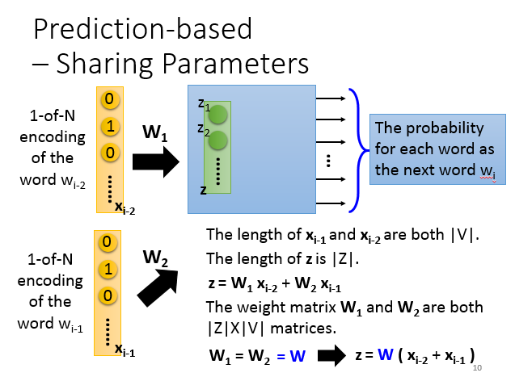

现在假设$w_{i-2}$的1-of-N encoding是$x_{i-2}$,$w_{i-1}$的1-of-N encoding是$x_{i-1}$，那它们的长度都是V的绝对值。那hidden layer的input写成一个vector z，z的长度写成Z的绝对值，z等于$x_{i-1}$乘以$W_1$加上$x_{i-2}$乘以$W_1$。现在$W^1,W^2$都是一个$\left | Z|X|V \right |$ weight matrices

我们强制$W^1=W^2=W$，所以我们今天实际在处理这个问题的时候，你可以把$x^{i-1}$跟$x^{i-2}$加起来($z= W(x_{i-1}+x_{i-2})$)。那你今天要得到一个word vector的时候，你就把1-of-N encoding乘上这个W，就得到了这个word embedding。

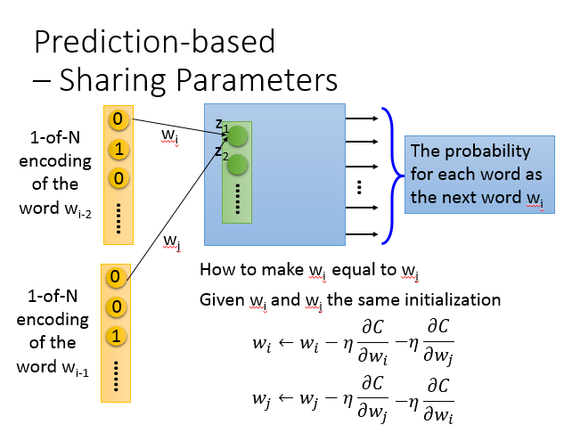

在实际上，你咋样让$W^1,W^2$一样呢。做法是这样子的：假设我现在有两个weight$w_i,w_j$，我们希望$w_i=w_j$。首先你要给$w_i,w_j$一样的initializati，然后update $w_i$。然后计算$w_j$对cost function的偏微分，然后update$w_j$。你可能会说，$w_i,w_j$对C的偏微分是不一样的，再做update以后，那它们的值就不一样了呀。如果你只是列这样的式子，$w_i,w_j$经过一次update以后就不一样了。

那我们就把$w_i$对C的偏微分减去$w_j$对C的偏微分，$w_j$对C的偏微分减去$w_i$对C的偏微分，$w_i,w_j$的update就一样了

### 训练

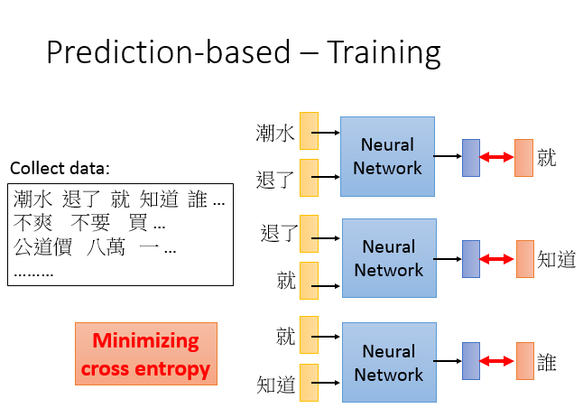

那咋样训练这个network呢？这个训练是Unsupe(rvised的，所以你只需要collect一大堆的文字data(爬虫)，然后就可以train你的model了。

比如说有一个句子是：“潮水退了就只知道谁没穿裤”。那你让你的neural network input “潮水”跟“退了”，希望output就是“就”。所以你就希望你的output跟“就”的1-of-N encoding是minimize cross entropy(“就”也是1-of-N encoding来表示的)。然后input“退了”跟“就”，希望它的output跟“知道”越接近越好。然后input“就”跟“知道”，希望它的output跟“谁”越接近越好。刚才讲的只是最基本的形态。

### Various Architectures

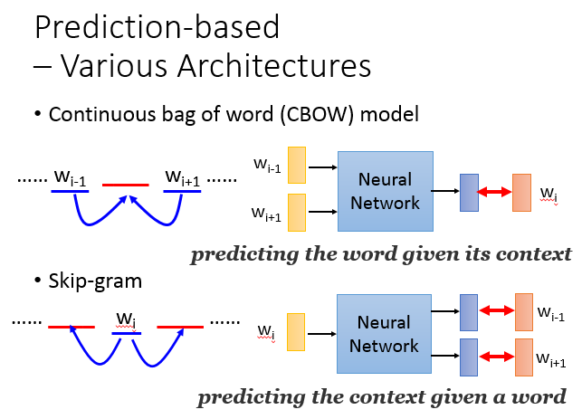

这个prediction baed的model可以有种种的变形，我目前不确定说：在这么多的变形哪一种是比较好的(在不同的task上互有胜负)。有一招叫做continuous bag of word model，我们刚才说：拿前面的词汇会prediction接下来的词汇。那CBOW的意思就是说：某一个词汇的context去prediction中间的词汇($w_{i-1},w_{i+1}$去prediction$w_i$)skin-gram是说:我们拿中间的词汇去prediction接下来的context(用$w_i$去prediction$w_{i-1},w_{i+1}$)

假设你有读过word vector的文献的话，这个neuralnetwork不是deep的，它其实就是一个hidden layer(linear hidden layer)

我们知道word vector有一些有趣的特性，我们可以看到说你把同样类型的东西word vector摆在一起(Italy跟Rome摆在一起，Japen跟Tokyo摆在一起，他们之间是有某种固定的关系的)或者说你把动词的三态摆在一起，同一个动词的三态中间有某种固定的关系

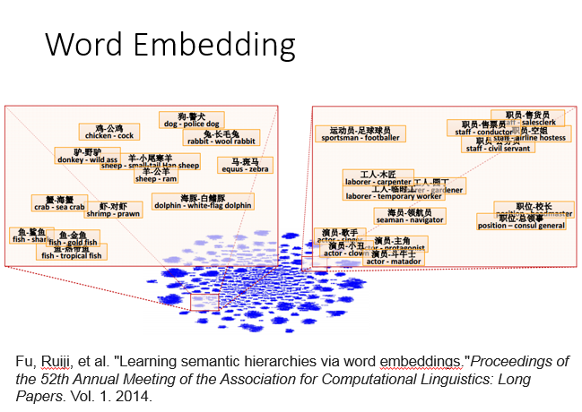

所以从这个word vector里面，你可以discover word和word之间的关系。还有人发现说：把两个word vector两两相减，然后project到two dimension sapce上面。如果今天是落在这个位置的话，那这连个word vector 具有包含的关系(海豚跟白海豚相减，工人跟木匠相减，职员和售货员相减，都落在这个地方。如果一个东西属于另一个东西的话，两个相减，他们的结果是会很类似的)

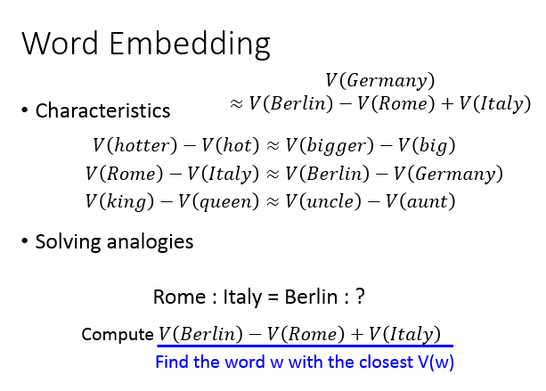

我们来做一些推论，我们知道hotter的word vector减掉hot的vord vector会很接近bigger的word vector减掉big的vord vector。Rome的word vector减掉italy的vord vector会很接近Berlin的word vector减掉Germany的vord vector。King的word vector减掉queen的vord vector会很接近uncle的word vector减掉aunt的vord vector

如果有人问你说：罗马来自于意大利，那柏林来自于什么呢。机器可以回答这样的问题，怎么做呢？(我们知道Germany vector会很接近于Berlin vector 减去Rome vector加上Italy vector vector)假设我们不知道答案是Germany的话，那你要做的事情就是：计算Berlin vector 减去Rome vector加上Italy vector，然后看看它跟哪一个vector最接近，你可能得到的答案是Germany

## 多语言嵌入

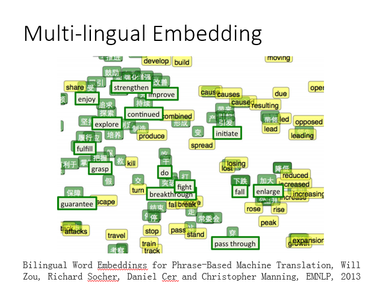

还可以做很多事情，可以把不同语言的word vector拉在一起(假设你有中文的咖啡，有一个英文的coffee，各自去train一组vector，你会发现说，中文和英文word vector是没有任何关系的。因为在做word vector的时候是凭借上下文的关系，如果今天中文和英文混杂在一起，那machine就没有办法来判断中文和英文之间的词汇关系)。但是假如你事先知道某几个中文词汇，某几个英文词汇是对应在一起的，你先得到一组中文的word vector，再得到一组英文的word vector。接下来你再learn 一个model，它把中文和英文对应的词汇(加大对应enlarge，下跌对应到fall)通过这个projection以后，把他们project到sapce同一个点。

图上上面是绿色，然后下面是绿色英文，代表是已经知道对应关系中文和英文的词汇。然后你做这个transform以后，接下来有新的中文词汇跟新的英文词汇，你都通过projection把他们project到同一个space上面。你就可以知道中文的降低跟英文的reduce都应该落在差不多的位置，你就可以知道翻译这样的事情

## 多域嵌入

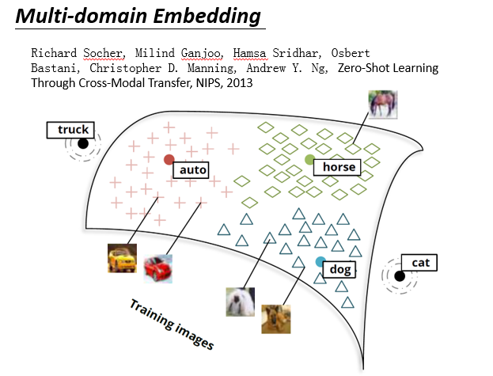

在这个word embedding 不局限于文字，你可以对影像做embedding。举例：我们现在已经找好一组word vector，dog vector，horse vector，auto vector，cat vector在空间中是这个样子。接下来，你learn一个model，input一张image，output是跟word vector一样dimension的vector。你会希望说，狗的vector分布在狗的周围，马的vector散布的马的周围，车辆的vector散布在auto的周围。

假设有一张新的image进来(它是猫，但是你不知道它是猫)，你通过同样的projection把它project这个space以后。神奇的是，你发现它就可能在猫的附近，那machine就会知道这是个猫。我们一般做影像分类的时候，你的machine很难去处理新增加的，它没有看过的。

如果你用这个方法的话，就算有一张image，在training的时候你没有看到过的class。比如说猫这个image，从来都没有看过，但是猫这个image project到cat附近的话，你就会说，这张image叫做cat。如果你可以做到这件事的话，就好像是machine阅读了大量的文章以后，它知道说：每一个词汇它是什么意思。先通过阅读大量的文章，先了解词汇之间的关系，接下来再看image的时候，会根据它阅读的知识去match每一个image所该对应的位置。这样就算它没有看过的东西，它也有可能把它的名字叫出来。

## 文档嵌入

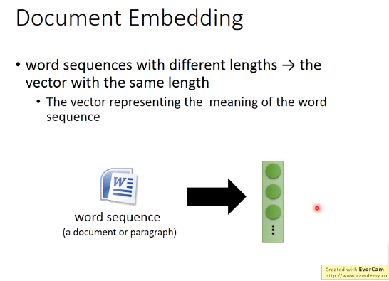

刚才讲的是word embedding，也可以做document embedding。也就不是把word变成一个vector，也可以把document变成一个vector

### 语义嵌入

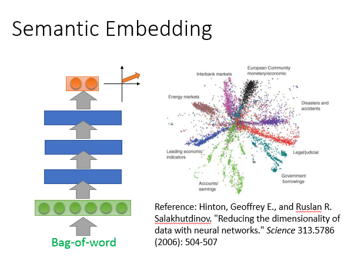

那咋样把一个document变成一个vector呢？最简单的方法我们之前已经讲过了，就是把一个document变成一个bag-of-word，然后用auto encoding就可以learn出document semantic embedding。但光这样做是不够

## Beyond Bag of Word

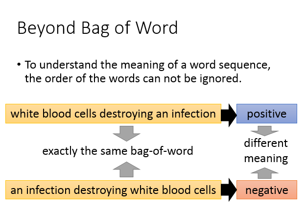

我们光用bag-of-word描述一个document是不够的，为什么呢？因为我们知道词汇的顺序代表了很重要的含义。举例来说，如图有两个句子“white blood cells destorying an infection”，“an infection destorying white blood cells”。如果这两句话，你看它们的bag-of-word是一模一样的(词汇相同)。上面这句话：白细胞消灭可传染病是positive，下面这句话是negative。虽然他们有相同的bag-of-word，但是它们的语义是不同的，所以如果只是用bag-of-word来描述一张document是非常不够的，会失去很多重要的information。

列了一大堆的reference给大家参考，前面的三种是unsupervised，也就是你collect一大堆的document，你就可以让它自己去学。后面的几个方法是supervised的，在这些document你需要进行额外的label。