# Manifold Learning

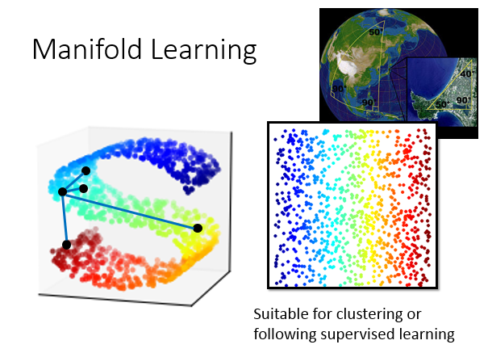

TSNE的NE就是Neighbor embedding的缩写。我们现在要做的事情就是我们之前讲过的降维，只是我们要做的是非线 性的降维。

我们知道data point可能是在高维空间里面的一个manifold，也就是说：data point的分布其实是在低维的一个空间里，只是被扭曲被塞到高维空间里面。讲到manifold ，常常举的例子是地球，地球的表面就是一个manifold(一个二维的平面，被塞到一个三维的空间里面)。在manifold里面只有很近距离的点，Euclidean distance才会成立，如果距离很远的时候，欧式几何不一定成立。也就是说：我们在这个S型的空间里面取一个点，我们用Euclidean distance比较跟其他两个点的距离。这个点跟离的近的点比较像，离的远的点比较不像(相邻的两个点)。如果是距离比较远的时候，如果你要比较这个点跟离的非常远的点的相似程度，你在高维空间中，你直接算Euclidean distance，你就变得不made sence。

所以manifold learning要做的事情是把S型的这块东西展开，把塞到高维空间的低维空间摊平。摊平的好处就是：把这个塞到高维空间里的manifold摊平以后，那我们就可以在这个manifold上面用Euclidean distance(来算点和点之间的距离)，这会对接下来你要做supervised learning都是会有帮助的

## Locally linear Embedding(LLE)

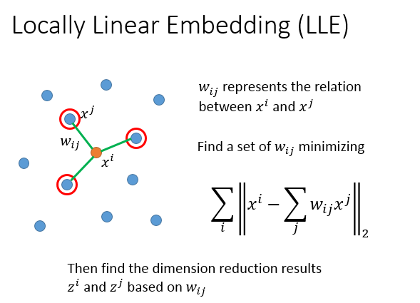

有个方法叫做Locally Linear Embedding，这个方法意思是说：在原来的空间里面，你的点分别长这个样子。有某一个点叫做$x^i$，我们先选出$x^i$的neighbor叫做$x^j$。接下来我们找$x^i$跟$x^j$之间的关系，它们之间的关系我们写作$w_{ij}$。

这个$w_{ij}$是怎么找出来的呢？我们假设说：每一个$x^i$都是可以用它的neighbor做linear combination以后组合而成，这个$w_{ij}$是拿$x^j$组成$x^i$的时候，linear combination的weight。那找这一组$x_{ij}$要咋样做呢，你就说：我们现在找一组$x_{ij}$，$x^i$减掉summation over$x_{ij}$乘以$x^j$的L2-Norm是越接近越好，然后summation over所以的data point。接下来我们要做dimension reduction，把原来的$x^i,x^j$转成$z^i,z^j$。但是现在的原则就是：从$x^i,x^j 转成 z^i,z^j$它们中间的关系$w_{ij}$是不变的

这个东西就是白居易《长恨歌里面》讲的“在天愿作比翼鸟，在地愿为连理枝”。所谓的“在天”就是$x^i,x^j$在原来的space上面，“比翼鸟”就是“$w_{ij}$”，“在地”就是把$x^i,x^j$transform到另外一个sapce就是$z^i,z^j$，“连理枝”等于“比翼鸟”就是$w_{ij}$

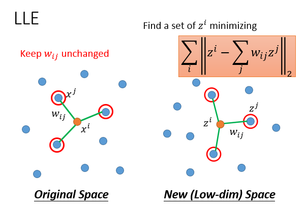

所以LLE做的事情，首先$x^i,x^j$在原来的space上面找完以后就fix住它，接下来为每一个$x^i,x^j$找另外一个vector$z^i,z^j$(因为我们在做dimension reduction，新找的dimension要比原来的要小)。我们找的$z^i,z^j$可以minimize这个function。也就是说原来的$x^i$它可以做linear combination产生x，原来的$x^j$做linear combination 产生$x^i$，这些$z^j$它也可以用同样的linear combination产生$z^i$，我们就是要找这一组z可以满足这个$w_{ij}$给我们的constraint，所以在这个式子里面$w_{ij}$变成是已知的，但是我们要找一组z，让$z^j$透过$w_{ij}$跟$在z^i$越接近越好，$z^j$用这组weight做linear combination以后跟$z^i$越接近越好，然后summation over所以的data point。

这个LLE你要注意一下，其实它并没有一个明确的function告诉你说我们咋样来做dimension reduction，不像我们在做auto encoding的时候，你learn出一个encoding的network，你input一个新的data point，然后你就得到结果。今天在LLE里面，你并没有找一个明确的function告诉我们，怎么样从一个x变到z，z完全就是另外凭空找出来的。

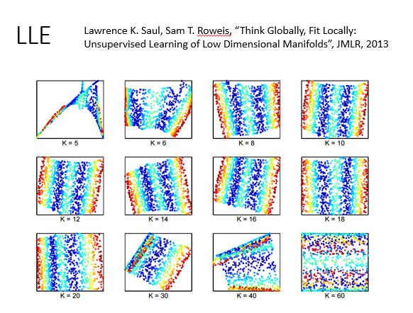

其实LLE你要好好的调以下你的neighbor，neighbor的数目要刚刚好，你才会得到好的结果。这个是从原始的paper里面截得图，它调了不同的k。如果k太小，得出来的结果会不太好，k太大，得出的结果的也不太好。为什么k太大，得出的结果也不好呢？因为我们之前的假设是Euclidean distance只是在很近的距离里面可以这样想，当k很大的时候，你会考虑很远的点，所以你不应该把它考虑进来，你的k要选一个适当的值。

## Laplacian Eigenmaps

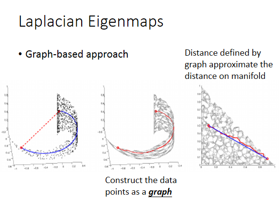

另外一个方法是Laplaciain Eigenmaps，它的想法是这样子的。我们之前在讲smei-supervised learning的时候，我们有讲过smothness assumption。如果你要比较这两个红点之间的距离，算他们的Euclidean diastance是不足够的。你要看的是在他们high distant range之间的distance，如果两个点之间有high density collection，那它们才是真正的很接近。

那你可以用graph来描述这件事，你把你的data point construct成一个graph(把比较近的点连起来，变成一个graph)，你把点变成graph以后，你考虑smoothness的距离，就可以被graph上面的collection来approximate

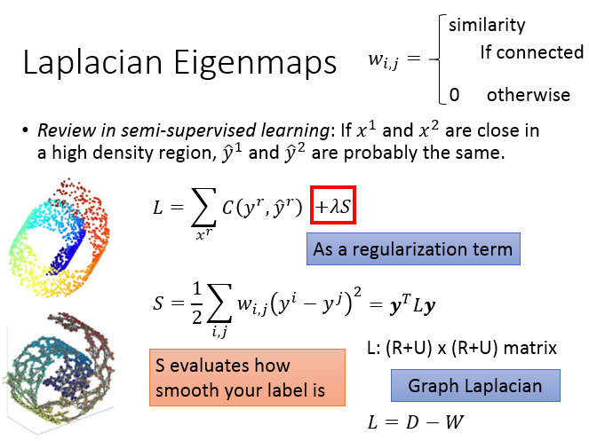

我们之间在讲semi-supervised learning的时候，如果$x^1,x^2$在high density region上面它们是相近的，那它们的laebl$y^1,y^2$很有可能是一样的。所以做supervised learning的时候，我们可以这么做：我们考虑有label data的项，另一个跟laebl data没有关系的(可以利用unlabel data)，这一项的作用是：要考虑我们现在得到的label是不是smooth的，它的作用很像regularization term。S这一项等于$y^i$跟$y^j$之间的距离 乘以$w_{i,j}$($w_{i,j}$的意思是：两个data point它们在图上是相连的，$w_{i,j}$是它们的相似程度；在图上没有相连就是0)。如果$x^i$跟$x^j$很接近的话，那$w_{i,j}$就是一个很大的值。这个S就是evaluate你现在得到的label有多么的smooth，这个S还可以写成$S=y^TLy$(L是graph laplacian，L=D-W)

也可以在Unsupervised learning上面，如果说$x^1,x^2$在high desity region 是close的，那我们就希望$z^1,z^2$也是相近的。我们刚才smooth式子写出来，如果$x^i,x^j$两个data point很像，那$z^i,z^j$做完dimension reduction以后距离就很近，反之$w_{i,j}$很小，距离要怎样都可以。

找一个$z^i,z^j$minimize S的值，这样做的话是有问题的。你不需要告诉我$w_{i,j}$是什么，要minimize S的时候，我选$z^i=z^j=0$，S=0，这样的话就结。所以光做这样的式子是不够的，你可能会说在supervised learning的时候，你咋不讲这句话呢？之前在semi-supervised learning的时候，我们还有supervised learning 给我们的那一项。如果你把所有的label都设成一样的，那你在supervised那一项，你得到的loss就会很大。那我们要同时supervised跟semi-supervised那一项，所以你不选择让所有的y通通一样的。这边少了supervised的东西，所以选择所以的z都是一样，反而是一个最好的solution。

所以这件事是行不通的，你要给你的z一些constraints：如果z降维以后是M维空间，你不会希望说：你的z它还分布在比M还要小的dimension里面。我们现在要做的是希望把高维空间中塞进去的低维空间展开，我们不希望展开的结果是在更低维的空间里面。今天假设你的z的dimension是M，你会希望你找出来的那些点(假设现在总共有N个点，$z^1$到$z^N$)它们做span以后会等于$R^M$

如果你要解这个式子的话，你会发现解出来z跟我们前面看到的graph Laplacian L是有关系的，它其实graph Laplacian eigenvector。

## T-distributed Stochastic Neighbor

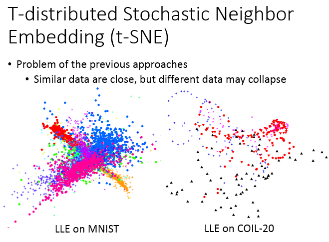

前面的那些问题是：它只假设相近的点应该要是接近的，但它没有假设说不相近的点没有要接近(不相近的点要分开)。比如说LLE在MNIST上你会遇到这样的情形：它确实会把同一个class聚集在一起，但它没有防止不同class的点不要叠成一团。

t-SNE也是在做降维，把原来的data point x变成low dimension vector z。在原来的space上面，我们会计算所有点的pair，$x^i,x^j$之间的similarity(S($x^i,x^j$))。我们会计算一个$x^j$given $ x^i$，分子是$x^i,x^j$的similarity，分母是summation over除了$x^i$以外所有其他的点之间的距离。假设我们今天找出了一个low dimension z，我们也可以计算$x^i,x^j$之间的similarity，$z^j$given $z^i$，分子是$z^i,z^j$的similarity，分母是summation over除了$z^i$以外所有其他的点之间的距离。有做这个normlization是很有必要的，不知道他们的scale是否一样，那你有做这个normlization就可以把他们变为几率，值会介于0-1之间。

我们现在还不知道$z^i,z^j$他么的值是多少(它是被我们找出来的)，我们希望找一组$z^i,z^j$，它可以让这两个distribution越接近越好。

那怎么衡量两个distribution之间的相似度呢？就是KL距离。所以我们要做的事情就是找一组z，它可以做到，$x^i$对其他point的distribution跟$z^i$对其他point的distribution，这样的distribution之间的KL距离越小越好，然后summation over 所以的data point，你要使得这这个值(L)越小越好。

你在t-SNE的时候，它会计算所有data point的similarity，所以它的运算有点大。在data point比较多的时候，t-SNE比较麻烦。第一个常见的做法是：你会先做降维，比如说：你原来的dimension很大，你不会直接从很高的dimension直接做t-SNE，因为你这样计算similarity时间会很长，你通常会先用PCA做将降维，降到50维，再用t-SNE降到2维，这个是比较常见的做法。

如果你给t-SNE一个新的data point，它是没办法做的。它只能够你先给它一大群x，它帮你把每个x的z先找出来，但你找完这些z以后，你再给它一个新的x，你要重新跑一遍这一整套演算法，所以就很麻烦。你有一大堆的x是high dimension，你想要它在二维空间的分布是什么样子，你用t-SNE，t-SNE会给你往往不错的结果。

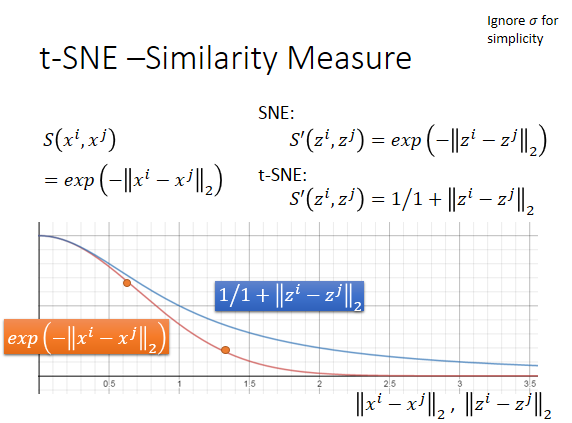

t-SNE这个similarity的选择是非常神妙的，我们在原来的data point space上面，evaluate similarity 是计算$x^i,x^j$之间的Euclidean distance，取一个负号，再取exponent，这种方法比较好，因为它可以确保说只有非常相近的点才有值，exponential掉的比较快，只要距离一拉开，similarity就会变得很小。 在t-SNE之前，有一个方法叫做SNE：dimension reduction以后的space，它选择measure跟原来的space是一样的。t-SNE神妙的地方在：dimension reduction以后的space，它选择measure跟原来的space是不一样的，它在dimension reduction之后选的space是t distribution的其中一种($S^{'}(z^i,z^j)=\frac{1}{1+||z^i-z^j||_2}$)

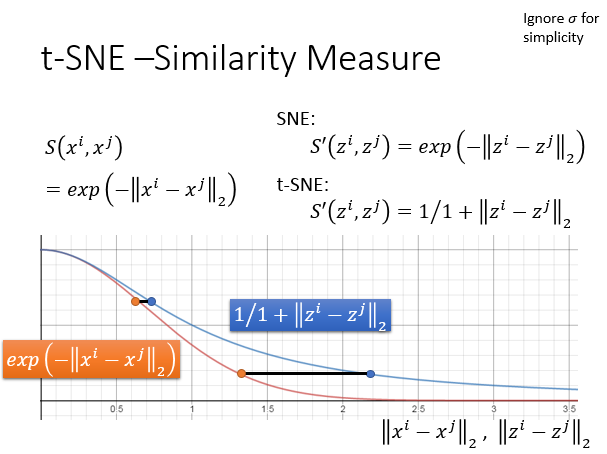

为什么要这样做呢，我可以提供一个很直觉的理由，假设横轴代表了在原来space上面的Euclidean distance或者是做dimension reduction以后的Euclidean distance。其中红色这条线是：$exp(-||x^i-x^j||_2)$,蓝色这条线是：$\frac{1}{1+||z^i-z^j||_2}$。 图中的两个点做dimension reduction以后，要怎样才能维持它原来人的space呢？变成图中这个样子。原来在高维空间里面，如果距离很近，那做完transform以后，它还是很近。原来就有一段距离，做完transform以后，会被拉的很远。

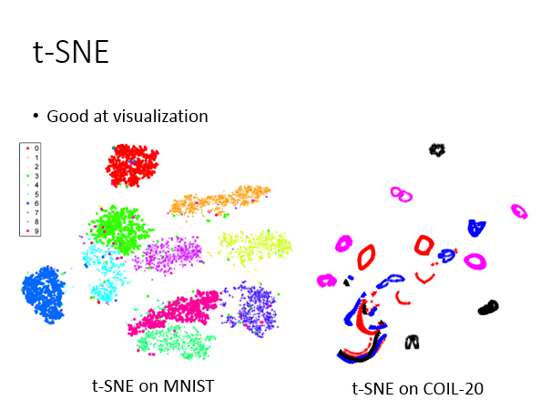

所以，t-SNE画出来的图往往长的这样，它会把你的data point 聚集成一群一群的，只要你的data point离的比较远，那做完t-SNE之后，就会强化，变得更远了。

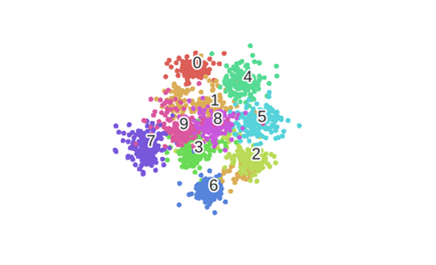

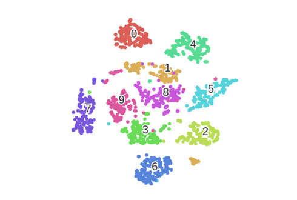

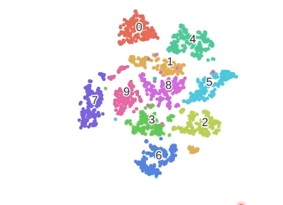

如图为t-SNE的动画。因为这是利用gradient descent 来train的，所以你会看到随着iteration process点会被分的越来越开。

