迁移学习指的就是，假设你手上有一些跟你现在要进行的task没有直接相关的data，那你能不能用这些没有直接相关的data来帮助我们做一些什么事情。比如说：你现在做的是猫跟狗的classifer，那所谓没有什么直接相关的data是什么意思呢？没有什么直接相关其实是有很多不同的可能。比如说input distribution 是类似的(一样时动物的图片)，但是你的label是无关的(domain是类似的，task是不像的)。还有另外的一个可能是：input domain是不同的，但是task是相同的(猫跟狗的分类，一个招财猫图片，一个是高非狗的图片)

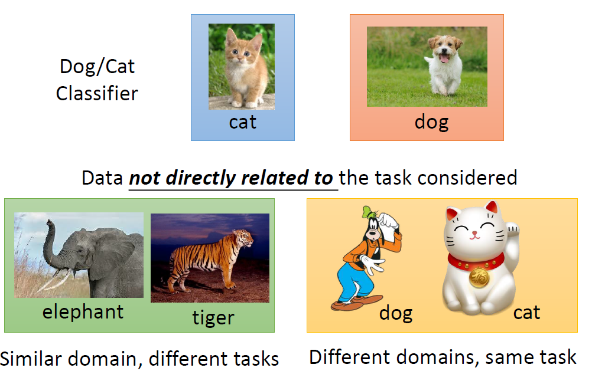

迁移学习问的问题是：我们能不能再有一些不想关data的情况下，然后帮助我们现在要做的task。

为什么我要考虑迁移学习这样的task呢？举例来说：在speech recognition里面(台语的语音辨识)，台语的data是很少的(但是语音的data是很好收集的，中文，英文等)。那我们能不能用其他语音的data来做台语这件事情。或许在image recongnition里面有一些是medical images，这种medical image其实是很少的，但是image data是很不缺的。

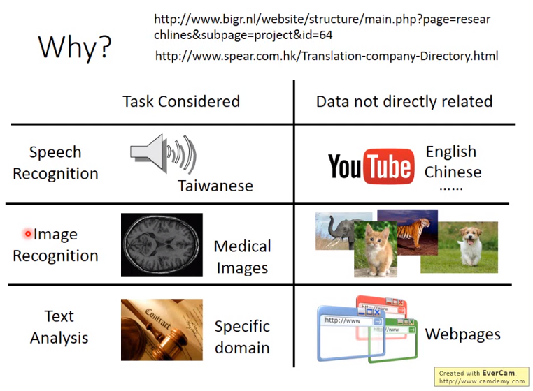

用不相干的data来做domain其他的data，来帮助现在的task，是有可能的。

我们在现实生活中，我们在不断的做迁移学习。比如说：你可能是是一名研究生，你可能想知道研究生咋样过日子，你就可以参考爆漫王里面的例子。在保漫王里面漫画家就是研究生，责编就等同于指导教授。漫画家每周画分镜去给责编看，跟责编讨论(就跟指导教授每周去汇报报告一样)，画分镜就是跑实验。目标就是投稿就等于投稿期刊。

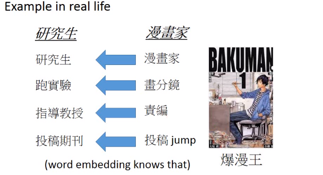

虽然我们没有一个研究生的守则，但是从爆漫王里面我们可以知道说：身为一个研究生应该要做什么样的事情。那你可能会说：拿漫画跟学术做类比，有点不伦不类的(漫画也是拿生命来做的)。

迁移学习有很多的方法，它是很多方法的集合。下面你有可能会看到我说的terminology可能跟其他的有点不一样，不同的文献用的词汇其实是不一样的，有些人说算是迁移学习，有些人说不算是迁移学习，所以这个地方比较混乱，你只需要知道那个方法是什么就好了。

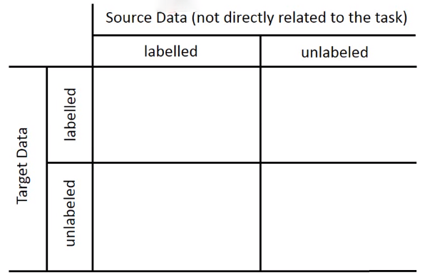

我们现在有一个我们想要做的task，有一些跟这个task有关的数据叫做target data，有一些跟这个task无关的data，这个data叫做source data。这个target data有可能是有label的，也有可能是没有label的，这个source data有可能是有label的，也有可能是没有label的，所以现在我们就有四种可能，所以之后我们会分这四种来讨论。

# Model Fine-tuning

那现在我们假设target data跟source data都同时有label的情况下，可以的做的事情是：最常见的事情就是：fine-tuning你的model

在现在的task里面，target data($x^t,y^t$)和source data($x^s,y^s$)都是有label的，但是我们通常是假设说：现在target data的数据量是非常少的(如果target data量是很多的话，你就当做一般的machine learning 来train你的model就好了，你也不需要做什么迁移学习)，source data是很多的。虽然source data跟我们现在考虑的task没有关系，但我们想知道说：在target data很少的情况下，有一大推不相关的source data到底有么有可能会有帮助。

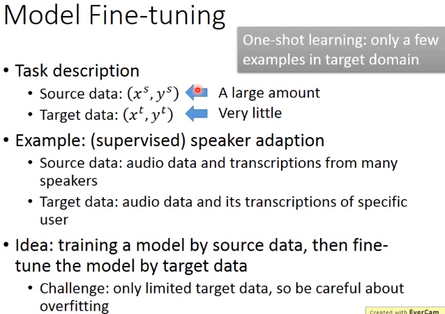

如果你今天的target data的量很少，少到只有几个example而已，这个就叫做one-shot learning。这样的task的例子是：在语音上最典型的例子就是speaker adaption，target data是某一个人的声音，但是这个人的声音你不太有可能有太多的label data(可能对你的machine 说了三句话)，但是source data有一大堆的audio data，它是来自于不同人的。你当然不可能直接去用target data去train一个语音辨识系统，这样一定会坏掉的。所以你会希望说：这个有好几w小时的source data在这个task里面有什么帮助。

处理方式是非常直觉的，那你的source data直接去train一个model，然后接下来fine tune这个model通过target data。可能会遇到的challenge：source data非常的少，所以你在target data train出一个好的model，然后在source data上做train，可能就坏掉了。

## conservative training

有一个技巧叫做：conservative training，你现在有大量的source data，(比如说：在语音辨识里面就是很多不同speaker的声音)，那你拿来做neural network。target data是某个speaker的声音，如果你直接拿这些去train的话就坏掉了。你可以在training的时候加一些constraint(regularization)，让新的model跟旧的model不要差太多。你会希望新的model的output跟旧的model的output在看同一笔data的时候越接近越好。或者说新的model跟旧的model L2-Norm差距越小越好(防止overfitting的情形)

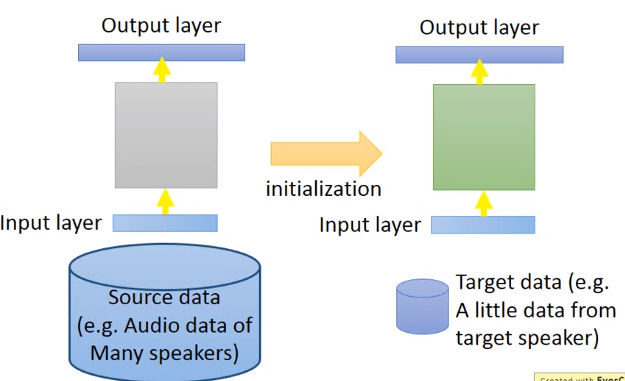

## layer transfer

另外的一个方法是layer transfer，你现在用source data train好了一个model，把这个model的某几个layer拿出来copy到新的model里面
。接下来用source data只去用没有copy的layer(可能你只保留一个layer没有copy)，这样的好处就是source data只需要考虑非常少的参数，这样就可以避免overfitting的情形。当然之后你的source data够多了，那之后可能还是要fine-tune整个model。

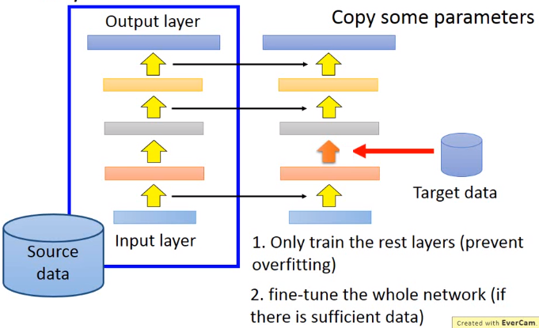

哪些layer应该被transfer，哪些layer不应该去transfer呢？有趣的是在不同的task上面需要被transfer的layer往往是不一样的。比如说在语音辨识上面，我们通常是copy the last few layers(最后几层)。同样的发音方式，因为口腔结果略有差异，得到的声音是不一样的。neural network前几层做的事情是从这个声音讯号里面得知现在说话人的发音方式，根据发音方式就可以得到说的词汇。所以从这个角度来看，从发音方式到辨识结果，也就是neural network后面几层是跟语者是每一关系的，所以它是可以被copy的。不一样的是从声音讯号到发音方式这一段可能每个人都是不一样的。

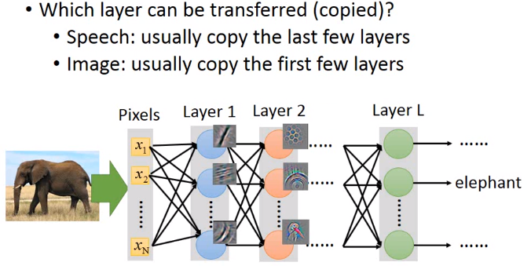

所以在做语音辨识的时候，常见的做法是把neural network的后几层是copy。但是在image的时候发现是不一样的，在image的时候是copy前面几层，只train最后几层。

在image的时候你会发现数说，当你source domain上learn了一network，你learn到CNN通常前几层做的就是deceide最简单的事情(比如前几层做的就是decide有么有直线，有么有简单的几何图形)。所以在image上面前几层learn的东西，它是可以被transfer到其他的task上面。而最后几层learn的东西往往是没有办法transfer到其他的东西上面去。所以在做影像处理的时候反而是会copy前面几层。

这是一个image在layer transfer上的实验，
120多wimage分成source跟target，分法是按照class来分的(500 class归为source data，500classes归为target data)。横轴的意思是：我们在做迁移学习的时候copy了几个layer(copy 0个layer，就是说完全没有做迁移学习)，纵轴时候top-1 accuracy，越高越好。

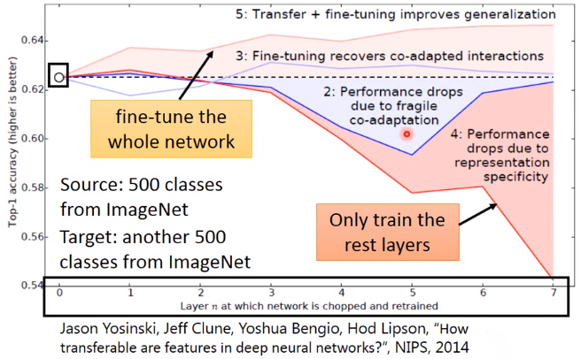

假设source跟target是没关系的，把这个Imagenet分为source data跟target data的时候，把自然界的东西通通当成source，target都是人造的东西，这样的迁移学习会有什么样的影响。如果source data跟target data是差很多的，那在做迁移学习的时候，你的性能会掉的非常多(如果只是copy前面几个layer的话，性能仍然跟没有跟copy是持平的)。这意味着说：即使source domain跟target domain是非常不一样的，在neural network的第一个layer，他们仍然做的事情仍然可能是一样的。绿色的这条线：假设我前面几个layer的参数random会坏掉了。

接下来是multitask learning，multitask learning跟fine tuning不同是：在fine tuning里面我们care target domain做的好不好，那在multitask learning里面我们同时care target domain跟source domain做的好不好。

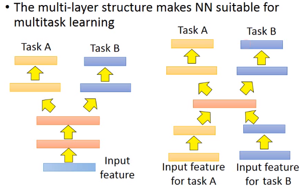

其实我们今天用deep learning base方法的话，它特别适合拿来做这种multitask learning，因为你可以说：假设有两个不同的task用的同样的feature(都做影像辨识)，我learn一个neural network，中间会分叉出来一部分network去处理taskA，一部分network去处理taskB。这么做的好处是：你的taskA跟taskB他们在前面几个layer会是共用的(有比较多的data，会有比较好的性能)。这样做的前提是：这两个task有没有共通性，是不是可以共用前面几个layer。

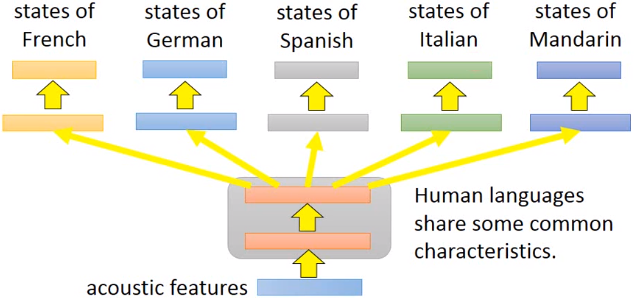

还有一种是input没有办法确定，两个不同task的input都用不同的neural network把它transfer到同一个domain上去，在同一个domain上你在apply不同的neural network，一条路去做taskA，一条路去做taskB。如果在这样的task下你也迁移学习，就算tasKA跟taskB的input完全不一样，如果你觉得中间几个layer有共同的地方，你还是可以用这样的model架构来处理。

# multitask learning

multitask learning一个很成功的例子就是多语言的语音辨识，假设你现在手上有一大堆不同语言的data(法文，中文，英文等)，那你在train你的model的时候，同时可以辨识这五种不同的语言。这个model前面几个layer他们会共用参数，后面几个layer每一个语言可能会有自己的参数，这样做是合理的。虽然是不同的语言，但是都是人类所说的，所以前面几个layer它们可能是share同样的咨询，共用同样的参数。

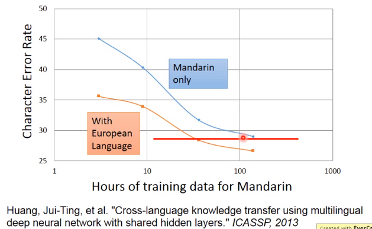

在translation你也可以拥同样的事情，假设你今天要做中翻英，也要做中翻日，你也把这两个model一起train。在一起train的时候无论是中翻英还是中翻日，你都要把中文的data先做process，那一部分neural network就可以是两种不同语言的data。

在过去收集了十几种语言，把它们两两之间互相做transfer，做了一个很大N*N的tabel，每一个task都有进步。所以目前发现大部分task，不同人类的语言就算你觉得它们不是非常像，但是它们之间都是可以transfer。

这边举得例子是从欧洲语言去transfer中文，横轴是中文的data，纵轴是character error rate。假设你一开始用中文train一个model，data很少，error rate很大，随着data越来越多，error rate就可以压到30以下。但是今天如果你有一大堆的欧洲语言，你把这些欧洲语言跟中文一起去做multitask train，用这个欧洲语言的data来帮助中文model前面几层让它train更好。你会发现说：在中文data很少的情况下，你有做迁移学习，你就可以得到比较好的性能。随着中文data越多的时候，中文本身性能越好，就算是中文100小时借用一些从欧洲语言对这个变化也是有微幅帮助的。所以这边的好处是说：假设你做multitask learning的时候，你会发现你有100多个小时跟有50小时以内，如果你有做迁移学习的话，你只需要1/2以下的data就可以跟有两倍的data做的一样好

常常有人会担心说：迁移学习会不会有负面的效应，这是会有可能，如果两个task不像的话，你的transfer 就是negative的。但是有人说：总是思考两个task到底之间能不能transfer，这样很浪费时间。所以就会有progressive neural networks。

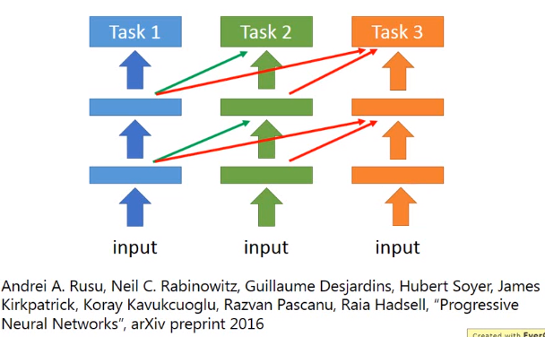

## progressive network neural

progressive network neural其实是很新的做法(2016年的paper)。我先train一个task1，train好以后它的参数就fix住，那现在我们要做task2，但是task2它的每一个hidden layer都会去接前一个task1的某一个hidden layer的output。所以在train的时候好处就是：task1跟task2非常不像，首先task1的data不会去动到task2的model，所以task1一定不会比原来更差。task2去借用task1的参数，但是它可以把这些参数直接设为0，这样也不会影响task2的性能。task3也是做一样的事情，task3会同时从task1和task2的hidden layer得到information。

接下来是：假设target data是unlaebl，而source data是label的时候我们可以做什么样的事情

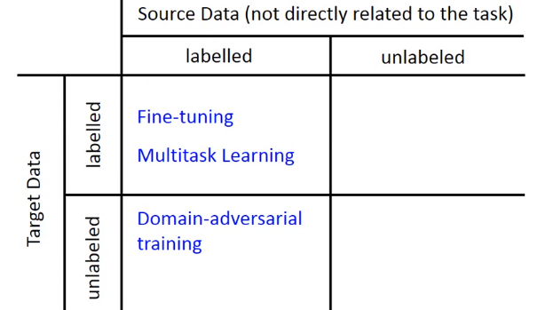

在source data里面有function的input跟output，在target里我们只有function的input，没有function的output。举例来说：我们可以说：source data是MNIST image，target data是MNIST-M image(MNIST image加上一些奇怪的背景)。MNIST是有label的，MNIST-M是没有label的，在这种情况下我们通常是把source data就视作training data，target data视作testing data。产生的问题是：training data跟testing data是非常mismatch

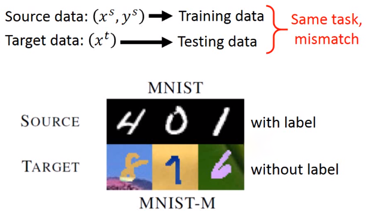

如果你今天直接learn一个model，input是一张image，一直learn下去结果可能就会坏掉。如果我们把一个neural network当做feature extract，neural network前面几层我们可以看做是抽feature，后面几层可以看做classification。我们把这个feature拿来看的话，我们会发现说：不同domain data它的feature完全就不一样，如果把MNIST丢进去的话，它是蓝色的这些点(0-9,总共10群)，但是如果你今天是把另外一群image丢进去的话，你会发现抽出来的feature是红色的这一群。所以你会发现说：今天做feature extract的时候，原来source image跟target image不在同一个位置里面，所以后面的classifier只能把蓝色的做好，红色部分就无能为力。

 

# Domain-adversarial 

所以该肿么办呢？这边希望做的事情是：前面的feature extract 它可以把domain的特性去除掉，这一招较做Domain-adversarial training。也就是feature extract output不应该是红色跟蓝色的点分成两群，而是不同的domain应该混在一起(不同domain的特性取消掉)。

那咋样learn这样的feature extract呢？，这边的做法是在后面接一下domain classifier。把feature extract output丢给domain clssifier，domain classifier它也是一个classification task，它要做的事情就是：根据feature extract给它的feature，判断这个feature来自于哪个domain，在这个task里面，要分辨这些feature是来自MNIST还是来自与MNIST-M。

有一个generator 的output，然后又有discriminator，让它的架构非常像GAN。但是跟GAN不一样的事情是：之前在GAN那个task里面，你的generator要做的事情是产生一个image，然后骗过discriminator，这件事很难。但是在这个Domain-adversarial training里面，要骗过domain classifier太简单了。肿么做呢？有一个solution是：不管看到什么东西，output都是0，这样就骗过了classifier。

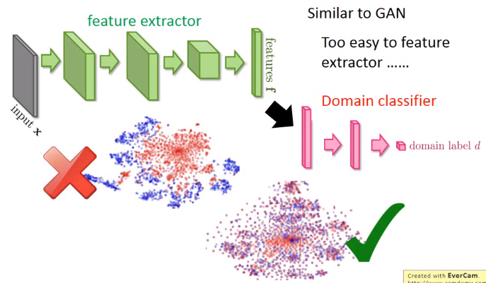 

所以只是training这个domain classifier是不够的，因为feature extract可以很轻易骗过domain classifier

所以你要在feature extract增加它任务的难度，所以feature extract它output feature不仅要骗过domain classifier还要同时让laebl predictor做好。这个label predictor它就吃feature extract output，然后它的output就是10个class。

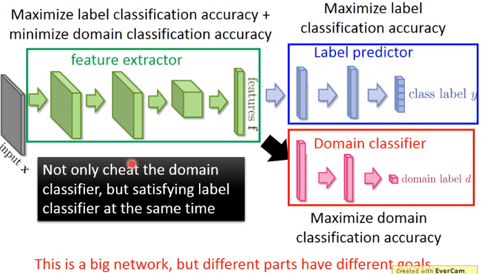

所以今天你的feature extract 不只要骗过domain classifier，还要满足label predictior的需求。抽出的feature不仅要把domain的特性消掉，同时还要保留原来feature的特性。那我们把这三个neural放在一起的话。实际上就是一个大型的neural network，是一个各怀 鬼胎的neural network(一般的neural network整个参数想要做的事情都是一样的，要minimize loss)，在这个neural network里面参数是各怀鬼胎的。蓝色label predictor做的事情是把class分类做的正确率越高越好，domain classifier做的事情是想正确predict image是属于哪个domain。feature extractor想要做的事情是：要同时improve label predictor，同时想要minimize domain classifier accuracy。

feature extractor 咋样陷害队友呢(domain classifier)？这件事情是很容易的，你只要加一个gradient reversal layer就行了。也就是你在做backpropagation的时候(feedford和backford)，在做backford task的时候你的domain classifier传给feature extractor什么样的value，feature extractor就把它乘上一个负号。也就是domain classifier 告诉你说某个value要上升，它就故意下降。

domain classifier因为看不到真正的image，所以它最后一定fail掉。因为它所能看到的东西都是feature extractor告诉它的，所以它最后一定会无法分辨feature extractor所抽出来的feature是来自哪个domain

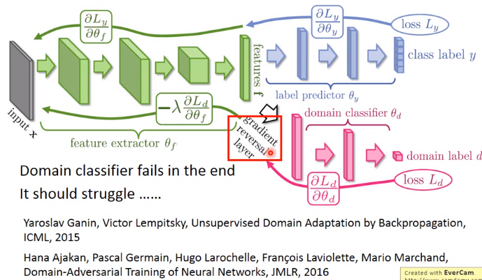

今天的问题就是domain classifier一定要奋力的挣扎，因为它要努力去判断现在的feature是来自哪个domain。

这些都是很新的paper，值得看。

这是paper中的一些实验结果，做了不同的domain transfer。

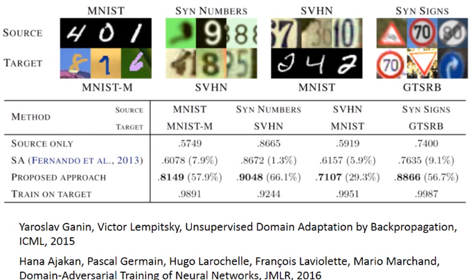

我们来看一些实验结果的话，纵轴代表用不同的方法，在这四个结果里面，你会发现说：如果只用source only的话，性能是比较差的。

接下来是zero-shot-learning

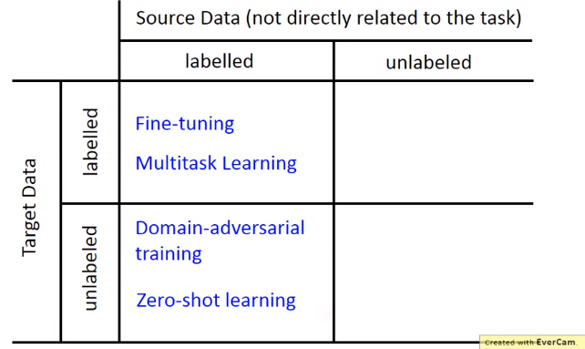

# Zero-shot learning

在zero-shot-learning里面呢？跟刚才讲的task是一样的，source data有label，target data每天label。在刚才task里面可以把source data当做training data，把target data当做testing data，但是实际上在zero-shot learning里面，它的difine又更加严格一点。它的difine是：今天在source data和target data里面，它的task是不一样的。

比如说在影像上面(你可能要分辨猫跟狗)，你的source data可能有猫的class，也有狗的class。但是你的target data里面image是草泥马的样子，在source data里面是从来没有出现过草泥马的，如果machine看到草泥马，就未免有点强人所难了吧。但是这个task在语音上很早就有solution了，其实语音是常常会遇到zero-shot learning的问题。

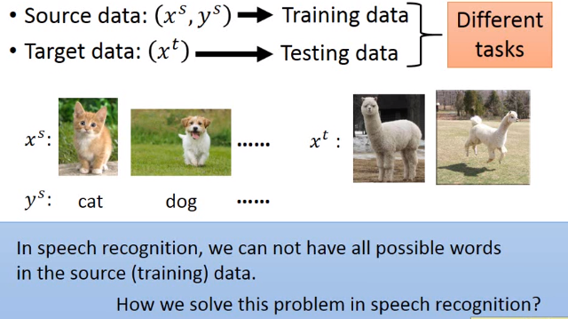

假如我们把不同的word都当做一个class的话，那本来在training的时候跟testing的时候就有可能看到不同的词汇。你的testing data本来就有一些词汇是在training的时候是没有看过的。

那在语音上我们咋样来解决这个问题呢？不要直接去辨识一段声音是属于哪一个word，我们辨识的是一段声音是属于哪一个音标。然后我们在做一个音标跟table对应关系的表，这个东西也就是词典。在辨识的时候只要辨识出音标就好，再去查表说：这个音标对应到哪一个word。这样就算有一些word是没有在training data里面的，它只要在你的词典里面出现过，你的model可以正确辨识出声音是属于哪一个音标的话，你就可以处理这个问题。

在影像上我们可以把每一个class用它的attribute来表示，也就是说：你有一个database，这个database里面会有所以不同可能的class跟它的特性。假设你要辨识的是动物，但是你training data跟testing data他们的动物是不一样的。但是你有一个database，这个database告诉你说：每一种动物它是有什么样的特性。比如狗就是毛茸茸，四只脚，有尾巴；鱼是有尾巴但不是毛茸茸，没有脚。

这个attribute要更丰富，每一个class都要有不一样的attribute(如果两个class有相同的attribute的话，方法会fail)。那在training的时候，我们不直接辨识说：每一张image是属于哪一个class，而是去辨识说：每一张image里面它具备什么样的attribute。所以你的neural network target就是说：看到猩猩的图，就要说：这是一个毛茸茸的动物，没有四只脚，没有尾巴。看到狗的图就要说：这是毛茸茸的动物，有四只脚，有尾巴。

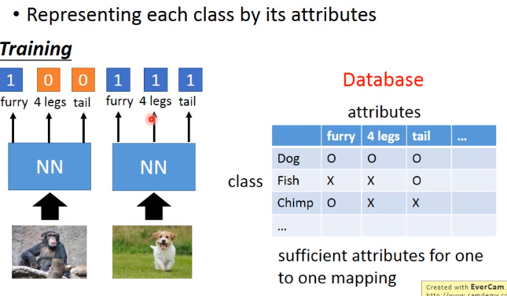

那在testing的时候，就算今天来了你从来没有见过的image，也是没有关系的。你今天neural network target也不是说：input image它是哪一种动物，而是input这一张image它是具有什么样的attribute。所以input你从来没有见过的动物，你只要把它的attribute长出来，然后你就查表看说：在database里面哪一种动物它的attribute跟你现在model output最接近。有时可能没有一摸一样的也是没有关系的，看谁最接近，那个动物就是你要找的。

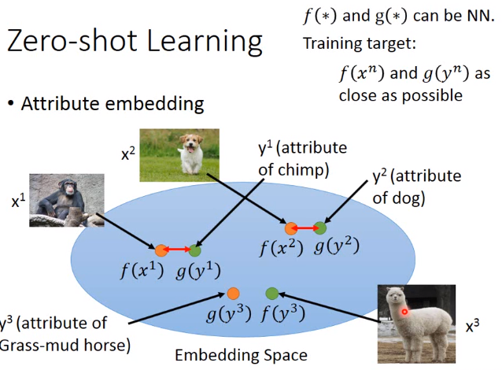 

那有时候你的attribute可能非常的复杂(attribute dimension非常大)，你可以做attribute embedding。也就是说现在有一个embedding space，把training data每一个image都通过一个transform，变成一个embedding space上的一个点。然后把所有的attribute也都变成embedding space上的一个点，这个$g(*)$跟$f(*)$都可能是neural network，那training的时候希望f跟g越接近越好。那在testing的时候如果有一张没有看过的image，你就可以说这张image attribute embedding以后跟哪个attribute最像，那你就可以知道它是什么样的image。
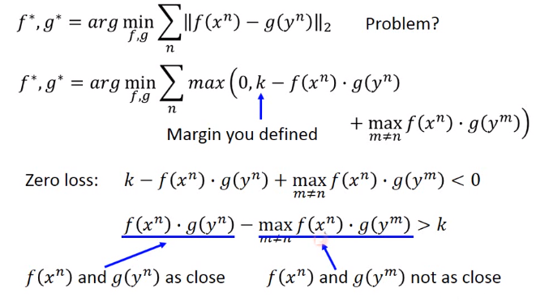

image跟attribute都可以描述为vector，要做的事情就是把attribute跟image都投影到同一个空间里面。也就是说：你可以想象成是对image的vector，也就是图中的x，跟attribute的vector，也就是图中的y都做降维，然后都降到同一个dimension。所以你把x通过一个function f都变成embedding space上的vector，把y通过另外一个function g也都变成embedding space上的vector。

但是咋样找这个f跟g呢？你可以说f跟g就是neural network。input一张image它变成一个vector，或者input attribute 变成一个vector。training target你希望说：假设我们已经知道$y^1$是$x^1$的attribute，$y^2$是$x^2$的attribute，那你就希望说找到一个f跟g，它可以让$x^1$跟$y^1$投影到embedding space以后越接近越好，$x^2$跟$y^2$投影到embedding space以后越接近越好。

那现在把f跟g找出来了，那现在假如有一张你从来没见过的image$x^3$在你的testing data里面，它也可以透过这个f变成embedding space上面的一个vector，接下来你就可以说这个embedding vector它跟$y^3$最接近，那$y^3$就是它的attribute

又是你会遇到一个问题，如果我没有database呢？我根本不知道每一个动物的attribute是什么，肿么办呢？那你可以借用word vector。我们知道word vector的每一个dimension就代表了现在word某种attribute。所以你不一定需要一个datbase去告诉你说：每一个动物的attribute是什么。假设你有一组word vector，这组word vector里面你知道每一个动物对应的word vector，那你可以把你的attribute直接换成word vector，再做跟刚才一样的embedding就结束了。
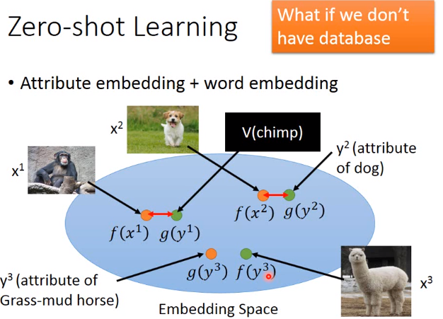

假设我们的train的query是要让$x^n$通过f、跟$y^n$通过g之后的距离越接近越好。这样子的话是有问题的，这样你的model只会learn到说：它把所有不同的x跟所有不同的y都投影同一个点，这样子距离最好。所以你的loss function这样定其实是不行的，所以你要稍微重新设计一下你的loss function。前面这个loss function只有考虑到$x^n$跟$y^n$越接近越好，但没有考虑
$x^n$跟另一个$y^n$，它的距离应该被拉大。 

max里面两个的element分别是0，k-f($x^n$)跟g($y^n$)的inner product，加上一个max(m不等于n)里面的f($x^n$)跟g($y^m$)的inner product。这个k是自己difine的margin(一个constant，在train的时候自己difine)

这个max的两个element一个是0，一个是max$f(x^n)*g(y^m)$。它会从0跟这个式子中选一个最大的，所以这一项的最小值就是0。什么时候会等于0呢？当你另外一项小于0的时候，这个loss就会是0。所以今天$k-f(x^n)*g(y^n)$的inner product 加上$max_{m\neq n}f(x^n)*g(y^m)$的inner product小于0的时候，这一项会是zero loss，整理一下得到下面的这个式子$f(x^n)g(y^n)-max_{m\neq n}f(x^n)*g(y^m)$的inner product小于k的时候是zero loss。这一项也和解释为：当$f(x^n)$跟$g(y^n)$的inner product大于另外一项(y不是$y^n$里面找一个m，这个$y^m$跟$x^n$是最接近的)

如果$x^n$跟$y^n$之间的inner product大过所有其它的$y^m$跟$x^n$之间的inner product，而且要大过一个margin k。

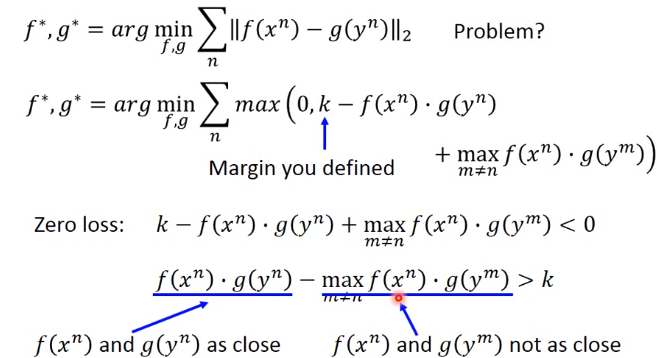

还有另外一个简单的Zero-Shot learning的方法叫做convex combination of semantic embedding。这个方法是说：我们也不要做什么learning，假设我们现在有一个语音辨识系统，有一个word vector，这两个是从网络上下载下来的，就可以做这件事情。

我把一张图丢到neural network里面去，它的output没有办法决定是哪一个class，但它觉得有0.5的几率是lion，有0.5的几率是tiger。接下来你在去找lion跟tiger的word vector，然后把lion跟tiger的word vector得到新的vector(用1:1的比例混合,0.5V(tiger)+0.5V(lion))，那你再看哪一个word的vector跟这个混合之后的结果最接近。假设是liger最接近，那这个东西就是liger(狮虎)

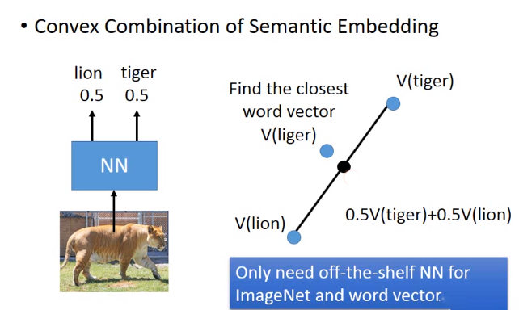

以下是这个的实验结果，也是蛮惊人的。我们来比一下人类跟机器的差别，第一张图，CNN判别说是sea lion(海狮)，DeViSE没有得到好的结果，ConSE判别为各种sea lion。
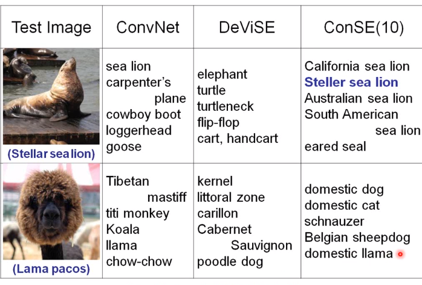

在training的时候，machine看过如何把英文翻译成韩文，知道咋样把韩文翻译为英文，知道咋样把英文翻译为日文，知道咋样把日文翻译为英文。但是它从来没有看过日文翻译韩文的data，但是可以翻，但是它从来没有看过韩文翻译日文的data，但是可以翻。

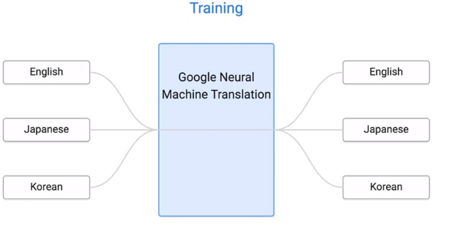

为什么zero-shot在这个task上是可行的呢？如果你今天用同一个model做了不同语言之间的translation以后，machine可以学到的事情是：对不同语言的input 句子都可以project到同一个space上面

我们现在根据我们learn好得translation，那个translation有一个encoder，它会把你input的句子变成vector，decoder根据这个vector解回一个句子，就是翻译的结果。那今天我们把不同语言都丢到这个encoder里面让它变成vector的话，那这些不同语言的不同句子在这个space上面有什么不一样的关系呢？

它发现说今天有日文、英文、韩文这三个句子，这三个句子讲的是同一件事情，通过encoder embedding以后再space上面其实是差不多的位置。在左边这个图上面不同的颜色代表说：不同语言的用一个意思。所以你这样说：machine发明了一个新语言也是可以接受的，如果你把这个embedding space当做一个新的语言的话。machine做的是：发现可一个sequence language，每一种不同的语言都先要先转成它知道的sequence language，在用这个sequence language转为另外一种语言。

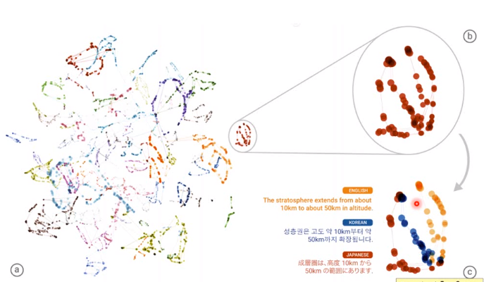 

所以今天就算是某一个翻译task ，你的input语言和output语言machine没有看过，它也可以透过这种自己学出来的sequence language来做translation。

一些paper给予参考。
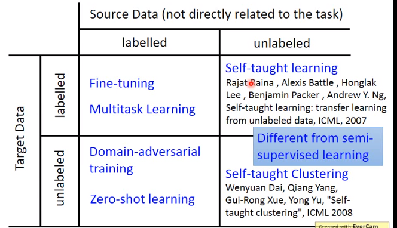

# self-taught learning & Self-taught Clustering

target data有label,source data没有label的状况叫做self-taught learning。target label没有label，source data也没有label的状况叫做self-taught clustering。

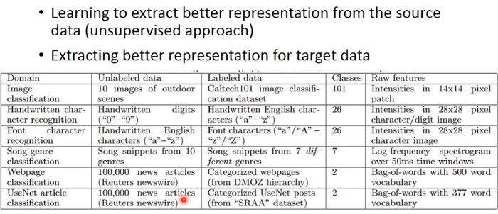

