# 复现导图

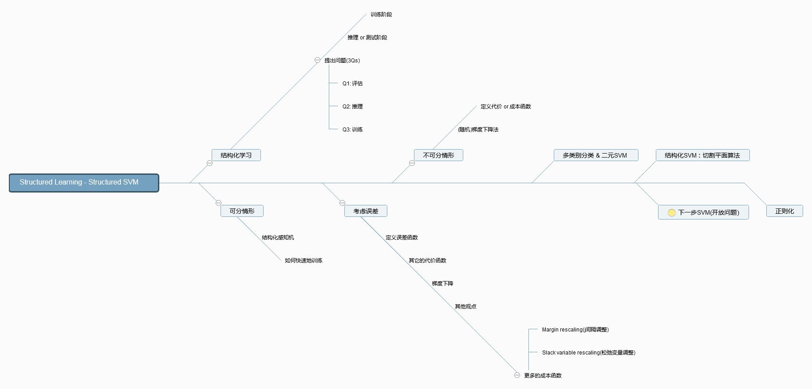

## 结构化学习(Structured Learning)

结构化学习要解决的问题，即需要找到一个强有力的函数 **f**
$$
f : X \rightarrow Y
$$

> 1. 输入和输出都是具有结构化的对象；
> 2. 对象可以为：sequence(序列)，list(列表)，tree(树结构)，bounding box(包围框)，等等

其中，**X**是一种对象的空间表示，**Y**是另一种对象的空间表示。

- 统一框架(两步走，三问题)

  - 第一步：训练

    - 寻找一个函数 **F**
      $$
      \mathrm{F} : X \times Y \rightarrow \mathrm{R}
      $$

    - F(x, y): 用来评估对象x和y的兼容性 or 合理性

  - 第二步：推理 or 测试

    - 给定一个对象 x，求得：
      $$
      \tilde{y}=\arg \max _{y \in Y} F(x, y)
      $$
      即给定任意一个x，穷举所有的y，将(x, y)带入F，找出最适当的y作为系统的输出。

- 提出问题(3Qs)

  - Q1: 评估

    - **What**: F(x, y) 的形式

  - Q2: 推理

    - **How**: 如何解决 “arg max” 问题
      $$
      \tilde{y}=\arg \max _{y \in Y} F(x, y)
      $$
      即转换为最优化的求解问题。

  - Q3: 训练

    - 给定训练数据，如何求解 F(x, y)？

- 示例任务：目标检测

  - Q1: 评估

    - F(x, y)是线性的

      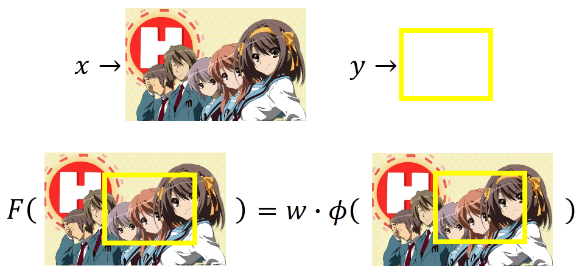

      其中，w是在Q3中利用训练数据来学习到的参数，ϕ是人为定义的规则。

    - 开放问题：如果F(x,y)不是线性，该如何处理?

  - Q2: 推理
    $$
    \tilde{y}=\arg \max _{y \in \mathbb{Y}} w \cdot \phi(x, y)
    $$
    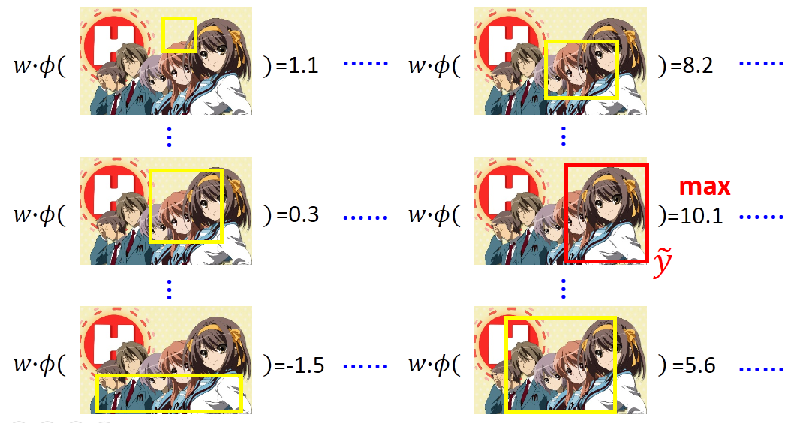

    即给定一张图片x，穷举出所有可能的标记框y，对每一个(x, y)对，用**w∙ϕ**计算出一个分数最大的(x, y)对，我们就把对应的y作为输出。

    - 目标检测(取决于ϕ(x, y))
      - Branch & Bound algorithm(分支定界法)
      - Selective Search(选择性搜索)
    - **序列标记**(会在下一章着重复现，其取决于ϕ(x, y))
      - **Viterbi Algorithm**(维特比译码算法)
    - 遗传算法(基因演算)
    - 开放问题
      - 如果推断不准确(non-exact)将会发生什么情况?

  - Q3: 训练

    - 原理

      训练数据：
      $$
      \left\{\left(x^{1}, \hat{y}^{1}\right),\left(x^{2}, \hat{y}^{2}\right) \ldots,\left(x^{\mathrm{N}}, \hat{y}^{\mathrm{N}}\right)\right\}
      $$
      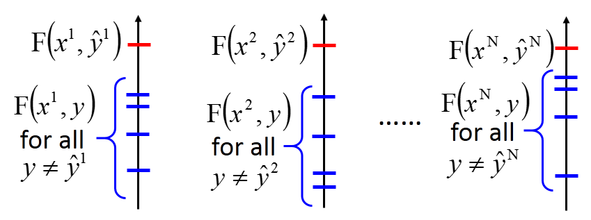

      假定只关注Q3的问题：比对所有的(x, y)，找到最佳的F(x, y)。

## 可分情形(Separable Case)

存在一个权值向量$$\hat{w}$$，使得：
$$
\begin{aligned} \hat{w} \cdot \phi\left(x^{1}, \hat{y}^{1}\right) & \geq \hat{w} \cdot \phi\left(x^{1}, y\right)+\delta \\ \hat{w} \cdot \phi\left(x^{2}, \hat{y}^{2}\right) & \geq \hat{w} \cdot \phi\left(x^{2}, y\right)+\delta \end{aligned}
$$
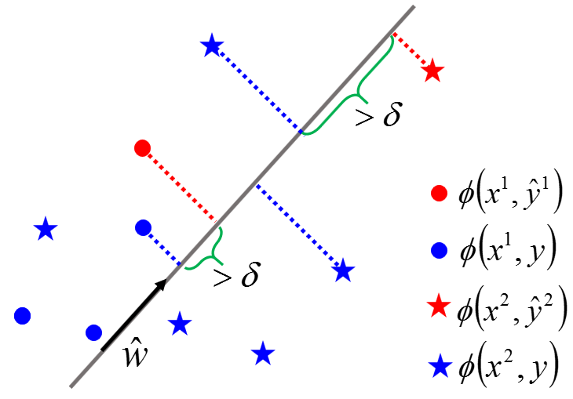

其中，红色代表正确的特征点(feature point)，蓝色代表错误的特征点(feature point)，可分性可以理解为，我们需要找到一个权值向量，其作用是与 ϕ(x, y) 做内积(inner product) ，能够将正确的point比蓝色的point的值均大于一个δ。

- 结构化感知机

  > 1. 输入：训练数据集
  >    $$
  >    \left\{\left(x^{1}, \hat{y}^{1}\right),\left(x^{2}, \hat{y}^{2}\right) \ldots,\left(x^{\mathrm{N}}, \hat{y}^{\mathrm{N}}\right)\right\}
  >    $$
  >
  > 2. 输出：权值向量w
  >
  > 3. 算法：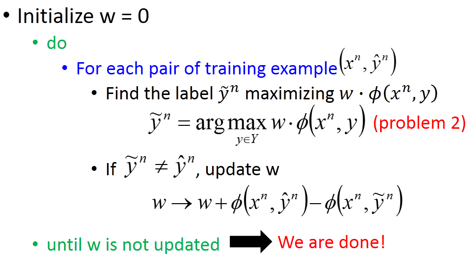
  

在可分情形下，为了得到$$\hat{w}$$，我们最多只需更新$$(R / \delta)^{2}$$次。其中，δ为间隔(使得误分的点和正确的点能够线性分离)，R为ϕ(x, y) 与 ϕ(x, y′)的最大距离(即特征之间最大的距离)，与y的空间无关！

**证明：**随着k的增加$$\hat{w} \text {与} w^{k}$$之间的角度$$\rho_{\mathrm{k}}$$将会变小

由
$$
  \cos \rho_{k}=\frac{\hat{w}}{\|\hat{w}\|} \cdot \frac{w^{k}}{\left\|w^{k}\right\|}
$$

- 一旦有错误产生，w将会被更新
    $$
    w^{0}=0 \rightarrow w^{1} \rightarrow w^{2} \rightarrow \ldots \ldots \rightarrow w^{k} \rightarrow w^{k+1} \rightarrow \ldots \ldots
    $$
  
  $$
    w^{k} \text { 与 } w^{k-1}\text { 的关系表示为： }w^{k}=w^{k-1}+\phi\left(x^{n}, \hat{y}^{n}\right)-\phi\left(x^{n}, \widetilde{y}^{n}\right))
  $$
  
  注意：此处我们仅考虑可分情形！
  
- 假定存在一个权值向量$$\widehat{W}$$使得
  
  $$\forall n$$，所有的样本：$$\forall y \in Y-\left\{\hat{y}^{n}\right\}$$，对于一个样本的所有不正确的标记；
  $$
    \hat{w} \cdot \phi\left(x^{n}, \hat{y}^{n}\right) \geq \hat{w} \cdot \phi\left(x^{n}, y\right)+\delta
  $$
    不失一般性，假设$$\|\widehat{w}\|=1$$
  $$
    \begin{aligned} \hat{w} \cdot w^{k} &=\hat{w} \cdot\left(w^{k-1}+\phi\left(x^{n}, \hat{y}^{n}\right)-\phi\left(x^{n}, \widetilde{y}^{n}\right)\right) \\ &=\hat{w} \cdot w^{k-1}+\hat{w} \cdot \phi\left(x^{n}, \hat{y}^{n}\right)-\hat{w} \cdot \phi\left(x^{n}, \widetilde{y}^{n}\right) \end{aligned}
  $$
    在可分情形下，有
  $$
    [\hat{w} \cdot \phi\left(x^{n}, \hat{y}^{n}\right)-\hat{w} \cdot \phi\left(x^{n}, \widetilde{y}^{n}\right)]\geq \delta
  $$
    又由
  $$
    \hat{w} \cdot w^{k} \geq \hat{w} \cdot w^{k-1}+\delta
  $$
    可得：
  $$
    \hat{w} \cdot w^{1} \geq \delta\\\hat{w} \cdot w^{2} \geq 2\delta
    \\......\\\hat{w} \cdot w^{k} \geq k\delta令
  $$
    令
  $$
    w^{k}=w^{k-1}+\phi\left(x^{n}, \hat{y}^{n}\right)-\phi\left(x^{n}, \widetilde{y}^{n}\right)
  $$
    则：
  $$
    \left\|w^{k}\right\|^{2}=\| w^{k-1}+\phi\left(x^{n}, \hat{y}^{n}\right)-\phi\left.\left(x^{n}, \widetilde{y}^{n}\right)\right|^{2}\\
    =\left\|w^{k-1}\right\|^{2}+\left\|\phi\left(x^{n}, \hat{y}^{n}\right)-\phi\left(x^{n}, \widetilde{y}^{n}\right)\right\|^{2}+2 w^{k-1} \cdot\left(\phi\left(x^{n}, \hat{y}^{n}\right)-\phi\left(x^{n}, \widetilde{y}^{n}\right)\right)\\
    \leq\left\|w^{k-1}\right\|^{2}+\mathrm{R}^{2}
  $$
    其中，
  $$
    \| \phi\left(x^{n}, \hat{y}^{n}\right)-\phi\left(x^{n}, \widetilde{y}^{n}\right)^{2}\gt 0
    \\2 w^{k-1} \cdot\left(\phi\left(x^{n}, \hat{y}^{n}\right)-\phi\left(x^{n}, \widetilde{y}^{n}\right)\right)\lt0
  $$
    我们假设任意两个特征向量之间的距离小于R，则有：
  $$
    \left\|w^{1}\right\|^{2} \leq\left\|w^{0}\right\|^{2}+\mathrm{R}^{2}=\mathrm{R}^{2}\\
    \left\|w^{2}\right\|^{2} \leq\left\|w^{1}\right\|^{2}+\mathrm{R}^{2}\leq2\mathrm{R}^{2}\\
    ......\\ \left\|w^{k}\right\|^{2} \leq k\mathrm{R}^{2}
  $$
    因为
  $$
    \hat{w} \cdot w^{k} \geq k \delta \qquad \left\|w^{k}\right\|^{2} \leq k \mathrm{R}^{2}
  $$
    则：
  $$
    \cos \rho_{k}=\frac{\hat{w}}{\|\hat{w}\|} \cdot \frac{w^{k}}{\left\|w^{k}\right\|}
    \geq \frac{k \delta}{\sqrt{k R^{2}}}=\sqrt{k} \frac{\delta}{R} \leq 1
  $$
    即：
  $$
    k \leq\left(\frac{R}{\delta}\right)^{2}.
  $$
  
- 如何快速地训练

  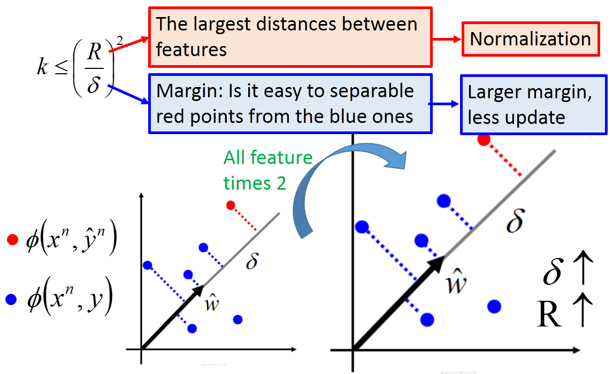

  随着δ的增大，R也会增大！

## 不可分情形(Non-separable Case)

- 定义代价 or 成本函数

  - 定义一个成本函数C来评估w的效果有多差，然后选择w，从而最小化成本函数C

    - What: $$C^n$$ 的值不可能为负数(最小值为0)，其最小值是多少？
    - 利用其他的备选方案可能会产生额外的负担

    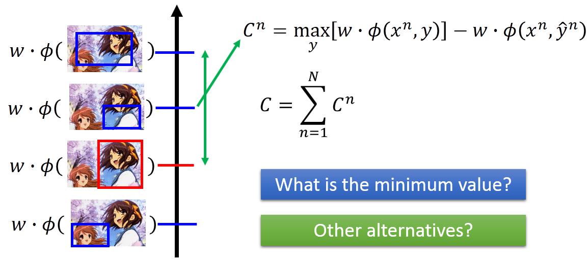

- (随机)梯度下降法

  - 当w不同时，y也会发生改变(在w的二维空间下，被max切割后的效果)；
  - 求解C的梯度，只需要求解ϕ之间的差值即可；
  - 最后利用**SGD**(随机梯度下降法)更新参数w。

  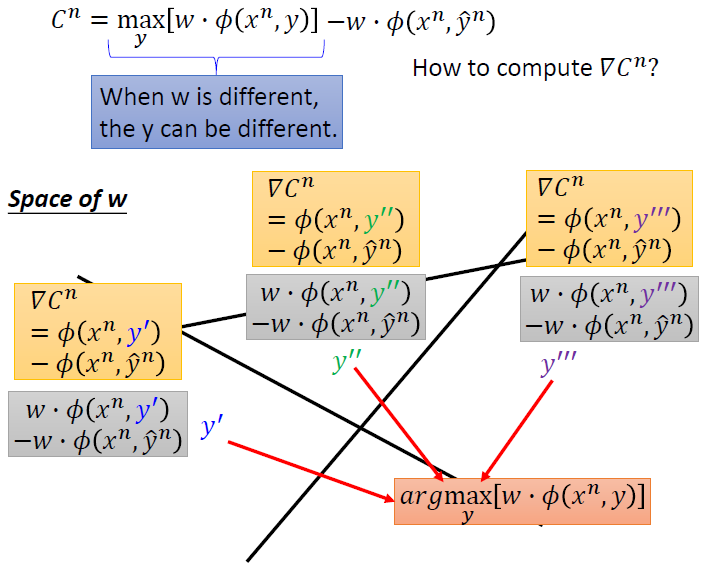

  保证在每个不同的region里面，但不包含边界的情况下，该问题可以利用随机梯度下降法来求解(即可以微分)

  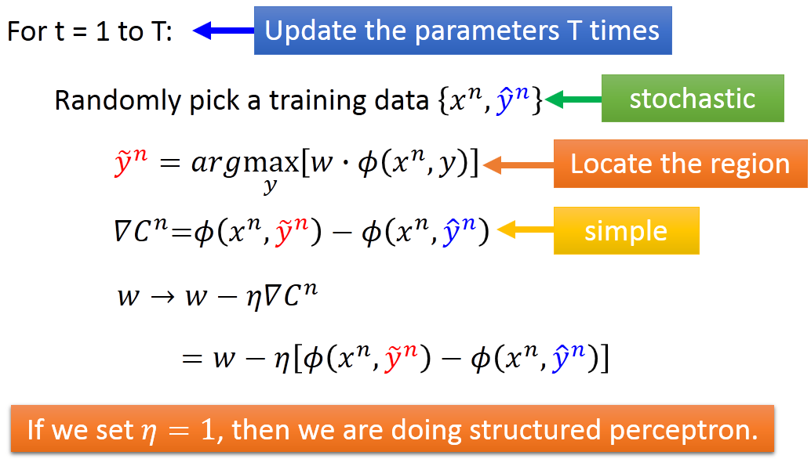

  - 当学习率设为1时，就转换为经典的**结构化感知机**；
  - 当设置不同的学习率，将会产生不同的模型。

## 考虑误差(Considering Errors)

不同的误差之间是存在差异的(即误差可以分为不同的等级)，我们在训练数据时需要考虑进去，问题是如何衡量这种差异呢？

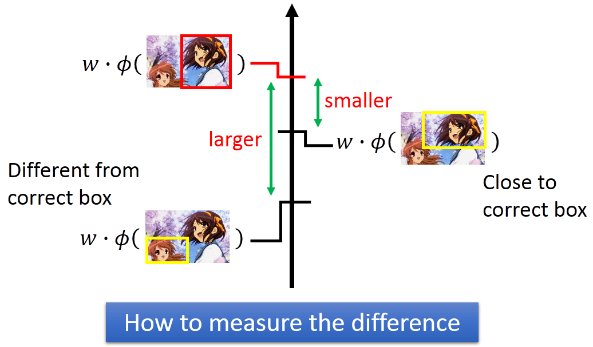

- 定义误差函数

  - $$\Delta(\hat{y}, y)$$: 定义$$\hat{y}$$(正确的标记)与y之间的差距(保证是大于0的): 

    

- 其它的代价 or 成本函数
  $$
  \begin{array}{l}{C^{n}=\max _{y}\left[w \cdot \phi\left(x^{n}, y\right)\right]-w \cdot \phi\left(x^{n}, \hat{y}^{n}\right)} \\变换为：\\ {C^{n}=\max _{y}\left[\Delta\left(\hat{y}^{n}, y\right)+w \cdot \phi\left(x^{n}, y\right)\right]-w \cdot \phi\left(x^{n}, \hat{y}^{n}\right)}\end{array}
  $$
  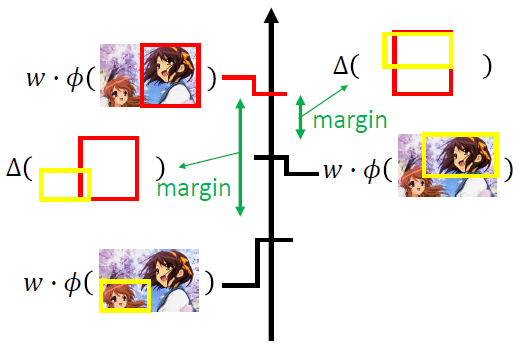

- 梯度下降

  每次迭代，选择一个训练数据
  $$
  \left\{x^{n}, \hat{y}^{n}\right\}
  $$
  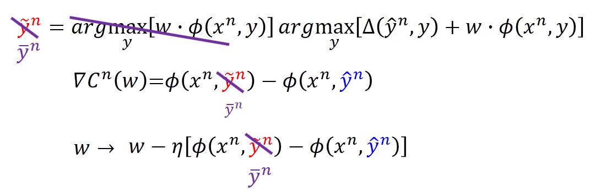

- 其他观点

  - 最小化新的代价函数，即最小化训练集上误差的上界：
    $$
    C^{\prime}=\sum_{n=1}^{N} \Delta\left(\hat{y}^{n}, \tilde{y}^{n}\right) \leq C=\sum_{n=1}^{N} C^{n}
    $$

  - 只需要证明：
    $$
    \Delta\left(\hat{y}^{n}, \tilde{y}^{n}\right) \leq C^{n}
    $$
    其中，
    $$
    \tilde{y}^{n}=\arg \max _{y} w \cdot \phi\left(x^{n}, y\right)
    $$
    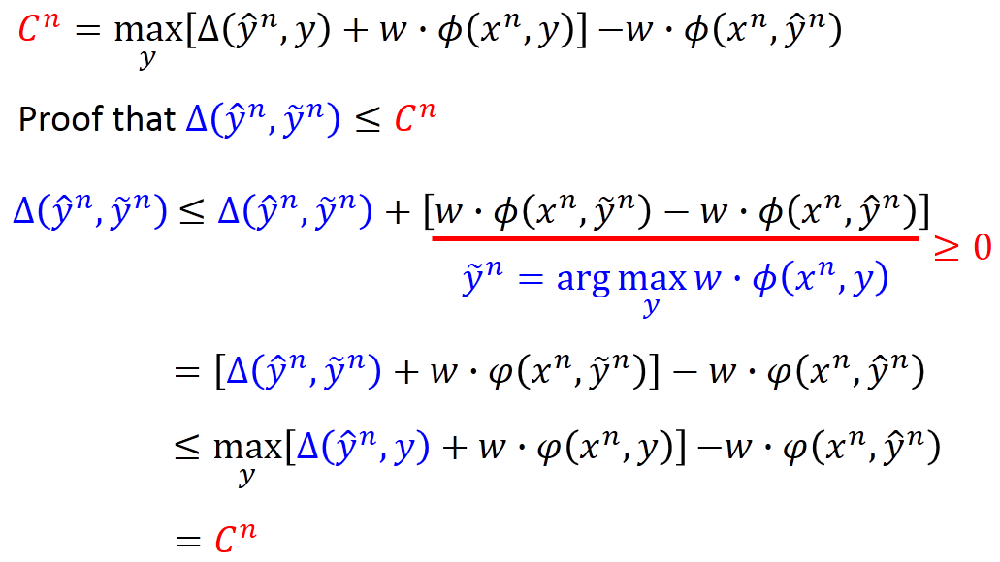

- 更多的代价 or 成本函数，证明：
  $$
  \Delta\left(\hat{y}^{n}, \tilde{y}^{n}\right) \leq C^{n}
  $$

  - **Margin Rescaling**(j间隔调整)
    $$
    C^{n}=\max _{y}\left[\Delta\left(\hat{y}^{n}, y\right)+w \cdot \phi\left(x^{n}, y\right)\right]-w \cdot \phi\left(x^{n}, \hat{y}^{n}\right)
    $$

  - **Slack Variable Rescaling**(松弛变量调整)
    $$
    C^{n}=\max _{y} \Delta\left(\hat{y}^{n}, y\right)\left[1+w \cdot \phi\left(x^{n}, y\right)-w \cdot \phi\left(x^{n}, \hat{y}^{n}\right)\right]
    $$

## 正则化(Regularization)

- 训练数据和测试数据可以有不同的分布；

- 如果w与0比较接近，那么我们就可以最小化误差匹配的影响；

- 即在原来的基础上，加上一个正则项$$\frac{1}{2}\|w\|^{2}$$，λ为权衡参数；
  $$
  C=\sum_{n=1}^{N} C^{n} \Rightarrow \quad C=\lambda \sum_{n=1}^{N} C^{n}+\frac{1}{2}\|w\|^{2}
  $$

- 每次迭代，选择一个训练数据
  $$
  \left\{x^{n}, \hat{y}^{n}\right\}
  $$

  $$
  \begin{array}{l}{\overline{y}^{n}=\arg \max _{y}\left[\Delta\left(\hat{y}^{n}, y\right)+w \cdot \phi\left(x^{n}, y\right)\right]} \\ {\nabla C^{n}=\phi\left(x^{n}, \overline{y}^{n}\right)-\phi\left(x^{n}, \hat{y}^{n}\right)+w} \\ {w \rightarrow w-\eta\left[\phi\left(x^{n}, \overline{y}^{n}\right)-\phi\left(x^{n}, \hat{y}^{n}\right)\right]-\eta w} \\ {\quad=(1-\eta) w-\eta\left[\phi\left(x^{n}, \overline{y}^{n}\right)-\phi\left(x^{n}, \hat{y}^{n}\right)\right]}\end{array}
  $$

  类似于**DNN**的**weight decay**(权重衰减)！

## 结构化SVM

- 求得w使得C最小化
  $$
  使得，C=\lambda \sum_{n=1}^{N} C^{n}+\frac{1}{2}\|w\|^{2}
  $$

  $$
  其中，C^{n}=\max _{y}\left[\Delta\left(\hat{y}^{n}, y\right)+w \cdot \phi\left(x^{n}, y\right)\right]-w \cdot \phi\left(x^{n}, \hat{y}^{n}\right)\\转换1：\\C^{n}+w \cdot \phi\left(x^{n}, \hat{y}^{n}\right)=\max _{y}\left[\Delta\left(\hat{y}^{n}, y\right)+w \cdot \phi\left(x^{n}, y\right)\right]......(1) \\转换2：\\
  对任意的y：\begin{array}{l}{C^{n}+w \cdot \phi\left(x^{n}, \hat{y}^{n}\right) \geq \Delta\left(\hat{y}^{n}, y\right)+w \cdot \phi\left(x^{n}, y\right)}......(2)\end{array}
  $$
  
  $$
  对(2)式进行变换：{w \cdot \phi\left(x^{n}, \hat{y}^{n}\right)-w \cdot \phi\left(x^{n}, y\right) \geq \Delta\left(\hat{y}^{n}, y\right)-C^{n}}
  $$
  
  **注意：(1)式与(2)式并不完全等价哟，前提条件是最小化C时，(1)(2)等价！**
$$
求得\mathrm{w}, \varepsilon^{1}, \cdots, \varepsilon^{N}，使得C=\frac{1}{2}\|w\|^{2}+\lambda \sum_{n=1}^{N} C^{n}
$$
$$
同时满足，对任意的n和任意的y：w \cdot \phi\left(x^{n}, \hat{y}^{n}\right)-w \cdot \phi\left(x^{n}, y\right) \geq \Delta\left(\hat{y}^{n}, y\right)-C^{n}\\一般我们将C^n用ε^n代替之，表示松弛变量
$$

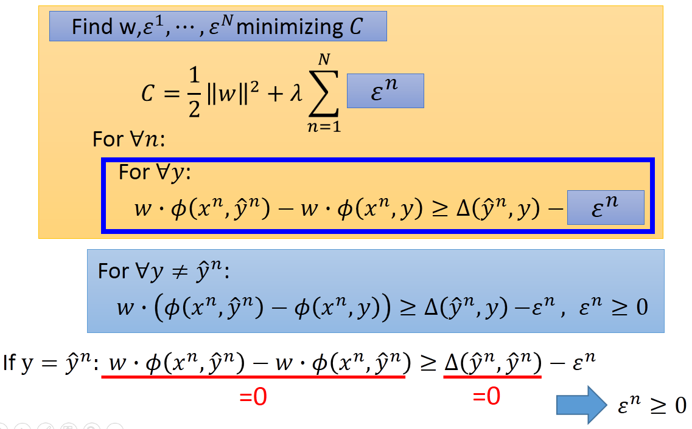
$$
当y=\hat{y}^{n}时， \varepsilon^{n} \geq 0\\所以有：\\
对\forall y \neq \hat{y}^{n}：\\
w \cdot\left(\phi\left(x^{n}, \hat{y}^{n}\right)-\phi\left(x^{n}, y\right)\right) \geq \Delta\left(\hat{y}^{n}, y\right)-\varepsilon^{n}, \varepsilon^{n} \geq 0
$$
**直觉解释：**

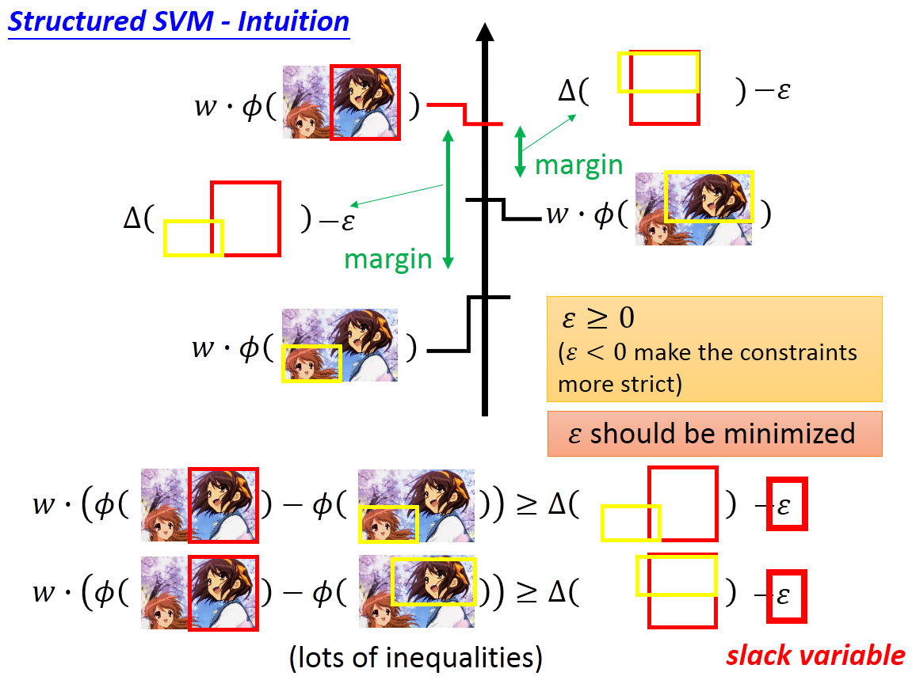

**存在的问题：**我们可能找不到一个w满足以上所有的不等式都成立！

将margine(可以理解为正确的标框与错误的标框之间的一个差值，该差值越小，则margine越小，用$$\Delta$$表示)减去一个ε(即为了放宽约束 or 限制，使得margine变小，但限制不应过宽，否则会失去意义，ε越小越好，且要大于等于0)

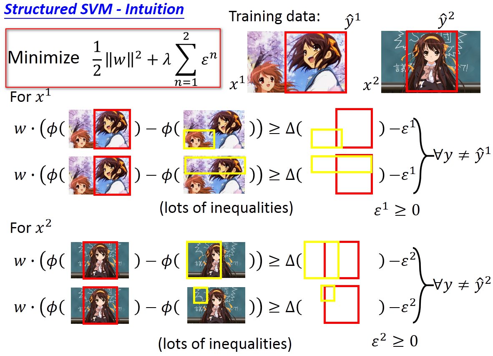

假设，我们现在有两个训练数据：
$$
\left(x^{1}, \hat{y}^{1}\right) 和 \left(x^{2}, \hat{y}^{2}\right)
$$
对于$$x^{1}$$而言，我们希望正确的减去错误的，要求大于它们之间的$$\Delta$$减去$$\varepsilon^{1}$$，同时满足：
$$
\forall y \neq \hat{y}^{1} 且 \varepsilon^{1} \geq 0
$$
同理，对于$$x^{2}$$而言，一样采用以上方式，我们希望正确的减去错误的，要求大于它们之间的$$\Delta$$减去$$\varepsilon^{2}$$，同时满足：
$$
\forall y \neq \hat{y}^{2} 且 \varepsilon^{2} \geq 0
$$
在满足以上这些不等式的前提之下，我们希望
$$
\lambda \sum_{n=1}^{2} \varepsilon^{n}{是最小的}，
$$
同时加上对应的正则项也满足最小化！

换言之：
$$
我们的目标是，求得w, \varepsilon^{1}, \cdots, \varepsilon^{N}，最小化C\\
其中，C=\frac{1}{2}\|w\|^{2}+\lambda \sum_{n=1}^{N}\left[\varepsilon^{n}\right.
$$
在最小化目标函数同时，要求我们满足以下的限制：

对所有的训练样本，以及所有不是正确答案的标记，我们希望，正确答案的分数减去其它标记的分数大于等于正确标记与其它标记之间的差距再减去一个$$\varepsilon^{n}$$，同时满足其大于等于0，即
$$
对于\forall n :\\
  \forall y \neq \hat{y}^{n}\\
  w \cdot\left(\phi\left(x^{n}, \hat{y}^{n}\right)-\phi\left(x^{n}, y\right)\right) \geq \Delta\left(\hat{y}^{n}, y\right)-\varepsilon^{n}, \varepsilon^{n} \geq 0
$$
- 可以利用**SVM包**中的solver来解决以上的问题；

- 是一个二次规划(Quadratic Programming **QP**)的问题；

- 约束条件过多，需要通过切割平面算法(**Cutting Plane Algorithm**)解决受限的问题。

## 结构化SVM：切割平面算法(Cutting Plane Algorithm)

- 无约束条件的问题求解

  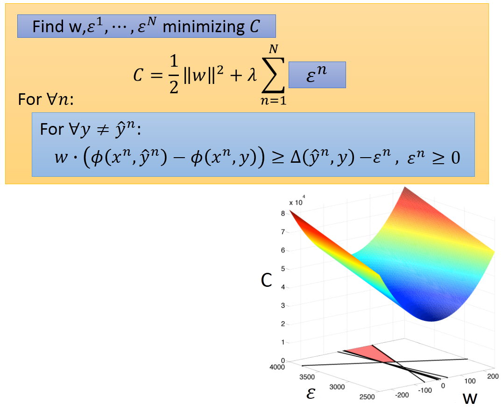

  假设我们先不考虑限制的部分，只考虑最小化部分，同时假设w只有一维，即w和ε为0时，对应的值最小

- 有约束条件的问题求解

  - 在w和$$ε^i$$组成的参数空间中，颜色表示C的值，在没有限制的情况下，青色的点对应的是最小值，在有限制的情况下，只有内嵌的多边形区域内是符合约束条件的，因此需要在该区域内(How如何确定多边形的形状？)寻找最小值，即
    $$
    C=\frac{1}{2}\|w\|^{2}+\lambda \sum_{n=1}^{N} \varepsilon^{n}
    $$
  
  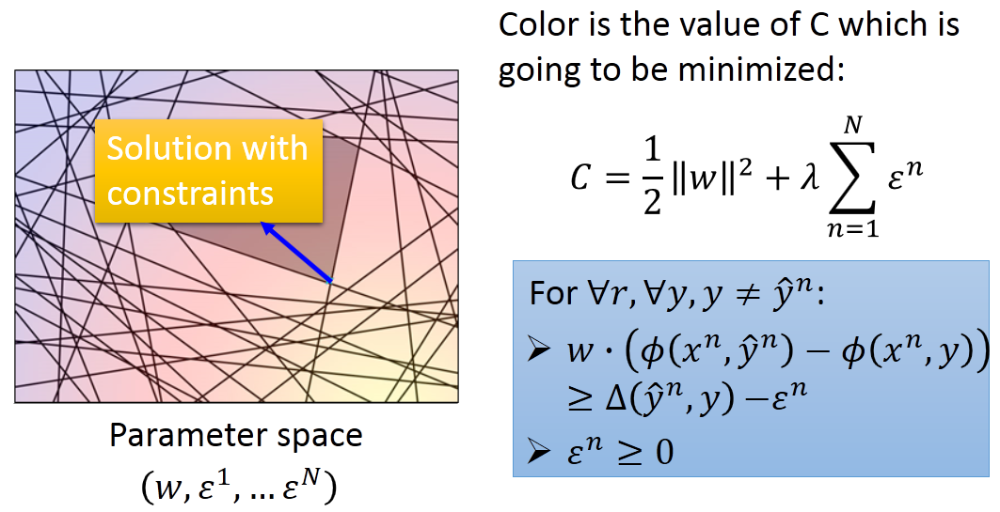

  - 虽然有很多约束条件，但它们中的大多数的约束都是**冗元**，并不影响问题的解决；

  - 红线表示确定问题的求解；

  - 绿线(冗元)表示移除此约束不会影响问题的求解，删除冗元线条，原本是穷举$$y \neq \hat{y}^{n}$$，而现在我们需要移除那些不起作用的线条，保留有用的线条，这些有影响的线条集可以理解为Working Set，用$$\mathbb{A}^{n}$$表示(利用迭代法寻找Working Set)。

    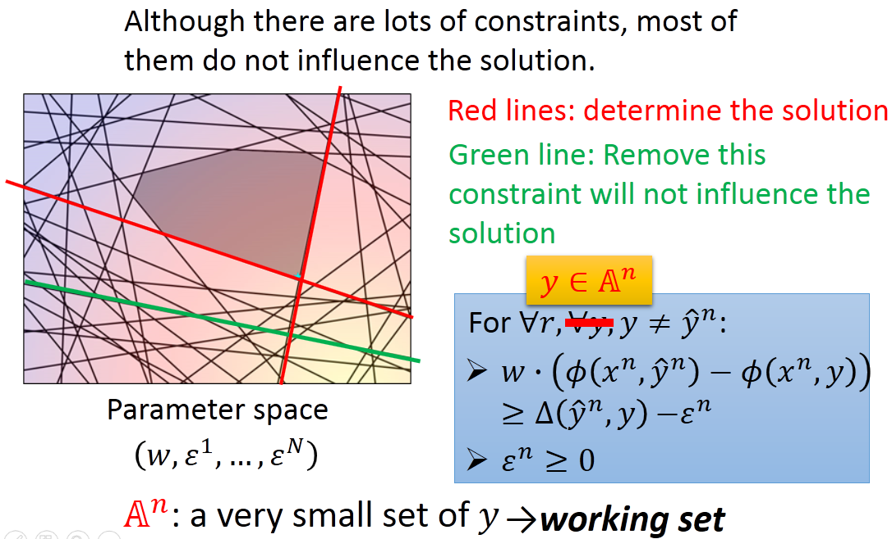

  - 在有效集中(**Working Set**)进行迭代性地选择元素

    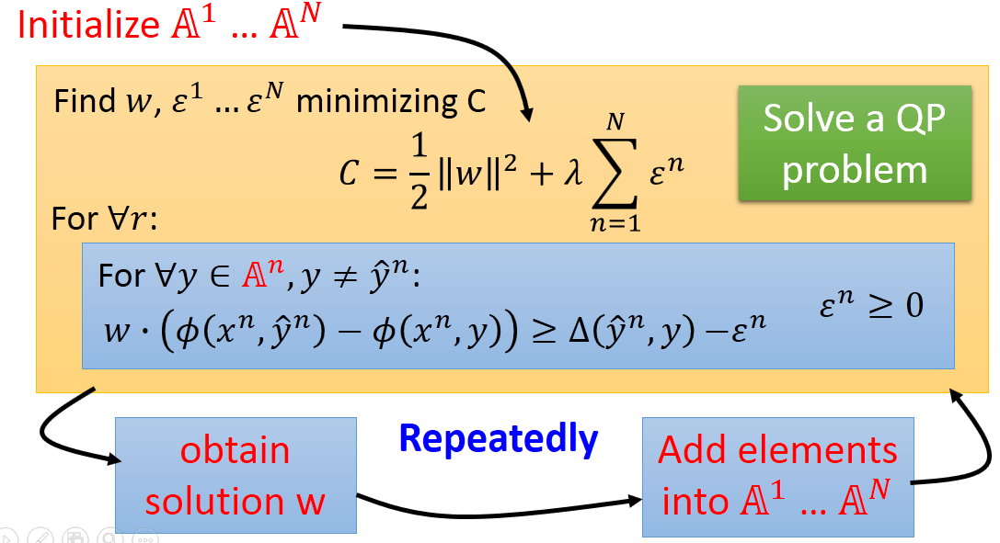

  - 向有效集中添加元素的策略

    原本解决QP问题，需要考虑所有可能的标记y，但如果给定一组Working Set，我们仅需考虑作用集里的标记y即可；然后再解决QP问题就相对简单多了。假设，我们根据Working Set求出对应的w，再用w重新检查，以便找寻新的成员加入到Working Set之中，因此Working Set会发生改变；然后根据新的Working Set来解决QP问题，这样的话，又会得到新的w，新的w可以继续检查，新的成员又可以加入到Working Set中，就这样不断地迭代下去，直到w不再变化为止！

    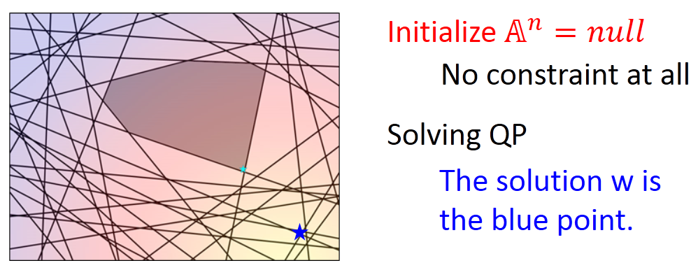

- 假设$$\mathbb{A}^{n}$$初始值为空集合null，即没有任何约束限制，求解QP的结果就是对应的蓝点，但是不能满足条件的线条有很多很多，我们现在只找出没有满足的最“严重的”那一个(Which具体是指哪一个？)即可。那么我们就把
  $$
  \mathbb{A}^{n}=\mathbb{A}^{n} \cup\left\{y^{\prime}\right\}
  $$
  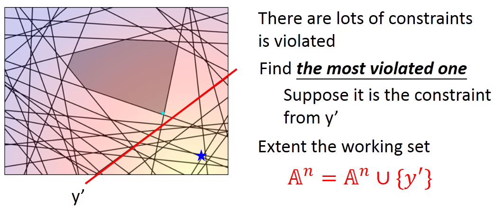

- 根据新获得的Working Set中唯一的成员y'，找寻新的最小值，从而解决QP问题，进而得到新的w，尽管得到新的w和最小值，但依旧存在不满足条件的约束，需要继续把最难搞定的限制添加到有效集中，再求解一次QP问题。从而得到新的解，进而得到新的w，直到所有难搞的线条均添加到Working Set之中，最终Working Set中有三个线条，根据这些线条确定求解区间内的point，最终得到问题的解。

- Which: 什么样的**constraint**是最**violated**的？只有满足这个条件才能被加入到Working Set之中！

  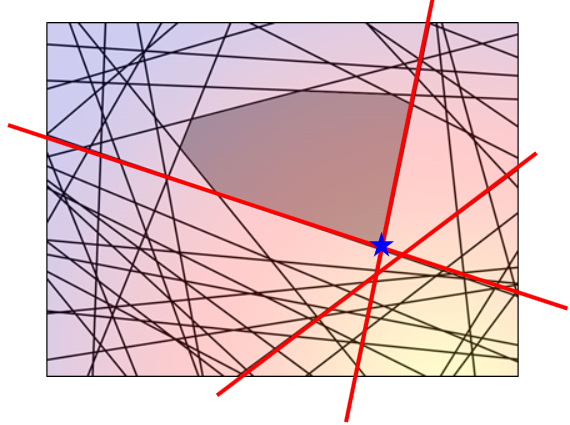

  **常规约束条件：**
  $$
  w \cdot(\phi(x, \hat{y})-\phi(x, y)) \geq \Delta(\hat{y}, y)-\varepsilon
  $$
  而**violated constraint**刚好相反：
  $$
  w^{\prime} \cdot(\phi(x, \hat{y})-\phi(x, y))<\Delta(\hat{y}, y)-\varepsilon^{\prime}在多数的violated constraints中，我们选定一个标准来衡量violation的程度(偏差越多，violated的越严重)，且ε′与w^{\prime} \cdot \phi(x, \hat{y})不影响violation的程度：
  $$
  在多数的violated constraints中，我们选定一个标准来衡量violation的程度(偏差越多，violated的越严重)，且ε′与$$w^{\prime} \cdot \phi(x, \hat{y})$$不影响violation的程度：
  $$
  \Delta(\hat{y}, y)-\varepsilon^{\prime}-w^{\prime} \cdot(\phi(x, \hat{y})-\phi(x, y))\\转换为：\\\Delta(\hat{y}, y)+w^{\prime} \cdot \phi(x, y)
  $$
  由此可知violated最为严重的为：
  $$
  \arg \max _{y}[\Delta(\hat{y}, y)+w \cdot \phi(x, y)]
  $$
  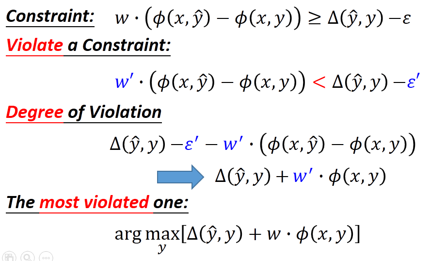

    - 具体步骤

      - 给定训练数据集
      
      $$
            \left\{\left(x^{1}, \hat{y}^{1}\right),\left(x^{2}, \hat{y}^{2}\right), \cdots,\left(x^{N}, \hat{y}^{N}\right)\right\}
      $$
      
      ​      Working Set初始设定为
      $$
            \mathbb{A}^{1} \leftarrow \text { null, } \mathbb{A}^{2} \leftarrow \text { null, } \cdots, \mathbb{A}^{N} \leftarrow null
      $$
      
       - 重复以下过程
         
            - 在初始的Working Set中求解一个QP问题的解，只需求解出w即可
            
            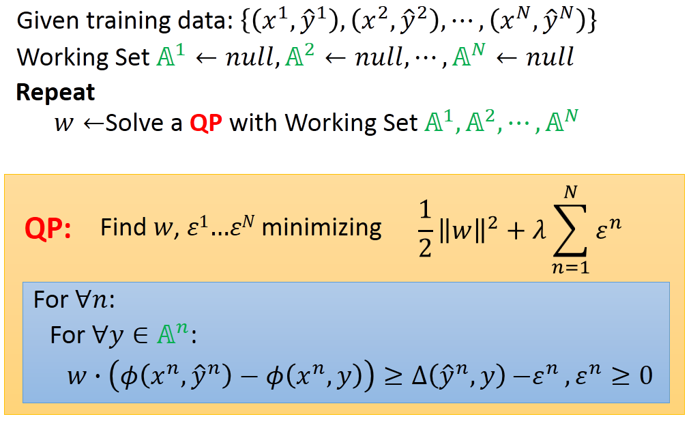
            
            针对求解出的w，要求对每一个训练数据$$\left(x^{n}, \hat{y}^{n}\right)$$，寻找最violated的限制：
            $$
                \overline{y}^{n}=\arg \max _{y}\left[\Delta\left(\hat{y}^{n}, y\right)+w \cdot \phi\left(x^{n}, y\right)\right]
            $$
            同时更新Working Set：
            $$
                \mathbb{A}^{n} \leftarrow \mathbb{A}^{n} \cup\left\{\overline{y}^{n}\right\}
            $$
            直到Working Set中的元素不再发生变化，迭代终止，即得到要求解的y！
            
            ​    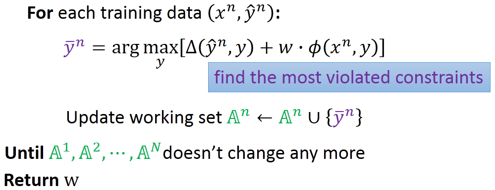
            
            - 示例解释
            
              假设，我们现在有两个训练数据：
              $$
              \left(x^{1}, \hat{y}^{1}\right) 和 \left(x^{2}, \hat{y}^{2}\right)
              $$
              对应的Working Set
              $$
              \begin{array}{l}{A^{1}=\{ \}} \\ {A^{2}=\{ \}}\end{array}\\同时还要保证\varepsilon^{1}>0, \varepsilon^{2}>0
              $$
              
            - 无约束的问题解决，求解的w为0
            
              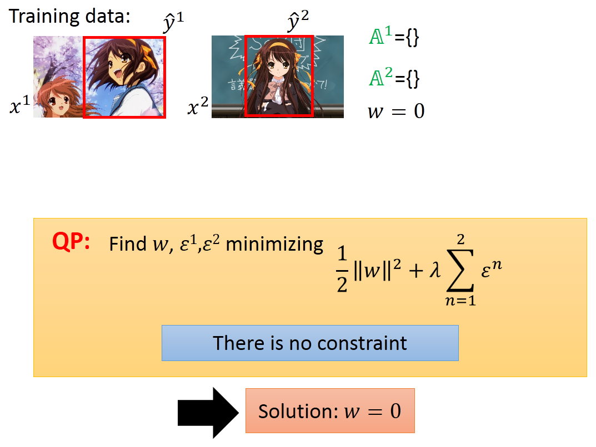
            
            - 有约束的问题解决
            
              ​    此时：
              $$
                  \begin{array}{l}{A^{1}=\{ \}} \\ {A^{2}=\{ \}}\end{array}\\
                w=0
              $$
            
              $$
              \overline{y}^{1}=\arg \max _{y}\left[\Delta\left(\hat{y}^{1}, y\right)+0 \cdot \phi\left(x^{1}, y\right)\right]计算每一个可能标框的\Delta\left(\hat{y}^{i}, y\right)+w \cdot \phi\left(x^{1}, y\right)的值，将A^{1}加入到Working Set集中
              $$
            
              ​    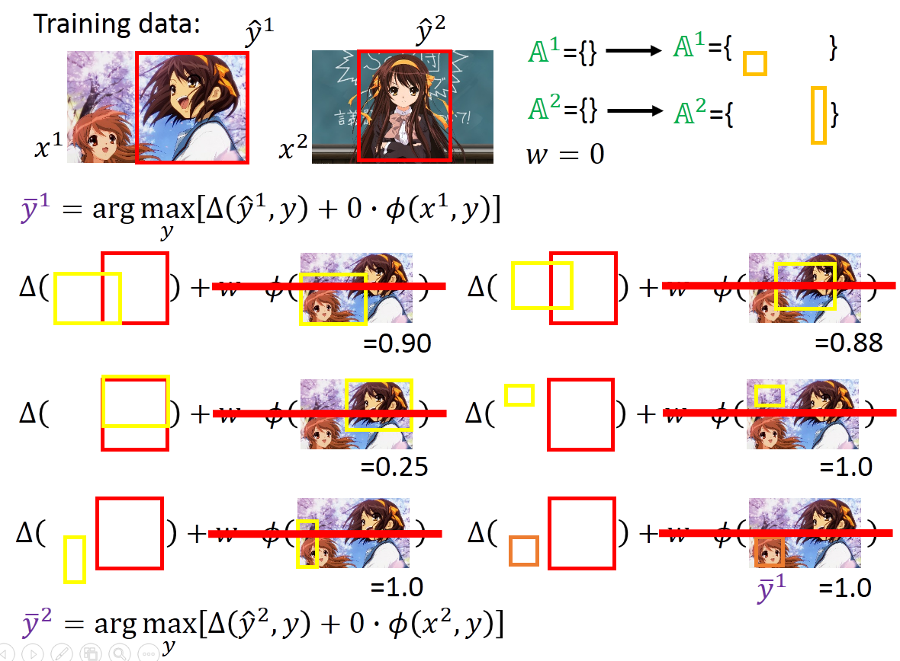
            
              用同样的方式，求解出最严重的的constraint$$A^{2}$$加入到Working Set集中
            
              此时，我们对$$A^{1}$$和$$A^{2}$$各有一个constraint，利用求解QP的方法求解此类问题，解得：
              $$
                  w=w^{1}
              $$
              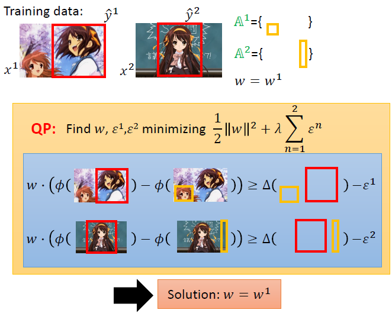
            
              然后需要更新w为$$w^{1}$$，用$$w^{1}$$继续找最严重的constraint，操作完成之后，Working Set将会继续更新，即$$A^{1}$$和$$A^{2}$$各自都会多一个成员。
            
              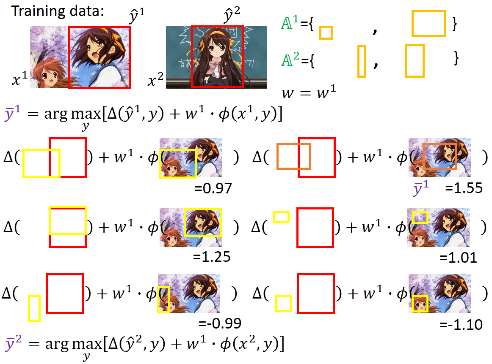
            
              此时$$A^{1}$$和$$A^{2}$$各有两个元素，求解时一共有4个constraints，问题转换为求解具有4个constraints的QP问题。
            
              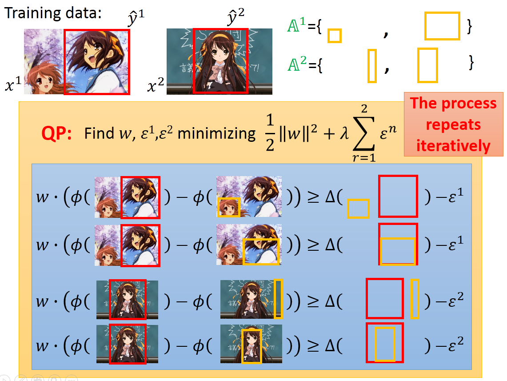

## 多类别 & 二元SVM(Multi-class & Binary SVM)

**Multi-class SVM**
$$
F(x, y)=w \cdot \phi(x, y)
$$

- Q1：评估

  - 如果存在K类，则我们将有K个权值向量
    $$
    \left\{w^{1}, w^{2}, \cdots, w^{K}\right\}
    $$
  
$$
y \in\{1,2, \cdots, k, \cdots, K\}
$$

$$
      F(x, y)=w^{y} \cdot \vec{x}
$$

  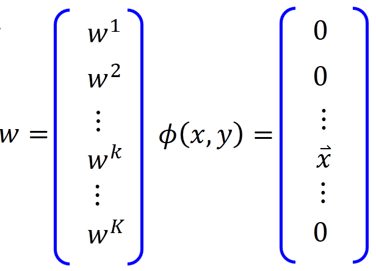

- Q2：推理
    $$
    \begin{array}{l}{F(x, y)=w^{y} \cdot \vec{x}} \\ {\hat{y}=\arg \max _{y \in\{1,2, \cdots, k, \cdots, K\}} F(x, y)} \\ {\quad=\arg \max _{y \in\{1,2, \cdots, k, \cdots, K\}} w^{y} \cdot \vec{x}}\end{array}
    $$
    穷举所有的y，使得F(x, y)最大化，这里类的数量通常很少，所以我们可以穷举它们！
  
- Q3：训练
  
  - 求得$$w, \varepsilon^{1}, \cdots, \varepsilon^{N}$$，最小化C
  
  $$
  C=\frac{1}{2}\|w\|^{2}+\lambda \sum_{n=1}^{N}\left[\varepsilon^{n}\right.
  $$
  
  - 对任意的n：
  
    - 对于任意的$$\forall y \neq \hat{y}^{n}:$$：(**这里有N(K-1)个约束**)
        $$
        w \cdot\left(\phi\left(x^{n}, \hat{y}^{n}\right)-\phi\left(x^{n}, y\right)\right) \geq \Delta\left(\hat{y}^{n}, y\right)-\varepsilon^{n}, \varepsilon^{n} \geq 0......(3)
        $$
  
      $$
        \begin{array}{l}{w \cdot \phi\left(x^{n}, \hat{y}^{n}\right)=w^{\hat{y}} \cdot \vec{x}} \\ {w \cdot \phi\left(x^{n}, y\right)=w^{y} \cdot \vec{x}}\end{array}
      $$
  
      $$
      (3)式转换为：\\\left(w^{\hat{y}^{n}}-w^{y}\right) \cdot \vec{x} \quad \geq \Delta\left(\hat{y}^{n}, y\right)-\varepsilon^{n}, \varepsilon^{n} \geq 0......(4)
      $$
  
      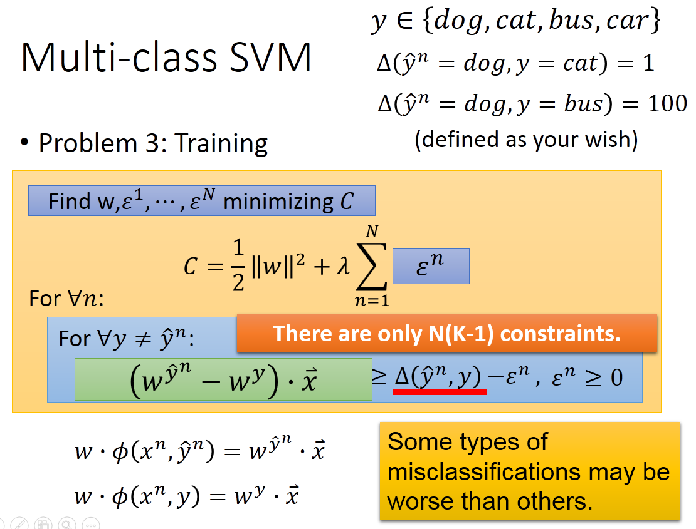
  
  **Binary SVM**(设定K为2，y∈{1,2})
  $$
  {对}\forall y \neq \hat{y}^{n}:
  $$
  
  $$
  \left(w^{\hat{y}^{n}}-w^{y}\right) \cdot \vec{x} \quad \geq \Delta\left(\hat{y}^{n}, y\right)-\varepsilon^{n}, \varepsilon^{n} \geq 0
  $$
  
  - 如果y为1：
    $$
    \left(w^{1}-w^{2}\right) \cdot \vec{x} \geq 1-\varepsilon^{n}
    $$
  
    $$
    令w1-w2为w，可以转换为：\\w \cdot \vec{x} \geq 1-\varepsilon^{n}
    $$
  
  - 如果y为2：
    $$
    \left(w^{2}-w^{1}\right) \cdot \vec{x} \geq 1-\varepsilon^{n}
    $$
  
    $$
    同理转换为：\\-w \cdot \vec{x} \geq 1-\varepsilon^{n}
    $$
  
    用**结构化SVM**概念联想**二元SVM分类**问题！
  
    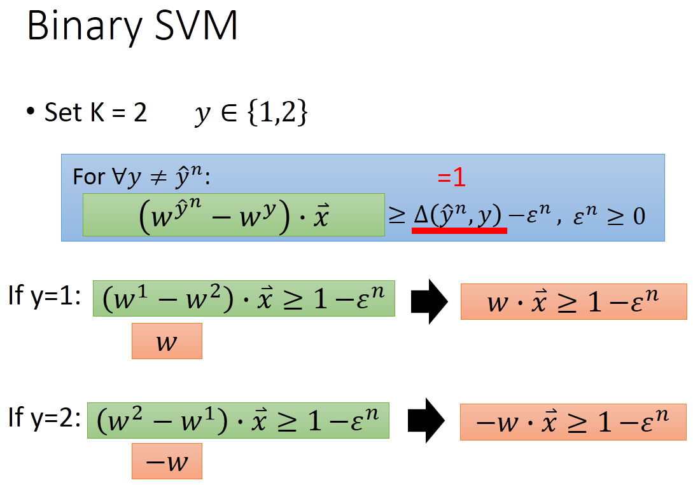
  

## 下一步SVM(开放问题)

- **DNN(深度神经网络)**

  结构化SVM是线性结构的，如果想要结构化SVM的扩展性更好，我们需要定义一个较好的特征，但是人为设定的特征往往十分困难，一个较好的方法是利用DNN生成特征，先用一个DNN，最后训练的结果往往十分有效！

  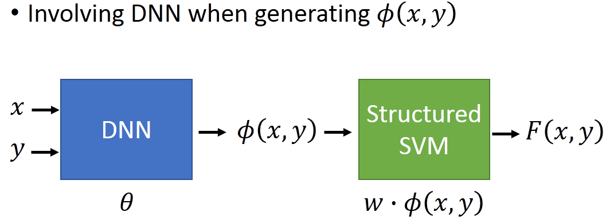

- **同时训练结构化SVM和DNN**

  与DNN不同的是，其将**DNN**与**结构化SVM**一起训练，同时**更新**DNN与结构化SVM中的**参数**！

  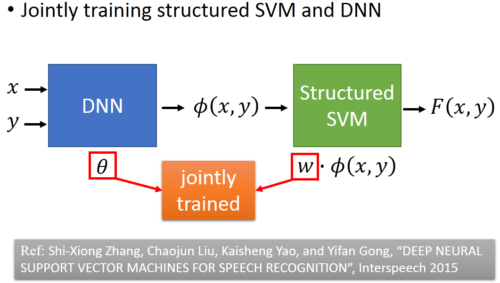

- **用DNN代替结构化SVM**

  再用一个DNN代替结构化SVM，即将x和y作为输入，F(x, y)(为一个标量)作为输出！
  
  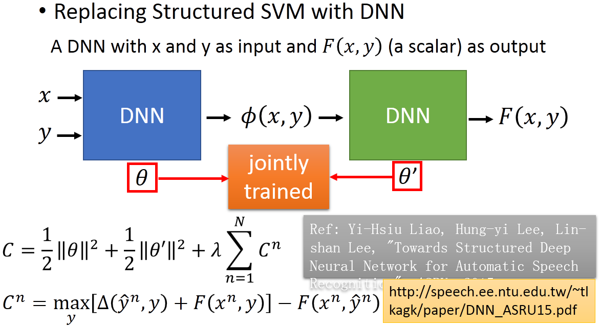
