# 序列标记(Sequence Labeling)

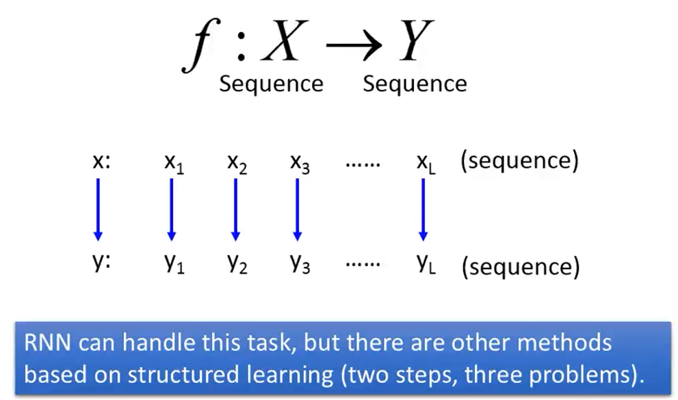

$$
f : X \rightarrow Y
$$

上一章节我们讲到**结构化学习**的一种方法—**结构化SVM**，本章学习另一种结构化学习的方法—**序列标记**。

序列标记的问题可以理解为：机器学习所要寻找的目标函数的输入是一个序列，输出也为一个序列，并且假设输入输出的序列长度相同，即输入可以写成序列向量的形式，输出也为序列向量。该任务可以利用**RNN**来解决，但本章节我们可以基于**结构化学习**的其它方法进行解决(**两步骤，三问题**)。

**应用(Application)**

- 命名实体识别

**示例任务(Example Task)**

- 词性标记(POS tagging)

  - 标记一个句子中每一个词的词性(名词、动词等等)；

  - 输入一个句子(比如，John saw the saw)，系统将会标记John为专有名词，saw为动词，the为限定词，saw为名词；

  - 其在自然语言处理(NLP)中，是非常典型且重要的任务，也是许多文字理解的基石，用于后续句法分析和词义消歧。

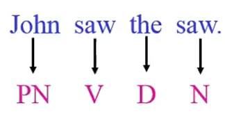

  - 如果不考虑序列，问题就无法解决(POS tagging仅仅依靠查表的方式是不够的，比如Hash Table，你需要知道一整个序列的信息，才能有可能把每个词汇的词性找出)
  
    - 第一个"saw"更有可能是动词V，而不是名词N；
    - 然而，第二个"saw"是名词N，因为名词N更可能跟在限定词后面。

## HMM(隐马尔科夫模型)

- 我们如何生成一个句子呢?

  

  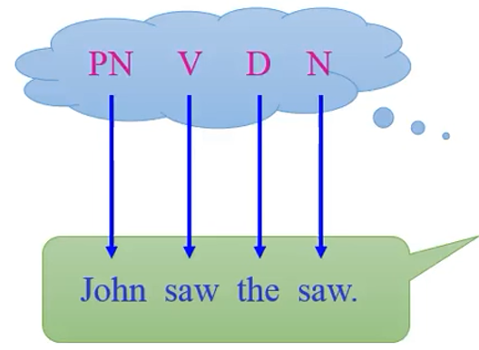

  

  - 步骤1：

    - 生成POS序列

    - 基于语法(根据脑中内建的的语法)
      
      
      

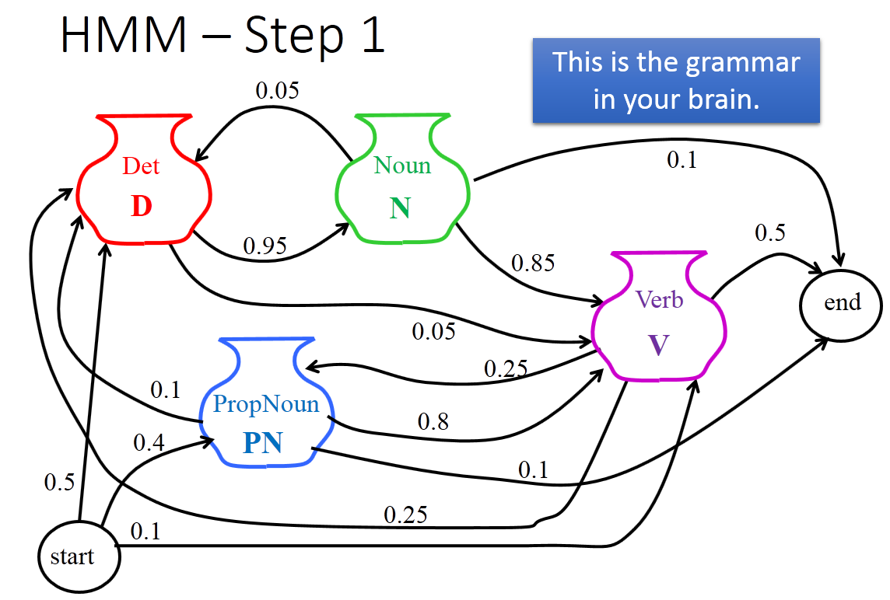

假设你大脑中一个马尔科夫链，开始说一句话时，放在句首的词性有50%的可能性为冠词，40%的可能性为专有名词，10%的可能性为动词，然后进行随机采样，再从专有名词开始，有80%的可能性后面为动词，动词后面有25%的可能性为冠词，冠词后面有95%的可能性为名词，名词后面有10%的可能性句子就结束了。用概率的形式表示即为：P( “PN  V  D  N”) = 0.4x0.8x0.25x0.95x0.1。

- 步骤2：
  
  - 根据词序生成一个句子
  
  - 基于词典

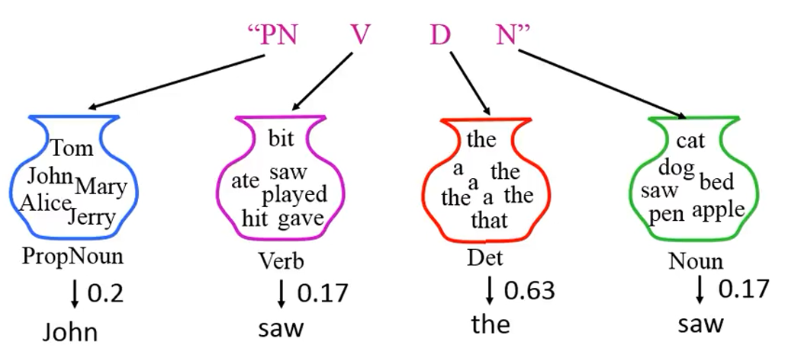
      

根据词性找到词典中中对应的词汇，从不同的词性集合中采样出不同词汇所出现的几率，即P("John saw the saw"|"PN V D N") = 0.2x0.17x0.63x0.17。 HMM可以描述为利用POS标记序列得到对应句子的几率，

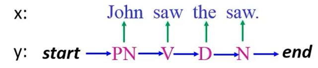

即

$$
P(x, y)=P(y) P(x | y)
$$

其中，P(y) = P(PN|start) x P(V|PN) x P(D|V) x P(N|D)，P(x|y) = P(John|PN) x P(saw|V) x P(the|D) x P(saw|N)

- HMM的一般性解释
  $$
    \begin{array}{l}{\mathrm{x} : \text { John saw the saw. }} \\ {\mathrm{Y} : \mathrm{PN} \quad \mathrm{V} \quad \mathrm{D} \quad \mathrm{N}}\end{array}
  $$
  对应于：
$$
    \begin{array}{l}{x=x_{1}, x_{2} \cdots x_{L}} \\ {y=y_{1}, y_{2} \cdots y_{L}}\end{array}
$$
  其中，
$$
  P(x, y)=P(y) P(x | y)
$$

  - Step1(转移概率)
$$
    P(y)=P\left(y_{1} | s t a r t\right)\times \prod_{l=1}^{L-1} P\left(y_{l+1} | y_{l}\right) \times P\left(e n d | y_{L}\right)
$$

  - Step2(发散概率)
  
    $$
    P(x | y)=\prod_{l=1}^{L} P\left(x_{l} | y_{l}\right)
    $$
  
- 概率估计(How：如何计算几率)

  - 我们如何知道P(V|PN), P(saw|V)......？

  - 从训练数据中得到
    
    
    
    
    

    
    $P(x, y)=P\left(y_{1} | \text {start}\right) \prod_{l=1}^{L-1} P\left(y_{l+1} | y_{l}\right) P\left(e n d | y_{L}\right) \prod_{l=1}^{L} P\left(x_{l} | y_{l}\right)$
    
    其中，
    
    $\frac{P\left(y_{l+1}=s^{\prime} | y_{l}=s\right)}{\left(s \text { and } s^{\prime} \text { are tags }\right)}=\frac{\operatorname{count}\left(s \rightarrow s^{\prime}\right)}{\operatorname{count}(s)}$
    
    计算$y_{l}=s$，下一个标记为s'的几率，就等价于现在训练集里面s出现的次数除去s后面跟s'的次数；
    
    $\frac{P\left(x_{l}=t | y_{l}=s\right)}{(s \text { is tag, and } t \text { is word })}=\frac{\operatorname{count}(s \rightarrow t)}{\operatorname{count}(s)}$
    
    计算某一个标记为s所产生的词为t的几率，就等价于s在整个词汇中出现的次数除去某个词标记为t的次数。

**如何进行词性标记**

- 任务计算P(x, y)

  
  
  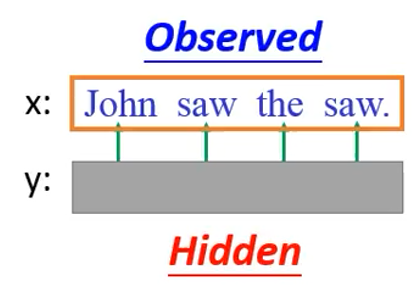
  
  
  
  - 给定x(Observed)，发现y(Hidden)，即如何计算P(x, y)的问题
    $$
    \begin{aligned} y &=\arg \max _{y \in Y} P(y | x)......(1) \\ &=\arg \max _{y \in Y} \frac{P(x, y)}{P(x)} ......(2)\\ &=\arg \max _{y \in \mathbb{Y}} P(x, y) ......(3)\end{aligned}
    $$
    
    (1)式到(2)式是由条件概率得到，(2)式到(3)式的转换是由于P(x)是我们已知的几率，即只要**穷举**所有的P(x, y)，找出使得其几率最大的y即可。

**Viterabi 算法**
$$
\tilde{y}=\arg \max _{y \in \mathbb{Y}} P(x, y)
$$

- 穷举所有可能的y
  
  - 假设有|S|个标记，序列y的长度为L；
  - 有可能的y即$|s|^{L}$(空间极为庞大)。
  
- 利用Viterabi算法解决此类问题
  
  - 复杂度为：
  
  $$
  O\left(L|S|^{2}\right)
  $$

**Summary—概要**

- Q1：评估
  $$
  F(x, y)=P(x, y)=P(y) P(x | y)
  $$
该评估函数可以理解为x与y的联合概率。
  
- Q2：推理
  $$
  \tilde{y}=\arg \max _{y \in \mathbb{Y}} P(x, y)
  $$
给定一个x，求出最大的y，使得我们定义函数的值达到最大(即Viterabi算法)。
  
- Q3：训练
  
  从训练数据集中得到P(y)与P(x | y)
  
  该过程就是计算几率的问题 or 统计语料库中词频的问题。

**缺点**
可以通过提高模型的复杂度弥补该缺点，但要尽量避免过拟合!

- 在推理过程
  $$
  \tilde{y}=\arg \max _{y \in \mathbb{Y}} P(x, y)
  $$
把求解最大的y作为我们的输出值。
  
- 为了得到正确的结果，我们需要怎么做？
  $$
  (x, \hat{y}) : P(x, \hat{y})>P(x, y)
  $$
  但是HMM可能无法处理该类问题。

**举例说明**

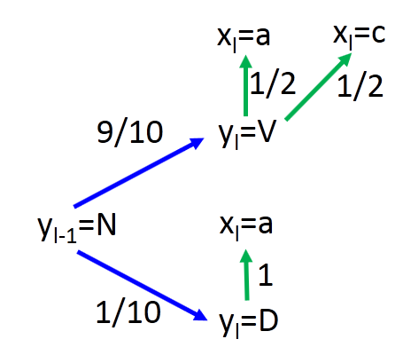

- 转移概率

  P(V|N)=9/10    P(D|N)=1/10 ......

- 发散概率

  P(a|V)=1/2    P(a|D)=1 ......

  

  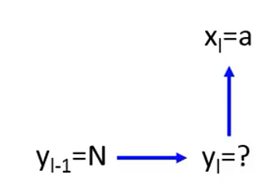

  

  假设我们知道在l-1时刻词性标记为N，即$\mathrm{y}_{\mathrm{l}-1}=\mathrm{N}$，在l时刻我们看到的单词为a，现在需要求出$y_{l}=?$

  

  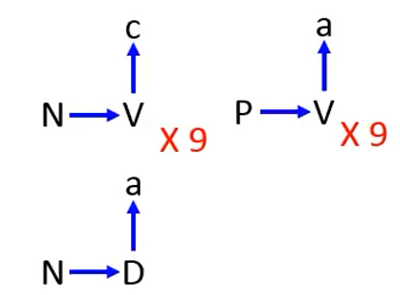

  

  N后面跟V的几率是0.9，跟D的几率是0.1，V可以产生c，也可以产生a，产生a的几率是0.5，产生c的几率是0.5，D后面产生a的几率是1，根据训练数据可以得到V的几率，但是测试数据里面存有和训练数据一样的数据，两者将会产生冲突！因此并不是V而是D！

  

  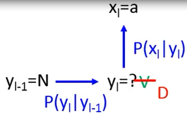
  
  
  
  - 通常情况下，HMM是判断**未知数据**出现的**最大可能性**，即(x,y)在训练数据中从未出现过，但可能有较大的概率P(x,y)；
  
  - 当训练数据很少的时候，使用HMM，其性能表现是可行的，但当训练集很大时，性能表现较差；
  
  - HMM会产生**未卜先知**的情况，因为转移概率和发散概率，在训练时是分开建模的，两者是相互独立的，我们也可以用一个更复杂的模型来模拟两个序列之间的可能性，但要避免过拟合！
  

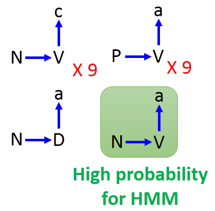

而CRF的模型和HMM是一样的，同时可以克服HMM的缺点！

## CRF(条件随机场)

$$
\mathrm{P}(x, y) \propto \exp (w \cdot \phi(x, y))
$$

CRF模型描述的也是P(x, y)的问题，但与HMM表示形式很不一样(本质上是在训练阶段不同)，其几率正比于exp(w∙ϕ(x,y))。

- ϕ(x,y)为一个特征向量；
- w是一个权重向量，可以从训练数据中学习得到；
- exp(w∙ϕ(x,y))总是正的，可能大于1。

$$
\mathrm{P}(x, y)=\frac{\exp (w \cdot \phi(x, y))}{R}......(4)
$$

$$
P(y | x)=\frac{P(x, y)}{\sum_{y^{\prime}} P\left(x, y^{\prime}\right)}......(5)
$$

$$
=\frac{\exp (w \cdot \phi(x, y))}{\sum_{y^{\prime} \in \mathbb{Y}} \exp \left(w \cdot \phi\left(x, y^{\prime}\right)\right)}=\frac{\exp (w \cdot \phi(x, y))}{Z(x)}......(6)
$$

$$
其中\sum_{y^{\prime} \in \mathbb{Y}} \exp \left(w \cdot \phi\left(x, y^{\prime}\right)\right)仅与x有关，与y无关！
$$

**P(x, y)**

- HMM
  $$
  P(x, y)=P\left(y_{1} | s t a r t\right) \prod_{l=1}^{L-1} P\left(y_{l+1} | y_{l}\right) P\left(e n d | y_{L}\right) \prod_{l=1}^{L} P\left(x_{l} | y_{l}\right)
  $$
  取对数log形式logP(x, y)，由原来的的相乘的形式变为相加的形式
  $$
  \begin{array}{l}{\log P(x, y)} \\ {=\log P\left(y_{1} | \operatorname{star} t\right)+\sum_{l=1}^{L-1} \log P\left(y_{l+1} | y_{l}\right)+\log P\left(\text {end} | y_{L}\right)} \\ {\quad+\sum_{l=1}^{L} \log P\left(x_{l} | y_{l}\right)}\end{array}
  $$
  其中，
  $$
  \sum_{l=1}^{L} \log P\left(x_{l} | y_{l}\right)=\sum_{s, t} \log P(t | s) \times N_{s, t}(x, y)
  $$

  - $\sum_{l=1}^{L}$穷举所有可能的标记s和所有可能的单词t；

  - $\log P\left(x_{l} | y_{l}\right)$表示给定标记s的单词取对数的形式；

  - $N_{s, t}(x, y)$表示为单词t被标记成s的事情，在(x, y)对中总共出现的次数。

**举例说明**

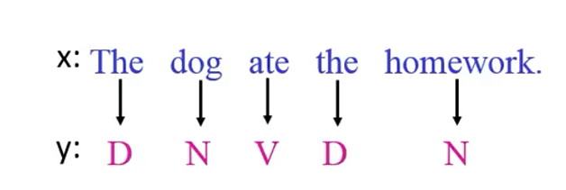

每个单词都已经标记成对应的词性，我们来分别计算 D，N，V 在(x, y)对中出现的次数(不考虑大小写)
$$
\begin{aligned} N_{D, t h e}(x, y) &=2 \\ N_{N, d o g}(x, y) &=1 \\ N_{V, a t e}(x, y) &=1 \end{aligned}
$$

$$
\begin{array}{l}{N_{N, \text {homework}}(x, y)=1} \\ {\quad N_{s, t}(x, y)=0} \\ {\text { (for any other s and t) }}\end{array}
$$

然后计算所有的几率相乘的结果
$$
\sum_{l=1}^{L} \log P\left(x_{l} | y_{l}\right)
$$

$$
\begin{array}{l}{=\log P(\text {the} | D)+\log P(\operatorname{dog} | N)+\log P(\text {ate} | V)} \\ {+\log P(\text {the} | D)+\log P(\text {homework} | N)}\end{array}
$$

$$
\begin{array}{l}{=\log P(\text { the } | D) \times 2+\log P(\operatorname{dog} | N) \times 1+\log P(a t e | V) \times 1} \\ {+\log P(\text {homework} | N) \times 1}\end{array}
$$

即D产生the的几率出现过两次，从来都没出现过的为0，整理之后的结果为
$$
\sum_{s, t} \log P(t | s) \times N_{s, t}(x, y)
$$
对其他项的操作logP(x, y)
$$
=\log P\left(y_{1} | s t a r t\right)+\sum_{l=1}^{L-1} \log P\left(y_{l+1} | y_{l}\right)+\log P\left(e n d | y_{L}\right)+\sum_{l=1}^{L} \log P\left(x_{l} | y_{l}\right)
$$
其中，
$$
\log P\left(y_{1} | s t a r t\right)=\sum_{s} \log P(s | s t a r t) \times N_{s t a r t, s}(x, y)
$$
表示对所有标记的词性s放在句首的几率取对数，再乘上在(x, y)对中，标记s放在句首所出现的次数；
$$
\sum_{l=1}^{L-1} \log P\left(y_{l+1} | y_{l}\right)=\sum_{s, s^{\prime}} \log P\left(s^{\prime} | s\right) \times N_{s, s^{\prime}}(x, y)
$$
表示计算s后面的标记后面跟s'在(x, y)里面所出现的次数，再乘上s后面跟s'的几率取对数；

同理，最后一项
$$
\log P\left(\text {end} | y_{L}\right)=\sum_{s} \log P(e n d | s) \times N_{s, \text {end}}(x, y)
$$
表示两项相乘的形式，则有logP(x, y)
$$
\begin{array}{l}{=\sum_{s, t} \log P(t | s) \times N_{s, t}(x, y)} \\ {+\sum_{s} \log P(s | \text {start}) \times N_{\text {start}, s}(x, y)} \\ {+\sum_{s, s^{\prime}} \log P\left(s^{\prime} | s\right) \times N_{s, s^{\prime}}(x, y)}\end{array}+\sum_{s} \log P(e n d | s) \times N_{s, e n d}(x, y)
$$
我们可以进一步将其描述成为向量形式logP(x,y)=w∙ϕ(x,y)
$$
=\left[\begin{array}{c}{\vdots} \\ {\log P(t | s)} \\ {\vdots} \\ {\vdots} \\ {\log P(s | s t a r t)} \\ {\vdots} \\ {\log P\left(s^{\prime} | s\right)} \\ {\vdots} \\ {\log P(e n d | s)} \\ {\vdots}\end{array}\right]∙\left[\begin{array}{c}{\vdots} \\ {N_{s, t}(x, y)} \\ {\vdots} \\ {N_{\text {start}, s}(x, y)} \\ {\vdots} \\ {N_{s, s^{\prime}}(x, y)} \\ {\vdots} \\ {N_{s, e n d}(x, y)}\end{array}\right]
$$
等价于两个向量做内积，进而可以用w∙ϕ(x,y)表示，第二个向量是依赖于(x, y)的；

由此可知，P(x,y)=exp(w∙ϕ(x,y))

其中，
$$
\phi(x, y)=\left[\begin{array}{c}{\vdots} \\ {N_{s, t}(x, y)} \\ {\vdots} \\ {N_{\text {start}, s}(x, y)} \\ {\vdots} \\ {N_{s, s^{\prime}}(x, y)} \\ {N_{s, s^{\prime}}(x, y)} \\ {N_{s, e n d}(x, y)}\end{array}\right]
$$

$$
w=\left[\begin{array}{c}{\vdots} \\ {w_{s, t}} \\ {\vdots} \\ {w_{\text {start}, s}} \\ {\vdots} \\ {w_{s, s^{\prime}}} \\ {\vdots} \\ {N_{s, e n d}}\end{array}\right]
$$

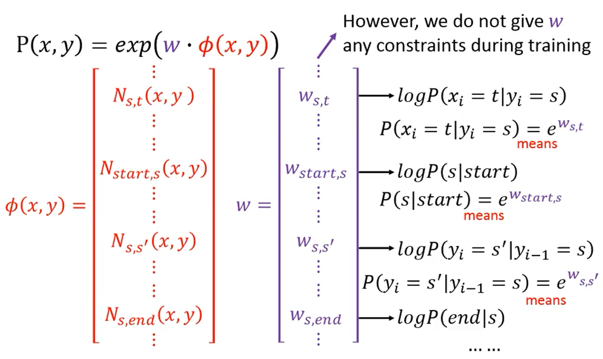

logP(s|start)为对应维度上的权重，s(表示词性)放在句首的几率，可以归纳为每一个权重都对HMM模型中每一个几率取对数，因为几率值都是小于等于1的，因此需要对P(x, y)表达式做变化为**P(x,y)∝exp(w∙ϕ(x,y))**

**特征向量**

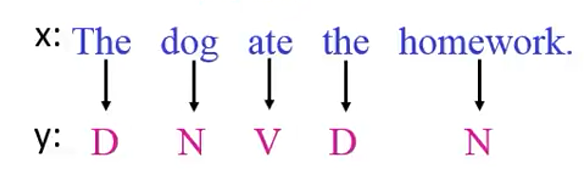

- ϕ(x,y)的形式是什么样的？

- ϕ(x,y)分为两部分

  - Part 1：标记和单词之间的关系

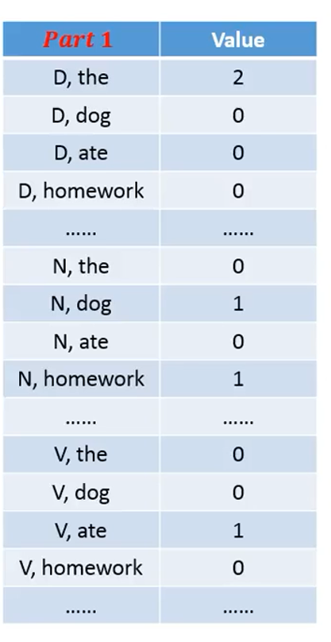

如果有|S|个可能的标记，|L|个可能的单词，Part 1的维度为 |S| X |L|，value表示在(标记, 单词)对中出现的次数，很大的一个稀疏矩阵；

  - Part 2：标签之间的关系

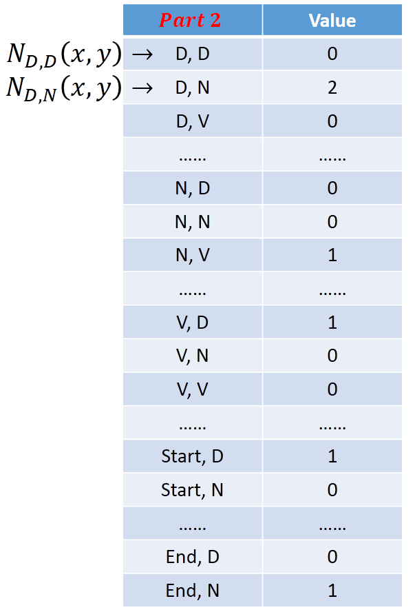

定义$N_{S, S^{\prime}}(x, y) :$为标记s和s'在(x, y)对中连续出现的次数，$N_{D, D}(x, y)$表示D后面出现D在(x, y)对中出现的次数；如果有|S|个可能的标记，其维度为|S| X |S| + 2|S|(对所有的标记对，我们都需要一个维度，每一个标记跟start产生的对也是一个维度，每一个标记跟end所产生的对又是一个维度，因此所有标记的对为s的平方，start跟end的对为s)，ϕ(x,y)的形式我们可以自己定义权重向量w！

**CRF—训练标准**

- 给定训练数据：
  $$
  \left\{\left(x^{1}, \hat{y}^{1}\right),\left(x^{2}, \hat{y}^{2}\right), \cdots\left(x^{N}, \hat{y}^{N}\right)\right\}
  $$

- 找到一个权重向量$W^{*}$去最大化目标函数$O(w)$；

  其中，$W^{*}$与目标函数定义如下：
  $$
  w^{*}=\arg \max _{w} \mathrm{O}(w)
  $$

  $$
  O(w)=\sum_{n=1}^{N} \log P\left(\hat{y}^{n} | x^{n}\right)
  $$

  表示为我们要寻找一个w，使得最大化给定的$x_n$所产生$\hat{y}^{n}$正确标记的几率，再取对数进行累加，此处可以联想到交叉熵也是最大化正确维度的几率再取对数，只不过此时是针对整个序列而言的。

  对logP(y|x)做相应的转换
  $$
  \begin{array}{l}{P(y | x)}  {=\frac{P(x, y)}{\sum_{y^{\prime}} P\left(x, y^{\prime}\right)}}\end{array}
  $$

  $$
  \log P\left(\hat{y}^{n} | x^{n}\right)=\log P\left(x^{n}, \hat{y}^{n}\right)-\log \sum_{y^{\prime}} P\left(x^{n}, y^{\prime}\right)
  $$

  

  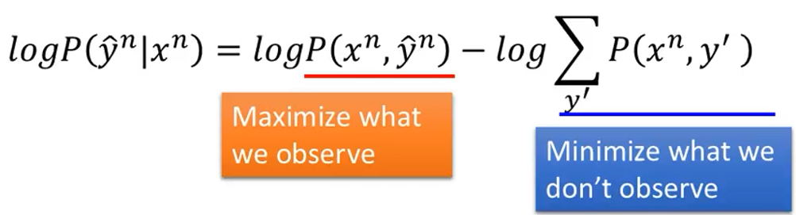
  
  
  
  根据CRF的定义可知，可以分解为两项再分别取对数，即最大化观测到的几率，最小化未知的几率。

**CRF—梯度上升**

- 梯度下降(找到一组参数θ，最小化成本函数C(θ))，即梯度的反方向
  $$
  \theta \rightarrow \theta-\eta \nabla C(\theta)
  $$

- 梯度上升((找到一组参数θ，最大化成本函数O(θ))，即梯度的同方向
  $$
  \theta \rightarrow \theta+\eta \nabla O(\theta)
  $$

**CRF—训练**

定义目标函数
$$
O(w)=\sum_{n=1}^{N} \log P\left(\hat{y}^{n} | x^{n}\right)=\sum_{n=1}^{N} O^{n}(w)
$$
计算梯度
$$
\nabla O^{n}(w)=\left[\begin{array}{c}{\vdots} \\ {\partial O^{n}(w) / \partial w_{s, t}} \\ {\vdots} \\ {\partial O^{n}(w) / \partial w_{s, s^{\prime}}}\end{array}\right]
$$
如何求解偏导数?(s为词性，t为单词，分别对(s, t)和(s, s'))
$$
P\left(y^{\prime} | x^{n}\right)=\frac{\exp \left(w \cdot \phi\left(x^{n}, y^{\prime}\right)\right)}{Z\left(x^{n}\right)}
$$

$$
w_{s, t} \rightarrow w_{s, t}+\eta \frac{\partial O(w)}{\partial w_{s, t}}
$$

偏导求解得到两项：
$$
\frac{\partial O^{n}(w)}{\partial w_{s, t}}=N_{s, t}\left(x^{n}, \hat{y}^{n}\right)-\sum_{y^{\prime}} P\left(y^{\prime} | x^{n}\right) N_{s, t}\left(x^{n}, y^{\prime}\right)
$$

- 第一项为单词t被标记为s，在$\left(x^{n}, \hat{y}^{n}\right)$中出现的次数；
- 第二项为累加所有可能的y，每一项为单词t被标记成s，在$x_n$产生任意y出现的次数，在给定$x_n$下产生任意标记的几率。
- 实际意义解释
  - 如果(s, t)在训练数据集正确出现的次数越多，对应的权值就会越大(第一项)，即如果单词t在训练数据对集$\left(x^{n}, \hat{y}^{n}\right)$中被标记成s，则会增加$w_{s, t}$；
  - 如果(s, t)在训练数据集任意的y与x配对之后出现的次数依然越多，那么我们应该将其权值进行减小(第二项，可以通过Viterbi算法计算)，即如果任意一个单词t在任意一个训练数据对集$\left(x^{n}, y^{\prime}\right)$中被标记成s的话，我们要减小$w_{s, t}$。

对所有的权值向量来说，正确的$\hat{y}^{n}$所形成的的向量减去任意一个y'乘上y‘的几率。

**随机梯度上升法**

- 随机选择一个数据$\left(x^{n}, \hat{y}^{n}\right)$
  $$
  \mathrm{w} \rightarrow w+\eta\left(\phi\left(x^{n}, \hat{y}^{n}\right)-\sum_{y^{\prime}} P\left(y^{\prime} | x^{n}\right) \phi\left(x^{n}, y^{\prime}\right)\right)
  $$

- 求解出w

**CRF—推理**
$$
\begin{aligned} y &=\arg \max _{y \in Y} P(y | x)=\arg \max _{y \in Y} P(x, y) \\ &=\arg \max _{y \in Y} w \cdot \phi(x, y) \text { 利用Viterbias算法可以很好地求解 } \end{aligned}
$$

等同于找一个y，使得其几率最大，因为由P(x,y)∝exp(w∙ϕ(x,y))可知。

## CRF v.s. HMM

- CRF：增加$P(x, \hat{y})$，减少$P\left(x, y^{\prime}\right)$(HMM做不到这一点)

  - 如果要得到正确的答案，我们希望
    $$
    (x, \hat{y}) : P(x, \hat{y})>P(x, y)
    $$
    CRF更有可能得到正确的结果

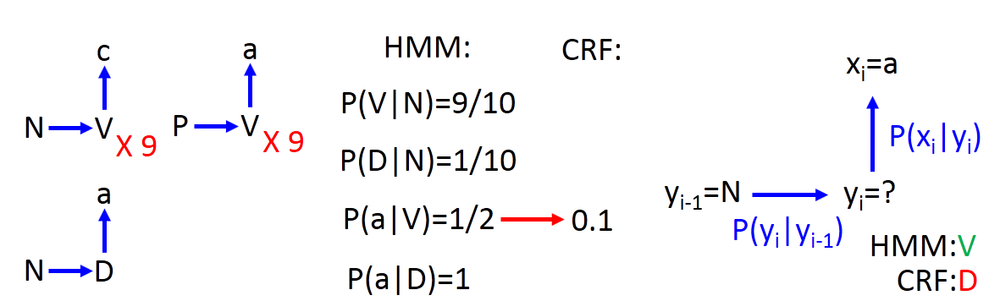

我们把V产生a的几率变小，CRF的本质就是想办法调整参数，让正确的变大，错误的变小，这样的话，如果把V产生a的几率变小，那么它就会调高P产生V的几率！

- 合成数据：CRF v.s. HMM

- 输入输出分别为：
  $$
  x_{i} \in\{a-z\}, y_{i} \in\{A-E\}
  $$
- 从混合顺序HMM生成数据

  - 转移概率
    $$
    \alpha P\left(y_{i} | y_{i-1}\right)+(1-\alpha) P\left(y_{i} | y_{i-1}, y_{i-2}\right)
    $$
    α 取1时，变为HMM模型，其值可以任意地进行调整。

  - 发散概率
    $$
    \alpha P\left(x_{i} | y_{i}\right)+(1-\alpha) P\left(x_{i} | y_{i}, x_{i-1}\right)
    $$
    如果α取1时，变为一般的HMM模型。

**比较HMM与CRF**

- 所有方法都只考虑1阶信息(即α取1的情况)

  - 仅仅考虑$y_{i-1} \text { 与} y_{i}$的关系

  - 一般来说，α调得越小，HMM与CRF得到的差距越大，整体性能就会越差，需要衡量HMM和CRF对整体性能的影响较大

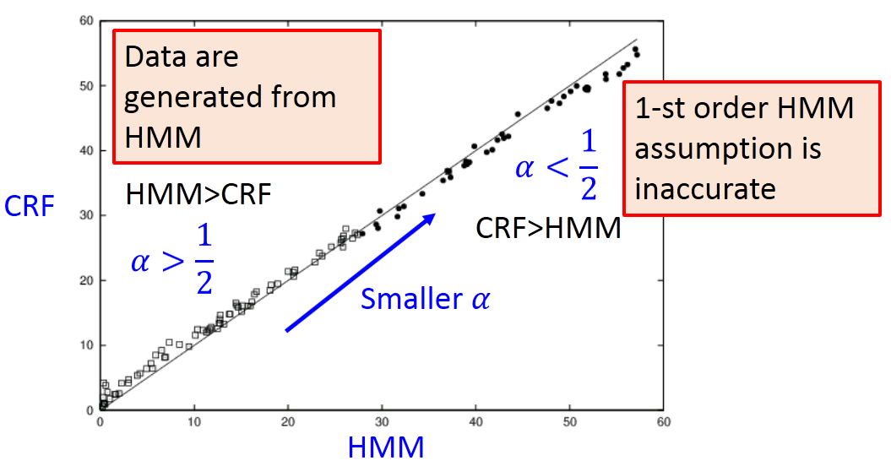

α从**左下方到右上方不断减小**，每一个圈圈表示不同的α所得到的结果，对每一个点都做一个HMM和CRF的实验，横轴代表HMM犯错的百分比，纵轴表示CRF犯错的百分比。

**Summary—概要**

- Q1：评估
  $$
  F(x, y)=P(y | x)=\frac{\exp (w \cdot \phi(x, y))}{\sum_{y^{\prime} \in \mathbb{Y}} \exp \left(w \cdot \phi\left(x, y^{\prime}\right)\right)}
  $$

- Q2：推理
  $$
  \tilde{y}=\arg \max _{y \in \mathbb{Y}} P(y | x)=\arg \max _{y \in \mathbb{Y}} w \cdot \phi(x, y)
  $$
  等价于向量内积的形式

- Q3：训练
  $$
  \begin{array}{l}{w^{*}=\arg \max _{w} \prod_{n=1} P\left(\hat{y}^{n} | x^{n}\right)} \\ {\mathbf{w} \rightarrow w+\eta\left(\phi\left(x^{n}, \hat{y}^{n}\right)-\sum_{y^{\prime}} P\left(y^{\prime} | x^{n}\right) \phi\left(x^{n}, y^{\prime}\right)\right)}\end{array}
  $$
  对数相加即等价于几率相乘(交叉熵一般是采用对数相加的形式)！

## 结构化感知机

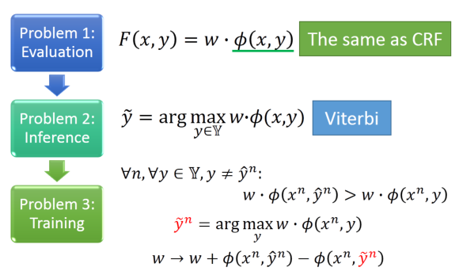

- Q1评估：

  x, y假设都为序列，用**CRF模型**来定义ϕ(x,y)

- Q2推理：

  利用**Viterbi算法**求解即可

- Q3训练：

  对所有的训练数据，以及对所有的$y \neq \hat{y}^{n}$，我们希望：
  $$
  w \cdot \phi\left(x^{n}, \hat{y}^{n}\right)>w \cdot \phi\left(x^{n}, y\right)
  $$
  在每次迭代之后，我们会根据目前的w，找到一个y，使得：
  $$
  \tilde{y}^{n}=\arg \max _{y} w \cdot \phi\left(x^{n}, y\right)
  $$
  然后，更新w
  $$
  w \rightarrow w+\phi\left(x^{n}, \hat{y}^{n}\right)-\phi\left(x^{n}, \tilde{y}^{n}\right)
  $$
  即正确的$\hat{\mathbf{y}}^{n}$减去其他的$\tilde{y}^{n}$所形成的向量

**结构化感知机 v.s. CRF**

- 结构化感知机(Hard范畴)
  $$
  \begin{array}{l}{\tilde{y}^{n}=\arg \max _{y} w \cdot \phi\left(x^{n}, y\right)} \\ {w \rightarrow w+\phi\left(x^{n}, \hat{y}^{n}\right)-\phi\left(x^{n}, \tilde{y}^{n}\right)}\end{array}
  $$
  只取几率最大的y来进行求解

- CRF(Soft范范畴)
  $$
  \mathrm{w} \rightarrow w+\eta\left(\underline{\phi\left(x^{n}, \hat{y}^{n}\right)}-\sum_{y^{\prime}} P\left(y^{\prime} | x^{n}\right) \phi\left(x^{n}, y^{\prime}\right)\right)
  $$
  对所有的y所形成的的特征向量y'与对应的几率做梯度上升。

- 在一定条件下，结构化感知机和CRF可以相互转化。

**结构化SVM**

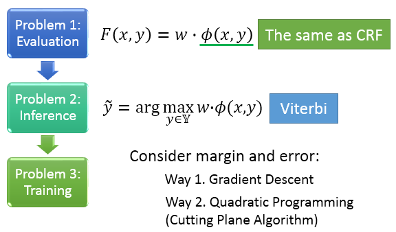

目标函数需要考虑到间隔和误差：

- 采用梯度下降法；
- QP二次规划问题，因为限制条件过多，所以采用Cutting Plane算法。

**结构化SVM—误差函数**

- 误差函数
  $$
  \Delta\left(\hat{y}^{n}, y\right)
  $$

  - ∆用来计算y与$\hat{y}^{n}$之间的差异性；

  - 结构化SVM的成本函数就是∆的上界(需要最小化该上界)；

  - 理论上讲，∆可以为任何适当的函数；

    - 但是，我们必须要考虑到Q2.1，即需要穷举所有的y，使得∆加上w∙ϕ最大化。

**举例说明**

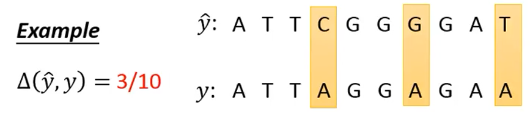

在该示例情况下，Q2.1可以通过**Viterbi算法**求解。

## 不同方法的性能比较

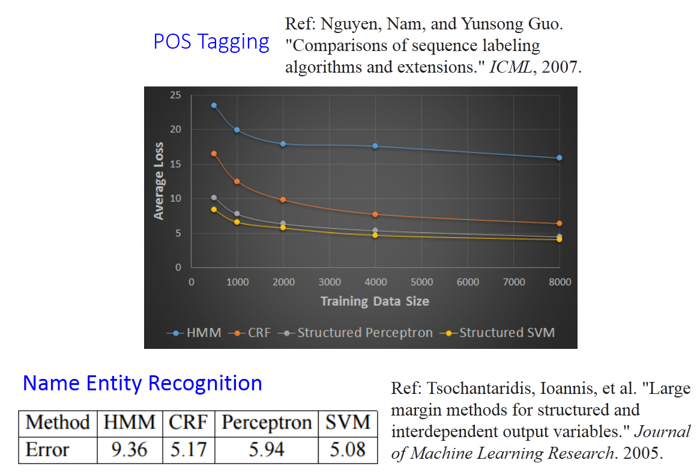

- 当训练数据更少的情况下，HMM表现得更好，其它方法性能不佳；
- 一般来说，CRF与结构化感知机没有明显的优劣之分，CRF为Soft型的，而结构化感知机为Hard型的，结构化感知机只需要求解Q2就可以了，而CRF需要求解所有可能的情况；
- 结构化SVM整体表现最好；
- 命名实体识别类似于POS词性标记；
  - 结构化SVM模型表现最好；
  - HMM模型表现最差。

## 为什么不用RNN？

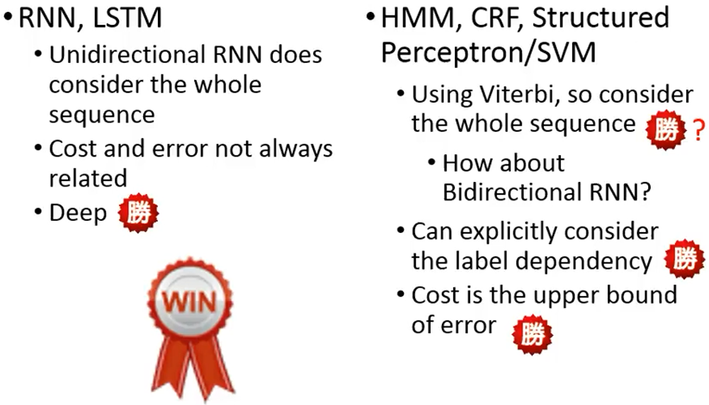

**RNN，LSTM**

- 单方向的RNN or LSTM并没有考虑到全部的序列，换言之，只考虑时间t1至当前时间tk的情形，对tk+1的情形没有考虑，即在时间tk时就已经有了输出结果；
- 如果利用双向的RNN，结果如何？
- 成本函数和误差函数并不总是相关的；
- 可以叠加很多层(利用Deep的特性)。

**HMM，CRF，结构化感知机 or SVM**

- 在输出结果之前，做的都是利用**Viterbi算法**穷举所有的序列，观测最大的序列，在计算过程中考虑到的是整个序列；
- 我们可以明确的考虑输出标签之间的依赖关系；
- **结构化SVM**的成本函数就是误差的上界，当成本函数不断减小的时候，误差就会随之降低。

## 整合一起

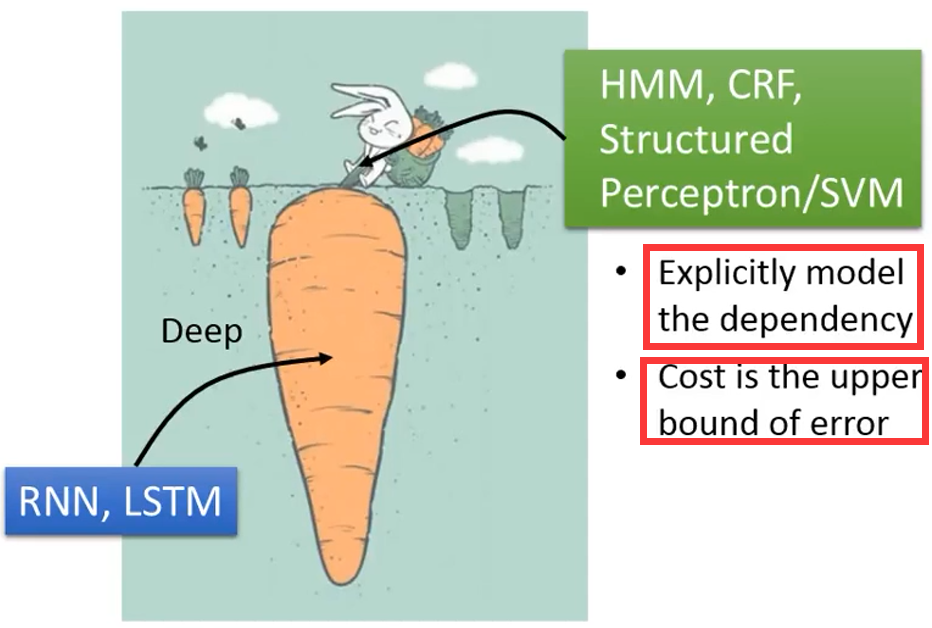

- 深层Deep
  - RNN，LSTM
- 浅层方案
  - HMM，CRF，结构化感知机 or SVM

- 语音识别
  - CNN/RNN or LSTM/DNN + **HMM**

$$
P(x, y)=P\left(y_{1} | s t a r t\right) \prod_{l=1}^{L-1} P\left(y_{l+1} | y_{l}\right) P\left(e n d | y_{L}\right) \prod_{l=1}^{L} P\left(x_{l} | y_{l}\right)
$$

- 根据HMM模型中的转移概率和发散概率知，emission 概率可以由RNN得到，用RNN的输出结果代替发散概率；

- 不需要考虑特征的几率；

- 双向RNN/LSTM + CRF/结构化SVM。

  

  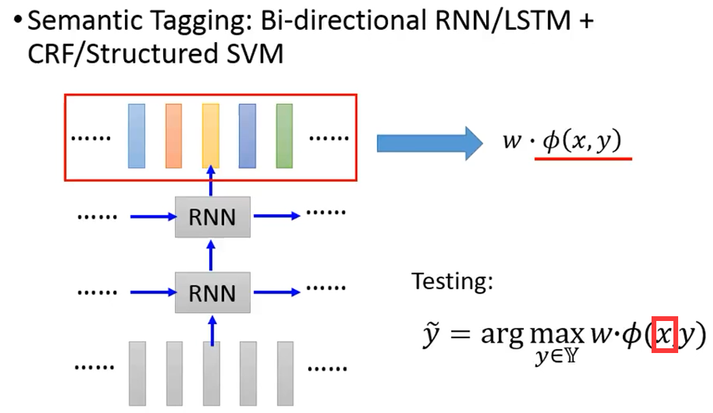
  
  
  
- 从RNN or DNN的输出结果中，抽出新的特征再计算
    $$
  w \cdot \phi(x, y)作为评估函数
  $$

  - 训练阶段
  
    利用梯度下降法让w和RNN中的所有参数一起训练；
  
  - 测试阶段
    $$
    \tilde{y}=\arg \max _{y \in \mathbb{Y}} w \cdot \phi(x, y)
    $$
    找一个y，使得w∙ϕ(x, y)的结果最大化，但此时的x来自于RNN的输出结果。

## 模型总结

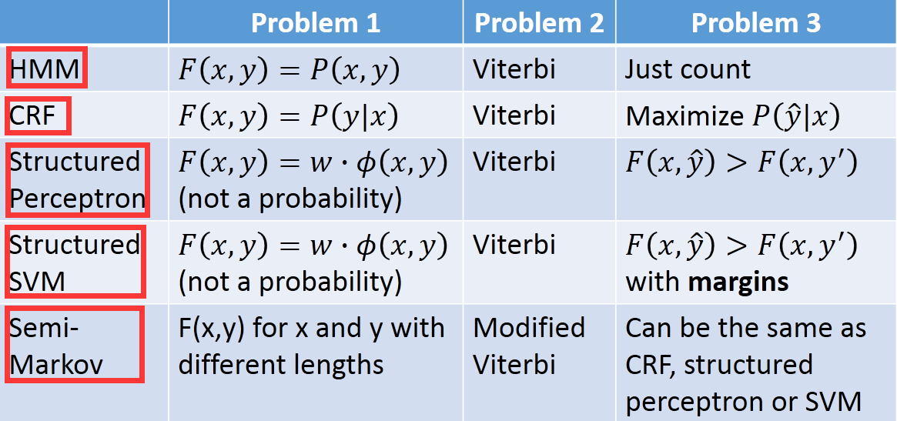

- HMM，CRF，结构化感知机 or SVM都是求解三个问题；
- 三个方法定义评估函数的方式都有所差异；
- 结构化感知机 or SVM跟几率都没有关系；
- 以上这些方法都可以加上**Deep Learning**让它们的性能表现地更好。