## 应用举例

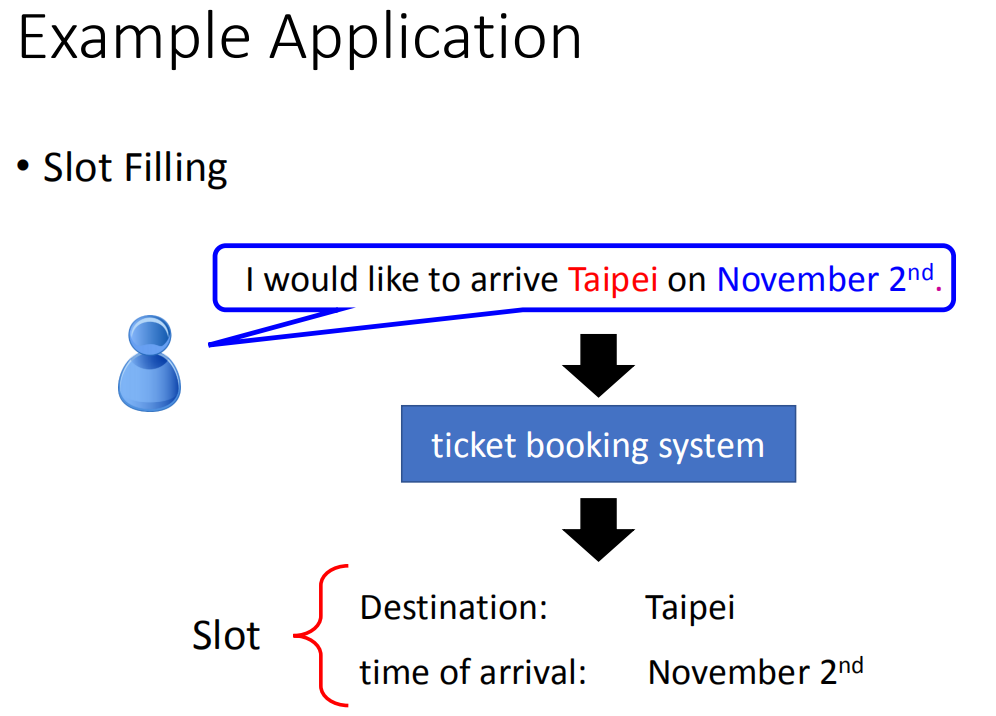
这边举的例子是slot filling，我们假设订票系统听到用户说：“ i would like to arrive Taipei on November 2nd”，你的系统有一些slot(有一个slot叫做Destination，一个slot叫做time of arrival)，系统要自动知道这边的每一个词汇是属于哪一个slot，比如Taipei属于Destination这个slot，November 2nd属于time of arrival这个slot。

这个问题你当然可以使用一个feedforward neural network来解，也就是说我叠一个feedforward neural network，input是一个词汇(把Taipei变成一个vector)丢到这个neural network里面去(你要把一个词汇丢到一个neural network里面去，就必须把它变成一个向量来表示)。以下是把词汇用向量来表示的方法：

## 1-of-N encoding

## Beyond 1-of-N encoding

如果只是用1-of-N encoding来描述一个词汇的话你会遇到一些问题，因为有很多词汇你可能都没有见过，所以你需要在1-of-N encoding里面多加dimension，这个dimension代表other。然后所有的词汇，如果它不是在我们词言有的词汇就归类到other里面去(Gandalf,Sauron归类到other里面去)。你可以用每一个词汇的字母来表示它的vector，比如说，你的词汇是apple，apple里面有出现app、ppl、ple，那在这个vector里面对应到app,ple,ppl的dimension就是1,而其他都为0。

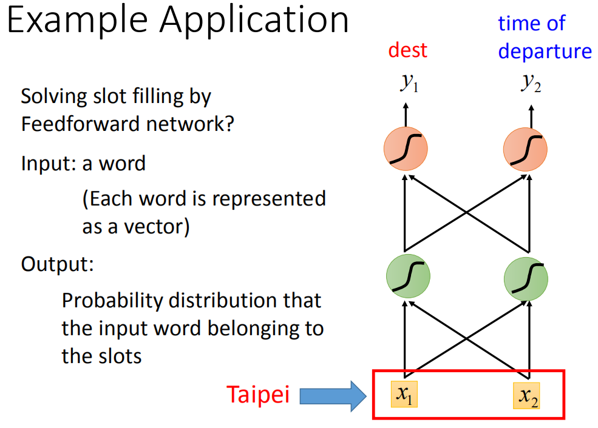
假设把词汇表示为vector，把这个vector丢到feedforward neural network里面去，在这个task里面，你就希望你的output是一个probability distribution。这个probability distribution代表着我们现在input这词汇属于每一个slot的几率，比如Taipei属于destination的几率和Taipei属于time of departure的几率。

但是光只有这个是不够的，feedforward neural network是没有办法解决这个问题。为什么呢，假设现在有一个使用者说：“arrive Taipei on November 2nd”(arrive-other,Taipei-dest, on-other,November-time,2nd-time)。那现在有人说:"leave Taipei on November 2nd"，这时候Taipei就变成了“place of departure”，它应该是出发地而不是目的地。但是对于neural network来说，input一样的东西output就应该是一样的东西(input  "Taipei"，output要么是destination几率最高，要么就是place of departure几率最高)，你没有办法一会让出发地的几率最高，一会让它目的地几率最高。这个怎么办呢？这时候就希望我们的neural network是有记忆力的。如果今天我们的neural network是有记忆力的，它记得它看过红色的Taipei之前它就已经看过arrive这个词汇；它记得它看过绿色之前，它就已经看过leave这个词汇，它就可以根据上下文产生不同的output。如果让我们的neural network是有记忆力的话，它就可以解决input不同的词汇，output不同的问题。

但是光只有这个是不够的，feedforward network是没有办法slot这个probability。为什么呢，假设现在有一个使用者说：“arrive Taipei on November 2nd”(arrive-other,Taipei-dest, on-other,November-time,2nd-time)。那现在有人说:"leave Taipei on November 2nd"，这时候Taipei就变成了“place of departure”，它应该是出发地而不是目的地。但是对于neural network来说，input一样的东西output就应该是一样的东西(input  "Taipei"，output要么是destination几率最高，要么就是time of departure几率最高)，你没有办法一会让出发地的几率最高，一会让它目的地几率最高。这个肿么办呢？这时候就希望我们的neural network是有记忆力的。如果今天我们的neural network是有记忆力的，它记得它看过红色的Taipei之前它就已经看过arrive这个词汇；它记得它看过绿色之前，它就已经看过leave这个词汇，它就可以根据上下文产生不同的output。如果让我们的neural network是有记忆力的话，它就可以解决input不同的词汇，output不同的问题。

## 什么是RNN？

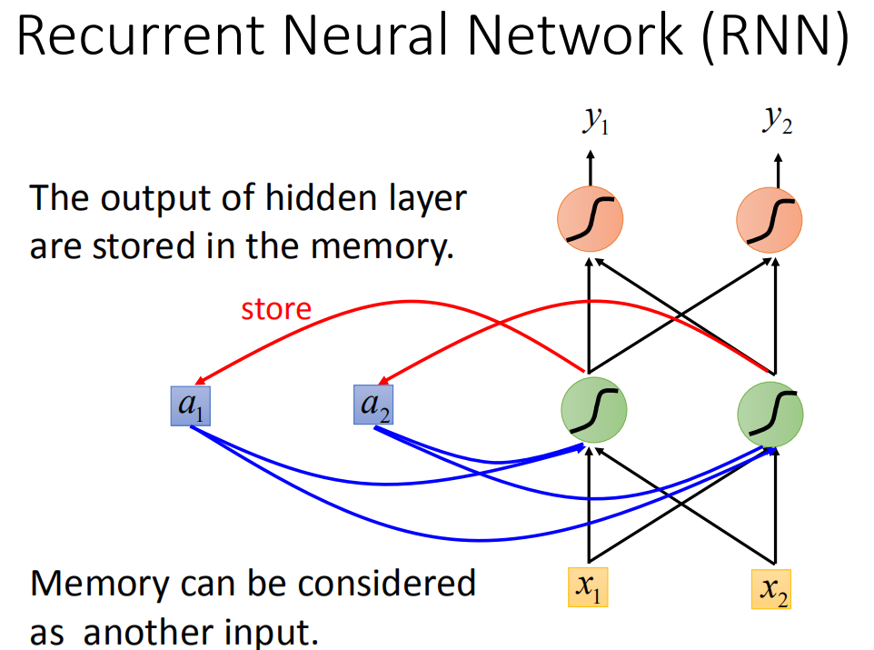
这种有记忆的neural network就叫做Recurrent Neural network(RNN)。在RNN里面，每一次hidden layer的neuron产生output的时候，这个output会被存到memory里去(用蓝色方块表示memory)。那下一次当有input时，这些neuron不只是考虑input$x_1,x_2$，还会考虑存到memory里的值。对它来说除了$x_1,x_2$以外，这些存在memory里的值$a_1,a_2$也会影响它的output。

### 例子

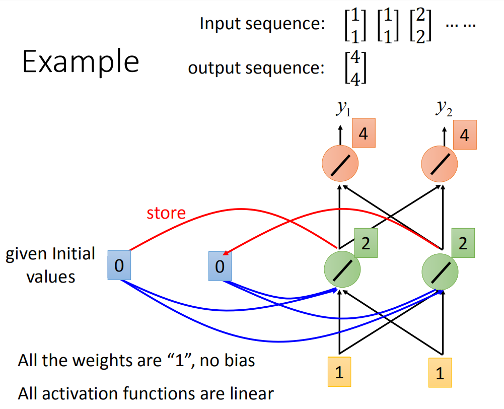
举个例子，假设我们现在图上这个neural network，它所有的weight都是1，所有的neuron没有任何的bias。假设所有的activation function都是linear(这样可以不要让计算太复杂)。现在假设我们的input 是sequence$\begin{bmatrix}
1\\ 
1
\end{bmatrix}\begin{bmatrix}
1\\ 
1
\end{bmatrix}\begin{bmatrix}
2\\ 
2
\end{bmatrix}...$
把这个sequence输入到neural network里面去会发生什么事呢？在你开始要使用这个Recurrent Neural Network的时候，你必须要给memory初始值(假设他还没有放进任何东西之前，memory里面的值是0)

现在输入第一个$\begin{bmatrix}
1\\ 
1
\end{bmatrix}$，接下来对发生什么事呢？，对左边的那个neural来说(第一个hidden layer)，它除了接到input的$\begin{bmatrix}
1\\ 
1
\end{bmatrix}$还接到了memory(0跟0)，output就是2(所有的weight都是1)，右边也是一样output为2。第二层hidden laeyer output为4。

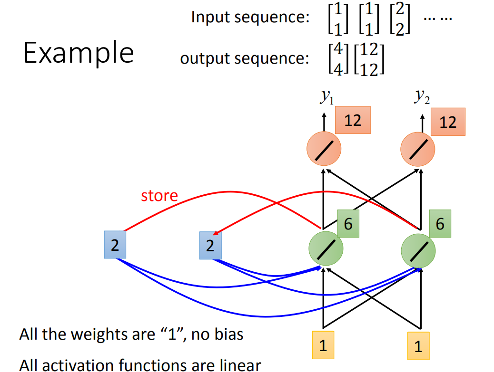
接下来Recurrent Neural Network会将绿色neuron的output存在memory里去，所以memory里面的值被update为2。

接下来再输入$\begin{bmatrix}
1\\ 
1
\end{bmatrix}$，接下来绿色的neuron输入有四个
$\begin{bmatrix}
1\\ 
1
\end{bmatrix}\begin{bmatrix}
2\\ 
2
\end{bmatrix}$，output为$\begin{bmatrix}
6\\ 
6
\end{bmatrix}(weight=1)$，第二层的neural output为$\begin{bmatrix}
12\\ 
12
\end{bmatrix}$。

所以对Recurrent Neural Network来说，你就算input一样的东西，它的output是可能不一样了(因为有memory)

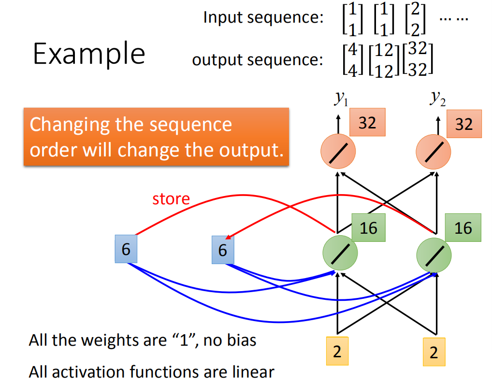

现在$\begin{bmatrix}
6\\ 
6
\end{bmatrix}$存到memory里去，接下来input是$\begin{bmatrix}
2\\ 
2
\end{bmatrix}$，output为$\begin{bmatrix}
16\\ 
16
\end{bmatrix}$,第二层hidden layer为$\begin{bmatrix}
32\\ 
32
\end{bmatrix}$

那在做Recurrent Neural Network时，有一件很重要的事情就是这个input sequence调换顺序之后output不同(Recurrent Neural Network里，它会考虑sequence的order)

## RNN架构

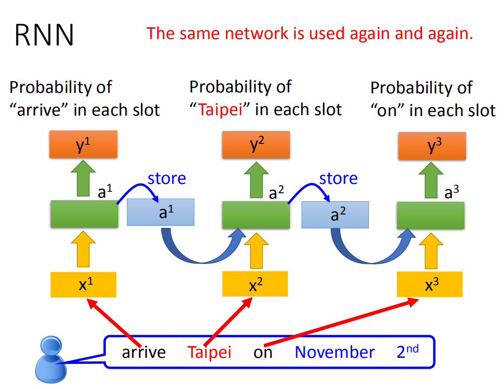

今天我们要用Recurrent Neural Network处理slot filling这件事，就像是这样，使用者说：“arrive Taipei on November 2nd”，arrive就变成了一个vector丢到neural network里面去，neural network的hidden layer的output写成$a^1$($a^1$是一排neural的output，是一个vector)，$a^1$产生$y^1$,$y^1$就是“arrive”属于每一个slot filling的几率。接下来$a^1$会被存到memory里面去，"Taipei会变为input"，这个hidden layer会同时考虑“Taipei”这个input和存在memory里面的$a^1$,得到$a^2$，根据$a^2$得到$y^2$，$y^2$是属于每一个slot filling的几率。以此类推($a^3$得到$y^2$)。

有人看到这里，说这是有三个network，这个不是三个network，这是同一个network在三个不同的时间点被使用了三次。(我这边用同样的weight用同样的颜色表示)

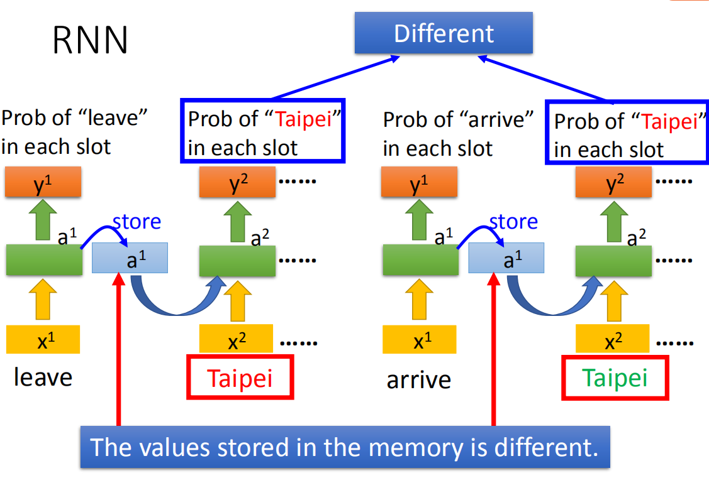
那所以我们有了memory以后，刚才我们讲了输入同一个词汇，我们希望output不同的问题就有可能被解决。比如说，同样是输入“Taipei”这个词汇，但是因为红色“Taipei”前接了“leave”，绿色“Taipei”前接了“arrive”(因为“leave”和“arrive”的vector不一样，所以hidden layer的output会不同)，所以存在memory里面的值会不同。现在虽然$x_2$的值是一样的，因为存在memory里面的值不同，所以hidden layer的output会不一样，所以最后的output也就会不一样。这是Recurrent Neural Network的基本概念。

## 其他RNN

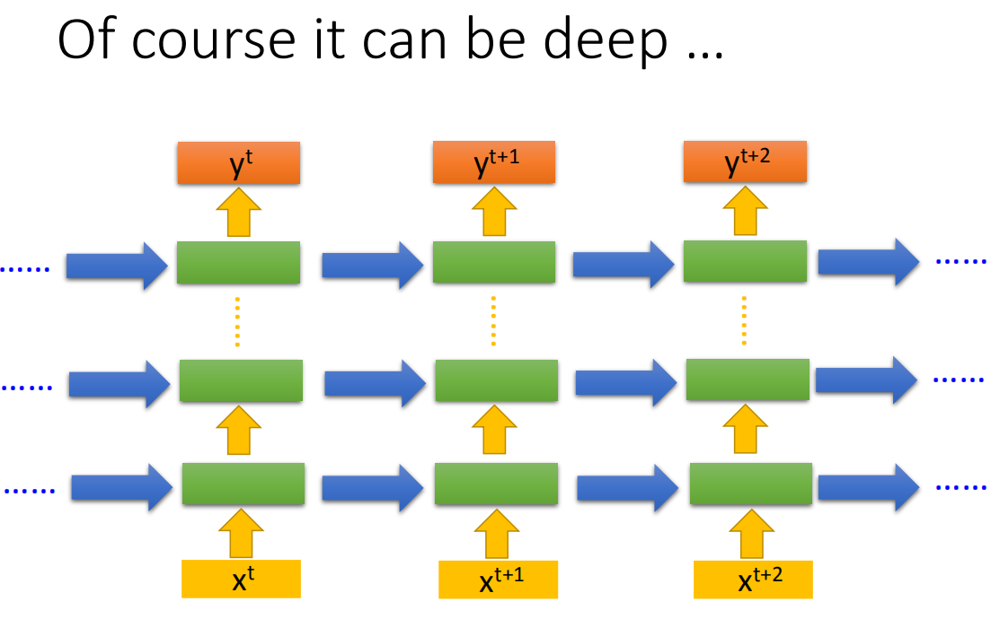
Recurrent Neural Networ的架构是可以任意设计的，比如说，它当然是deep(刚才我们看到的Recurrent Neural Networ它只有一个hidden layer)，当然它也可以是deep Recurrent Neural Networ。

比如说，我们把$x^t$丢进去之后，它可以通过一个hidden layer，再通过第二个hidden layer，以此类推(通过很多的hidden layer)才得到最后的output。每一个hidden layer的output都会被存在memory里面，在下一个时间点的时候，每一个hidden layer会把前一个时间点存的值再读出来，以此类推最后得到output，这个process会一直持续下去。

### Elman network &Jordan network

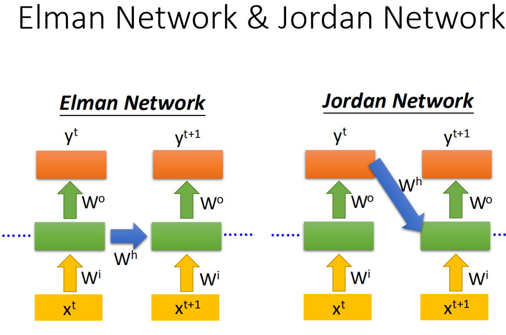
Recurrent Neural Networ会有不同的变形，我们刚才讲的是Elman network。(如果我们今天把hidden layer的值存起来，在下一个时间点在读出来)。还有另外一种叫做Jordan network，Jordan network存的是整个network output的值，它把output值在下一个时间点在读进来(把output存到memory里)。传说Jordan network会得到好的performance。

Elman network是没有target，很难控制说它能学到什么hidden layer information(学到什么放到memory里)，但是Jordan network是有target，今天我们比较很清楚我们放在memory里是什么样的东西。
### Bidirectional neural network

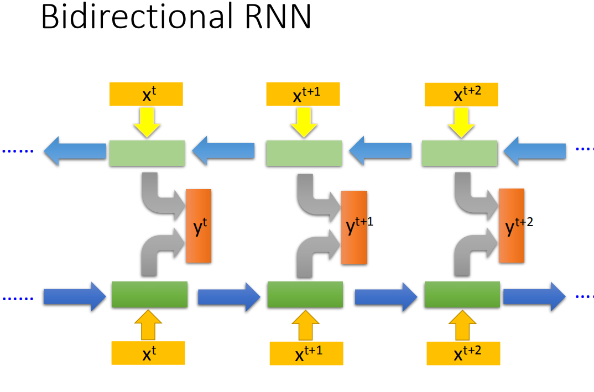
Recurrent Neural Networ还可以是双向，什么意思呢？我们刚才Recurrent Neural Networ你input一个句子的话，它就是从句首一直读到句尾。假设句子里的每一个词汇我们都有$x^t$表示它。他就是先读$x^t$在读$x^{t+1}$在读$x^{t+2}$。但是它的读取方向也可以是反过来的，它可以先读$x^{t+2}$，再读$x^{t+1}$，再读$x^{t}$。你可以同时train一个正向的Recurrent Neural Network，又可以train一个逆向的Recurrent Neural Network，然后把这两个Recurrent Neural Network的hidden layer拿出来，都接给一个output layer得到最后的$y^t$。所以你把正向的network在input$x^t$的时候跟逆向的network在input$x^t$时，都丢到output layer产生$y^t$，然后产生$y^{t+1}$,$y^{t+2}$,以此类推。用Bidirectional neural network的好处是，neural在产生output的时候，它看的范围是比较广的。如果你只有正向的network，再产生$y^t$，$y^{t+1}$的时候，你的neural只看过$x^1$到$x^{t+1}$的input。但是我们今天是Bidirectional neural network，在产生$y^{t+1}$的时候，你的network不只是看过$x^1$,到$x^{t+1}$所有的input，它也看了从句尾到$x^{t+1}$的input。那network就等于整个input的sequence。假设你今天考虑的是slot filling的话，你的network就等于看了整个sentence后，才决定每一个词汇的slot应该是什么。这样会比看sentence的一半还要得到更好的performance。

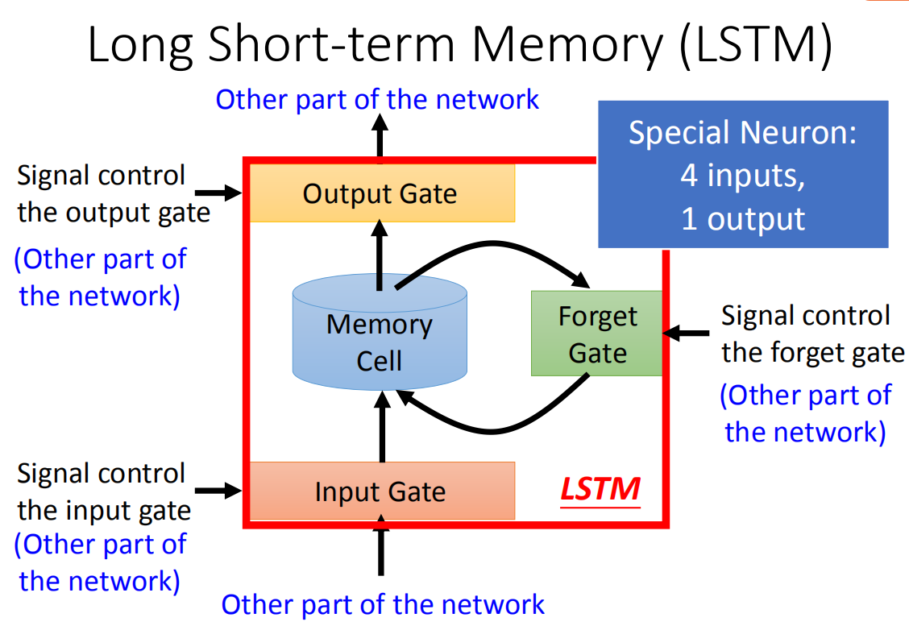
那我们刚才讲的Recurrent Neural Network其实是Recurrent Neural Network最单的版本

### LSTM

那我们刚才讲的memory是最单纯的，我们可以随时把值存到memory去，也可以把值读出来。但现在最常用的memory称之为Long Short-term Memory(长时间的短期记忆)，简写LSTM.这个Long Short-term Memor是比较复杂的。

这个Long Short-term Memor是有三个gate，当外界某个neural的output想要被写到memory cell里面的时候，必须通过一个input Gate，那这个input Gate要被打开的时候，你才能把值写到memory cell里面去，如果把这个关起来的话，就没有办法把值写进去。至于input Gate是打开还是关起来，这个是neural network自己学的(它可以自己学说，它什么时候要把input Gate打开，什么时候要把input Gate关起来)。那么输出的地方也有一个output Gate，这个output Gate会决定说，外界其他的neural可不可以从这个memory里面把值读出来(把output Gate关闭的时候是没有办法把值读出来，output Gate打开的时候，才可以把值读出来)。那跟input Gate一样，output Gate什么时候打开什么时候关闭，network是自己学到的。那第三个gate叫做forget Gate，forget Gate决定说：什么时候memory cell要把过去记得的东西忘掉。这个forget Gate什么时候会把存在memory的值忘掉，什么时候会把存在memory里面的值继续保留下来)，这也是network自己学到的。

那整个LSTM你可以看成，它有四个input 1个output，这四个input中，一个是想要被存在memory cell的值(但它不一定存的进去)还有操控input Gate的讯号，操控output Gate的讯号，操控forget Gate的讯号，有着四个input但它只会得到一个output

冷知识：这个“-”应该在short-term中间，是长时间的短期记忆。想想我们之前看的Recurrent Neural Network，它的memory在每一个时间点都会被洗掉，只要有新的input进来，每一个时间点都会把memory
洗掉，所以的short-term是非常short的，但如果是Long Short-term Memory，它记得会比较久一点(只要forget Gate不要决定要忘记，它的值就会被存起来)。

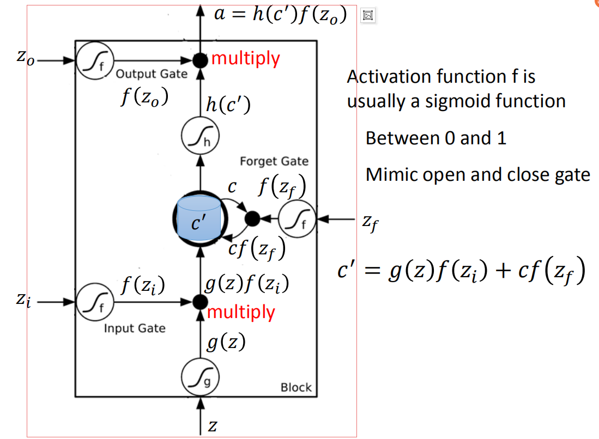
这个memory cell更仔细来看它的formulation，它长的像这样。

底下这个是外界传入cell的input，还有input gate,forget gate,output gate。现在我们假设要被存到cell的input叫做z，操控input gate的信号叫做$z_i$（一个数值）,所谓操控forget gate的信号叫做$z_f$，操控output gate叫做$z_o$，综合这些东西会得到一个output 记为a。假设cell里面有这四个输入之前，它里面已经存了值c。

假设要输入的部分为z，那三个gate分别是由$z_i​$,$z_f​$,$z_0​$所操控的。那output a会长什么样子的呢。我们把z通过activation function得到g(z)，那$z_i​$通过另外一个activation function得到$f(z_i)​$($z_i​$,$z_f​$,$z_0​$通过的activation function 通常我们会选择sigmoid function)，选择sigmoid function的意义是它的值是介在0到1之间的。这个0到1之间的值代表了这个gate被打开的程度(如果这个f的output是1，表示为被打开的状态，反之代表这个gate是关起来的)。

那接下来，把$g(z)$乘以$f(z_i)$得到$g(z)f(z_i)$，对于forget gate的$z_f$,也通过sigmoid的function得到$f(z_f)$

接下来把存到memory里面的值c乘以​$f(z_f)$得到c​$f(z_f)$，然后加起来​$c^{'}=g(z)f(z_i)+cf(z_f)$，那么$c^{'}$就是重新存到memory里面的值。所以根据目前的运算说，这个​$f(z_i)$cortrol这个​$g(z)$，可不可以输入一个关卡(假设输入​$f(z_i)$0，那​$g(z)f(z_i)$就等于0，那就好像是没有输入一样，如果​$f(z_i)$等于1就等于是把​$g(z)$当做输入)
。那这个​$f(z_f)$决定说：我们要不要把存在memory的值洗掉假设​$f(z_f)$为1(forget gate 开启的时候),这时候c会直接通过(就是说把之前的值还会记得)。如果​$f(z_f)$等于0(forget gate关闭的时候)​$cf(z_f)$等于0。然后把这个两个值加起来(​$c^{'}=g(z)f(z_i)+cf(z_f)$)写到memory里面得到$c^{'}$。这个forget gate的开关是跟我们的直觉是相反的，那这个forget gate打开的时候代表的是记得，关闭的时候代表的是遗忘。那这个​$c^{'}$通过$h(c^{'})$，将​$h(c^{'})$乘以​$f(z_o)$得到​$a = f(c^{'}f(z_o)$(output gate受​$f(z_o)$所操控，​$f(z_o)$等于1的话，就说明​$h(c^{'})$能通过，​$f(z_o)$等于0的话，说明memory里面存在的值没有办法通过output gate被读取出来)

### LSTM举例

LSTM例子:我们的network里面只有一个LSTM的cell，那我们的input都是三维的vector，output都是一维的output。那这三维的vector跟output还有memory的关系是这样的。假设第二个dimension$x_2$的值是1时，$x_1$的值就会被写到memory里，假设$x_2$的值是-1时，就会reset the memory，假设$x_3$的值为1时，你才会把output打开才能看到输出。

假设我们原来存到memory里面的值是0，当第二个dimension$x_2$的值是1时，3会被存到memory里面去。第四个dimension的$x_2$等于，所以4会被存到memory里面去，所以会得到7。第六个dimension的$x_3$等于1，这时候7会被输出。第七个dimension的$x_2$的值为-1，memory里面的值会被洗掉变为0。第八个dimension的$x_2$的值为1，所以把6存进去，因为$x_3$的值为1，所以把6输出。

### LSTM运算举例

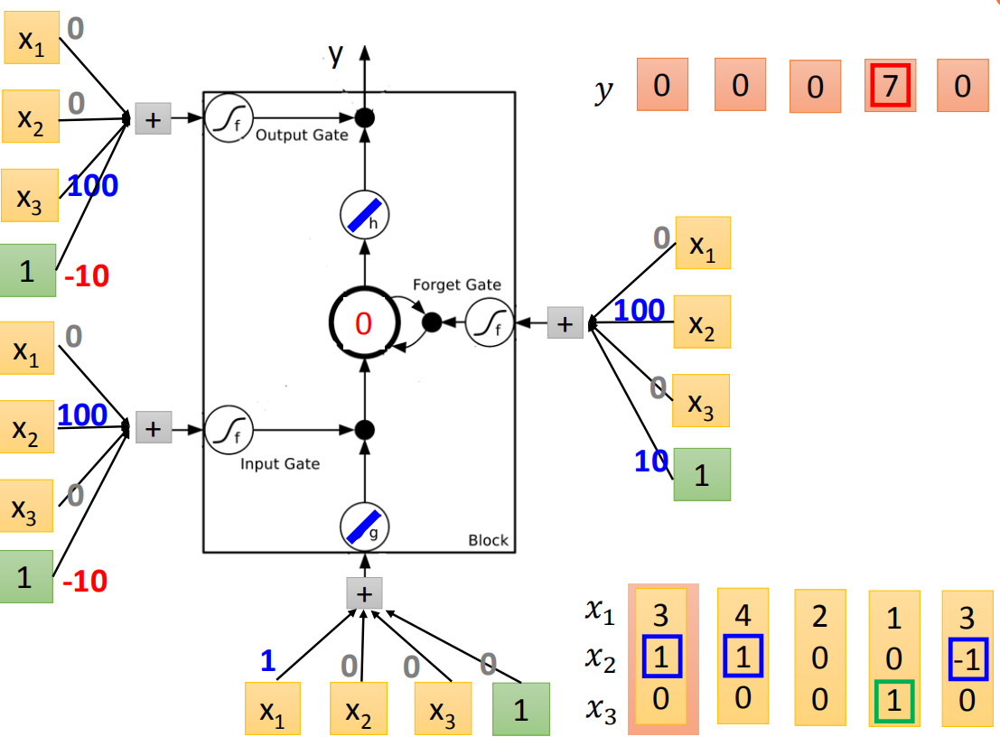
那我们就做一下实际的运算，这个是一个memory cell。这四个input scalar是这样来的：input的三维vector乘以linear transform以后所得到的结果($x_1$,$x_2$,$x_3$乘以权重再加上bias)，这些权重和bias是哪些值是通过train data用GD学到的。 假设我已经知道这些值是多少了，那用这样的输入会得到什么样的输出。那我们就实际的运算一下。

在实际运算之前，我们先根据它的input，参数分析下可能会得到的结果。底下这个外界传入的cell，$x_1$乘以1，其他的vector乘以0，所以就直接把$x_1$当做输入。在input gate时，$x_2$乘以100，bias乘以-10(假设$x_2$是没有值的话，通常input gate是关闭的(bias等于-10)因为-10通过sigmoid函数之后会接近0，所以就代表是关闭的，若$x_2$的值大于1的话，结果会是一个正值，代表input gate会被打开) 。forget gate通常会被打开的，因为他的bias等于10(它平常会一直记得东西)，只有当$x_2$的值为一个很大的负值时，才会把forget gate关起来。output gate平常是被关闭的，因为bias是一个很大的负值，若$x_3$有一个很大的正值的话，压过bias把output打开。

接下来，我们实际的input一下看看。我们假设g和h都是linear(因为这样计算会比较方便)。假设存到memory里面的初始值是0，我们input第一个vector(3,1,0),input这边3*1=3，这边输入的是的值为3。input gate这边($1 *100-10\approx 1$)是被打开(input gate约等于1)。($g(z) *f(z_i)=3$)。forget gate($1 *100+10\approx 1$)是被打开的(forget gate约等于1)。现在0 *1+3=3($c^{'}=g(z)f(z_i)+cf(z_f)$)，所以存到memory里面的现在为3。output gate(-10)是被关起来的，所以3无关通过，所以输出值为0。

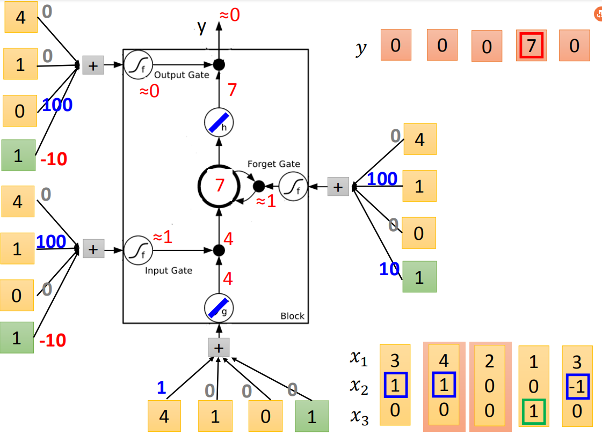
接下来input(4,1,0),传入input的值为4，input gate会被打开，forget gate也会被打开，所以memory里面存的值等于7(3+4=7)，output gate仍然会被关闭的，所以7没有办法被输出，所以整个memory的输出为0。

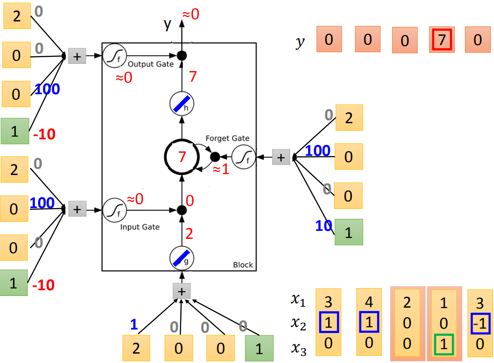

接下来input(2,0,0),传入input的值为2，input gate关闭($\approx$ 0),input被input gate给挡住了(0 *2=0),forget gate打开(10)。原来memory里面的值还是7(1 *7+0=7).output gate仍然为0，所以没有办法输出，所以整个output还是0。

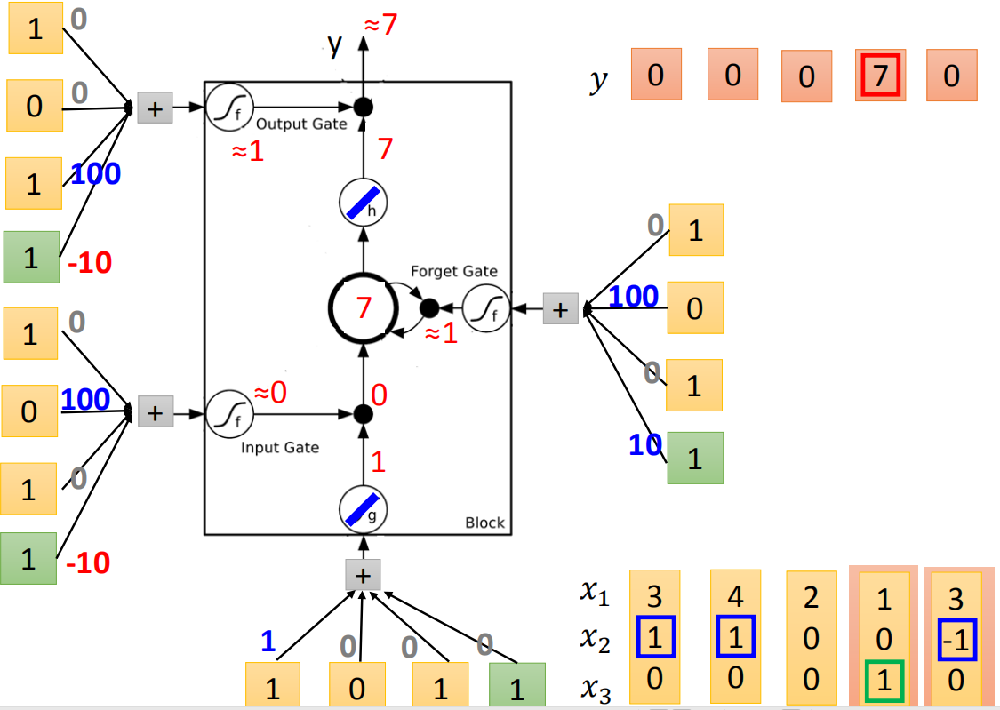
接下来input(1,0,1),传入input的值为1,input gate是关闭的，forget gate是打开的，memory里面存的值不变，output gate被打开，整个output为7(memory里面存的7会被读取出来)

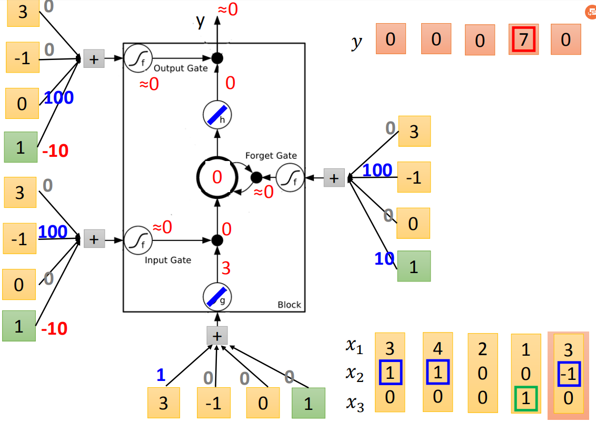
最后input(3,-1,0),传入input的值为3，input gate 关闭，forget gate关闭，memory里面的值会被洗掉变为0，output gate关闭，所以整个output为0。
## LSTM原理

你可能会想这个跟我们的neural network有什么样的关系呢。你可以这样想，在我们原来的neural network里面，我们会有很多的neural，我们会把input乘以不同的weight当做不同neural的输入，每一个neural都是一个function，输入一个值然后输出一个值。但是如果是LSTM的话，其实你只要把LSTM那么memory的cell想成是一个neuron就好了。

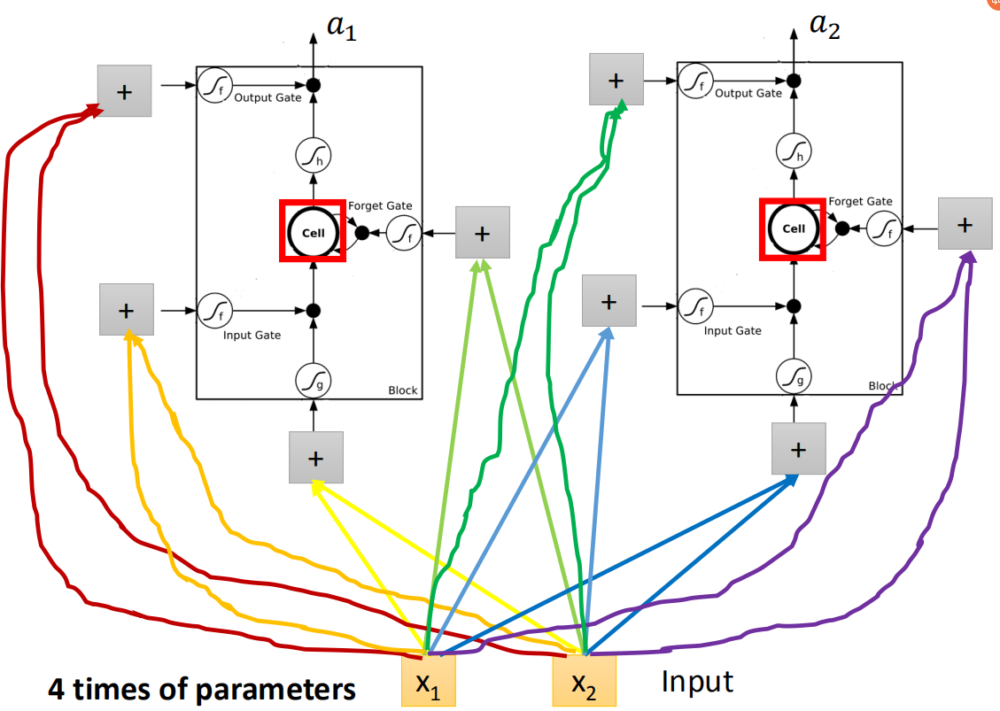

所以我们今天要用一个LSTM的neuron，你做的事情其实就是原来简单的neuron换成LSTM。现在的input($x_1,x_2$)会乘以不同的weight当做LSTM不同的输入(假设我们这个hidden layer只有两个neuron，但实际上是有很多的neuron)。input($x_1,x_2$)会乘以不同的weight会去操控output gate，乘以不同的weight操控input gate，乘以不同的weight当做底下的input，乘以不同的weight当做forget gate。第二个LSTM也是一样的。所以LSTM是有四个input跟一个output，对于LSTM来说，这四个input是不一样的。在原来的neural network里是一个input一个output。在LSTM里面它需要四个input，它才能产生一个output。

LSTM因为需要四个input，而且四个input都是不一样，原来的一个neuron就只有一个input和output，所以LSTM需要的参数量(假设你现在用的neural的数目跟LSTM是一样的)是一般neural network的四倍。这个跟Recurrent Neural Network 的关系是什么，这个看起来好像不一样，所以我们要画另外一张图来表示。

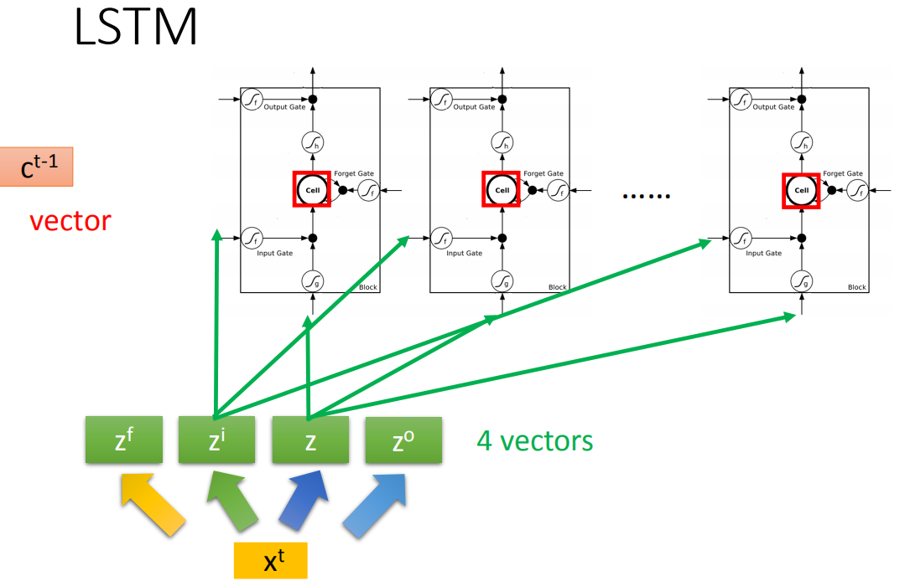

假设我们现在有一整排的neuron(LSTM)，这些LSTM里面的memory都存了一个值，把所有的值接起来就变成了vector，写为
$c^{t-1}$(一个值就代表一个dimension)。现在在时间点t，input一个vector$x^t$，这个vector首先会乘上一matrix(一个linear transform变成一个vector z,z这个vector的dimension就代表了操控每一个LSTM的input(z这个dimension正好就是LSTM memory cell的数目)。z的第一维就丢给第一个cell(以此类推)

这个$x^t$会乘上另外的一个transform得到$z^i$，然后这个$z^i$的dimension也跟cell的数目一样，$z^i$的每一个dimension都会去操控input gate(forget gate 跟output gate也都是一样，这里就不在赘述)。所以我们把$x^t$乘以四个不同的transform得到四个不同的vector，四个vector的dimension跟cell的数目一样，这四个vector合起来就会去操控这些memory cell运作。

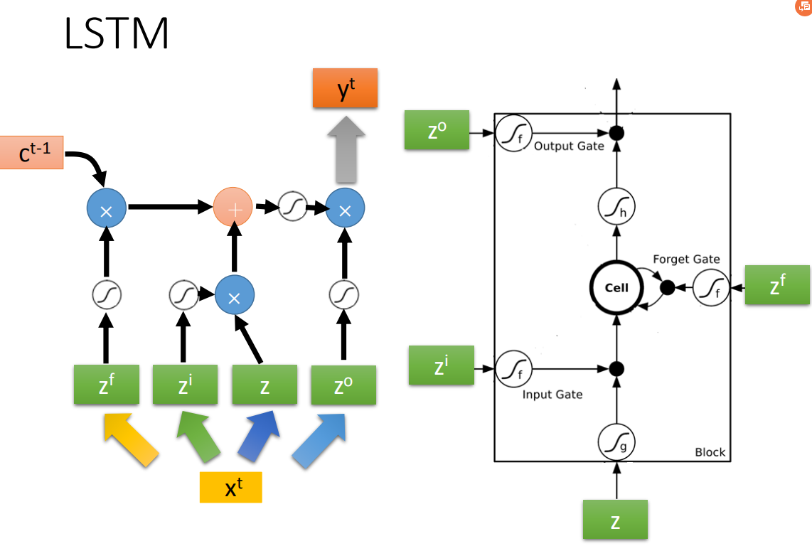
一个memory cell就长这样，现在input分别就是$z$,$z^i$,$z^o$,$z^f$(都是vector)，丢到cell里面的值其实是vector的一个dimension，因为每一个cell input的dimension都是不一样的，所以每一个cell input的值都会是不一样。所以cell是可以共同一起被运算的,怎么共同一起被运算呢？我们说，$z^i$通过activation function跟z相乘，$z^f$通过activation function跟之前存在cell里面的值相乘，然后将$z$跟$z^i$相乘的值加上$z^f$跟$c^{t-1}$相乘的值，$z^o$通过activation function的结果output，跟之前相加的结果再相乘，最后就得到了output$y^t$

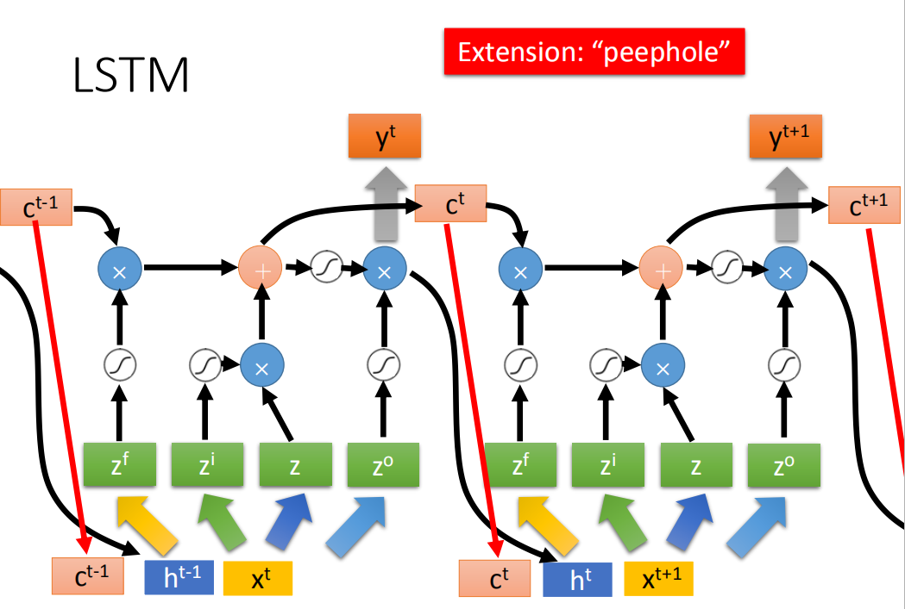
之前那个相加以后的结果就是memory里面存放的值$c^t$，这个process反复的进行，在下一个时间点input$x^{t+1}$，把z跟input gate相乘，把forget gate跟存在memory里面的值相乘，然后将前面两个值再相加起来，在乘上output gate的值，然后得到下一个时间点的输出$y^{t+1}$

你可能认为说这很复杂了，但是这不是LSTM的最终形态，真正的LSTM,会把上一个时间的输出接进来，当做下一个时间的input，也就说下一个时间点操控这些gate的值不是只看那个时间点的input$x^t​$，还看前一个时间点的output$h^t​$。其实还不止这样，还会加一个东西叫做“peephole”，这个peephole就是把存在memory cell里面的值也拉过来。那操控LSTM四个gate的时候，你是同时考虑了$x^{t+1},h^t,c^t​$，你把这三个vector并在一起乘上不同的transform得到四个不同的vector再去操控LSTM。

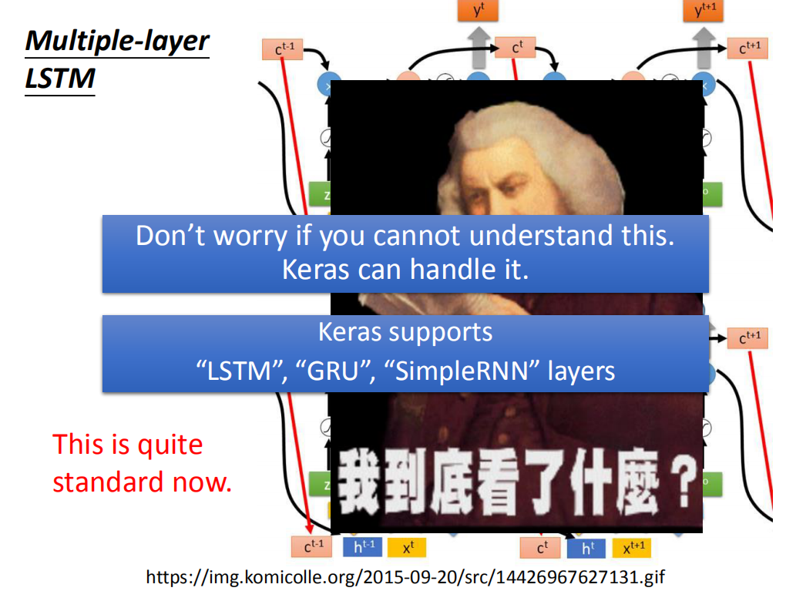
LSTM通常不会只有一层，若有五六层的话。大概是这个样子。每一个第一次看这个的人，反映都会很难受。现在还是 quite standard now，当有一个人说我用RNN做了什么，你不要去问他为什么不用LSTM,因为他其实就是用了LSTM。现在当你说，你在做RNN的时候，其实你指的就用LSTM。Keras支持三种RNN：‘’LSTM‘’,“GRU”,"SimpleRNN"
## GRU
GRU是LSTM稍微简化的版本，它只有两个gate，虽然少了一个gate，但是performance跟LSTM差不多(少了1/3的参数，也是比较不容易overfitting)。如果你要用这堂课最开始讲的那种RNN，你要说是simple RNN才行。

GRU是LSTM稍微简化的版本，它只有两个gate，虽然少了一个gate，但是performance跟LSTM差不多(少了1/3的参数，也是比较不容易overfitting)。如果你要用这堂课最开始讲的那种RNN，你要说是simple RNN才行。

