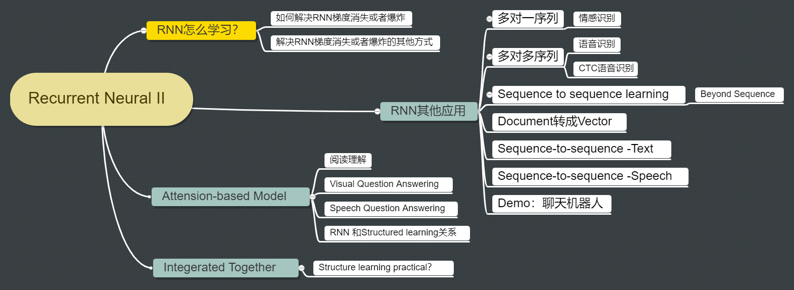
# RNN怎么学习？

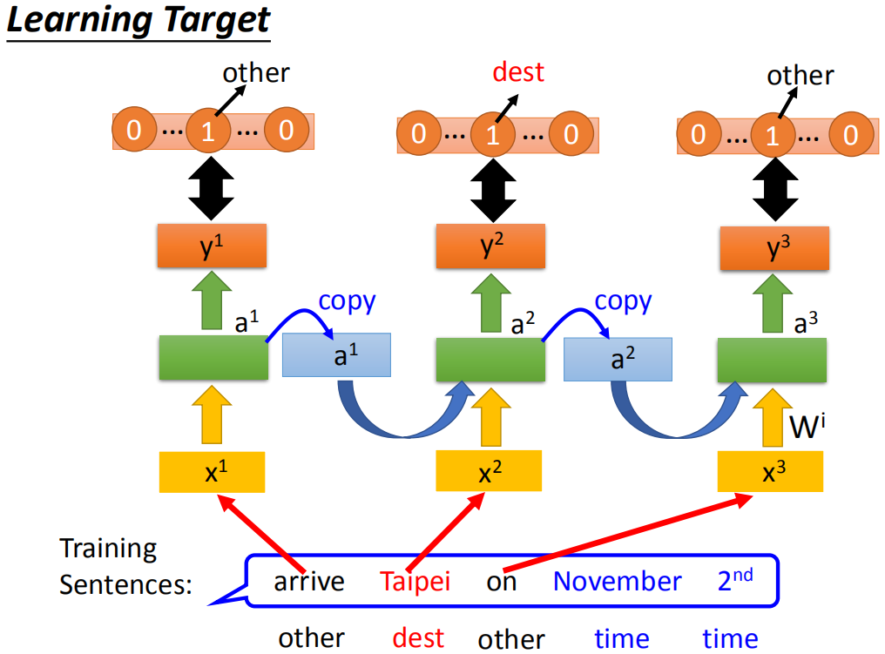
如果要做learning的话，你要定义一个cost function来evaluate你的model是好还是不好，选一个parameter要让你的loss 最小。那在Recurrent Neural 
Network里面，你会怎么定义这个loss呢，下面我们先不写算式，先直接举个例子。

假设我们现在做的事情是slot filling，那你会有train data，那这个train data是说:我给你一些sentence，你要给sentence一些label，告诉machine说第一个word它是属于other slot，“Taipei是”Destination slot,"on"属于other
slot，“November”和“2nd”属于time slot，然后接下来你希望说：你的cost咋样定义呢。那“arrive”丢到Recurrent Neural Network的时候，Recurrent Neural Network会得到一个output $y^1$,接下来这个$y^1​$会看它的reference vector算它的cross entropy。你会希望说，如果我们丢进去的是“arrive”，那他的reference vector应该对应到other slot的dimension(其他为0)，这个reference vector的长度就是slot的数目(这样四十个slot，reference vector的dimension就是40)，那input的这个word对应到other slot的话，那对应到other slot dimension为1,其它为0。

那现在把“Taipei”丢进去之后，因为“Taipei”属于destination slot,就希望说把$x^2$丢进去的话，$y^2$它要跟reference vector距离越近越好。那$y^2$的reference vector是对应到destination slot是1，其它为0。

那这边注意的事情就是，你在丢$x_2$之前，你一定要丢$x_1$(在丢“Taipei”之前先把“arrive''丢进去)，不然你就不知道存到memory里面的值是多少。所以在做training的时候，你也不能够把这些word打散来看，word sentence仍然要当做一个整体来看。把“on”丢进去，reference vector对应的other的dimension是1，其它是0.

RNN的损失函数output和reference vector的entropy的和就是要最小化的对象。

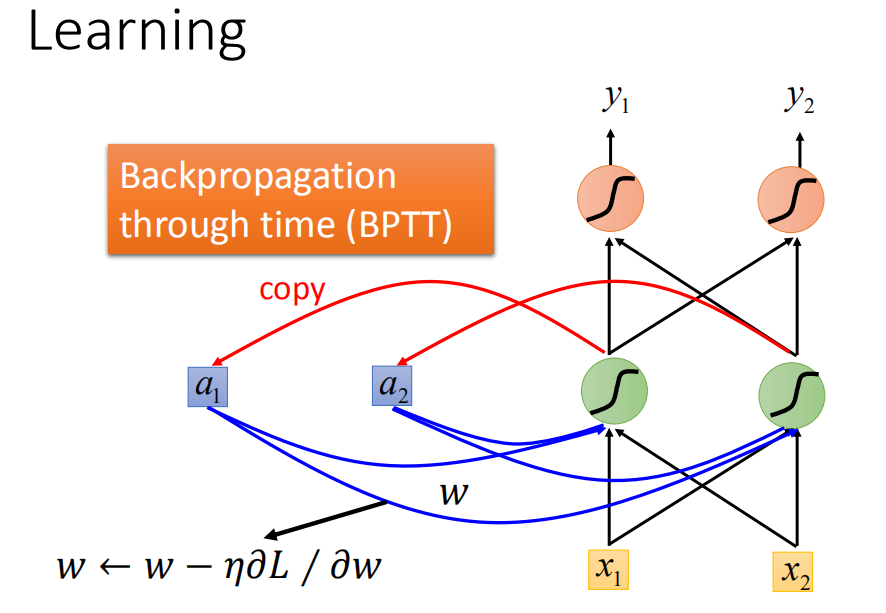
有了这个loss function以后，对于training，也是用梯度下降来做。也就是说我们现在定义出了loss function(L)，我要update这个neural network里面的某个参数w，就是计算对w的偏微分，偏微分计算出来以后，就用GD的方法去update里面的参数。在讲feedforward neural network的时候，我们说GD用在feedforward neural network里面你要用一个有效率的算法叫做Backpropagation。那Recurrent Neural Network里面，为了要计算方便，所以也有开发一套算法是Backpropagation的进阶版，叫做BPTT。它跟Backpropagation其实是很类似的，只是Recurrent Neural Network它是在high sequence上运作，所以BPTT它要考虑时间上的information。

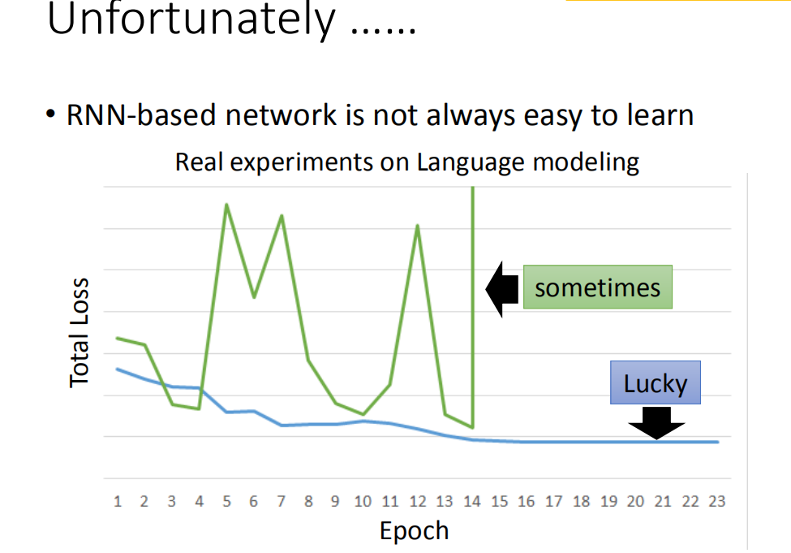
不幸的是，RNN的training是比较困难的。一般而言，你在做training的时候，你会期待，你的learning curve是像蓝色这条线，这边的纵轴是total loss，横轴是epoch的数目，你会希望说：随着epoch的数目越来越多，随着参数不断的update，loss会慢慢的下降最后趋向收敛。但是不幸的是你在训练Recurrent Neural Network的时候，你有时候会看到绿色这条线。如果你是第一次trai Recurrent Neural Network，你看到绿色这条learning curve非常剧烈的抖动，然后抖到某个地方，这时候你会有什么想法，我相信你会：这程序有bug啊。

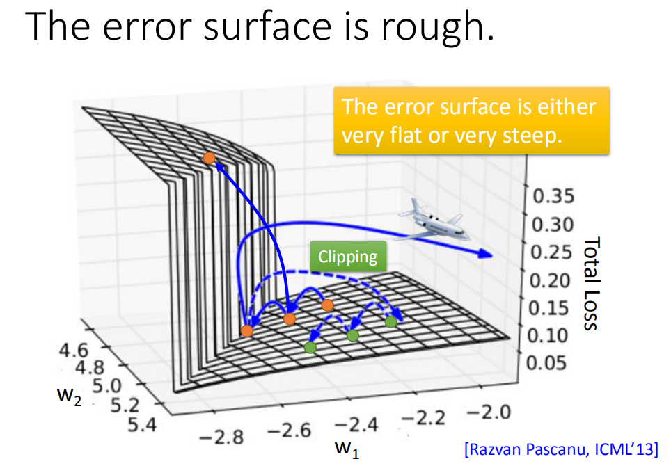
分析了下RNN的性质，他发现说RNN的error surface是total loss的变化是非常陡峭的/崎岖的(error surface有一些地方非常的平坦，一些地方非常的陡峭，就像是悬崖峭壁一样)，纵轴是total loss，x和y轴代表是两个参数。这样会造成什么样的问题呢？假设你从橙色的点当做你的初始点，用GD开始调整你的参数(updata你的参数，可能会跳过一个悬崖，这时候你的loss会突然爆长，loss会非常上下剧烈的震荡)。有时候你可能会遇到更惨的状况，就是以正好你一脚踩到这个悬崖上，会发生这样的事情，因为在悬崖上的gradient很大，之前的gradient会很小，所以你措手不及，因为之前gradient很小，所以你可能把learning rate调的比较大。很大的gradient乘上很大的learning rate结果参数就update很多，整个参数就飞出去了。

用工程的思想来解决，这一招蛮关键的，在很长的一段时间，只有他的code可以把RNN的model给train出来。

这一招就是clipping(当gradient大于某一个threshold的时候，不要让它超过那个threshold)，当gradient大于15时，让gradient等于15结束。因为gradient不会太大，所以你要做clipping的时候，就算是踩着这个悬崖上，也不飞出来，会飞到一个比较近的地方，这样你还可以继续做你得RNN的training。

问题：为什么RNN会有这种奇特的特性。有人会说，是不是来自sigmoid function，我们之前讲过Relu activation function的时候，讲过一个问题gradient vanish，这个问题是从sigmoid function来的，RNN会有很平滑的error surface是因为来自于gradient vanish，这问题我是不认同的。等一下来看这个问题是来自sigmoid function，你换成Relu去解决这个问题就不是这个问题了。跟大家讲个秘密，一般在train neural network时，一般很少用Relu来当做activation function。为什么呢？其实你把sigmoid function换成Relu，其实在RNN performance通常是比较差的。所以activation function并不是这里的关键点。

如果说我们今天讲BPTT，你可能会从式子更直观的看出为什么会有这个问题。那今天我们没有讲BPTT。没有关系，我们有更直观的方法来知道一个gradient的大小。

你把某一个参数做小小的变化，看它对network output的变化有多大，你就可以测出这个参数的gradient的大小。

举一个很简单的例子，只有一个neuron，这个neuron是linear。input没有bias，input的weight是1，output的weight也是1，transition的weight是w。也就是说从memory接到neuron的input的weight是w。

现在我假设给neural network的输入是(1,0,0,0)，那这个neural network的output会长什么样子呢？比如说，neural network在最后一个时间点(1000个output值是$w^{999}$)。

现在假设w是我们要learn的参数，我们想要知道它的gradient，所以是知道当我们改变w的值时候，对neural的output有多大的影响。现在假设w=1，那现在$y^{1000}=1$，假设w=1.01，$y^{1000}\approx 20000$，这个就跟蝴蝶效应一样，w有一点小小的变化，会对它的output影响是非常大的。所以w有很大的gradient。有很大的gradient也并没有，我们把learning rate设小一点就好了。但我们把w设为0.99，那$y^{1000}\approx0$，那如果把w设为0.01，那$y^{1000}\approx0$。也就是说在1的这个地方有很大的gradient，但是在0.99这个地方就突然变得非常非常的小，这个时候你就需要一个很大的learning rate。设置learning rate很麻烦，你的error surface很崎岖，你的gardient是时大时小的，在非常小的区域内，gradient有很多的变化。从这个例子你可以看出来说，为什么RNN会有问题，RNN training的问题其实来自它把同样的东西在transition的时候反复使用。所以这个w只要一有变化，它完全由可能没有造成任何影响，一旦造成影响，影响都是天崩地裂的(所以gradient会很大，gradient会很小)。

所以RNN不好训练的原因不是来自activation function而是来自于它有high sequence同样的weight在不同的时间点被反复的使用。

## 如何解决RNN梯度消失或者爆炸

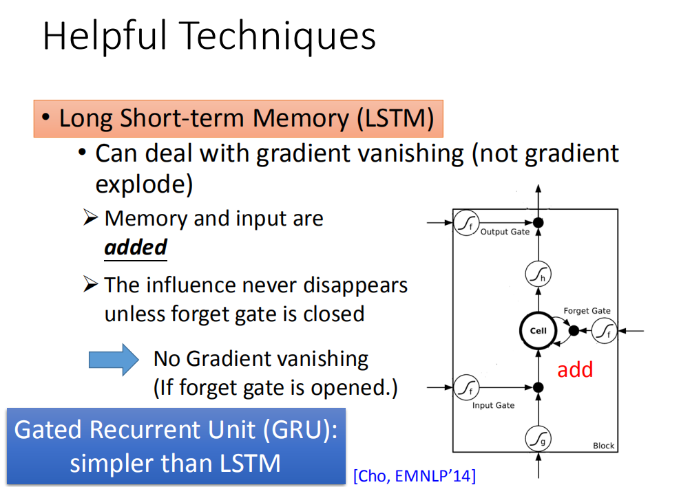
有什么样的技巧可以告诉我们可以解决这个问题呢？其实广泛被使用的技巧就是LSTM，LSTM可以让你的error surface不要那么崎岖。它可以做到的事情是，它会把那些平坦的地方拿掉，解决gradient vanish的问题，不会解决gradient explode的问题。有些地方还是非常的崎岖的(有些地方仍然是变化非常剧烈的，但是不会有特别平坦的地方)。

如果你要做LSTM时，大部分地方变化的很剧烈，所以当你做LSTM的时候，你可以放心的把你的learning rate设置的小一点，保证在learning rate很小的情况下进行训练。

那为什么LSTM 可以解决梯度消失的问题呢，为什么可以避免gradient特别小呢？

我听说某人在面试某国际大厂的时候被问到这个问题，那这个问题怎么答比较好呢(问题：为什么我们把RNN换成LSTM)。如果你的答案是LSTM比较潮，LSTM比较复杂，这个就太弱了。正在的理由就是LSTM可以handle gradient vanishing的问题。接下里面试官说：为什么LSTM会handle gradient vanishing的问题呢？用这边的式子回答看看，若考试在碰到这样的问题时，你就可以回答了。

RNN跟LSTM在面对memory的时候，它处理的操作其实是不一样的。你想想看，在RNN里面，在每一个时间点，memory里面的值都是会被洗掉，在每一个时间点，neuron的output都要memory里面去，所以在每一个时间点，memory里面的值都是会被覆盖掉。但是在LSTM里面不一样，它是把原来memory里面的值乘上一个值再把input的值加起来放到cell里面。所以它的memory input是相加的。所以今天它和RNN不同的是，如果今天你的weight可以影响到memory里面的值的话，一旦发生影响会永远都存在。不像RNN在每个时间点的值都会被format掉，所以只要这个影响被format掉它就消失了。但是在LSTM里面，一旦对memory造成影响，那影响一直会被留着(除非forget gate要把memory的值洗掉)，不然memory一旦有改变，只会把新的东西加进来，不会把原来的值洗掉，所以它不会有gradient vanishing的问题

那你想说们现在有forget gate可能会把memory的值洗掉。其实LSTM的第一个版本其实就是为了解决gradient vanishing的问题，所以它是没有forget gate，forget gate是后来才加上去的。甚至，现在有个传言是：你在训练LSTM的时候，你要给forget gate特别大的bias，你要确保forget gate在多数的情况下都是开启的，只要少数的情况是关闭的

那现在有另外一个版本用gate操控memory cell，叫做Gates Recurrent Unit(GRU)，LSTM有三个Gate，而GRU有两个gate，所以GRU需要的参数是比较少的。因为它需要的参数量比较少，所以它在training的时候是比较鲁棒的。如果你今天在train LSTM，你觉得overfitting的情况很严重，你可以试下GRU。GRU的精神就是：旧的不去，新的不来。它会把input gate跟forget gate联动起来，也就是说当input gate打开的时候，forget gate会自动的关闭(format存在memory里面的值)，当forget gate没有要format里面的值，input gate就会被关起来。也就是说你要把memory里面的值清掉，才能把新的值放进来。

### 其他方式

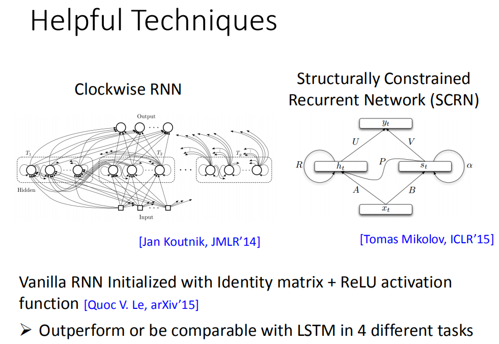
其实还有其他的technique是来handle gradient vanishing的问题。比如说clockwise RNN或者说是Structurally Constrained Recurrent Network (SCRN)等等。

有一个蛮有趣的paper是这样的：一般的RNN用identity matrix（单位矩阵）来initialized transformation weight+ReLU activaton function它可以得到很好的performance。刚才不是说用ReLU的performance会比较呀，如果你说一般train的方法initiaed weight是(这个单词没懂)，那ReLU跟sigmoid function来比的话，sigmoid performance 会比较好。但是你今天用了identity matrix的话，这时候用ReLU performance会比较好。

# RNN其他应用

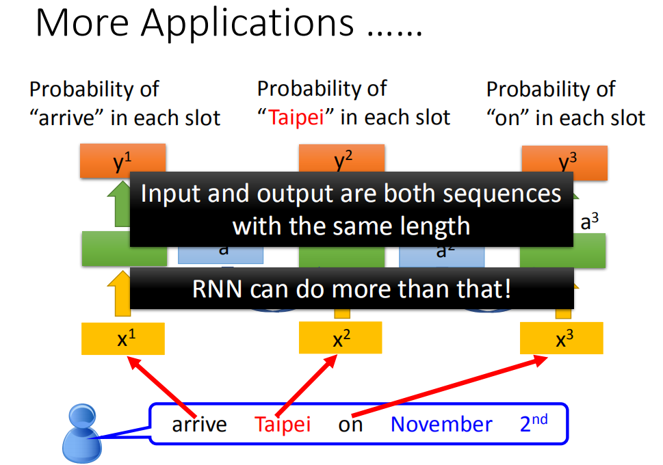
其实RNN有很多的application，前面举得那个solt filling的例子。我们假设input跟output的数目是一样的，也就是说input有几个word，我们就给每一个word slot label。那其实RNN可以做到更复杂的事情

## 多对一序列

### 情感识别

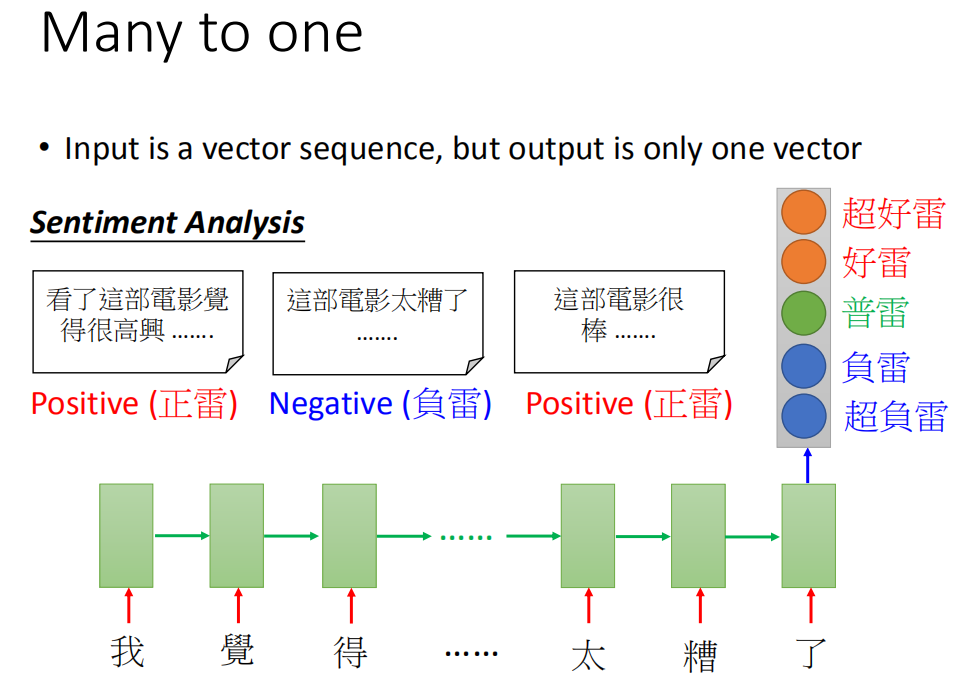
那其实RNN可以做到更复杂的事情，比如说input是一个sequence，output是一个vector，这有什么应用呢。比如说，你可以做sentiment analysis。sentiment analysis现在有很多的应用：

某家公司想要知道，他们的产品在网上的评价是positive 还是negative。他们可能会写一个爬虫，把跟他们产品有关的文章都爬下来。那这一篇一篇的看太累了，所以你可以用一个machine learning 的方法learn一个classifier去说哪些document是正向的，哪些document是负向的。或者在电影上，sentiment analysis所做的事就是给machine 看很多的文章，然后machine要自动的说，哪些文章是正类，哪些文章是负类。怎么样让machine做到这件事情呢？你就是learn一个Recurrent Neural Network，这个input是character sequence，然后Recurrent Neural Network把这个sequence读过一遍。在最后一个时间点，把hidden layer拿出来，在通过几个transform，然后你就可以得到最后的sentiment analysis(这是一个分类的问题，但是因为input是sequence，所以用RNN来处理)

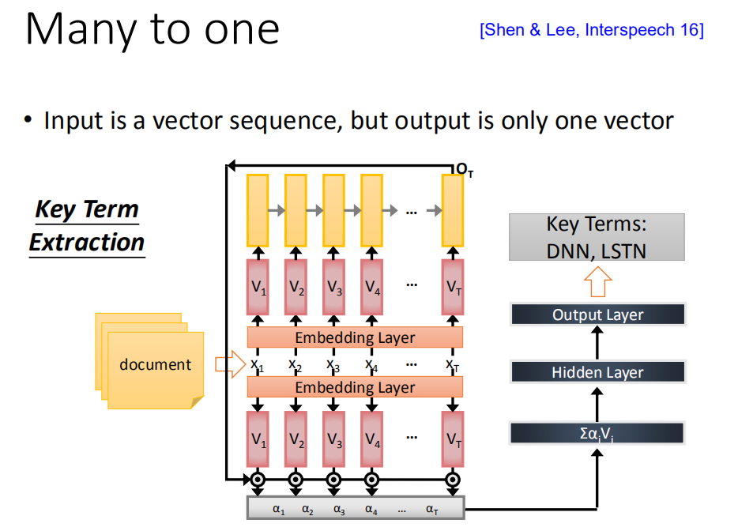
用RNN来作key term extraction。key term extraction意思就是说给machine看一个文章，machine要预测出这篇文章有哪些关键词汇。那如果你今天能够收集到一些training data(一些document，这些document都有label，哪些词汇是对应的，那就可以直接train一个RNN)，那这个RNN把document当做input，通过Embedding layer，然后用RNN把这个document读过一次，然后把出现在最后一个时间点的output拿过来做attention，你可以把这样的information抽出来再丢到feedforward neural network得到最后的output

## 多对多序列

### 语音识别

那它也可以是多对多的，比如说当你的input和output都是sequence，但是output sequence比input sequence短的时候，RNN可以处理这个问题。什么样的任务是input sequence长，output sequence短呢。比如说，语音辨识就是这样的任务。在语音辨识这个任务里面input是acoustic sequence(说一句话，这句话就是一段声音讯号)。我们一般处理声音讯号的方式，在这个声音讯号里面，每隔一小段时间，就把它用vector来表示。这个一小段时间是很短的(比如说，0.01秒)。那output sequence是character sequence。

如果你是原来的RNN(slot filling的那个RNN)，你把这一串input丢进去，它充其量只能做到说，告诉你每一个vector对应到哪一个character。加入说中文的语音辨识的话，那你的output target理论上就是这个世界上所有可能中文的词汇，常用的可能是八千个，那你RNNclassifier的数目可能就是八千个。虽然很大，但也是没有办法做的。但是充其量只能做到说：每一个vector属于一个character。每一个input对应的时间间隔是很小的(0.01秒)，所以通常是好多个vector对应到同一个character。所以你的辨识结果为“好好好棒棒棒棒棒”。你会说：这不是语音辨识的结果呀，有一招叫做“trimming”(把重复的东西拿掉)，就变成“好棒”。这这样会有一个严重的问题，因为它没有辨识“好棒棒”。

### CTC语音识别

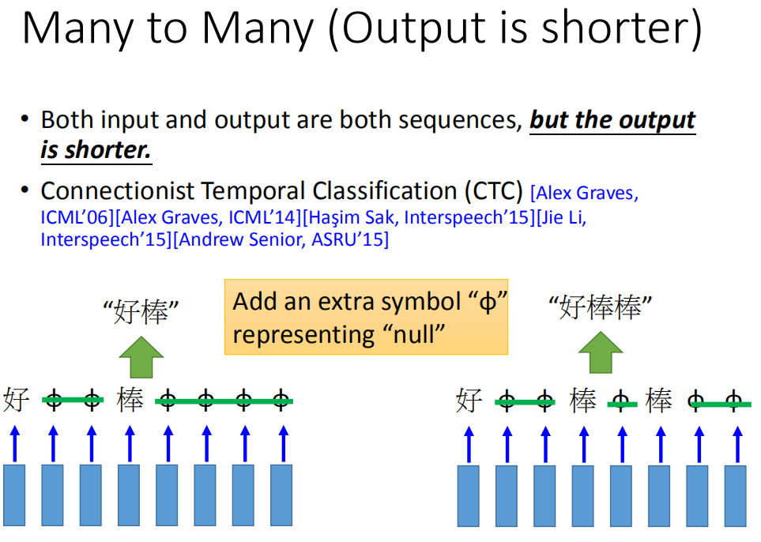
需要把“好棒”跟“好棒棒”分开来，怎么办，我们有一招叫做“CTC”(这招很神妙)，它说：我们在output时候，我们不只是output所有中文的character，我们还有output一个符号，叫做"null""(没有任何东西)。所以我今天input一段acoustic feature sequence,它的output是“好 null null 棒 null null null null”，然后我就把“null”的部分拿掉，它就变成“好棒”。如果我们输入另外一个sequence，它的output是“好 null null 棒 null 棒 null null”，然后把“null”拿掉，所以它的output就是“好棒棒”。这样就可以解决叠字的问题了。

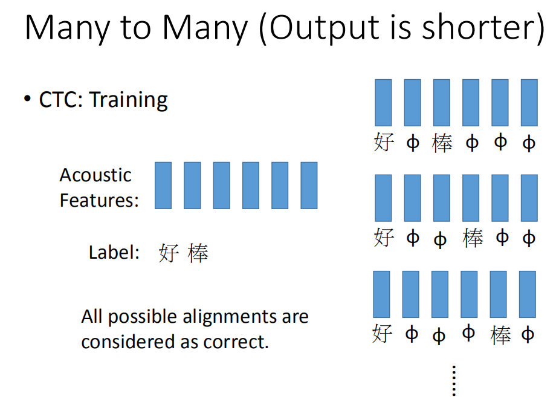
那在训练neuron怎么做呢(CTC怎么做训练呢)。CTC在做training的时候，你手上的train data就会告诉你说，这一串acoustic features对应到这一串character sequence，但它不会告诉你说“好”是对应第几个character 到第几个character。这该怎么办呢，穷举所有可能的alignments。简单来说就是，我们不知道“好”对应到那几个character，“棒”对应到哪几个character。假设我们所有的状况都是可能的。可能第一个是“好 null 棒 null null null”，可能是“好 null null 棒 null null”，也可能是“好 null null null 棒 null”。我们不知道哪个是对的，那假设全部都是对的。在training的时候，全部都当做是正确的，然后一起train。穷举所有的可能，那可能性太多了，有没有巧妙的算法可以解决这个问题呢？那今天我们就不细讲这个问题。

以下是在文献CTC上得到的结果。在做英文辨识的时候，你的RNN output target 就是character(英文的字母+空白)。直接output字母，然后如果字和字之间有boundary，就自动有空白。

假设有一个例子，第一个frame是output h，第二个frame是output null，第三个frame是output null，第四个frame是output I等等。如果你看到output是这样子话，那最后把“null”的地方拿掉，那这句话的辨识结果就是“HIS FRIEND'S”。你不需要告诉machine说："HIS"是一个词汇，“FRIEND's”是一个词汇,machine通过training data会自己学到这件事情。那传说，Google的语音辨识系统已经全面换成CTC来做语音辨识。如果你用CTC来做语音辨识的话，就算是有某一个词汇(比如是：英文中人名，地名)在training data中从来没有出现过，machine也是有机会把它辨识出来。

## Sequence to sequence learning

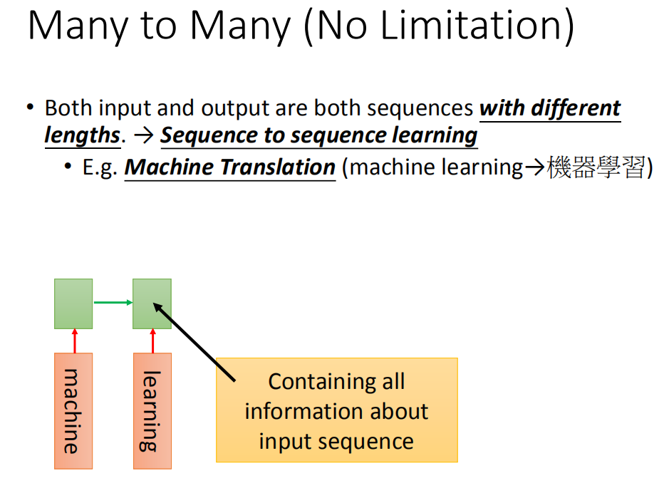
另外一个神奇RNN的应用叫做sequence to sequence learning，在sequence to sequence learning里面,RNN的input跟output都是sequence(但是两者的长度是不一样的)。刚在在CTC时，input比较长，output比较短。在这边我们要考虑的是不确定input跟output谁比较长谁比较短。

比如说，我们现在做machine translation，input英文word sequence把它翻译成中文的character sequence。那我们并不知道说，英文跟中文谁比较长谁比较短(有可能是output比较长，output比较短)。所以改怎么办呢？

现在假如说input machine learning ，然后用RNN读过去，然后在最后一个时间点，这个memory里面就存了所有input sequence的information。

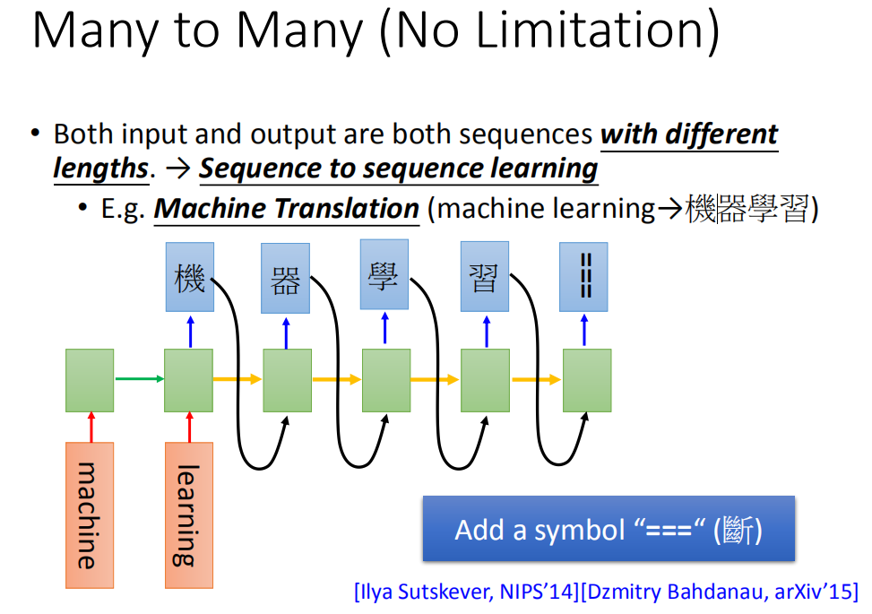
然后接下来，你让machine 吐一个character(机)，然后就让它output下一个character，把之前的output出来的character当做input，再把memory里面的值读进来，它就会output “器”。那这个“机”怎么接到这个地方呢，有很多支支节节的技巧，还有很多不同的变形。在下一个时间input “器”，output“学”，然后output“习”，然后一直output下去

这就让我想到推文接龙，有一个人推超，下一个人推人，然后推正，然后后面一直推推，等你推好几个月，都不会停下来。你要怎么让它停下来呢？推出一个“断”，就停下来了。

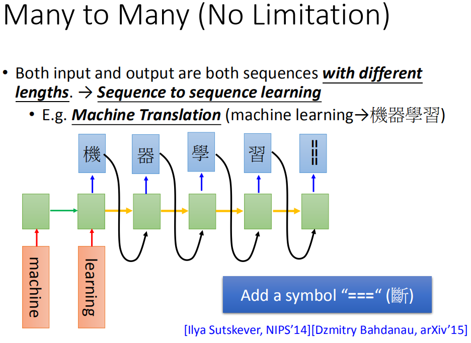
要怎么阻止让它产生词汇呢？你要多加一个symbol “断”，所以现在manchine不只是output说可能character，它还有一个可能output 叫做“断”。所以今天“习”后面是“===”(断)的话，就停下来了。你可能会说这个东西train的起来吗，这是train的起来的。

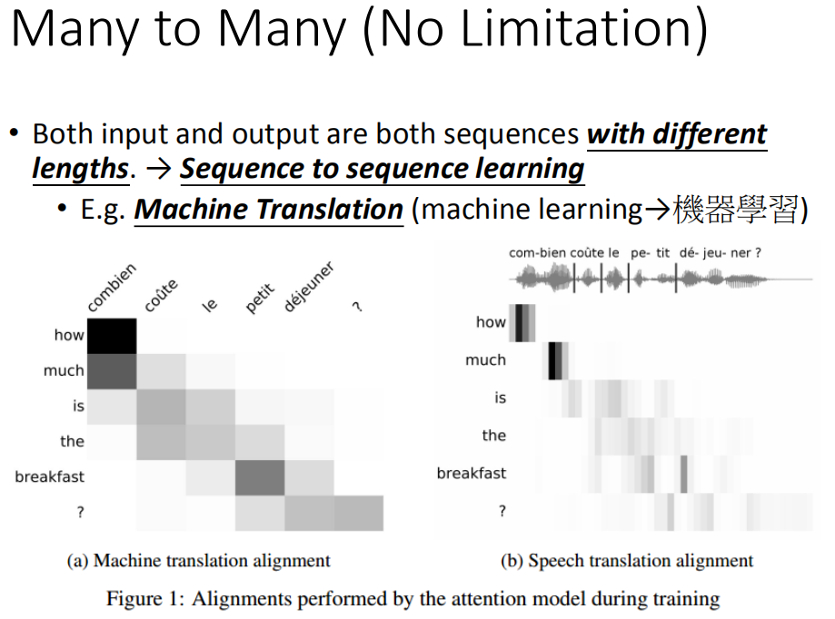
这篇的papre是这样做的，sequence to sequence learning我们原来是input 某种语言的文字翻译成另外一种语言的文字(假设做翻译的话)。那我们有没有可能直接input某种语言的声音讯号，output另外一种语言的文字呢？我们完全不做语音辨识。比如说你要把英文翻译成中文，你就收集一大堆英文的句子，看看它对应的中文翻译。你完全不要做语音辨识，直接把英文的声音讯号丢到这个model里面去，看它能不能output正确的中文。这一招居然是行得通的。假设你今天要把台语转成英文，但是台语的语音辨识系统不好做，因为台语根本就没有standard文字系统，所以这项技术可以成功的话，未来你在训练台语转英文语音辨识系统的时候，你只需要收集台语的声音讯号跟它的英文翻译就可以刻了。你就不需要台语语音辨识的结果，你也不需要知道台语的文字，也可以做这件事。

### Beyond Sequence

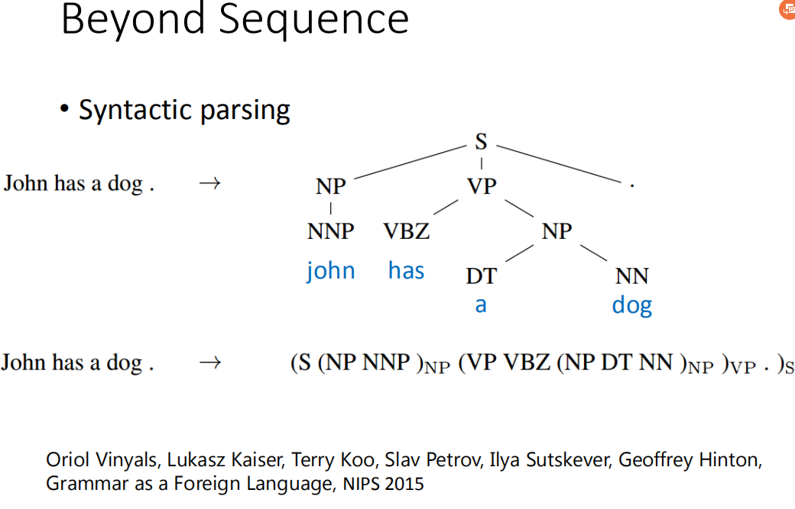
利用sequence to sequence的技术，甚至可以做到Beyond Sequence。这个技术也被用到syntactic parsing。synthetic parsing这个意思就是说，让machine看一个句子，它要得到这个句子的结构树，得到一个树状的结构。怎么让machine得到这样的结构呢？，过去你可能要用structured learning的技术能够解这个问题。但是现在有了 sequence to sequence learning的技术以后，你只要把这个树状图描述成一个sequence(具体看图中 john has a dog)。所以今天是sequence to sequence learning 的话，你就直接learn 一个sequence to sequence model。它的output直接就是syntactic parsing tree。这个是可以train的起来的，非常的surprised

你可能想说machine它今天output的sequence不符合文法结构呢(记得加左括号，忘记加右括号)，神奇的地方就是LSTM不会忘记右括号。

## Document转成Vector

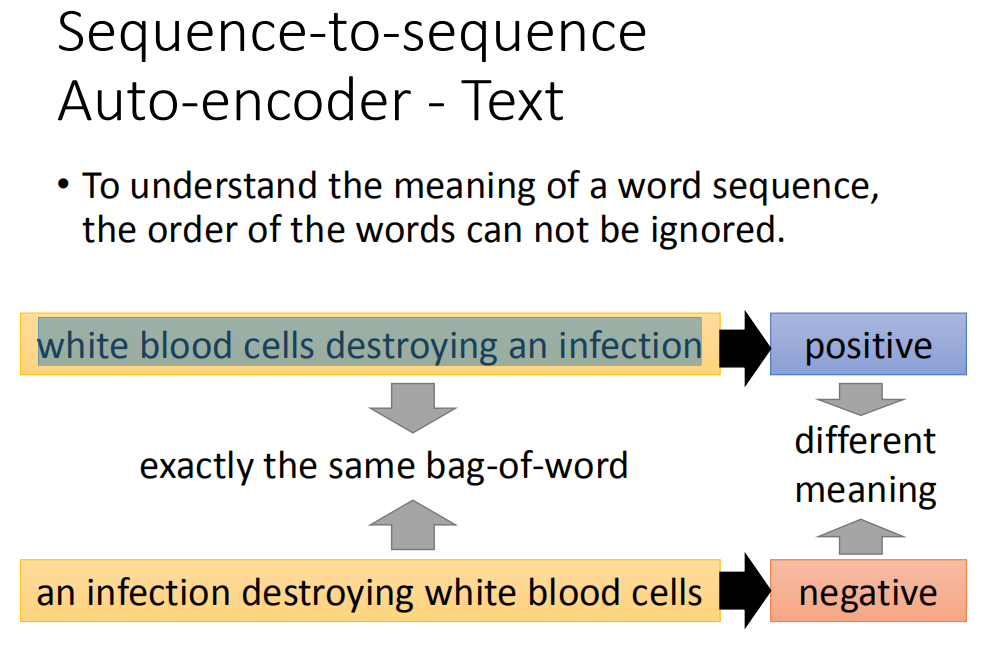
那我们要将一个document表示成一个vector的话，往往会用bag-of-word的方法，用这个方法的时候，往往会忽略掉 word order information。举例来说，有一个word sequence是“white blood cells destroying an infection”，另外一个word sequence是：“an infection destroying white blood cells”，这两句话的意思完全是相反的。但是我们用bag-of-word的方法来描述的话，他们的bag-of-word完全是一样的。它们里面有完全一摸一样的六个词汇，因为词汇的order是不一样的，所以他们的意思一个变成positive，一个变成negative，他们的意思是很不一样的。

那我们可以用sequence to sequence Auto-encoder这种做法来考虑word sequence order的情况下，把一个document变成一个vector。

# Sequence-to-sequence -Text

### 

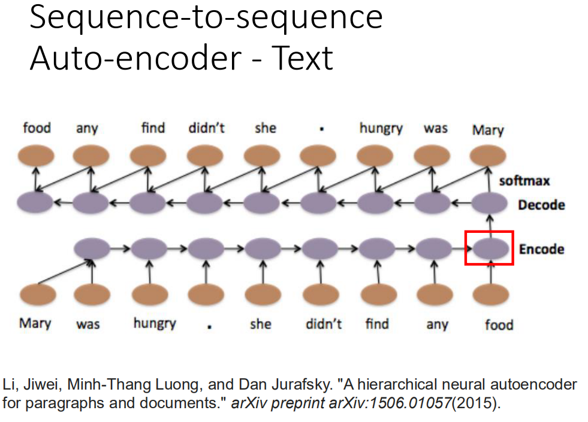
input一个word sequence，通过Recurrent Neural  Network变成一个invalid vector，然后把这个invalid vector当做decoder的输入，然后让这个decoder，找回一模一样的句子。如果今天Recurrent Neural Network可以做到这件事情的话，那Encoding这个vector就代表这个input sequence里面重要的information。在trian Sequence-to-sequence Auto-encoder的时候，不需要label data，你只需要收集大量的文章，然后直接train下去就好了。

Sequence-to-sequence 还有另外一个版本叫skip thought，如果用Sequence-to-sequence的，输入输出都是同一个句子，如果用skip thought的话，输出的目标就会是下一个句子，用sequence-to-sequence得到的结果通常容易表达，如果要得到语义的意思的，那么skip thought会得到比较好的结果。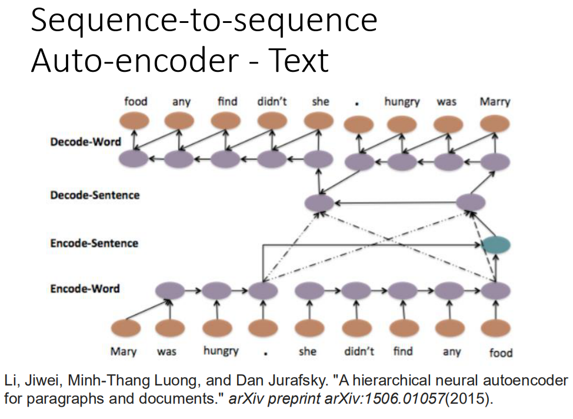
这个结构甚至可以是hierarchical,你可以每一个句子都先得到一个vector(Mary was hungry得到一个vector，she didn't find any food得到一个vector)，然后把这些vector加起来，然后变成一个整个 document high label vector，在让这整个vector去产生一串sentence vector，在根据每一个sentence vector再去解回word sequence。这是一个四层的LSTM(从word 变成sentence sequence ，变成document lable，再解回sentence sequence，再解回word sequence)

# Sequence-to-sequence -Speech

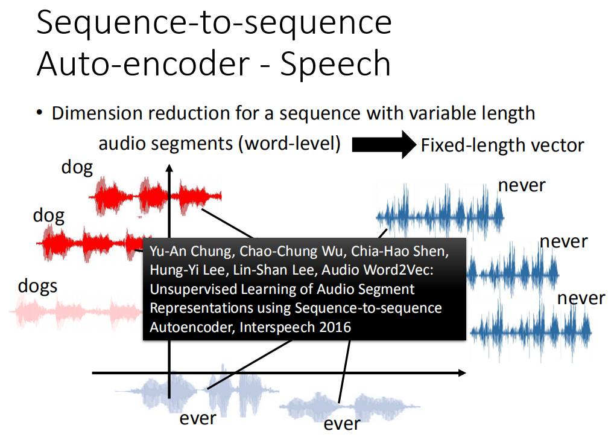
这个也可以用到语音上，在语音上，它可以把一段audio segment变成一个fixed length vector。比如说，左边有一段声音讯号，长长短短都不一样，那你把他们变成vector的话，可能dog跟dogs比较接近，never和ever比较接近。我称之为audio auto vector。一般的auto vector它是把word变成vector，这个是把一段声音讯号变成一个vector。

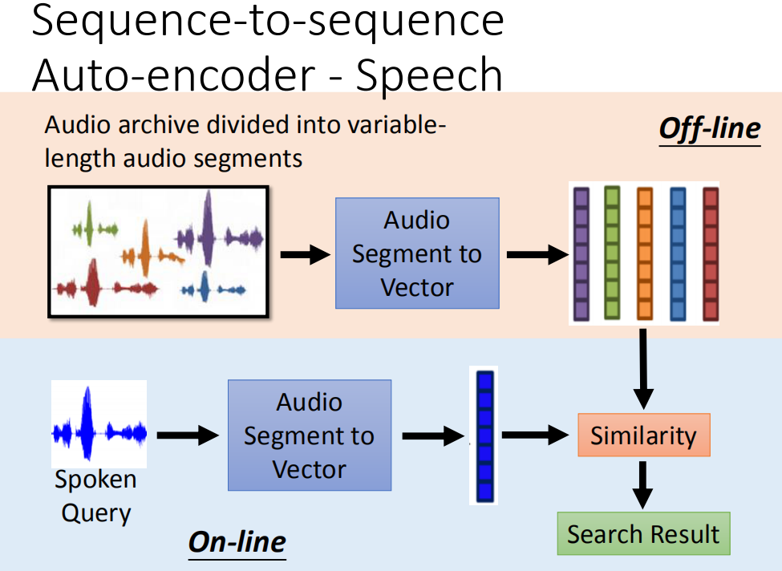
那这个东西有什么用呢？它可以做很多的事。比如说，我们可以拿来做语音的搜寻。什么是语音的搜寻呢？你有一个声音的data base(比如说，上课的录音，然后你说一句话，比如说，你今天要找跟美国白宫有关的东西，你就说美国白宫，不需要做语音辨识，直接比对声音讯号的相似度，machine 就可以从data base里面把提到的部分找出来)

怎么实现呢？你就先把一个audio data base，把这个data base做segmentation切成一段一段的。然后每一个段用刚才讲的audio segment to vector这个技术，把他们通通变成vector。然后现再输入一个spoken query，可以通过audio segment to vector技术也变成vector，接下来计算他们的相似程度。然后就得到搜寻的结果

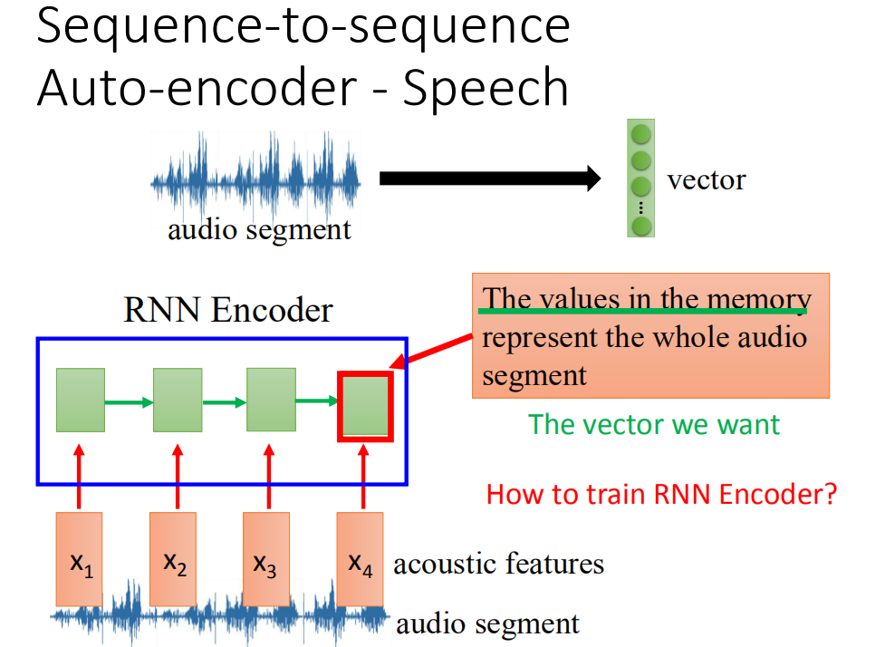
如何把一个audio segment变成一个vector呢？把audio segment抽成acoustic features，然后把它丢到Recurrent neural network里面去，那这个recurrent neural network它的角色就是Encoder，那这个recurrent neural network读过acoustic features之后，最后一个时间点它存在memory里面的值就代表了input声音讯号它的information。它存到memory里面的值是一个vector。这个其实就是我们要拿来表示整段声音讯号的vector。

但是只要RNN Encoder我没有办法去train，同时你还要train一个RNN Decoder，Decoder的作用就是，它把Encoder得到的值存到memory里面的值，拿进来当做input，然后产生一个acoustic features sequence。然后希望这个$y_1$跟$x_1$越接近越好。然后再根据$y_1$产生$y_2$，以此类推。今天训练的target$y_1,y_2,y_3,y_4$跟$x_1,x_2,x_3,x_4$越接近越好。那在训练的时候，RNN Encoder跟RNN Decoder是一起train的

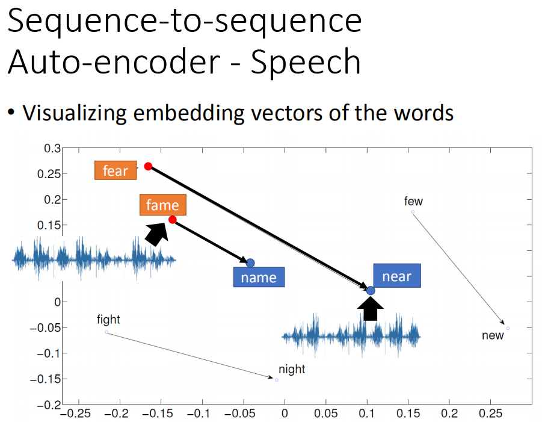
我们在实验上得到一些有趣的结果，图上的每个点其实都是一段声音讯号，你把声音讯号用刚才讲的
Sequence-to-sequence Auto-encoder技术变成平面上一个vector。发现说：fear这个位置在左上角，near的位置在右下角，他们中间这样的关系(fame在左上角，name在右下角)。你会发现说：把fear的开头f换成n，跟fame的开头f换成n，它们的word vector的变化方向是一样的。现在这个技术还没有把语义加进去。

# Demo：聊天机器人

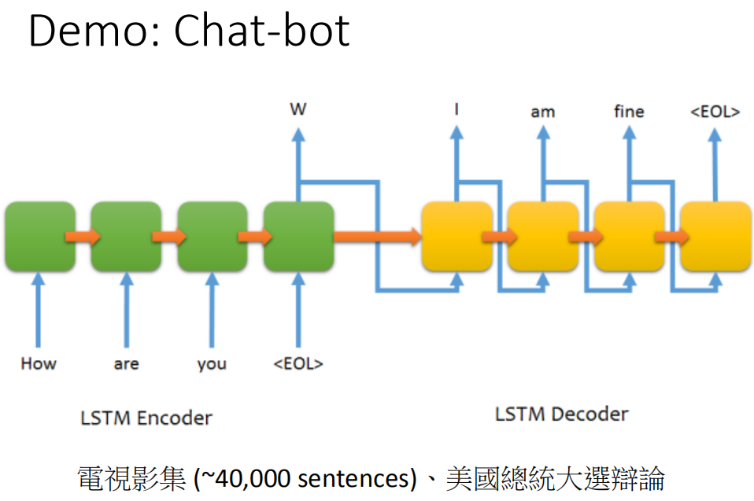
现在有一个demo，这个demo是用Sequence-to-sequence Auto-encoder来训练一个chat-bot(聊天机器人)。怎么用sequence to sequence learning来train chat-bot呢？你就收集很多的对话，比如说电影的台词，在电影中有一个台词是“How are you”，另外一个人接“I am fine”。那就告诉machine说这个sequence to sequence learning当它input是“How are you”的时候，这个model的output就要是“I am fine”。你可以收集到这种data，然后就让machine去 train。这里我们就收集了四万句和美国总统辩论的句子，然后让machine去学这个sequence to sequence这个model。

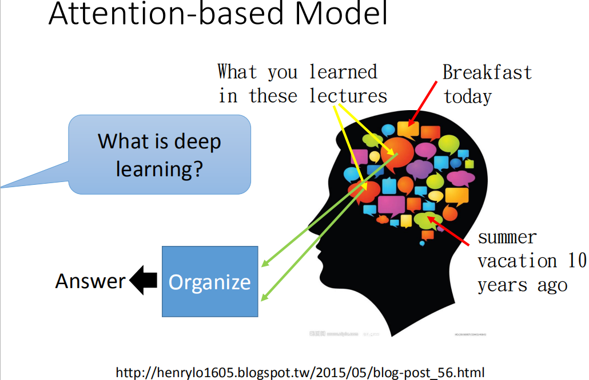
现在除了RNN以外，还有另外一种有用到memory的network，叫做Attention-based Model，这个可以想成是RNN的进阶的版本。

那我们知道说，人的大脑有非常强的记忆力，所以你可以记得非常非常多的东西。比如说，你现在同时记得早餐吃了什么，同时记得10年前夏天发生的事，同时记得在这几门课中学到的东西。那当然有人问你说什么是deep learning的时候，那你的脑中会去提取重要的information，然后再把这些information组织起来，产生答案。但是你的脑中会自动忽略那些无关的事情，比如说，10年前夏天发生的事情等等。

# Attension-based Model

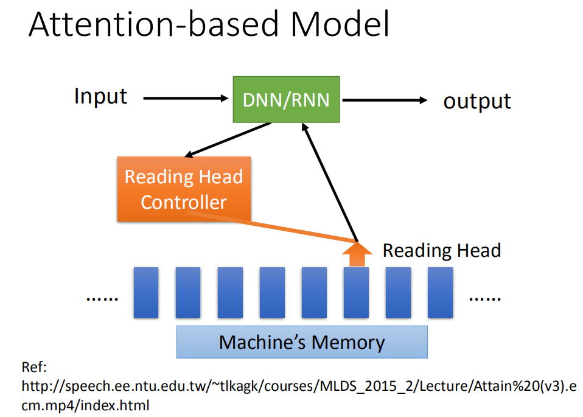
其实machine也可以做到类似的事情，machine也可以有很大的记忆的容量。它可以有很大的data base，在这个data base里面，每一个vector就代表了某种information被存在machine的记忆里面。

当你输入一个input的时候，这个input会被丢进一个中央处理器，这个中央处理器可能是一个DNN/RNN，那这个中央处理器会操控一个Reading Head 
Controller，这个Reading Head Controller会去决定这个reading head放的位置。machine再从这个reading head 的位置去读取information，然后产生最后的output

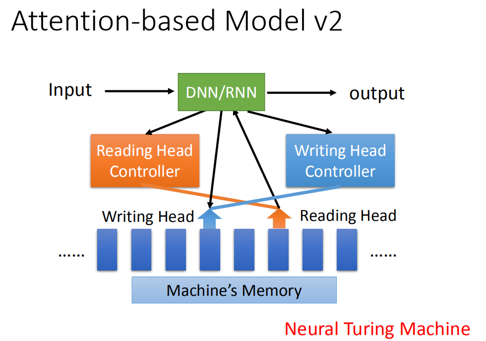
这个model还有一个2.0的版本，它会去操控writing head controller。这个writing head controller会去决定writing head 放的位置。然后machine会去把它的information通过这个writing head写进它的data base里面。所以，它不仅有读的功能，还可以discover出来的东西写入它的memory里面去。这个就是大名鼎鼎的Neural Turing Machine

## 阅读理解

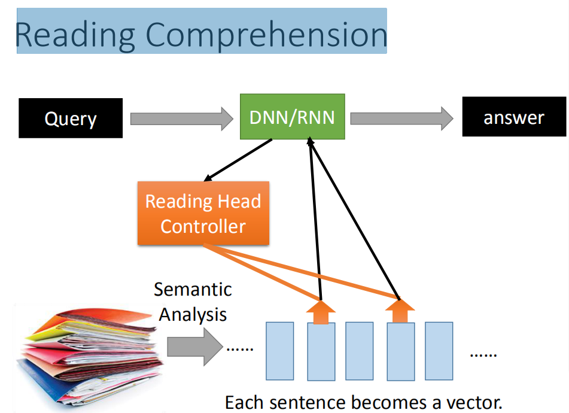
Attention-based Model 常常用在Reading Comprehension里面。所谓的Reading Comprehension就是让machine读一堆document，然后把这些document里面的内容(每一句话)变成一个vector。每一个vector就代表了每一句话的语义。比如你现在想问machine一个问题，然后这个问题被丢进中央处理器里面，那这个中央处理器去控制而来一个reading head controller，去决定说现在在这个data base里面哪些句子是跟中央处理器有关的。假设machine发现这个句子是跟现在的问题是有关的，就把reading head放到这个地方，把information 读到中央处理器中。读取information这个过程可以是重复数次,也就是说machine并不会从一个地方读取information，它先从这里读取information以后，它还可以换一个位置读取information。它把所有读到的information收集起来，最后给你一个最终的答案。

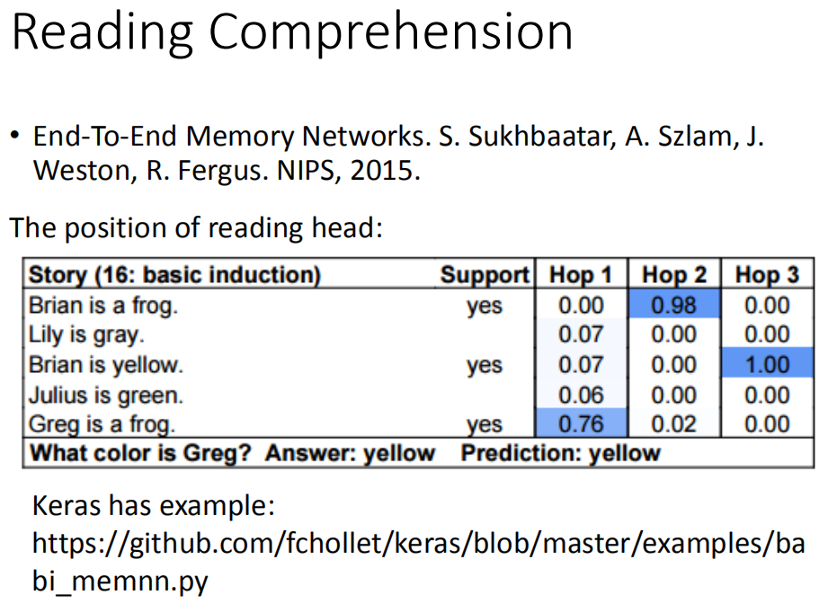

上图是在baby corpus上的结果，baby corpus是一个Q&A的一个简单的测试。我们需要做的事就是读过这五个句子，然后说：what color is Grey?，得到正确的答案，yes。那你可以从machine attention的位置(也就是reading head 的位置)看出machine的思路。图中蓝色代表了machine reading head 的位置，Hop1，Hop2，Hop3代表的是时间，在第一个时间点，machine先把它的reading head放在“greg is a frog”，把这个information提取出来。接下来提取“brian is a frog” information ，再提取“brian is yellow”information。最后它得到结论说：greg 的颜色是yellow。这些事情是machine自动learn出来的。也就是machine attention在哪个位置，这些通过neural network学到该怎么做，并不是去写程序，你要先看这个句子，在看这个句子。这是machine自动去决定的。

## Visual Question Answering

也可以做Visual Question Answering，让machine看一张图，问它这是什么，如果它可以正确回答说：这是香蕉，这就非常厉害了。

这个Visual Question Answering该怎么做呢？先让machine看一张图，然后通过CNN你可以把这张图的一小块region用一小块的vector来表示。接下里，输入一个query，这个query被丢到中央处理器中，这个中央处理器去操控这个reading head controller，这个reading head controller决定读取的位置(是跟现在输入的问题是有关系的，这个读取的process可能要好几个步骤，machine会分好几次把information读到中央处理器，最后得到答案。

## Speech Question Answering

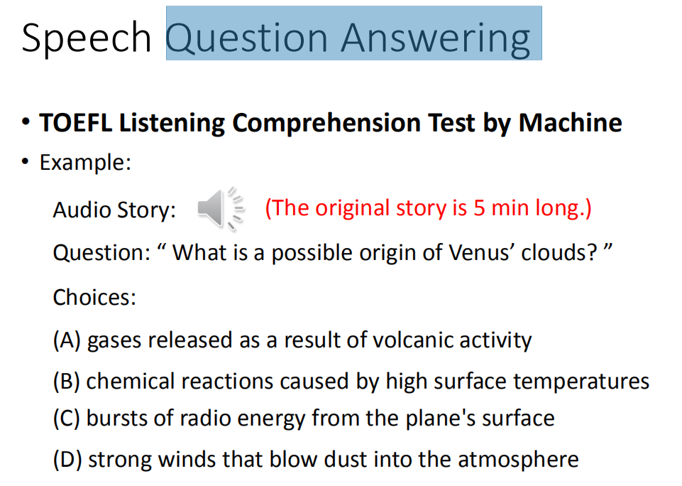
那可以做语音的Question Answering 。比如说：在语音处理实验上我们让machine做TOEFL Listening Comprehension Test 。让machine听一段声音，然后问它问题，从四个选项里面，machine选择出正确的选项。那machine做的事情是跟人类考生做的事情是一模一样的。

那用的Model Architecture跟我们刚才看到的其实大同小异。你让machine先读一个question，然后把question做语义的分析得到question的语义，声音的部分是让语音辨识先转成文字，在把这些文字做语音的分析，得到这段文字的语义。那machine了解question的语义然后就可以做attention，决定在audio story里面哪些部分是回答问题有关的。这就像画重点一样，machine画的重点就是答案，它也可以回头去修正它产生的答案。经过几个process以后，machine最后得到的答案跟其他几个选项计算相似度，然后看哪一个想项的相似度最高，它就选那一个选项。那整个test就是一个大的neural network。除了语音辨识以外question semantic部分和audio semantic部分都是neural network，所以他们就可以训练的。

这些是一些实验结果，这个实验结果是：random 正确率是25 percent。有两个方法要比25 percent要强的。

这五个方法都是naive的方法，也就是完全不管文章的内容，直接看问题跟选项就猜答案。我们发现说，如果你选最短的那个选项，你就会得到35 percent的正确率。如果分析四个选项的semantic，用sequence-to-sequence autoencoder，去把一个选项的semantic找出来，然后再去看某个选项和另外三个选项的相似度，如果比较高的话，那就把该选项选出来。和人的直觉是相反的，直觉应该是选一个语义和另外三个语义是不像的，但是别人已经计算到会这么做的了，所以用了计中计，如果要选和其他选项语义比较相似的答案，反而比随便选得到正确答案的概率要高，如果选最不像的那个选项，得到的答案就会接近随机，都是设计好的。

另外还可以用memory network可以得到39.2 %正确率，如果用我们刚才讲的那个model的话，可以做到48.8%正确率。

## RNN 和Structured learning关系

使用deep learning跟structure learning的技术有什么不同呢？首先假如我们用的是unidirectional RNN/LSTM，当你在  decision的时候，你只看了sentence的一半，而你是用structure learning的话，比如用Viterbi algrithm你考虑的是整个句子。从这个结果来看，也许HMM，SVM等还是占到一些优势的。但是这个优势并不是很明显，因为RNN和LSTM他们可以做Bidirectional ，所以他们也可以考虑一整个句子的information

在HMM/SVM里面，你可以explicitly的考虑label之间的关系

举例说，如果做inference的时候，再用Viterbi algrithm求解的时候（假设每个label出现的时候都要出现五次）这个算法可以轻松做到，因为可以修改机器在选择分数最高的时候，排除掉不符合constraint的那些结果，但是如果是LSTM/RNN，直接下一个constraint进去是比较难的，因为没办法让RNN连续吐出某个label五次才是正确的。所以在这点上，structured learning似乎是有点优势的。如果是RNN/LSTM，你的cost function跟你实际上要考虑的error往往是没有关系的，当你做RNN/LSTM的时候，考虑的cost是每一个时间点的cross entropy(每一个时间的RNN的output cross entropy)，它跟你的error不见得是直接相关的。但是你用structure learning的话，structure learning 的cost会影响你的error，从这个角度来看，structured learning也是有一些优势的。最重要的是，RNN/LSTM可以是deep，HMMM,SVM等它们其实也可以是deep，但是它们要想拿来做deep learning 是比较困难的。在我们上一堂课讲的内容里面。它们都是linear，因为他们定义的evaluation函数是线性的。如果不是线性的话也会很麻烦，因为只有是线性的我们才能套用上节课讲的那些方法来做inference。

最后总结来看，RNN/LSTM在deep这件事的表现其实会比较好，同时这件事也很重要，如果只是线性的模型，function space就这么大，可以直接最小化一个错误的上界，但是这样没什么，因为所有的结果都是坏的，所以相比之下，deep learning占到很大的优势。

# Integerated Together

deep learning和structured learning结合起来。input features 先通过RNN/LSTM，然后RNN/LSTM的output再做为HMM/svm的input。用RNN/LSTM的output来定义HMM/structured SVM的evaluation function，如此就可以同时享有deep learning的好处，也可以有structure learning的好处。

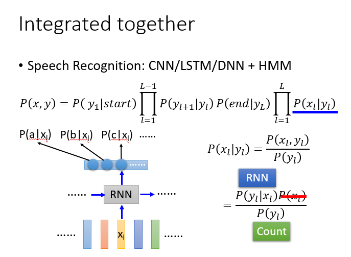
在语音上，我们常常把deep learning 和structure learning 合起来(CNN/LSTM/DNN + HMM)，所以做语音的时候一般HMM都还在，这样得到的结果往往是最好的。

这个系统工作流程：
在HMM里面，必须要去计算$x$，$y$的probability，而在structured learning里面，我们要计算$x$，$y$的evaluation function，在语音辨识里面，x是声音讯号，y是语音辨识的结果。
在HMM里面，有transition的部分和emission的部分，DNN做的事情其实就是去取代的emission的部分，原来在HMM的emission部分就是去统计高斯混合模型，但是把它换成DNN以后，会得到很好的performance。
换的方法：把$P(y_l | x_l)$转换成$P(x_l | y_l)$,公式是

$$P(x_l | y_l)=\frac{P(x_l,y_l)}{P(y_l)}=\frac{P(y_l|x_l)P(x_l)}{P(y_l)}$$

其中$P(y_l|x_l)$可以从RNN里面来，$P(y_l)$则可以直接count，$P(x_l)$可以直接无视，因为在得到几率的时候，$x_l$是输入（已知的），穷举所有的$y_l$让$P(y_l)$最大，所有和x有关的项不影响inference的结果，所有我们可以不用把x考虑进来。

其实加上HMM在语音辨识里很有帮助，就算是用RNN，但是在辨识的时候，常常会遇到问题，假设我们是一个frame，用RNN来问这个frame属于哪个form，往往会产生奇怪的结果，比如说一个frame往往是蔓延好多个frame，比如理论是是看到第一个frame是A，第二个frame是A，第三个是A，第四个是A，然后BBB，但是如果用RNN做的时候，RNN每个产生的label都是独立的，所以可能会在前面若无其事的改成B，然后又是A，RNN很容易出现这个现象。HMM则可以把这种情况修复。因为RNN在训练的时候是分来考虑的，假如不同的错误对语音辨识结果影响很大，结果就会不好。所以加上HMM会很有帮助。

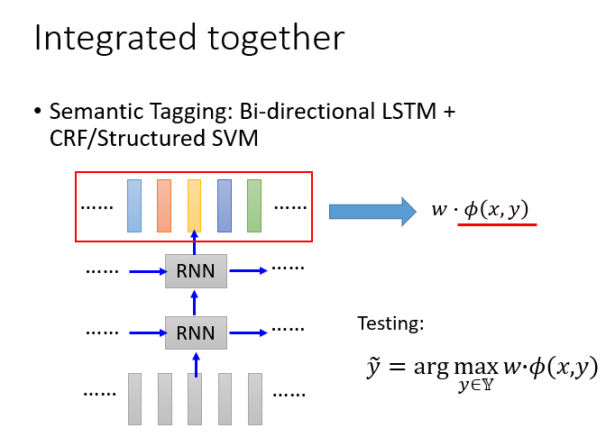

先用Bi-directional LSTM做feature，然后把这些feature拿来在做CRF或者Structured SVM，然后学习一个权重w，这个$\phi(x,y)$的feature，要直接从Bidirectional LSTM的输出可以得到比较好的结果。

## Structure learning practical？

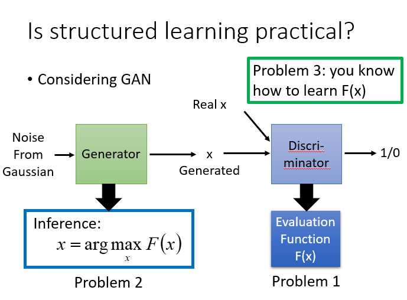

有人说structured learning是否现实？

structured learning需要解三个问题，其中input的问题往往很困难，因为要穷举所有的y让其最大，解一个optimization的问题，其实大部分状况都没有好的解决办法，只有少数有，其他都是不好的状况。所有有人说structured learning应用并不广泛，但是未来未必是这样的。

其实GAN就是一种structured learning，可以把discriminator看做是evaluation function（也就是problem 1）最后要解一个inference的问题，我们要穷举我们未知的东西，看看哪个可以让我们的evaluation function最大。这步往往比较困难，因为x的可能性太多了。但其实这个可以就是generator，我们可以想成generator就是用所给的noise，输出一个update，它输出的这个高斯模型，就是让discriminator分辨不出的高斯模型，如果discriminator就是evaluation function的话，那output的值就是让evaluation function的值很大的那个对应值，所以这个generator就是在解这个问题，其实generator的输出就是argmax的输出，可以把generator当做在解inference这个问题，然后就直接求problem 3。structured learning过程和GAN模型generator不断产生让discriminator最大的那个值，然后再去训练discriminator不断识别真实值，然后更新值的过程是异曲同工的。

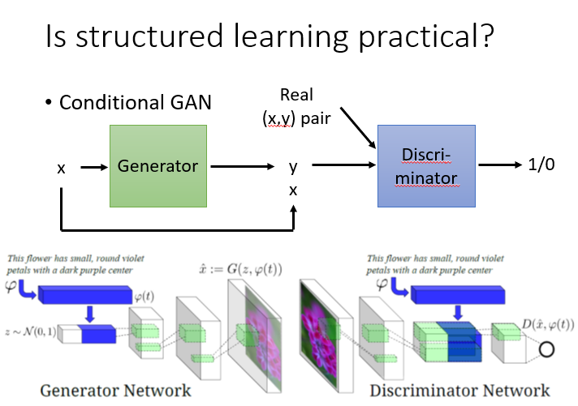

GAN也可以是conditional的GAN，现在的任务是给定x，找出最有可能的y，想象成语音辨识，x是声音讯号，y是辨识出来的文字，如果是用conditional的概念，generator输入一个x，就会output一个y，discriminator是去检查y的pair是不是对的，如果给他一个真正的x，y的pair，会得到一个比较高的分数，给一个generator输出的一个y配上输入的x，所产生的一个假的pair，就会给他一个比较低的分数。训练的过程就和原来的GAN就是一样的，这个已经成功运用在文字产生图片这个task上面。这个task的input就是一句话，output就是一张图，generator做的事就是输入一句话，然后产生一张图片，而discriminator要做的事就是给他一张图片，要他判断这个x，y的pair是不是真的，如果把 discriminator换成evaluation function，把generator换成解inference的problem，其实conditional GAN和structured learning就是可以类比，或者说GAN就是训练structured learning的一种方法。

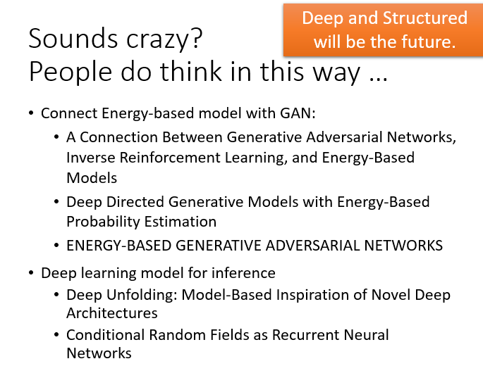
很多人都有类似的想法，比如GAN可以和Energy—based模型一起做。这里给出一些Reference。