# Deep Reinforcement Learning—Scratching the surface

2015年2月的时候，google在nature上发了一篇用reinforcement learning 的方法来玩akari的小游戏，然后痛鞭人类

2016的春天，又有大家都耳熟能详的alpha go，也是可以痛鞭人类

David Silver 说 AI 就是 Reinforcement Learning加Deep Learning
Deep Reinforcement Learning : AI = RL + DL

## Scenario of Reinforcement Learning

在Reinforcement Learning里面会有一个Agent跟一个Environment。这个Agent会有Observation看到世界种种变化，这个Observation又叫做State，这个State指的是环境的状态，也就是你的machine所看到的东西。所以在这个Reinforcement Learning领域才会有这个XXX做法，我们的state能够观察到一部分的情况，机器没有办法看到环境所有的状态，所以才会有这个partial of state 这个想法，这个state其实就是Observation。machine会做一些事情，它做的事情叫做Action，Action会影响环境，会跟环境产生一些互动。因为它对环境造成的一些影响，它会得到Reward，这个Reward告诉它，它的影响是好的还是不好的。如下图

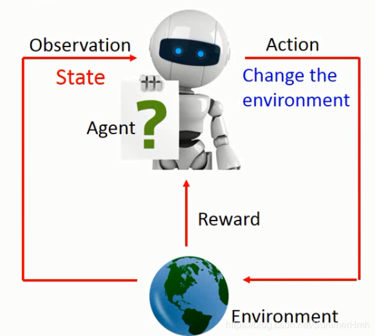

举个例子，比如机器看到一杯水，然后它就take一个action，这个action把水打翻了，Environment就会得到一个negative的reward，告诉它不要这样做，它就得到一个负向的reward。在Reinforcement Learning这些动作都是连续的，因为水被打翻了，接下来它看到的就是水被打翻的状态，它会take另外一个action，决定把它擦干净，Environment觉得它做得很对，就给它一个正向的reward。机器生来的目标就是要去学习采取那些ation，可以让maximize reward maximize 。

接着，以alpha go为例子，一开始machine的Observation是棋盘，棋盘可以用一个19*19的矩阵来描述，接下来，它要take一个action，这个action就是落子的位置。落子在不同的位置就会引起对手的不同反应，对手下一个子，Agent的Observation就变了。Agent看到另外一个Observation后，就要决定它的action，再take一个action，落子在另外一个位置。用机器下围棋就是这么个回事。在围棋这个case里面，还是一个蛮难的Reinforcement Learning，在多数的时候，你得到的reward都是0，落子下去通常什么事情也没发生这样子。只有在你赢了，得到reward是1，如果输了，得到reward是-1。Reinforcement Learning困难的地方就是有时候你的reward是sparse的，只有倒数几步才有reward。即在只有少数的action 有reward的情况下去挖掘正确的action。

对于machine来说，它要怎么学习下围棋呢，就是找一某个对手一直下下，有时候输有时候赢，它就是调整Observation和action之间的关系，调整model让它得到的reward可以被maximize。

## Supervised  v.s. Reinforcement 

我们可以比较下下围棋采用Supervised 和Reinforcement 有什么区别。如果是Supervised 你就是告诉机器说看到什么样的态势就落在指定的位置。Supervised不足的地方就是具体态势下落在哪个地方是最好的，其实人也不知道，因此不太容易做Supervised。用Supervised就是machine从老师那学，老师说下哪就下哪。如果是Reinforcement 呢，就是让机器找一个对手不断下下，赢了就获得正的reward，没有人告诉它之前哪几步下法是好的，它要自己去试，去学习。Reinforcement 是从过去的经验去学习，没有老师告诉它什么是好的，什么是不好的，machine要自己想办法，其实在做Reinforcement 这个task里面，machine需要大量的training，可以两个machine互相下。alpha Go 是先做Supervised Learning，做得不错再继续做Reinforcement Learning。

## Application

### Learning a chat-bot

 Reinforcement Learning 也可以被用在Learning a chat-bot。chat-bot 是seq2seq，input 就是一句话，output 就是机器的回答。

 如果采用Supervised ，就是告诉机器有人跟你说“hello”，你就回答“hi”。如果有人跟你说“bye bye”，你就要说“good bye”。

如果是Reinforcement  Learning 就是让机器胡乱去跟人讲话，讲讲，人就生气了，machine就知道一句话可能讲得不太好。不过没人告诉它哪一句话讲得不好，它要自己去发掘这件事情。

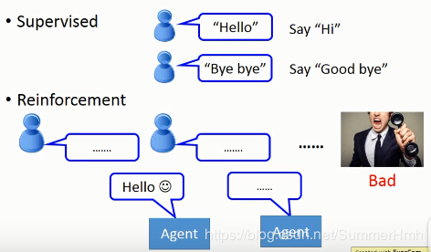

这个想法听起来很crazy，但是真正有chat-bot是这样做的，这个怎么做呢？因为你要让machine不断跟人讲话，看到人生气后进行调整，去学怎么跟人对话，这个过程比较漫长，可能得好几百万人对话之后才能学会。这个不太现实，那么怎么办呢，就用Alpha Go的方式，Learning 两个agent，然后让它们互讲的方式。

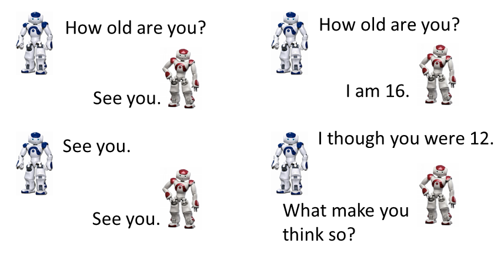

两个chat-bot互相对话，对话之后有人要告诉它们它们讲得好还是不好。在围棋里比较简单，输赢是比较明确的，对话的话就比较麻烦，你可以让两个machine进行无数轮互相对话，问题是你不知道它们这聊天聊得好还是不好，这是一个待解决问题。现有的方式是制定几条规则，如果讲得好就给它positive reward ，讲得不好就给它negative reward，好不好由人主观决定，然后machine就从它的reward中去学说它要怎么讲才是好。后续可能会有人用GAN的方式去学chat-bot。通过discriminator判断是否像人对话，两个agent就会想骗过discriminator，即用discriminator自动认出给reward的方式。
Reinforcement  Learning 有很多应用，尤其是人也不知道怎么做的场景非常适合。

## Interactive retrieval

让machine学会做Interactive retrieval，意思就是说有一个搜寻系统，能够跟user进行信息确认的方式，从而搜寻到user所需要的信息。直接返回user所需信息，它会得到一个positive reward，然后每问一个问题，都会得到一个negative reward。

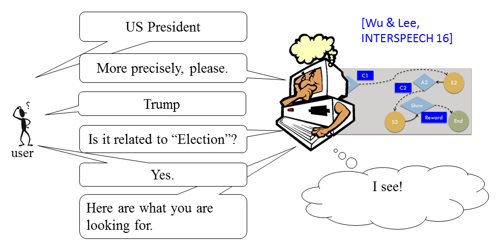

### More applications

Reinforcement  Learning 还有很多应用，比如开个直升机，开个无人车呀，也有通过deepmind帮助谷歌节电，也有文本生成等。现在Reinforcement  Learning最常用的场景是电玩。现在有现成的environment，比如Gym,Universe。让machine 用Reinforcement  Learning来玩游戏，跟人一样，它看到的东西就是一幅画面，就是pixel，然后看到画面，它要做什么事情它自己决定，并不是写程序告诉它说你看到这个东西要做什么。需要它自己去学出来。

### Example:Playing Video Game

- Space invader

	这个游戏界面如下
	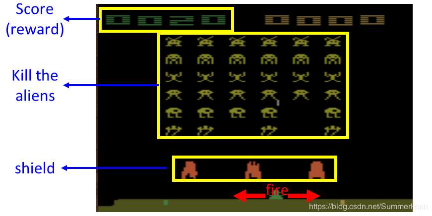
	游戏的终止条件时当所有的外星人被消灭或者你的太空飞船被摧毁。

	这个游戏里面，你可以take的actions有三个，可以左右移动跟开火。怎么玩呢，machine会看到一个observation，这个observation就是一幕画面。一开始machine看到一个observation $s_1$，这个$s_1$其实就是一个matrix，因为它有颜色，所以是一个三维的pixel。machine看到这个画面以后，就要决定它take什么action，现在只有三个action可以选择。比如它take 往右移。每次machine take一个action以后，它会得到一个reward，这个reward就是左上角的分数。往右移不会得到任何的reward，所以得到的reward $r_1 = 0$，machine 的action会影响环境，所以machine看到的observation就不一样了。现在observation为$s_2$，machine自己往右移了，同时外星人也有点变化了，这个跟machine的action是没有关系的，有时候环境会有一些随机变化，跟machine无关。machine看到$s_2$之后就要决定它要take哪个action，假设它决定要射击并成功的杀了一只外星人，就会得到一个reward，发现杀不同的外星人，得到的分数是不一样的。假设杀了一只5分的外星人，这个observation就变了，少了一只外星人。这个过程会一直进行下去，直到machine的reward $r_T$进入另一个step，这个step是一个terminal step，它会让游戏结束，在这个游戏背景里面就是你被杀死。可能这个machine往左移，不小心碰到alien的子弹，就死了，游戏就结束了。从这个游戏的开始到结束，就是一个episode，machine要做的事情就是不断的玩这个游戏，学习怎么在一个episode里面怎么去maximize reward，maximize它在所有的episode可以得到的total reward。在死之前杀最多的外星人同时要闪避子弹，让自己不会被杀死。

	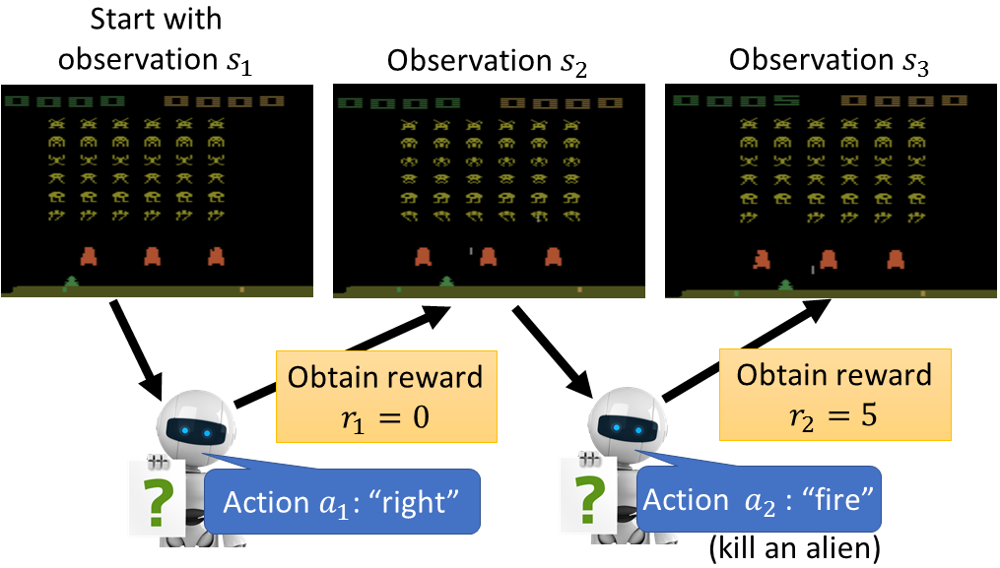

## Difficulties of Reinforcement  Learning

那么Reinforcement  Learning的难点在哪里呢？它有两个难点

- Reward delay

	第一个难点是，reward出现往往会存在delay，比如在space invader里面只有开火才会得到reward，但是如果machine只知道开火以后就会得到reward，最后learn出来的结果就是它只会乱开火。对它来说，往左往右移没有任何reward。事实上，往左往右这些moving，它对开火是否能够得到reward是有关键影响的。虽然这些往左往右的action，本身没有办法让你得到任何reward，但它帮助你在未来得到reward，就像规划未来一样，machine需要有这种远见，要有这种visual，才能把电玩玩好。在下围棋里面，有时候也是一样的，短期的牺牲可以换来最好的结果。

- Agent's actions affect the subsequent data it receives

	Agent采取行动后会影响之后它所看到的东西，所以Agent要学会去探索这个世界。比如说在这个space invader里面，Agent只知道往左往右移，它不知道开火会得到reward，也不会试着击杀最上面的外星人，就不会知道击杀这个东西可以得到很高的reward，所以要让machine去explore它没有做过的行为，这个行为可能会有好的结果也会有坏的结果。但是探索没有做过的行为在Reinforcement  Learning里面也是一种重要的行为。

## Approach

Reinforcement  Learning 的方法分成两大块，一个是Policy-based的方法，另一个是Valued-based的方法。先有Valued-based的方法，再有Policy-based的方法。在Policy-based的方法里面，会learn一个负责做事的Actor，在Valued-based的方法会learn一个不做事的Critic，专门批评不做事的人。我们要把Actor和Critic加起来叫做Actor+Critic的方法。

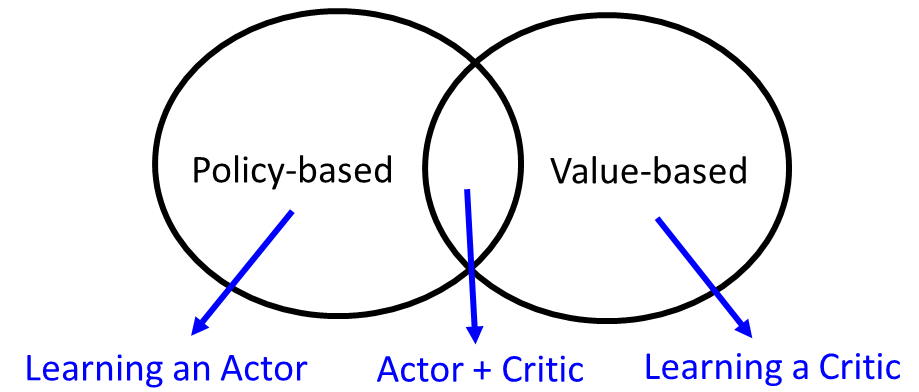

现在最强的方法就是Asynchronous Advantage Actor-Critic(A3C)。Alpha Go是各种方法大杂烩，有Policy-based的方法，有Valued-based的方法，有model-based的方法。下面是一些学习deep Reinforcement  Learning的资料

- Textbook: Reinforcement Learning: An Introduction
https://webdocs.cs.ualberta.ca/~sutton/book/the-book.html
- Lectures of David Silver
http://www0.cs.ucl.ac.uk/staff/D.Silver/web/Teaching.html (10 lectures, 1:30 each)
http://videolectures.net/rldm2015_silver_reinforcement_learning/ (Deep Reinforcement Learning )
- Lectures of John Schulman
https://youtu.be/aUrX-rP_ss4

### Policy-based Approach

先来看看怎么学一个Actor，所谓的Actor是什么呢?我们之前讲过，Machine Learning 就是找一个Function，Reinforcement Learning也是Machine Learning 的一种，所以要做的事情也是找Function。这个Function就是所谓的魔术发现，Actor就是一个Function。这个Function的input就是Machine看到的observation，它的output就是Machine要采取的Action。我们要透过reward来帮我们找这个best Function。

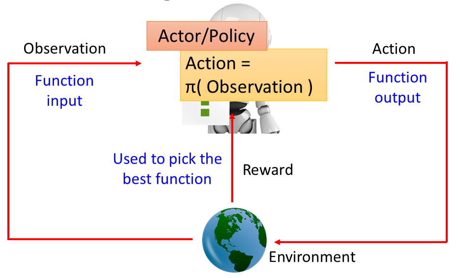

找个这个Function有三个步骤：

- Neural Network as Actor

	第一个步骤就是决定你的Function长什么样子，假设你的Function是一个Neural Network，就是一个deep learning。

	

	如果Neural Network作为一个Actor，这个Neural Network的输入就是observation，可以通过一个vector或者一个matrix 来描述。output就是你现在可以采取的action。举个例子，Neural Network作为一个Actor，inpiut是一张image，output就是你现在有几个可以采取的action，output就有几个dimension。假设我们在玩Space invader，output就是可能采取的action左移、右移和开火，这样output就有三个dimension分别代表了左移、右移和开火。

	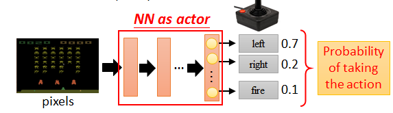

	这个Neural Network怎么决定这个Actor要采取哪个action呢？通常的做法是这样，你把这个image丢到Neural Network里面去，它就会告诉你说每个output dimension所对应的分数，可以采取分数最高的action，比如说left。用这个Neural Network来做Actor有什么好处，Neural Network是可以举一反三的，可能有些画面Machine 从来没有看过，但是Neural Network的特性，你给它一个image，Neural Network吐出一个output。所以就算是它没看过的东西，它output可以得到一个合理的结果。Neural Network就是比较generous。

- Goodnedd of Actor

	第二步骤就是，我们要决定一个Actor的好坏。在Supervised learning中，我们是怎样决定一个Function的好坏呢？举个Training Example例子来说，我们把图片扔进去，看它的结果和target是否像，如果越像的话这个Function就会越好，我们会一个loss，然后计算每个example的loss，我们要找一个参数去minimize这个参数。

	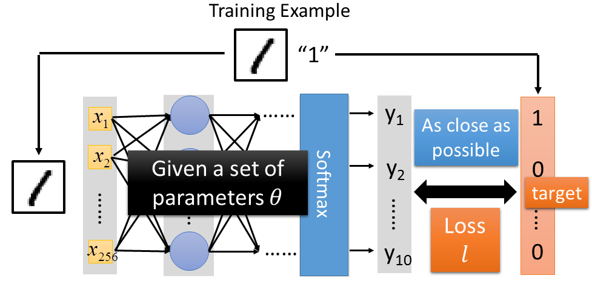

	在Reinforcement Learning里面，一个Actor的好坏的定义是非常类似的。假设我们现在有一个Actor，这个Actor就是一个Neural Network，Neural Network的参数是$\mathbf{\theta}$，即一个Actor可以表示为$\pi_\theta(s)$，它的input就是Mechine看到的observation。那怎么知道一个Actor表现得好还是不好呢？我们让这个Actor实际的去玩一个游戏，玩完游戏得到的total reward为 $R_\theta=\sum_{t=1}^Tr_t$，把每个时间得到的reward合起来，这既是一个episode里面，你得到的total reward。这个total reward才是我们需要去maximize的对象。我们不需要去maximize 每个step的reward，我们是要maximize 整个游戏玩完之后的total reward。假设我们拿同一个Actor，每次玩的时候，$R_\theta$其实都会不一样的。因为两个原因，首先你Actor本身如果是Policy，看到同样的场景它也会采取不同的Action。所以就算是同一个Actor，同一组参数，每次玩的时候你得到的$R_\theta$也会不一样的。再来游戏本身也有随机性，就算你采取同一个Action，你看到的observation每次也可能都不一样。所以$R_\theta$是一个Random Variable。我们做的事情，不是去maximize每次玩游戏时的$R_\theta$，而是去maximize $R_\theta$的期望值。这个期望值就衡量了某一个Actor的好坏，好的Actor期望值就应该要比较大。

	那么怎么计算呢，我们假设一场游戏就是一个trajectory $\tau$
	$$ \tau = \left\{ s_1,a_1,r_1, s_2,a_2,r_2,...,s_T,a_T,r_T \right\} $$
	$\tau$ 包含了state，看到这个observation，take的Action，得到的Reward，是一个sequence。
	$$
	R(\tau) = \sum_{n=1}^Nr_n
	$$
	$R(\tau)$代表在这个episode里面，最后得到的总reward。当我们用某一个Actor去玩这个游戏的时候，每个$\tau$都会有出现的几率，$\tau$代表从游戏开始到结束过程，这个过程有千百万种，当你选择这个Actor的时候，你可能只会看到某一些过程，某些过程特别容易出现，某些过程比较不容易出现。每个游戏出现的过程，可以用一个几率$P(\tau|\theta)$来表示它，就是说参数是$\theta$时$\tau$这个过程出现的几率。那么$R_\theta$的期望值为
	$$\bar{R}_\theta=\sum_\tau R(\tau)P(\tau|\theta)$$
	实际上要穷举所有的$\tau$是不可能的，那么要怎么做？让Actor去玩N场这个游戏，获得N个过程${\tau^1,\tau^2,...,\tau^N}$ ，玩N场就好像从$P(\tau|\theta)$去Sample N个$\tau$。假设某个$\tau$它的几率特别大，就特别容易被sample出来。sample出来的$\tau$跟几率成正比。让Actor去玩N场，相当于从$P(\tau|\theta)$概率场抽取N个过程，可以通过N各Reward的均值进行近似，如下表达
	$$\bar{R}_\theta=\sum_\tau R(\tau)P(\tau|\theta) \approx \frac{1}{N}R(\tau^n)$$

- Pick the best function

	怎么选择最好的function，其实就是用我们的Gradient Ascent。我们已经找到目标了，就是最大化这个$\bar{R}_\theta$
	$$\theta^\ast = arg \max_\theta \bar{R}_\theta$$
	其中$\bar{R}_\theta = \sum_\tau R(\tau)P(\tau|\theta)$。就可以用Gradient Ascent进行最大化，过程为：
		- 初始化$\theta^0$
		- $\theta^1 \leftarrow \theta^0+\eta \triangledown \bar{R}_{\theta^0}$
		- $\theta^2 \leftarrow \theta^1+\eta \triangledown \bar{R}_{\theta^1}$
		- .......

	参数$\theta = {w_1,w_2,...,b_1,...}$，那么$\triangledown \bar{R}_{\theta}$就是$\bar{R}_{\theta}$对每个参数的偏微分，如下
	$$
	\triangledown \bar{R}_{\theta} = \begin{bmatrix}
	\partial{ \bar{R}_{\theta}}/\partial w_1 \\ \partial{ \bar{R}_{\theta}}/\partial w_2
	\\ \vdots
	\\ \bar{R}_{\theta}/\partial b_1
	\\ \vdots
	\end{bmatrix} 
    $$
  	接下来就是实际的计算下，$\bar{R}_\theta = \sum_\tau R(\tau)P(\tau|\theta)$中，只有$P(\tau|\theta)$跟$\theta$有关系，所以只需要对$P(\tau|\theta)$做Gradient ，即
  	$$\nabla \bar{R}_{\theta}=\sum_{\tau} R(\tau) \nabla P(\tau | \theta)$$
  	所以$R(\tau)$就算不可微也没有关系，或者是不知道它的function也没有差，我们只要知道把$\tau$放进去得到值就可以。接下来，为了让$P(\tau|\theta)$出现，有
 	 $$
	\nabla \bar{R}_{\theta}=\sum_{\tau} R(\tau) \nabla P(\tau | \theta)=\sum_{\tau} R(\tau) P(\tau | \theta) \frac{\nabla P(\tau | \theta)}{P(\tau | \theta)}
	$$
	由于
	$$
	\frac{\operatorname{dlog}(f(x))}{d x}=\frac{1}{f(x)} \frac{d f(x)}{d x}
	$$
	所以
	$$
	\nabla \bar{R}_{\theta}=\sum_{\tau} R(\tau) P(\tau | \theta) \frac{\nabla P(\tau | \theta)}{P(\tau | \theta)}=\sum_{\tau} R(\tau) P(\tau | \theta) \nabla \log P(\tau | \theta)
	$$
	从而可以通过抽样的方式去近似，即
	$$
	\nabla \bar{R}_{\theta}=\sum_{\tau} R(\tau) P(\tau | \theta) \nabla \log P(\tau | \theta)=\approx \frac{1}{N} \sum_{n=1}^{N} R\left(\tau^{n}\right) \nabla \log P\left(\tau^{n} | \theta\right)
	$$
	即拿$\theta$去玩N次游戏，得到${\tau^1,\tau^2,...,\tau^N}$，算出每次的$R(\tau)$。接下来的问题是怎么计算$\nabla \log P\left(\tau^{n} | \theta\right)$，因为
	$$
	P(\tau|\theta)=p\left(s_{1}\right) p\left(a_{1} | s_{1}, \theta\right) p\left(r_{1}, s_{2} | s_{1}, a_{1}\right) p\left(a_{2} | s_{2}, \theta\right) p\left(r_{2}, s_{3} | s_{2}, a_{2}\right) \cdots \\
	=p\left(s_{1}\right) \prod_{t=1}^{T} p\left(a_{t} | s_{t}, \theta\right) p\left(r_{t}, s_{t+1} | s_{t}, a_{t}\right)
	$$
	其中$P(s_1)$是初始状态出现的几率，接下来根据$\theta$会有某个概率在$s_1$状态下采取Action $a_1$，然后根据$a_1,s_1$会得到某个reward $r_1$，并跳到另一个state $s_2$，以此类推。其中有些项跟Actor是无关的，$p\left(s_{1}\right)$和$p\left(r_{t}, s_{t+1} | s_{t}, a_{t}\right)$，只有$p\left(a_{t} | s_{t}, \theta\right)$跟Actor $\pi_\theta$有关系。
	通过取log，连乘转为连加，即
	$$
	\log P(\tau | \theta) =\log p\left(s_{1}\right)+\sum_{t=1}^{T} \log p\left(a_{t} | s_{t}, \theta\right)+\log p\left(r_{t}, s_{t+1} | s_{t}, a_{t}\right) 
	$$
	然后对$\theta$取Gradient，删除无关项，得到
	$$
	\nabla \log P(\tau | \theta)=\sum_{t=1}^{T} \nabla \log p\left(a_{t} | s_{t}, \theta\right)
	$$
	则
	$$
	\begin{aligned} \nabla \bar{R}_{\theta} & \approx \frac{1}{N} \sum_{n=1}^{N} R\left(\tau^{n}\right) \nabla \log P\left(\tau^{n} | \theta\right)=\frac{1}{N} \sum_{n=1}^{N} R\left(\tau^{n}\right) \sum_{t=1}^{T_{n}} \nabla \log p\left(a_{t}^{n} | s_{t}^{n}, \theta\right) \\ &=\frac{1}{N} \sum_{n=1}^{N} \sum_{t=1}^{T_{n}} R\left(\tau^{n}\right) \nabla \log p\left(a_{t}^{n} | s_{t}^{n}, \theta\right) \end{aligned}
	$$
	这个式子就告诉我们，当我们在某一次$\tau^n$游戏中，在$s_t^n$状态下采取$a_t^2$得到$R(\tau^n)$是正的，我们就希望$\theta$能够使$p(a_t^n|s_t^n)$的概率越大越好。反之，如果$R(\tau^n)$是负的，就要调整$\theta$参数，能够使$p(a_t^n|s_t^n)$的几率变小。注意，某个时间点的$p\left(a_{t}^{n} | s_{t}^{n}, \theta\right)$是乘上这次游戏的所有reward $R(\tau^n)$而不是这个时间点的reward。假设我们只考虑这个时间点的reward，那么就是说只有fire才能得到reward，其他的action你得到的reward都是0。Machine就只会增加fire的几率，不会增加left或者right的几率。最后Learn出来的Agent它就会fire。

	接着还有一个问题，为什么要取log呢？

	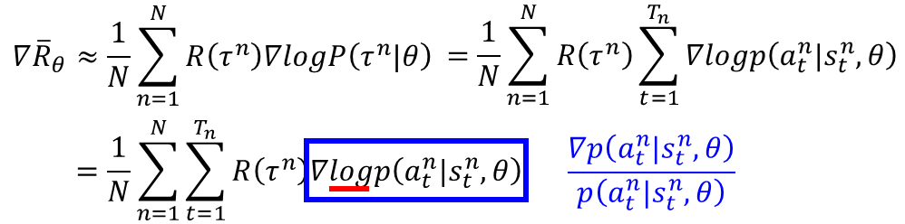

	$$\nabla \log p\left(a_{t}^{n} | s_{t}^{n}, \theta\right)=\frac{\nabla  p\left(a_{t}^{n} | s_{t}^{n}, \theta\right)}{p\left(a_{t}^{n} | s_{t}^{n}, \theta\right)}$$
	那么为什么要除以$p\left(a_{t}^{n} | s_{t}^{n}, \theta\right)$呢？假设某个state s在$\tau^{13},\tau^{15},\tau^{17},\tau^{33}$，采取不同的action，获得不同的reward，会偏好出现次数比较多的action，但是次数比较多的action有时候并没有比较好，就像b出现的比较多，但是得到的reward并没有比较大，Machine把这项几率调高。除掉一个几率，就是对那项做了个normalization，防止Machine偏好那些出现几率比较高的项。

	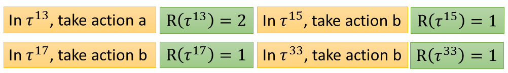

	还有另外一个问题，假设$R(\tau^n)$总是正的，那么会出现什么事情呢？在理想的状态下，这件事情不会构成任何问题。假设有三个action，a,b,c采取的结果得到的reward都是正的，这个正有大有小，假设a和c的$R(\tau^n)$比较大，b的$R(\tau^n)$比较小，经过update之后，你还是会让b出现的几率变小，a,c出现的几率变大，因为会做normalization。但是实做的时候，我们做的事情是sampling，所以有可能只sample b和c，这样b,c几率都会增加，a没有sample到，几率就自动减少，这样就会有问题了。

	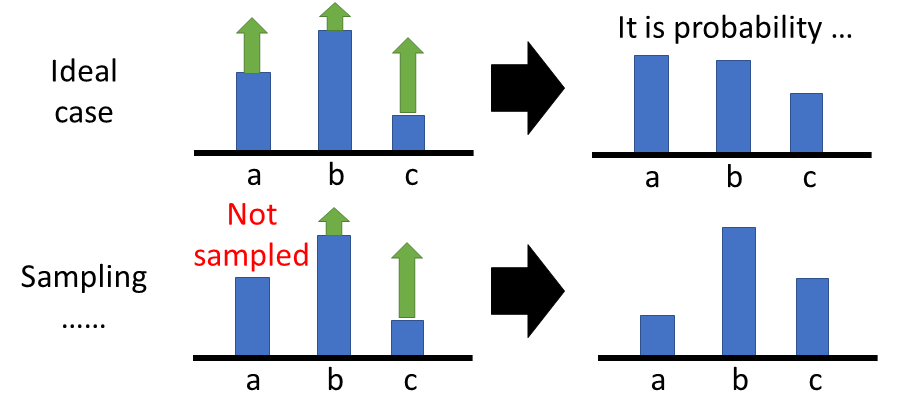

	这样，我们就希望$R(\tau^n)$有正有负这样，可以通过将$R(\tau^n)-b$来避免，$b$需要自己设计。如下
	$$\nabla \bar{R}_{\theta} \approx \frac{1}{N} \sum_{n=1}^{N} \sum_{t=1}^{T_{n}}\left(R\left(\tau^{n}\right)-b\right) \nabla \log p\left(a_{t}^{n} | s_{t}^{n}, \theta\right)$$
	这样$R(\tau^n)$超过b的时候就把几率增加，小于b的时候就把几率降低，从而解决了都是正的问题。

### Value-based Approach

#### Critic

Critic就是Learn一个Neural Network，这个Neural Network不做事，然后Actor可以从这个Critic中获得，这就是Q-learning。
Critic就是learn一个function，这个function可以告诉你说现在看到某一个observation的时候，这个observation有有多好这样。

- 根据actor $\pi$评估critic function

	这个function是用Neural Network表示 

- state value function $V^\pi(s)$
 
	这个累加的reward是通过观察多个observation

	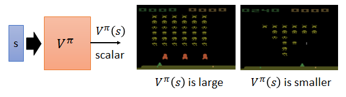

	那么如何估计 $V^\pi(s)$呢？可以采用Monte-Carlo based approach。

- State-action value function $Q^\pi(s,a)$

	这个累加的reward是通过观察observation和take的action

	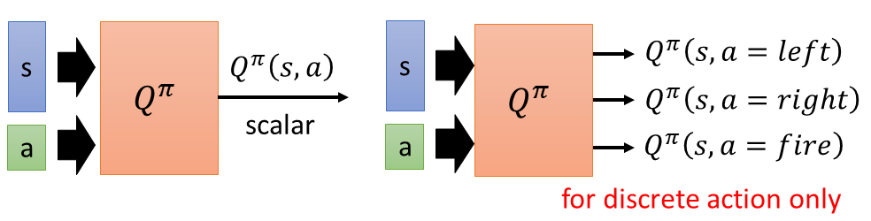

### Actor-Critic

 这部分留着下学期再讲

 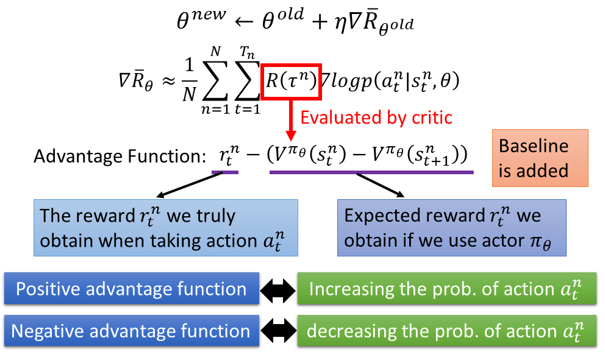

 附上一张学习地图，完结撒花~

 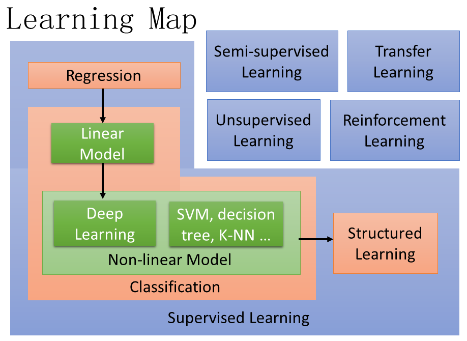
