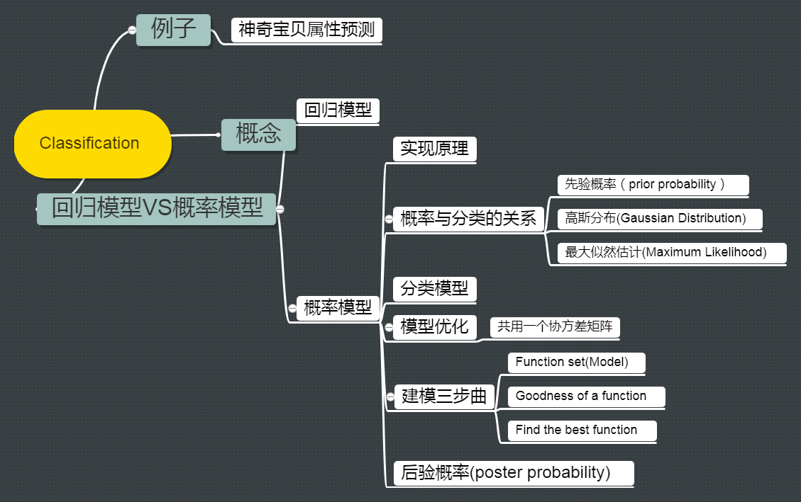

[toc]
# 背景
## 分类概念

分类要找一个 $function$ 函数，输入对象 $x$ 特征， 输出是该对象属于 $n$ 个类别中是属于哪一个。

- 例子1：比如信用评分【二分类问题】
	- 输入：收入，储蓄，行业，年龄，金融史…
	- 输出：是否拒绝拒绝贷款
- 例子2：比如医疗诊断【多分类问题】
	- 输入：当前症状，年龄，性别，医疗史…
	- 输出：患了哪种疾病
- 例子3：比如手写文字辨识【多分类问题】
	- 输入：手写的文字
	- 输出：约9353个汉字中输入哪一个

> 个人总结：我接触到的分类问题目前还是相对较少。在多分类问题上，如果特征复杂，类别又多，对机器的计算性能要求也相对较高。

## 神奇宝贝的属性（水、电、草）预测
这里再次使用《神奇宝贝》作为例子讲解。如下图，首先认识一下神奇宝贝中的属性：

神奇宝贝有很多的属性，比如电，火，水。要做的就是一个分类的问题：需要找到一个 $function$，
- 输入：一只神奇宝贝的特征（整体强度，生命值，攻击力，防御力，特殊攻击力，特殊防御力，速度等）
- 输出：属于哪一种类型的神奇宝贝

首先将神奇宝贝数值化：以比卡丘为例

- Total：整体强度，大概的表述神奇宝贝有多强，比如皮卡丘是320
- HP：生命值，比如皮卡丘35
- Attack：攻击力，比如皮卡丘55
- Defense：防御力，比如皮卡丘40
- SP Atk：特殊攻击力，比如皮卡丘50
- SP Def：特殊防御力，比如皮卡丘50
- Speed：速度，比如皮卡丘90
- 
所以一只 《神奇宝贝》可以用一个向量来表示，上述7个数字组成的向量。

因为没有玩过《神奇宝贝》，我猜测在PK厂可以大概知道一只神奇宝贝的特征，但是不知道属于属性。因为在战斗的时候会有属性相克，下面给了张表，只需要知道，战斗的时候遇到对面神奇宝贝的特征，己方不知道属性的情况会吃亏，所以需要预测它的属性。

## 回归模型 vs 概率模型
我们收集当前神奇宝贝的特征数据和属性数据，例如：皮卡丘$(x^1,\hat{y}^1)$  电属性；杰尼龟 $(x^2,\hat{y}^2)$ 水属性；···；妙蛙草  $(x^3,\hat{y}^3)$ 草属性

### 回归模型

假设还不了解怎么做，但之前已经学过了 $regression$。就把分类当作回归硬解。
举一个二分类的例子，假设输入神奇宝贝的特征 $x$，判断属于类别1或者类别2，把这个当作回归问题。
- 类别1：相当于target是 $1$。
- 类别2：相当于target是 $-1$。

然后训练模型：因为是个数值，如果数值比较接近 $1$，就当作类别1，如果数值接近 $-1$，就当做类别2。这样做遇到什么问题？

- 左图：绿色是分界线，红色叉叉就是 Class2 的类别，蓝色圈圈就是 Class1 的类别。
- 右图：紫色是分界线，红色叉叉就是 Class2 的类别，蓝色圈圈就是 Class1 的类别。训练集添加有很多的距离远大于1的数据后，分界线从绿色偏移到紫色

这样用回归的方式硬训练可能会得到紫色的这条。直观上就是将绿色的线偏移一点到紫色的时候，就能让右下角的那部分的值不是那么大了。但实际是绿色的才是比较好的，用回归硬训练并不会得到好结果。此时可以得出用回归的方式定义，对于分类问题来说是不适用的。

还有另外一个问题：比如多分类，类别1当作target1，类别2当作target2，类别3当作target3…如果这样做的话，就会认为类别2和类别3是比较接近的，认为它们是有某种关系的；认为类别1和类别2也是有某种关系的，比较接近的。但是实际上这种关系不存在，它们之间并不存在某种特殊的关系。这样是没有办法得到好的结果。

### 其他模型（理想替代品）

先看二分类，将 $function$ 中内嵌一个函数 $g(x)$，如果大于0，就认识是类别1，否则认为是类别2。损失函数的定义就是，如果选中某个 $funciton \ f(x)$，在训练集上预测错误的次数。当然希望错误次数越小越好。

但是这样的损失函数没办法解，这种定义没办法微分。这是有方法的，比如Perceptron（感知机），SVM等。这里先引入一个概率模型。

# 概率模型实现原理
## 盒子抽球概率举例
说明：假设两个盒子，各装了5个球，还得知随机抽一个球，抽到的是盒子1的球的概率是 $2/3$，是盒子2的球的概率是$1/3$。从盒子中蓝色球和绿色球的分配可以得到：
- 在盒子1中随机抽一个球，是蓝色的概率为 $4/5$，绿的的概率为 $1/5$
- 在盒子2中随机抽一个球，是蓝色的概率为 $2/5$，绿的的概率为 $3/5$

现在求随机从两个盒子中抽一个球，抽到的是盒子1中蓝色球的概率是多少？

$$
\begin{aligned} 
P(B_1|Blue) &= \frac{P(Blue|B_1)P(B_1)}{P(Blue|B_1)P(B_1)+P(Blue|B_2)P(B_2) } \\
& = \frac{\frac{4}{5}*\frac{2}{3}}{\frac{4}{5} * \frac{2}{3}+\frac{2}{5}*\frac{1}{3}}  \\
& = \frac{4}{5}
\end{aligned} 
\tag{1}
$$

所以，两个盒子中抽一个球，抽到的是盒子1中蓝色球的概率是 $\frac{4}{5}$

## 概率与分类的关系
将上面两个盒子换成两个类别

- 那么，两个盒子中抽一个球，抽到的是盒子1中蓝色球的概率是多少？
- 相当于两个类别中抽一个 $x$，抽到的是类别1中 $x$ 的概率是多少？
- 可以转化成，随机给出一个 $x$，那么它属于哪一个类别（属于概率相对比较大的类别）？

同理知道红色方框的值，就可以计算出给一个 $x$，它是属于哪个类型的，$P(C_1|x)$ 和 $P(C_ 2 | x)$，哪个类别的概率大就属于哪个类别。接下来就需要从训练集中估测红色方框中的值。这一套想法叫做**生成模型**（Generative Model）。因为有了这个模型，就可以生成一个 $x$，可以计算某个 $x$ 出现的概率，知道了$x$ 的分布，就可以自己产生 $x$ 。

> $P(C_1|x)$  是由贝叶斯（bayes）公式得到的；$P(x)$ 是由全概率公式得到的，详情见《概率论与数理统计，浙江大学，第一章》。

### 先验概率（Priori probability）

先考虑简单的二分类，水属性或者一般属性，通过训练集的数据可以计算出 $P(C_1)$ 和 $P(C_2)$，如图所示：
- 水属性占比：$P(C_1) = 0.56$ 
- 普通属性占比：$P(C_2) = 0.44$

下面想计算 神奇宝贝原盖海龟是水属性的概率，即 $P(x|C_1)$。虽然知道这是一只原盖海龟，一看就是水属性的，但是在模型中，我们输入的是一个特征向量（vector）。

也就是在水系的神奇宝贝中随机选一只，是海龟的概率。下面将训练集中79个水系的神奇宝贝，属性`Defense`和`SP Defense`进行可视化

这里假设这79点是从高斯分布（Gaussian distribution）中采样的，现在需要从这79个点找出符合的那个高斯分布。

### 高斯分布（Gaussian distribution）
下面简单说一下高斯分布：

简单点可以把高斯分布当作一个 $function$，输入就是一个向量 $x$ ，输出就是选中 $x$ 的概率（实际上高斯分布不等于概率，只是和概率成正比，这里简单说成概率）。 $function$由期望  $\mu$ 和协方差矩阵  $\sum$ 决定。上图的例子是说同样的  $\sum$，不同的 $\mu$ ，概率分布的最高点的位置是不同的。下图的例子是同样的 $\mu$，不同的 $\sum$，概率分布的最高点是一样的，但是离散度是不一样的。

假设通过79个点估测出了期望 $\mu$ 和协方差矩阵 $\sum$。期望是图中的黄色点，协方差矩阵是红色的范围。现在给一个不在79个点之内的新点，用刚才估测出的期望和协方差矩阵写出高斯分布的 $function \ f_{μ,Σ}(x)$，然后把 $x$ 带进去，计算出被挑选出来的概率

### 最大似然估计（Maximum Likelihood）

首先对于这79个点，任意期望和协方差矩阵构成的高斯分布，都可以生成这些点。当然，像图中左边的高斯分布生成这些点，比右边高斯分布生成这些点的几率要大。那给一个 $\mu$ 和 $\sum$，它生成这79个点的概率为图中的 $L(\mu,\sum)$，$L(\mu,\sum)$ 也称为样本的似然函数。

将使得 $L(\mu,\sum)$ 最大的 $L(\mu,\sum)$ 记做 $(\mu^∗,\sum^∗)$ ， $(\mu^∗,\sum^∗)$ 就是所有 $L(\mu,\sum)$ 的 Maximum Likelihood（最大似然估计）

这些解法很直接，直接对 $L(\mu,\sum)$ 求两个偏微分，求偏微分是0的点。

> 最大似然估计更多详情参看《概率论与数理统计，浙江大学，第七章》

### 应用最大似然估计计算期望和协方差

算出之前水属性和一般属性高斯分布的期望和协方差矩阵的最大似然估计值。

## 分类模型

上图看出我们已经得到了需要计算的值，可以进行分类了。

左上角的图中蓝色点是水属性的神奇宝贝，红色点是一般属性的神奇宝贝，图中的颜色：越偏向红色代表是水属性的可能性越高，越偏向蓝色代表是水属性的可能性越低。

右上角在训练集上进行分类的结果，红色就是 P(C1|x)P(C1|x) 大于0.5的部分，是属于类别1，相对蓝色属于类别2。右下角是放在测试集上进行分类的结果。结果是测试集上正确率只有 47% 。当然这里只处理了二维（两个属性）的情况，那在7维空间计算出最大释然估计值，此时μμ是7维向量，ΣΣ是7维矩阵。得到结果也只有54% 的正确率，so so。。。

## 模型优化

通常来说，不会给每个高斯分布都计算出一套不同的最大似然估计，协方差矩阵是和输入feature大小的平方成正比，所以当feature很大的时候，协方差矩阵是可以增长很快的。此时考虑到model参数过多，容易Overfitting，为了有效减少参数，给描述这两个类别的高斯分布相同的协方差矩阵。

此时修改似然函数为 L(μ1,μ2,Σ)L(μ1,μ2,Σ)。μ1,μ2μ1,μ2 计算方法和上面相同，分别加起来平均即可；而ΣΣ的计算有所不同。

这里详细的理论支持可以查看《Pattern Recognition and Machine Learning》Christopher M. Bishop 著，chapter4.2.2

右图新的结果，分类的boundary是线性的，所以也将这种分类叫做 linear model。如果考虑所有的属性，发现正确率提高到了73%。

# 概率模型-建模三部曲
将上述问题简化为前几个系列说过的三大步：

实际做的就是要找一个概率分布模型，可以最大化产生data的likelihood。

# 为什么是高斯分布？
可能选择其他分布也会问同样的问题。。。

有一种常见的假设

假设每一个维度用概率分布模型产生出来的几率是相互独立的，所以可以将 P(x|C1)P(x|C1) 拆解。

可以认为每个 P(xk|C1)P(xk|C1) 产生的概率都符合一维的高斯分布，也就是此时P(x|C1)P(x|C1) 的高斯分布的协方差是对角型的（不是对角线的地方值都是0），这样就可以减少参数的量。但是试一下这种做法会坏掉。

对于二元分类来说，此时用通常不会用高斯分布，可以假设是符合 Bernoulli distribution（伯努利分布）。

假设所有的feature都是相互独立产生的，这种分类叫做 Naive Bayes Classifier（朴素贝叶斯分类器）

# 后验概率（Posterior Probability）

将 P(C1|x)P(C1|x)整理，得到一个 σ(z)σ(z)，这叫做Sigmoid function。

接下来算一下zz 长什么样子。

数学推导：

求得z，然后：

> 这里用到简单的矩阵知识，比如转置，矩阵的逆，矩阵乘法。详情可参考《高等代数》or《线性代数》；喜欢代数的，推荐丘维声著的《高等代数》，分上下册，这本书是国内代数方面的翘楚，数学系的鄙人强烈推荐。别被抄来抄去的书害了—||

化简z，x的系数记做向量wTwT，后面3项结果都是标量，所以三个数字加起来记做bb。最后P(C1|x)=σ(w⋅x+b)P(C1|x)=σ(w⋅x+b)。从这个式子也可以看出上述当共用协方差矩阵的时候，为什么分界线是线性的。

既然这里已经化简为上述的式子，直观感受就是可以估测N1,N2,μ1,μ2,ΣN1,N2,μ1,μ2,Σ，就可以直接得到结果了。下一篇讲述另外一种方法

> 参考：《Pattern Recognition and Machine Learning》Christopher M. Bishop 著 Chapter4.1 -4.2 
Data: https://www.kaggle.com/abcsds/pokemon
