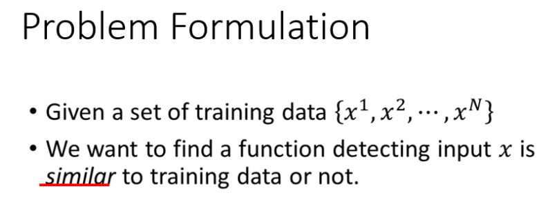
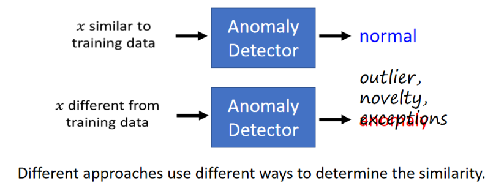
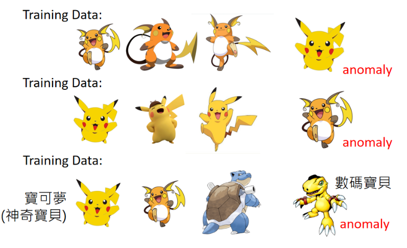
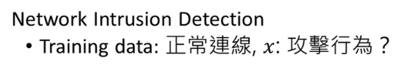
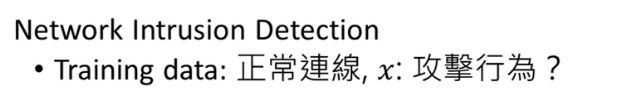
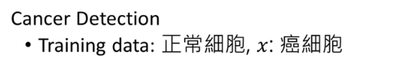
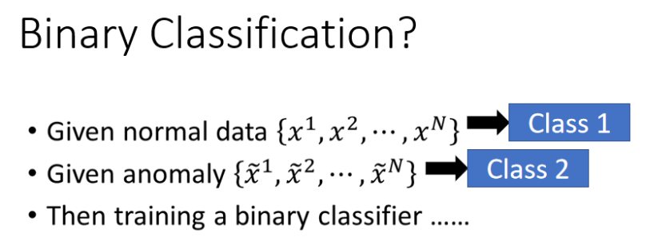
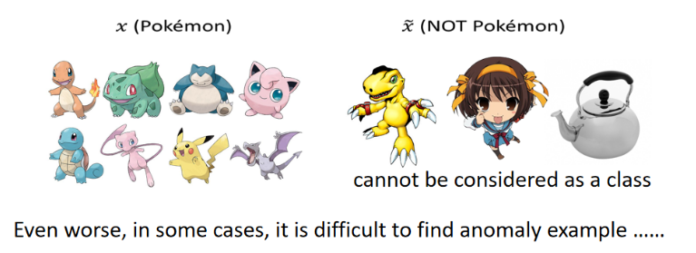
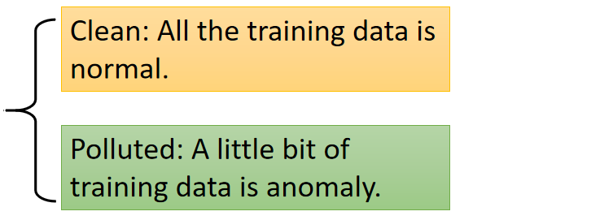

今天这堂我要讲的是Anomaly Detection，翻译为中文意思是异常侦测，异常侦测要做的如同我们上节课所讲的：让机器可以知道我不知道这件事。投影片的右边引用了《论语，论证》篇，“知之为知之，不知为不知，是知也（知道就是知道，不知道就是不知道，这样才是真正的知道）”，就是让机器知道它不知道这件事

异常侦测的问题通常formulation成这样，假设我们现在有一堆训练数据（$x^1, x^2, ... x^N$），（在这门课里面，我们通常用上标来表示一个完整的数据，用下标来表示一个完整数据的其中一部分）。我们现在要找到一个function，这个function要做的事情是：检测输入x的时，决定现在输入的x到底跟我们的训练数据是相似还是不相似的

我们之前说过：机器学习其实就是让机器找到一个function，在异常侦测里面我们要找的function是这样的。输入与我们训练数据相似的x，则异常侦测的function（Anomaly Detector）就会告诉我们这是正常的数据；若输入与我们训练数据不相似的x，则异常侦测的function（Anomaly Detector）就会告诉我们这是异常的数据。

我们一直再用Anoamly这个词汇，可能会让某些同学觉得机器在做Anoamly Detector都是要Detector不好的结果。因为异常这个词汇显然通常代表的是负面意思。其实Anoramly Detector这件事并不一定是找不好的结果，只是找跟训练数据不一样的数据。所以我们找出结果不见得是异常的数据，你会发现Anoamly Detector在不同的领域里面有不同名字。有时候我们会叫它为“outlier， novelty, exceprions”。

总之我们要找的是跟训练数据不一样的数据，有可能是特别好的，有可能是特别坏的。但至于什么叫做“像（similar）”，这就是Anoamly Detector需要探讨的问题。不同的方法就有不同的方式来定义什么叫做“像”、什么叫做“不像”。

这里我要强调一下什么叫做异常，机器到底要看到什么就是Anormaly。其实是取决你提供给机器什么样的训练数据。

假设你提供了很多的雷丘作为训练数据，皮卡丘就是异常的。若你提供了很多的皮卡丘作为训练数据，雷丘就是异常的。若你提供很多的宝可梦作为训练数据，这时数码宝贝就是异常的。

异常侦测有很多的应用，你可以应用到诈欺侦测（Fraud Detection）。训练数据是正常的刷卡行为，收集很多的交易记录，这些交易记录视为正常的交易行为，若今天有一笔新的交易记录，就可以用异常检测的技术来侦测这笔交易记录是否有盗刷的行为。（正常的交易金额比较小，频率比较低，若短时间内有非常多的高额消费，这可能是异常行为）

异常侦测还可以应用到网络系统的入侵侦测，训练数据是正常连线。若有一个新的连线，你希望用Anoramly Detection让机器自动决定这个新的连线是否为攻击行为

异常侦测还可以应用到医疗（癌细胞的侦测），训练数据是正常细胞。若给一个新的细胞，让机器自动决定这个细胞是否为癌细胞。

我们咋样去做异常侦测这件事呢？很直觉的想法就是：若我们现在可以收集到很多正常的资料（$x^1, x^2, ...,x^N$），我们可以收集到很多异常的资料（$\tilde{x}^1, \tilde{x}^2,..., \tilde{x}^N$）。我们可以将normal data当做一个Class（Class1），anomaly data当做另外一个Class（Class2）。我们已经学过了binary classification，这时只需要训练一个binary classifier，然后就结束了。

这个问题其实并没有那么简单，因为不太容易把异常侦测视为一个binary classification的问题。为什么这样说呢？

假设现在有一笔正常的训练数据是宝可梦，只要不是宝可梦就视为是异常的数据，这样不只是数码宝贝是异常数据，凉宫春日也是异常数据，茶壶也是异常的数据。不属于宝可梦的数据，不可能穷举所有不是宝可梦的数据。根本没有办法知道整个异常的数据（Class2）是咋样的，所以不应该将异常的数据视为一个类别，应为它的变化太大了。这是第一个不能将异常侦测视为二元分类的原因。

第二个原因是：很多情况下不太容易收集到异常的资料，收集正常的资料往往比较容易，收集异常的资料往往比较困难。对于刚才的诈欺侦测例子而言，你可以想象多数的交易通常都是正常的，很难找到异常的交易。这样就造成异常侦测不是一个单纯的二元分类问题，需要想其它的方法。它是一个独立的研究主题，仍然是一个尚待研究的问题。

接下来对异常侦测做一个简单的分类（两类），一类是：不只有训练资料（$x^1, x^2,..., x^N$），同时这些训练资料还具有某种类型的label（$y^1, y^2,...,y^N$）。若有了这些label就可以训练出一个classifier，教机器看到这些训练资料能不能预测出对应的label是什么。

训练一个classifier可以用generative model、logistic regression、deep learning，从中可以选择一个自己喜欢的技术训练出一个classifier。但是在这些label里没有任何一种label叫做“unknown”，我们期待训练好一个classifier以后，机器有能力知道新给定的训练数据不在原本的训练数据中，它会给新的训练数据贴上“unknown”的标签。

若你有一个classifier，你希望这个classifier具有：看到不知道的数据会标上这是未知物的能力，这算是异常侦测的其中一种，又叫做Open-set Recognition

有时你会遇到的状况是：这些训练资料是没有任何的label，这时你只能在只有这些训练资料的情况下想办法去判断，给定一笔新的训练资料，这笔资料跟原本的训练资料是否相像。

上述内容分为两个case，一个case是手上的资料是干净的（所有的训练资料都是正常的资料），手上的资料已经被污染（训练资料已经被混杂了一些异常的资料）。

对于刚才的诈欺侦测例子而言，银行收集了大量的交易记录，它把所有的交易记录都当做是正常的，然后告诉机器这是正常交易记录，然后希望机器可以借此侦测出异常的交易。但所谓的正常的交易记录可能混杂了异常的交易，只是银行在收集资料的时候不知道这件事。所以我们更多遇到的是：手上有训练资料，但我没有办法保证所有的训练资料都是正常的，可能有非常少量的训练资料是异常的。

