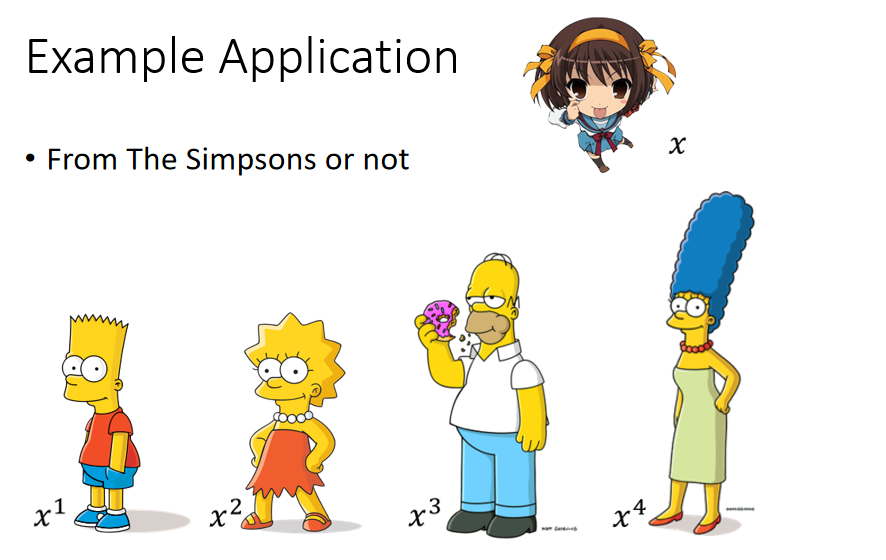
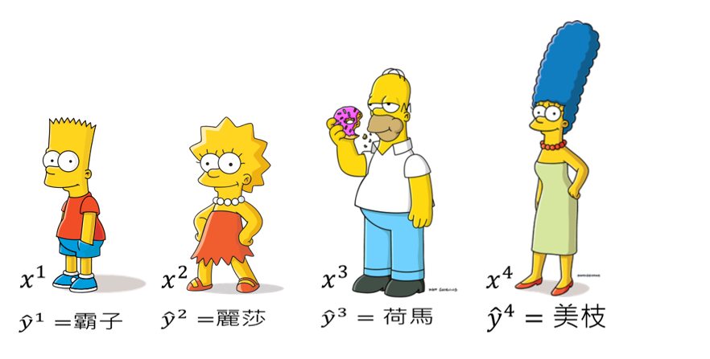
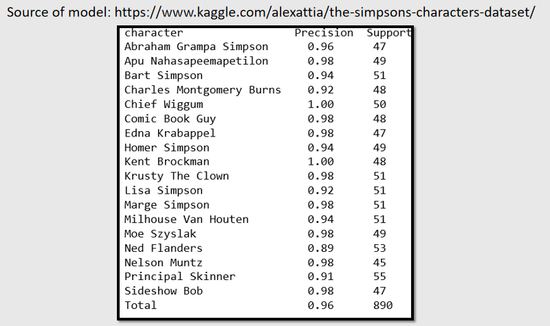
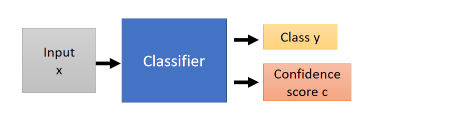
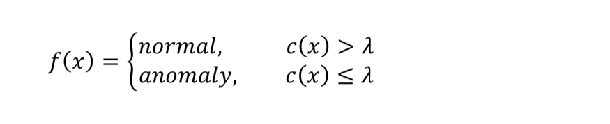
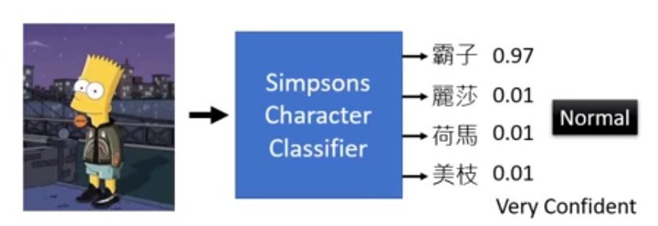
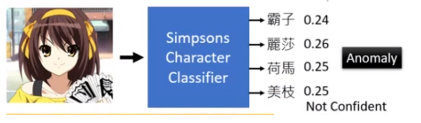
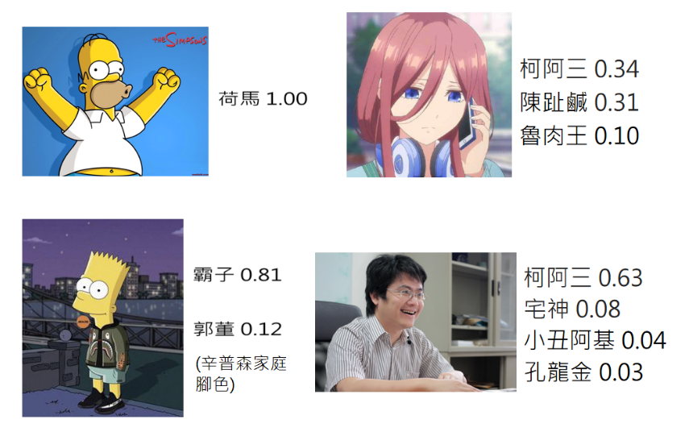
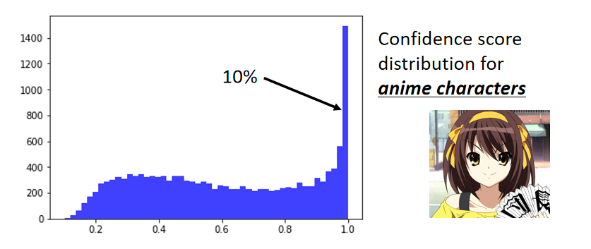
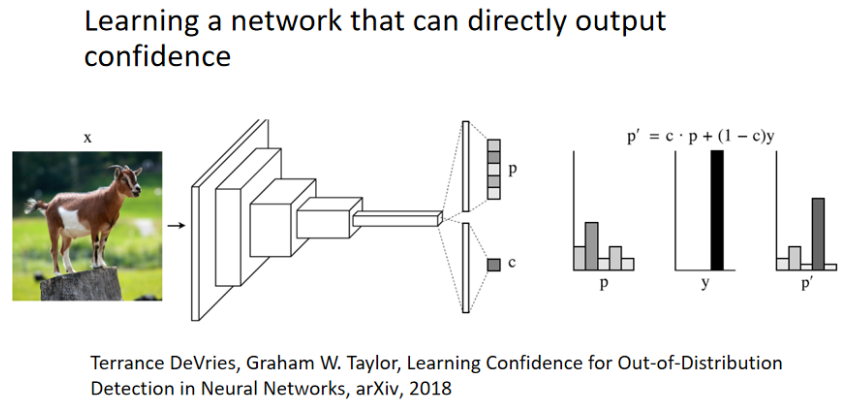

现在给定的例子是要侦测一个人物是不是来自辛普森家庭，可以看出`$x^1, x^2, x^3,x^4$`是来自辛普森家庭（辛普森家庭的人有很明显的特征：脸是黄色的，嘴巴像似鸭子），同时也可以看出凉宫春日显然不是来自辛普森家庭。

假设我们收集的辛普森家庭的人物都具有标注（霸子，丽莎，荷马，美枝），有了这些训练资料以后就可以训练出一个辛普森家庭成员的分类器。我们就可以给分类器看一张照片，它就可以判断这个照片中的人物是辛普森家庭里面的哪个人物。

将这张图片输入辛普森家庭人物的分类器，它就会告诉你这是荷马。

在kaggle上有一个非常喜欢辛普森家庭的人，收集了数千张辛普森家庭人物，然后训练出一个分类器，然后用这个分类器做了测试，结果有百分之九十六的正确率。

现在我们想做的事情是根据这个分类器来进行异常侦测，判断这个人物是否来自辛普森家庭。

我们原本是使用分类器来进行分类，现在希望分类器不仅可以来自分类，还会输出一个数值，这个数值代表信心分数（Confidence score ），然后根据信心分数做异常侦测这件事情。

定义一个阈值称之为`$\lambda$`，若信心分数大于`$\lambda$`就说明是来自于辛普森家庭。若信心分数小于`$\lambda$`就说明不是来自于辛普森家庭

咋样可以得到信心分数呢？若我们将图片输入辛普森家庭的分类器中，若分类器非常的肯定这个图片到底是谁，输出的信心分数就会非常的高。当我们将图片输入分类器时，分类器的输出是一个几率分布（distribution），所以将一张图片输入分类器时，分类器会给事先设定的标签一个分数。

如图所示，将“霸子”图片输入分类器，分类器就会给“霸子”一个很高的分数。

但你若给它一张很奇怪的图片（凉宫春日），这时输出的分数会特别的平均。若输出特别平均，那这张图片就是异常的图片

刚才讲的都是定性的分析，现在需要将定性分析的结果化为信心分数。一个非常直觉的方法就是将分类器的分布中最高数值作为信心分数，所以上面那张图输出的信心分数为0.97（霸子），下面那张图输出的信心分数为0.26（凉宫春日）

根据信心分数来进行异常检测不是唯一的方法，因为输出的是distribution，那么就可以计算交叉熵（entropy）。交叉熵（entropy）越大就代表输出越平均，代表机器没有办法去肯定输出的图片是哪个类别，表示输出的信心分数是比较低。总之我们有不同的方法根据分类器决定它的信心分数

现在我输入一张训练资料没有的图片（荷马），分类器输出荷马的信心分数是1.00；输入霸子的图片，分类器输出霸子的信心分数为0.81，输出郭董的信心分数为0.12；输入三玖的图片，分类器输出柯阿三的信心分数为0.34，输出陈趾鹹的信心分数为0.31，输出鲁肉王的信心分数为0.10。

以上都是动漫人物，现在输入一张真人的图片，分类器输出柯阿三的信心分数为0.63，输出宅神的信心分数为0.08，输出小丑阿基的信心分数为0.04，输出孔龙金的信心分数为0.03。

我们可以发现，如果输入的是辛普森家庭的人物，分类器输出比较高信心分数。如果输入不是辛普森家庭的任务，分类器输出的信心分数是比较低。但是输入凉宫春日的图片，分类器输出柯阿三的信心分数为0.99。

若输入大量的训练资料（将之前的介绍辛普森家庭的那张投影片中的kaggle链接中的数据作为训练资料（有数千张辛普森家庭人物））输入至分类器中，输出的信息分数分布如图所示。几乎所有的辛普家庭的人物输入分类器中，无论是否辨识有错都会给出一个较高的信心分数。但还是发现若辨识若有错误会得到较低的信心分数，如图所示的红色点就是辨识错误图片的信心分数的分布。蓝色区域分布相较于红色区域集中在1.0，有很高的信心分数认为是辛普森家庭的人物。

若输入其它动画的人物图片（15000张图片），其分类器输出的信心分数如题所示，我们会发现有10分之一图片的信心分数比较高（不是辛普森家庭的人物，但给了比较高的分数），多数的图片得到的信心分数比较低（辛普森家庭的人物和不是辛普森家庭的人物在分类器输出的信息分数是有所差别的）。

刚才是比较直观的给出了一个信心分数，你可能会觉得这种方法会让你觉得非常弱，不过刚才那种非常简单的方法其实在实做上往往还可以有不错的结果。

若你要做异常侦测的问题，现在有一个分类器，这应该是你第一个要尝试的baseline。虽然很简单，但不见得结果表现会很差。

你训练一个neuron network时，可以直接让neuron network输出信心分数，这个问题我先不细节，在这里我先引用一个文献（2018年的paper）是有这样的技术的。

