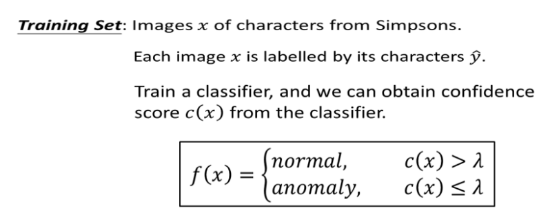

我们现在复习整个框架：我们有大量的训练资料，且训练资料具有标注（辛普森家庭哪个人物），因此我们可以训练一个分类器。不管你用什么方法，总可以从分类器中得到对所有图片的信心分数。然后就根据信心分数建立异常侦测的系统，若信心分数高于某个阀值（threshold）时就认为是正常，若低于某个阀值（threshold）时就认为是异常。

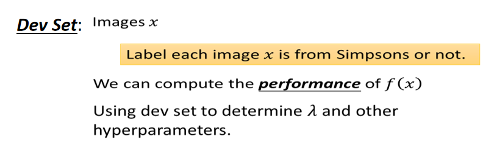

在之前的课程中已经讲了Dev Set的概念，需要Dev Set调整模型的超参数（hyperparameter），才不会将过拟合现象表现在测试集上。

在异常侦测的任务里面我们需要Dev Set，不仅是需要大量的images，还需要被标注这些图片是来自辛普森家庭的人物还是不是来自辛普森家庭的人物。需要强调的是在训练时所有的资料都是来自辛普森家庭的人物，标签是来自辛普森家庭的哪一个人物。但是我们要做Dev Set时，Dev Set要模仿测试数据集（testing Set），Dev Set要的并不是一张图片（辛普森家庭的哪一个人物），而是应该有：辛普森家庭的人物和不是辛普森家庭的人物。

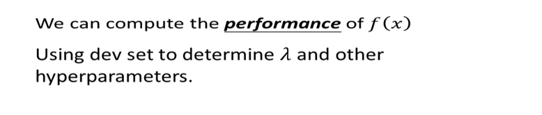

有了Dev Set以后，我们就可以把我们异常侦测的系统用在Dev Set，然后计算异常侦测系统在Dev Set上的结果表现是多少。等下会说明这个结果表现咋样来衡量。你能够在Dev Set衡量一个异常侦测系统的结果表现以后，你就可以拿来调整阀值（threshold），可以找出让最好的阀值（threshold）。

决定超参数以后（hyperparameters），就有了一个异常侦测的系统，你就可以让它上线。输入一张图片，系统就会决定是不是辛普森家庭的人物。

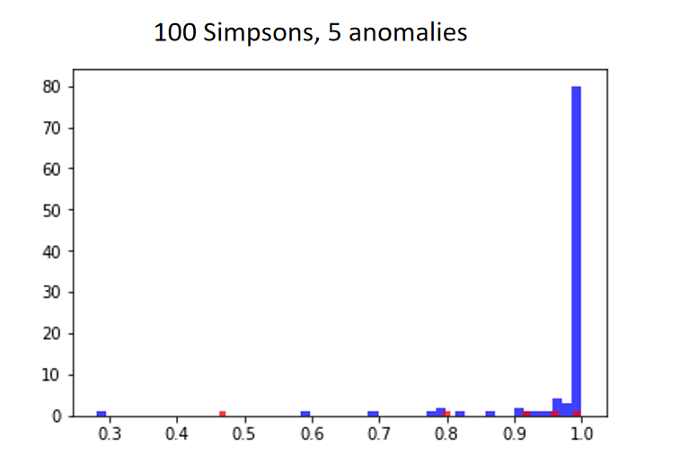

接下里要讲的是：如何计算一个异常侦测系统的性能好坏？现在有100张辛普森家庭人物的图片和5张不是辛普森家庭人物的图片。如图所示，辛普森家庭是用蓝色来进行表示，你会发现基本都集中在高分的区域。5张不是辛普森家庭的图片用红色来表示。

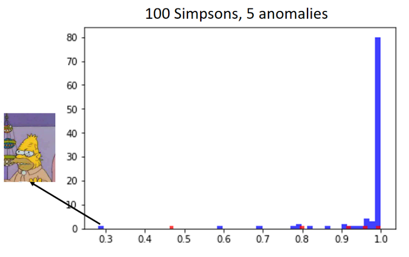

你会发现图的左边有一个辛普森家庭人物的分数是非常低的，在异常侦测时机器显然会在这里犯一个错误，认为它不是辛普森家庭人物，这张图片是辛普森家庭的老爷爷（我也不知道这是为什么）。

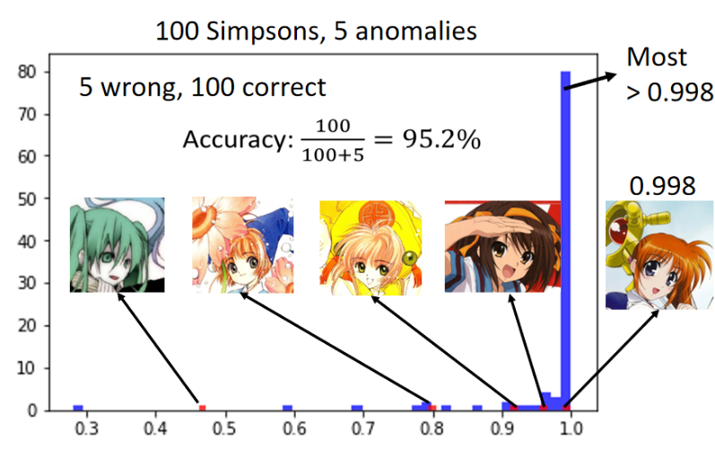

第一个图片是看起来像安娜贝尔的初音，第二张图片是小樱，第三张图片也是小樱，第四张图是凉宫春日，第五张图是魔法少女。我们会发现这个魔法少女的信心分数非常的高（0.998），事实上在这个图中有百分之七十五的信心分数都是高于0.998，你会发现多数辛普森家庭人物得到的信心分数都是1。很多人在实做时，发现这张异常的图片却给到了0.998很高的分数。但你发现那些正常的图片往往得到更高的分数。虽然这些异常的图片可以得到很高的分数，但如果没有正常图片的分数那么高，还是可以得到较好的异常侦测的结果。

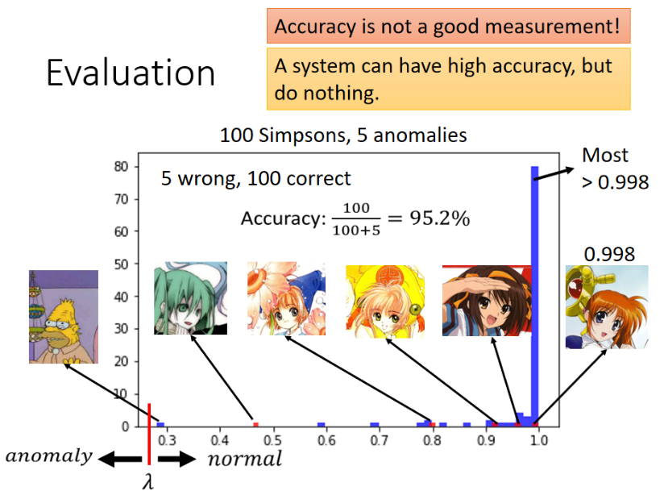

我们咋样来评估一个异常侦测系统的好坏呢？我们知道异常侦测其实是一个二元分类（binary classification）的问题。在二元分类中我们都是用正确率来衡量一个系统的好坏，但是在异常侦测中正确率并不是一个好的评估系统的指标。你可能会发现一个系统很可能有很高的正确率，但其实这个系统什么事都没有做。为什么这样呢？因为在异常侦测的问题中正常的数据和异常的数据之间的比例是非常悬殊的。在这个例子里面，我们使用了正常的图片有一百张，异常的图片有五张。

所以正常的资料和异常的资料之间的比例是非常悬殊的，所以会造成只用准确率衡量系统的好坏会得到非常奇怪的结果的。

在如图所示的例子中，我们认为有一个异常侦测的系统，它的$\lambda$设为0.3以下。$\lambda$以上认为是正常的，$\lambda$以下认为是异常的。这时你会发现这个系统的正确率是95.2%，所以异常侦测问题中不会用正确率来直接当做评估指标。

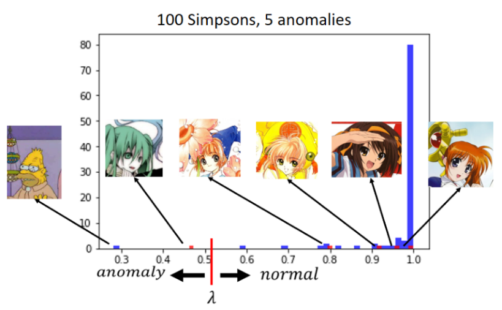

首先我们要知道在异常侦测中有两种错误：一种错误是异常的资料被判断为正常的资料，另外一种是正常的资料被判为异常的资料。所以你实际下，假设我们将$\lambda$设为0.5（0.5以上认为是正常的资料，0.5以下认为是异常的资料），这时就可以计算机器在这两种错误上分别范了多少错误。

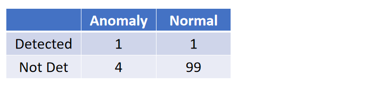

对于所有异常的资料而言，有一笔资料被侦测出来，其余四笔资料没有被侦测为异常的资料。对于所有正常的资料而言，只有一笔资料被判断为异常的资料，其余的九十九笔资料被判断为正常的资料。

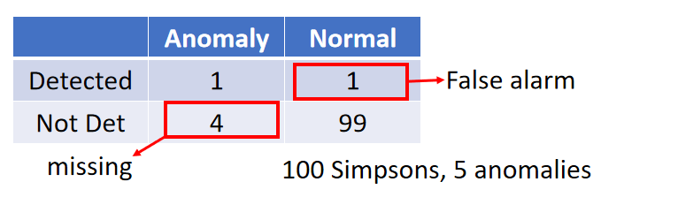

这时我们会说机器犯了一个false alarm（正常的资料被判断为异常的资料）错误，若是异常的资料却没有被侦测出来，我们会说机器有四个missing错误。

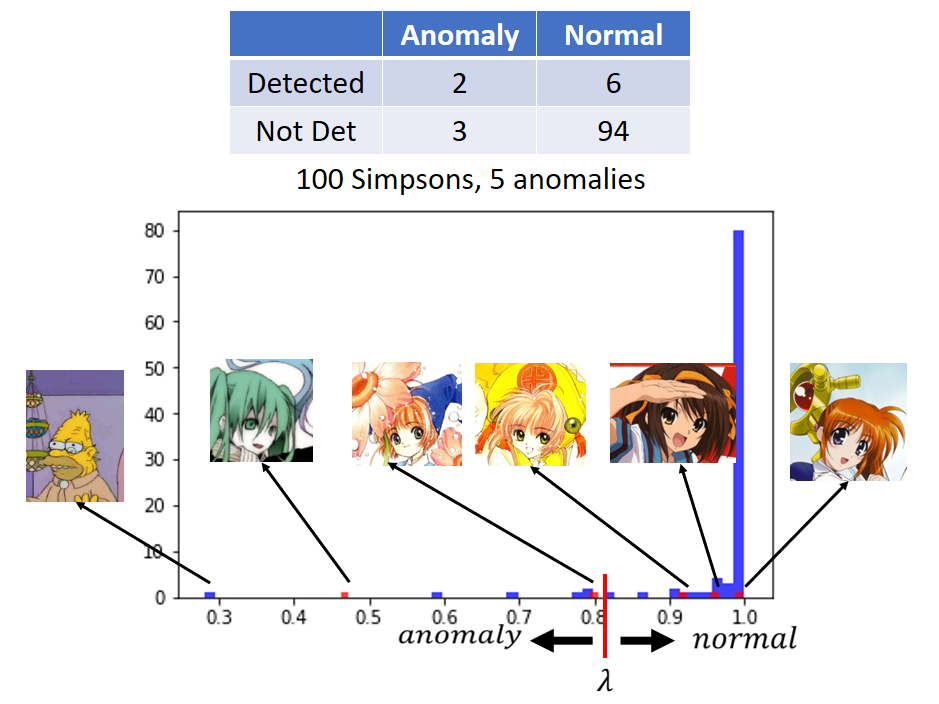

若我们将阀值（threshold）切在比0.8稍高的部分，这时会发现在五张异常的图片中，其中有两张认为是异常的图片，其余三种被判断为正常的图片；在一百张正确的图片中，其中有六张图片被认为是异常的图片，其余九十四张图片被判断为正常的图片。

哪一个系统比较好呢？其实你是很难回答这个问题。有人可能会很直觉的认为：当阀值为0.5时有五个错误，阀值为0.8时有九个错误，所以认为左边的系统好，右边的系统差。

但其实一个系统是好还是坏，取决你觉得false alarm比较严重还是missing比较严重。

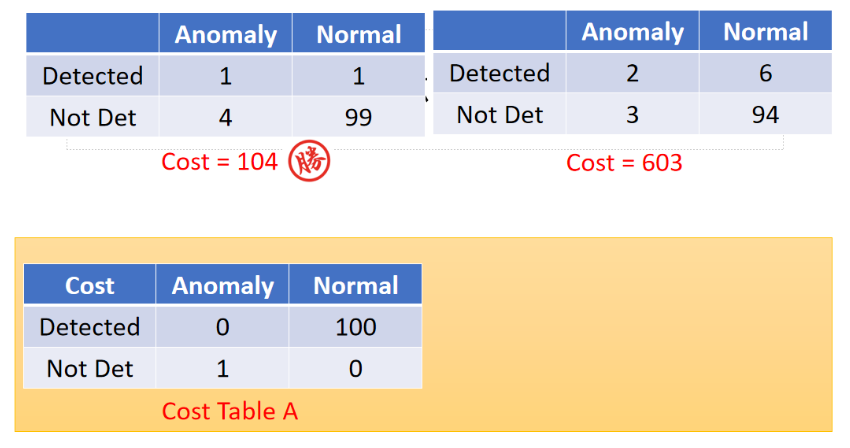

所以你在做异常侦测时，可能有Cost Table告诉你每一种错误有多大的Cost。若没有侦测到资料就扣一分，若将正确的资料被误差为错误的资料就扣100分。若你是使用这样的Cost来衡量系统的话，左边的系统会被扣104分，右边的系统会被扣603分。所以你会认为左边的系统较好。

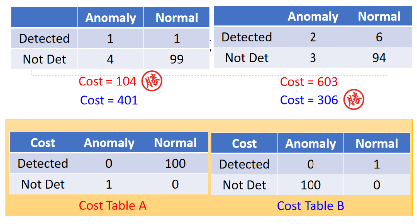

若Cost Table为Cost Table B 时，异常的资料没有被侦测出来就扣100分，将正常的资料被误判为错误的资料就扣1分，计算出来的结果会很不一样。在不同的情景下、不同的任务，其实有不同的Cost Table：假设你要做癌症检测，你可能就会比较倾向想要用右边的Cost Table。因为一个人没有癌症却被误判为有癌症，顶多几天心情不好，但是还可以接受。若一个人其实有癌症，但没有检查出来，这时是非常严重的，这时的Cost也是非常的高。

这些Cost要给出来，其实是要问你现在是什么样的任务，根据不同的人物有不同的Cost Table。所以根据右边的Cost Table，，左边的Cost为306分，所以这时右边的系统较好。

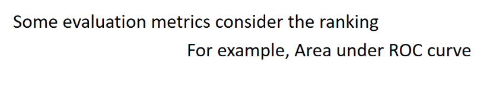

其实还有很多衡量异常检测系统的指标，我在这里就不细讲这些，有一个常用的指标为Area under ROC curve。若使用这种衡量的方式，你就不需要决定阀值（threshold），而是看你将测试集的结果做一个排序（高分至低分），根据这个排序来决定这个系统好还是不好。

