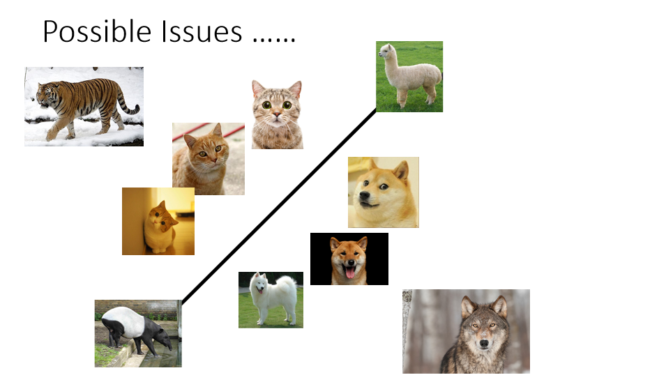
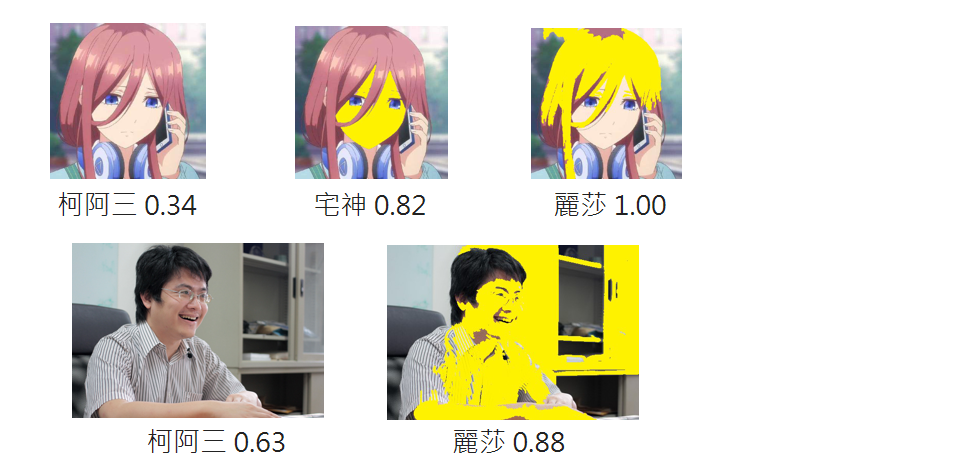
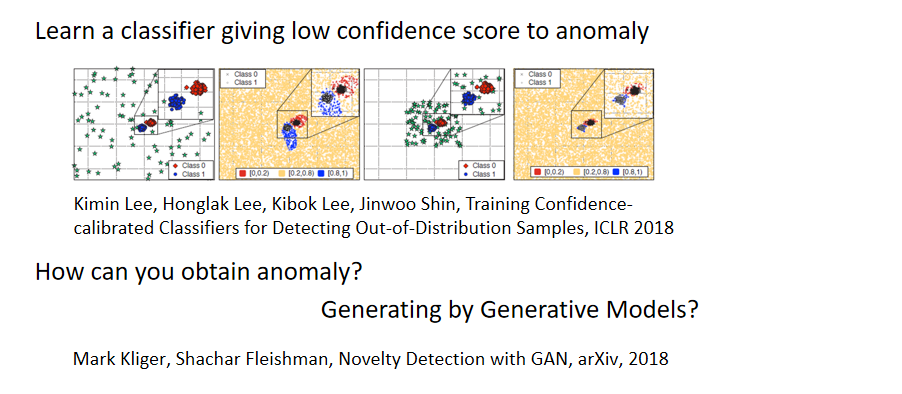

如果我们直接用一个分类器来侦测输入的资料是不是异常的，当然这并不是一种很弱的方法，但是有时候无法给你一个perfect的结果，我们用这个图来说明用classifier做异常侦测时有可能会遇到的问题。假设现在做一个猫和狗的分类器，将属于的一类放在一边，属于狗的一类放在一边。若输入一笔资料即没有猫的特征也没有狗的特征（草泥马，马莱貘），机器不知道该放在哪一边，就可能放在这个boundary上，得到的信息分数就比较低，你就知道这些资料是异常的。

你有可能会遇到这样的状况：有些资料会比猫更像猫（老虎），比狗还像狗（狼）。机器在判断猫和狗时是抓一些猫的特征跟狗的特征，也许老虎在猫的特征上会更强烈，狼在狗的特征上会更强烈。对于机器来说虽然有些资料在训练时没有看过（异常），但是它有非常强的特征会给分类器很大的信心看到某一种类别。

在解决这个问题之前我想说辛普森家庭人物脸都是黄的，如果用侦测辛普森家庭人物的classifier进行侦测时，会不会看到黄脸的人信心分数会不会暴增呢？所以将三玖的脸涂黄，结果侦测为是宅神，信心分数为0.82；若再将其头发涂黄，结果侦测为丽莎，信心分数为1.00。若将我的脸涂黄，结果侦测为丽莎，信心分数为0.88。

当然有些方法可以解这个问题，这里列一些文献给大家进行参考。其中的一个解决方法是：假设我们可以收集到一些异常的资料，我们可以教机器看到正常资料时不要只学会分类这件事情，要学会一边做分类一边看到正常的资料信心分数就高，看到异常的资料就要给出低的信心分数。

但是会遇到的问题是：很多时候不容易收集到异常的数据。有人就想出了一个神奇的解决方法就是：既然收集不到异常的资料，那我们就通过Generative Model来生成异常的资料。这样你可能遇到的问题是：生成的资料太像正常的资料，那这样就不是我们所需要的。所以还要做一些特别的constraint，让生成的资料有点像正常的资料，但是又跟正常的资料又没有很像。接下来就可以使用上面的方法来训练你的classifier。

