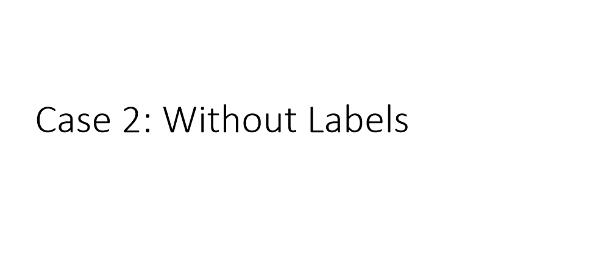
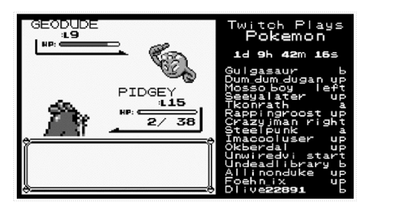
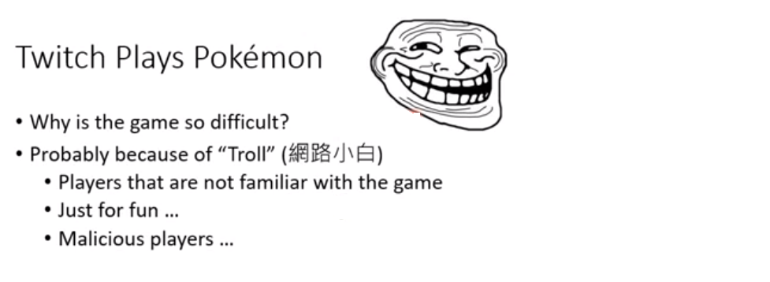
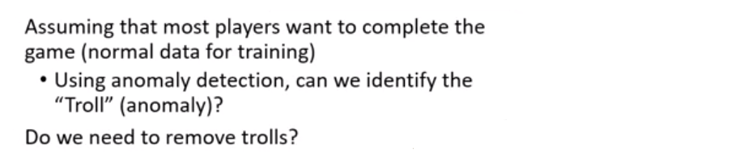
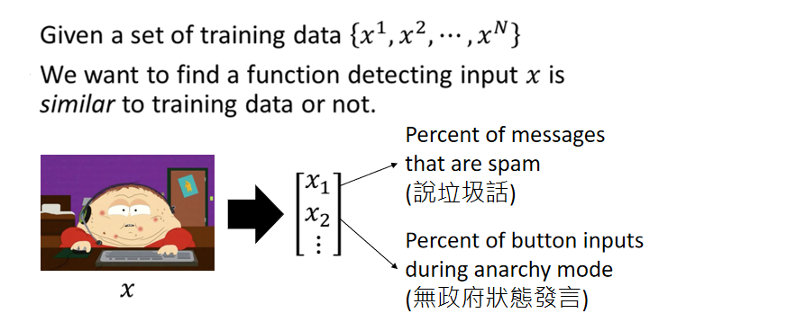
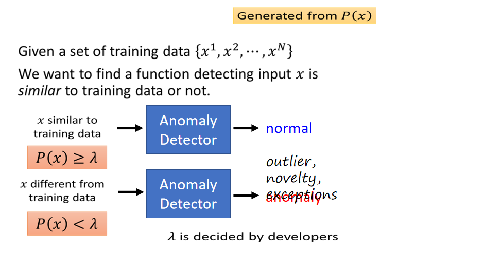
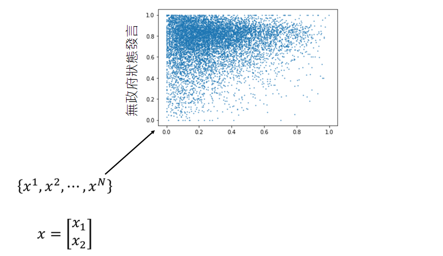
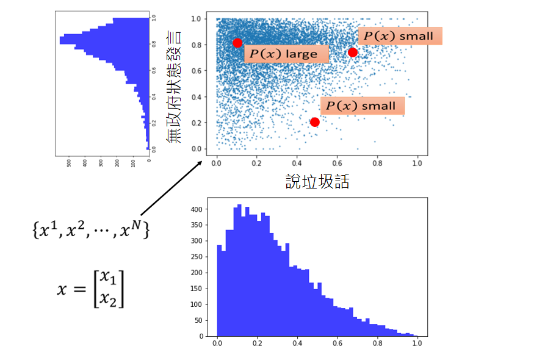

接下来我们再讲第二个例子，在第二个例子中我们没有classifier，我们只能够收集到一些资料，但没有这些资料的label

这是一个真实的Twitch Plays Pokemon例子，这个的例子是这样的：有人开了一个宝可梦的游戏，全世界的人都可以连接一起玩这个宝可梦的游戏。右边的框是每一个人都在输入指令同时操控这个游戏，这个游戏最多纪录好像是有八万人同时玩这个游戏。当大家都在同时操作同一个角色时，玩起来其实是相当崩溃的。

人们玩的时候就非常的崩溃，那么崩溃的原因是什么呢？可能是因为有网路小白（Troll）。有一些人根本就不会玩，所以大家都没有办法继续玩下去；或者觉得很有趣；或者是不知名的恶意，不想让大家结束这个游戏。人们相信有一些小白潜藏在人们当中，他们想要阻挠游戏的进行。

所以我们就可以用异常侦测的技术，假设多数的玩家都是想要破关的（资料资料），我们可以从多数玩家的行为知道正常玩家的行为是咋样的，然后侦测出异常的玩家（网路小白）。至于侦测出来给网路小白做什么，还需要待讨论的问题。有人说：小白只是人们的幻想，为什么这么说呢？因为有人在

也许实际上根本就没有在阻挠这个游戏的进行，只是因为大家同时玩这个游戏时，大家的想法会是不一样的，这样玩起来会非常的卡。甚至有人说若没有网路小白，大家就根本没办法玩下去，因为在这个游戏里面同时可能会有非常多的指令被输入，而系统pick一个指令，所以多数时你的指定根本就没有被选到。如果所有人的想法都是一致的（输入同一个指定），结果某一个人的指定被选到。那你可能就会觉得这有什么好玩的，反正我又没有操控那个角色。所以大家相信有网络小白的存在，大家一起联手起来抵挡网路小白的攻击，这会让你觉得最后系统没有选到我，但是至少降低了小白被选到的可能，所以大家可以继续玩下去。

我们需要一些训练的资料，每一个x代表一个玩家，如果我们使用machine learning的方法来求解这个问题，首先这个玩家能够表示为feature vector。向量的第一维可以是玩家说垃圾话的频率，第二维是统计玩家无政府状态发言，越是喜欢在无政府状态下发言，就越有可能是搞破坏的。

我们现在只有大量的训练资料，但是没有label。我们刚才可以根据分类器的conference来判断是不是异常的资料，我们在没有classifier的情况下可以建立一个模型，这个模型是告诉我们P(x)的几率有多大。（根据这些训练资料，我们可以找出一个几率模型，这个模型可以告诉我们某一种行为发生的概率多大）。如果有一个玩家的几率大于某一个阀值（threshold），我们就说他是正常的；如果几率小于某一个阀值（threshold），我们就说他是异常的。

如图这是一个真实的资料，假设每一个玩家可以用二维的向量来描述（一个是说垃圾话的几率，一个是无政府状态发言的几率）。

如果我们只看说垃圾话的那一维如图所示，会发现并不是完全不说垃圾话的是最多的。很多人可能会想象说大多数人是在民主状态下发言的（民主时比较想发言，无政府混乱时不想发言），但是实际上统计的结果跟直觉的想象是不一样的，如图所示大多数人有八成的几率是在无政府状态下发言的，因为这个游戏多数时间是在无政府状态下进行的。游戏进行到某一个地方以后，官方决加入民主机制（20秒内最多人选择的那一个行为是控制角色所采取的决策，这个听起来好像是很棒的主意，马上就遭到了大量的反对。在游戏里面要投票选择民主状态还是无政府状态，若很多人选择无政府状态，就会进入无政府状态。

事实上很多人强烈支持无政府状态，强烈反对民主状态，所以这个游戏多数是在无政府状态下进行。假设一个玩家不考虑自己是要在什么状态下发言，大多数人有八成的几率是在无政府下进行发言，有人觉得多数小白是在民主状态下发言，因为进入了民主状态，所以他要多发言才能够让他的行为被选中，所以小白会特别喜欢在民主状态下发言。

我们还没有讲任何的几率模型，从这个图上可以很直觉的看出一个玩家落在说垃圾的话几率低，通常在无政府状态下发言，这个玩家有可能是一个正常的玩家。假设有玩家落在有五成左右的几率说垃圾话，二成的几率在无政府状态下发言；或者落在有七成左右的几率说垃圾话，七成的几率在无政府状态下发言，显然这个玩家比较有可能是一个不正常的玩家。我们直觉上明白这件事情，但是我们仍然希望用一个数值化的方法告诉我们玩家落在哪里会更加的异常。

