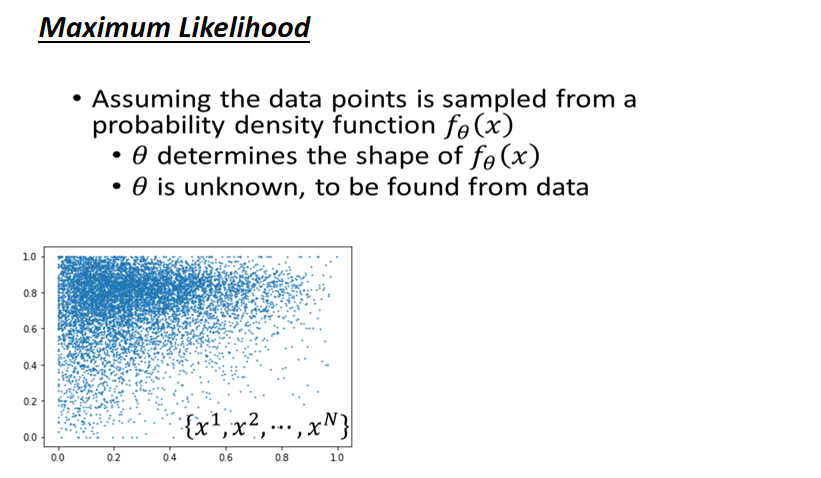
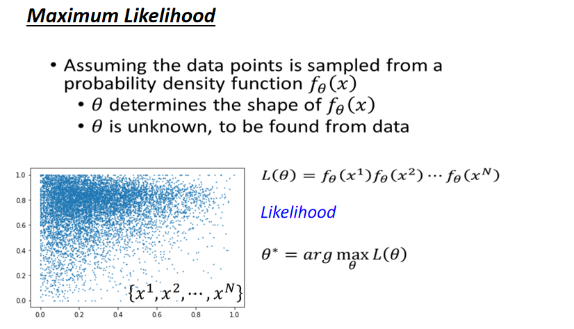
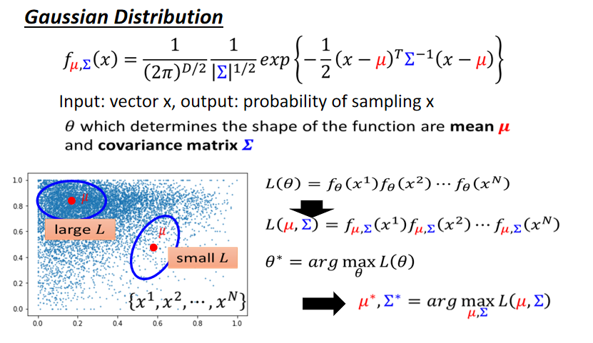
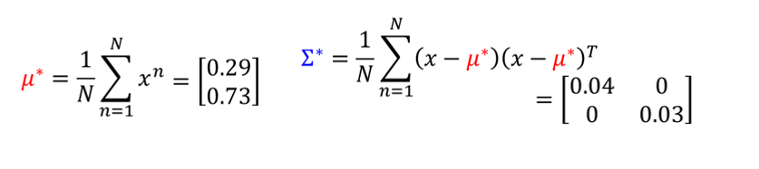
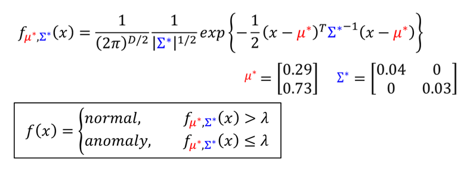
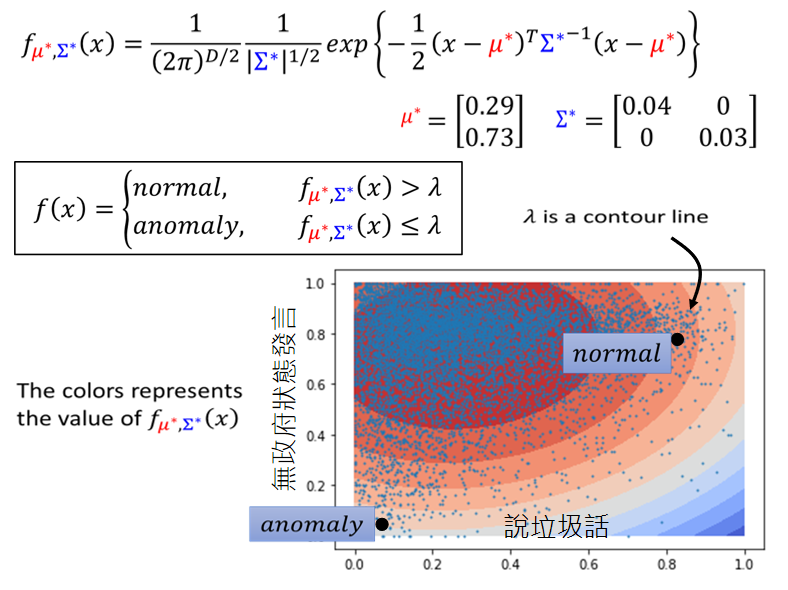

我们需要likelihood这个概念：我们收集到n笔资料，假设我们有一个probability density function（$f_{\theta}(x)$），其中$\theta$是这个probability density function的参数（$\theta$的数值决定这个probability density function的形状），$\theta$必须要从训练资料中学习出来。假设这个probability density function生成了我们所看到的数据，而我们所做的事情就是找出这个probability density function究竟长什么样子。

likelihood的意思是：根据probability density function产生如图所示的数据几率有多大。若严格说的话，$f_{\theta}(x)$并不是几率，它的output是probability density；输出的范围也并不是(0,1)，有可能大于1。$x^1$根据probability density function产生的几率($f_{\theta}(x^1)$)乘以$x^2$根据probability density function产生的几率($f_{\theta}(x^2)$)，一直乘到$x^N$根据probability density function产生的几率，得到的结果就是likelihood。likelihood的可能性显然是由$\theta$控制的，选择不同的$\theta$就有不同的probability density function，就可以算法不同的likelihood。

而我们现在并不知道这个$\theta$是多少，所以我们要将这个$\theta$算出来，这个$\theta^*$算出来的likelihood是最大的。

一个常用的probability density function就是Gaussian Distribution，你可以将这个公式想象为一个function，这个function就是输入一个vector x，输出为这个vector x被sample的几率。这个function由两个参数（$\mu, $和covariance matrix $\sum$）所控制，相当于我们刚才所讲的$\theta$，这个Gaussian function的形状由$\mu$和covariance matrix $\mu$所控制。将$\theta$替换为$\mu, \sum$，不同的$\mu, \sum$就有不同的probability density function。假设如图所示的数据是由左上角的$\mu$来生成的，它的likelihood是比较大（Gaussian function的特性就是在$\mu$附近时data被sample的几率很高）假设这个$\mu$远离高密度，若从这个$\mu$被sample出来的资料应该落在这个蓝色圈圈的范围内，但是资料没有落在这个蓝色圈圈的范围内，显然这样计算出来的likelihood是比较低的。

所以我们要做的事情就是穷举所有的$\mu, \sum$，观察哪个$\mu, 
\sum$计算的likelihood最大，那这个$\mu, \sum$就是我们要找的$\mu^*,\sum^*$，得到$\mu^*,\sum^*$以后就可以知道产生这笔资料的Distribution的形状。但是往往有同学问的问题是：为什么要用Gaussian Distribution，为什么不用其它的Distribution。最简答的答案是：我选别的Distribution，你也会问同样的问题。Gaussian是真的常用，常用到有时你的资料分布看不起来不是Gaussian Distribution。这是一个非常非常强的假设，因为你的资料分布可能根本就不是Gaussian，有可能你会做的的更好，但不是我们这门课要讲的范围。

如果$f_{\theta}(x)$是一个非常复杂的function（network），而操控这个network的参数有非常大量，那么就不会有那么强的假设了，就会有多的自由去选择function来产生资料。这样就不会限制在看起来就不像Gaussian产生的资料却硬要说是Gaussian产生的资料。因为我们这门课还没有讲到其它进阶的模型，所以现在用Gaussian Distribution来当做我们资料是由Gaussian Distribution所产生的。

$\mu^*, \sum^*$可以代入相应的公式来解这个这个公式，$\mu^*$等于将所有的training data x做平均，结果为$\begin{bmatrix}
0.29\\ 
0.73
\end{bmatrix}$，$\sum^*$等于将x减去$\mu^*$乘以x减去$\mu^*$的转置，然后做平均，得到的结果为$\begin{bmatrix}
0.04 & 0\\ 
0 & 0.03
\end{bmatrix}$

我们根据如图所示的资料找出了$\mu^*$和$\sum^*$，接下来就可以做异常侦测了。将$\mu^*,\sum^*$代入probability density function，若大于某一个阀值（threshold）就说明是正常的，若小于某一个阀值（threshold）就说明是异常的。

每一笔资料都可以代入probability density function算出一个数值，结果如图所示。若落在颜色深的红色区域，就说明算出来的数值越大，越是一般的玩家，颜色浅的蓝色区域，就说明这个玩家的行为越异常。其中$\lambda$就是如图所示的等高线的其中一条，若有一个玩家落在很喜欢说垃圾话，多数喜欢在无政府状态下发言的区域，就说明是一个正常的玩家。若有一个玩家落在很少说垃圾话，特别喜欢在民主时发言，就说明是一个异常的玩家。

