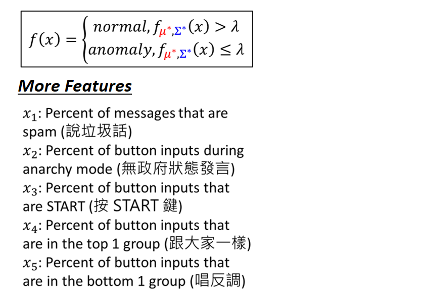
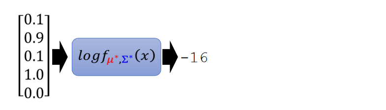
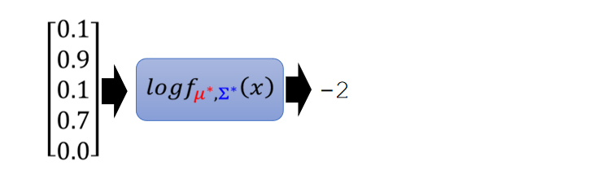
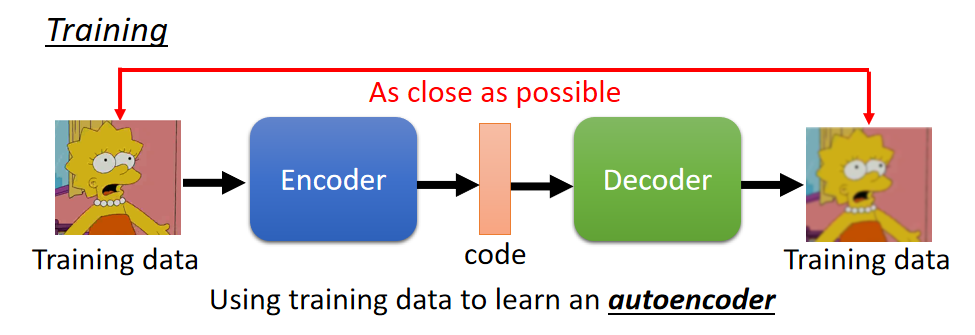
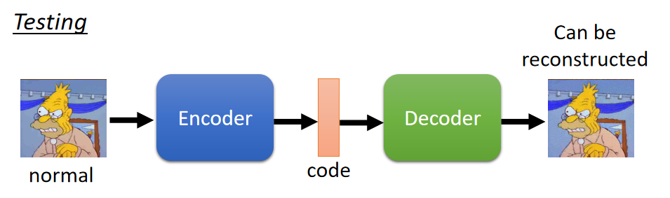
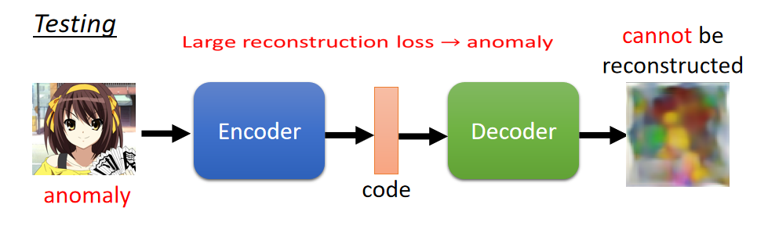
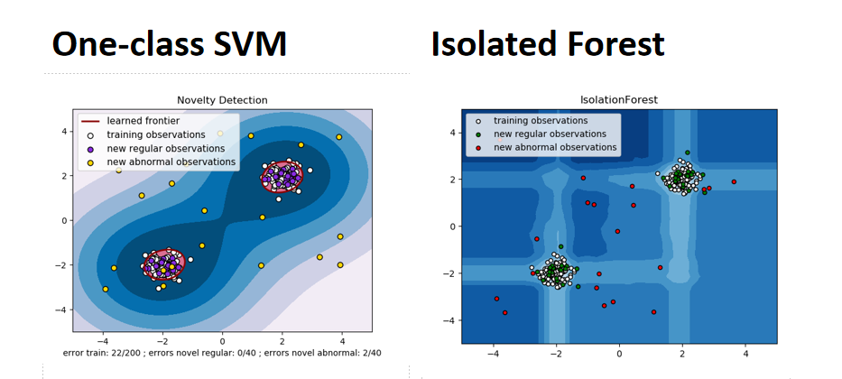
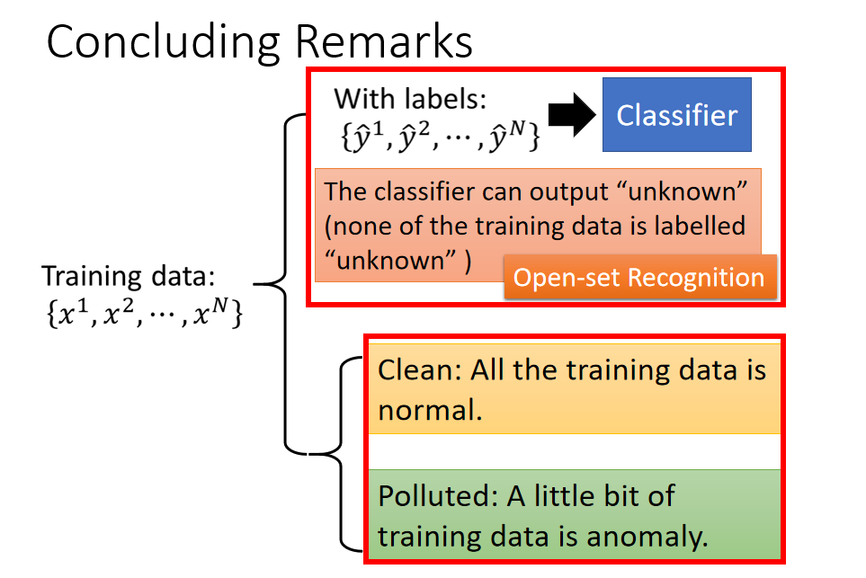

machine learning最厉害的就是让machine做，所以你要选择多少feature都可以，把能想到觉得跟判断玩家是正常的还是异常的feature加进去（小白会不断的按START键，所以按START键的比例可能代表了他是正常的玩家还是异常的玩家，等等）。有了这些feature以后就训练训练出$\mu*, \sum^*$，然后创建一个新的玩家代入这个function，就可以知道这个玩家算出来的分数有多高（对这function进行log变化，因为一般function计算出来的分数会比较小）。

假设输入的这个玩家有0.1 percent说垃圾话，0,9 percent无政府状态下发言，0.1 percent按START键，1.0 percent跟大家一样，0.0 percent唱反调，这个玩家计算出来的likelihood为-16。

假设输入的这个玩家有0.1 percent说垃圾话，0,9 percent无政府状态下发言，0.1 percent按START键，0.0 percent跟大家一样，0.3 percent唱反调，这个玩家计算出来的likelihood为-22。

假设输入的这个玩家有0.1 percent说垃圾话，0,9 percent无政府状态下发言，0.1 percent按START键，0.7 percent跟大家一样，0.0 percent唱反调，这个玩家计算出来的likelihood为-2。

 
上述是用生成模型（Generative Model） 来进行异常侦测这件事情，我们也可以使用Auto-encoder来做这件事情。

我们把所有的训练资料训练一个Encoder，Encoder所做的事情是将输入的图片（辛普森）变为code（一个向量），Decoder所做事情是将code解回原来的图片。训练时Encoder和Decoder是同时训练，训练目标是希望输入和输出越接近越好。

测试时将一个图片输入Encoder，Decoder还原原来的图片。如果这张图片是一个正常的照片，很容易被还原为正常的图片。因为Auto-encoder训练时输入的都是辛普森家庭的图片，那么就特别擅长还原辛普森家庭的图片。

但是若你输入异常的图片，通过Encoder变为code，再通过Decoder将coede解回原来的图片时，你会发现无法解回原来的图片。解回来的图片跟输入的图片差很多时，这时你就可以认为这是一张异常的图片。

machine learning中也有其它做异常侦测的方法，比如SVM的One-class SVM，只需要正常的资料就可以训练SVM，然后就可以区分正常的还是异常的资料。在Random Forset的Isolated Forest，它所做的事情跟One-class SVM所做的事情很像（给出正常的训练进行训练，模型会告诉你异常的资料是什么模样）。

上述就是异常侦测要跟大家分享的内容。

