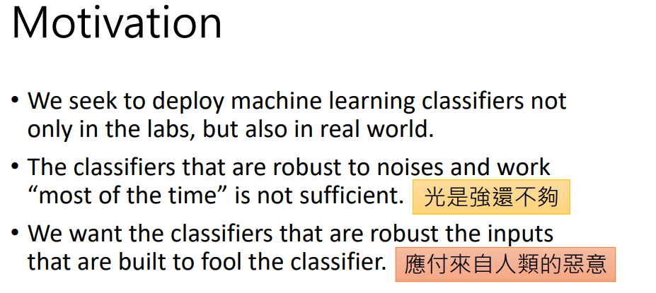
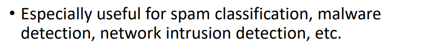
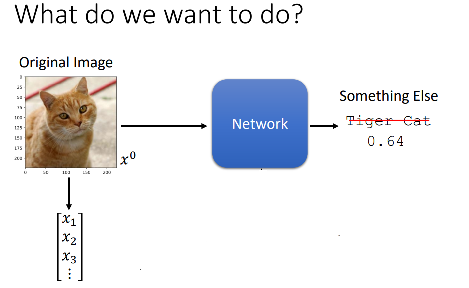

今天要讲的内容是Attack和Defense，

今天machine learning的技术非常的popular，我们当然期待这样的技术不只是用在实验室中，而是能够在日常生活中真正被实用。

但是我把machine learning的技术用在日常生活中，它光是好，这是不够的，它还要能够对抗带有恶意的攻击（假设有人制造一些特殊的输入，这些特殊的输入制造的目的就是为了要骗过machine learning的model）。希望machine learning不只是强，还要应对人类的恶意攻击。

你可能想说，真的会有人恶意攻击machine learning所学出来的model吗？其实是有可能的。因为有很多machine learning的应用，它本身就是想要侦测带有恶意的东西。比如：垃圾邮件的侦测，网络入侵的侦测（用machine learning的技术来侦测垃圾邮件，编写垃圾邮件的人就会想要把那些垃圾邮件进行改写，隐藏成可以骗过machine leaning model的垃圾邮件）。这也是为什么我们要研究如何攻击一个machine learning model，和防御一个machine learning model。

我们先来讲如何攻击一个model，在讲如何防御一个model。多出来的时间会讲如何攻击一个model的部分，因为攻击是比较容易的，多数machine learning的model其实相当容易被各式各样的方法攻破，防御目前仍然是比较困难的。

我们到底想要做什么样的攻击呢？例子：现在有一个影像侦测的模型，本来可以用影像的辨识。给它输入一张图片，就会输出这张图片里面是什么样的内容。（将如图所示的图片丢到Network中，Network的输出的信息分数是0.64。本来觉得Tiger cat这个答案是正确的，但是后来仔细Google一下觉得好像又没有那么正确。Google一下“Tiger cat”的中文名是：虎斑猫，好像是一个正确的答案，因为这确实是一只猫，根据它的班纹也许是一个虎斑猫。但是后来更仔细的Google了一下发现，虎斑猫其实不算是一种猫，好像是类似虎这样。这个辨识的结果好像没有完全的正确，不过没有关系，就当做machine 得到一个不完全正确的结果。给当前的machine输入一个图片，输出Tiger Cat的信息分数为0.64，你不会说它是一个很差的model，你会说它是一个做的还不错的model。

我们现在想要做的是：往图片上面加上一些杂讯，这些杂讯不是从gaussion distribution中随机生成的（随机生成的杂讯，没有办法真的对Network造成太大的伤害），这是种很特殊的讯号，把这些很特殊的讯号加到一张图片上以后，得到稍微有点不一样的图片。将这张稍微有点不一样的图片丢到Network中，Network会得到非常不一样的结果。

本来的图片叫做$x_0$，而现在是在原来的$x_0$上加上一个很特别的$\bigtriangleup  x$（$x_0+\bigtriangleup x$）得到一张新的图片$x'$（$x'=x_0+\bigtriangleup x$）。然后将$x'$丢到Network中，原来看到$x_0$时，Network会输出是一张Tiger Cat，但是这个Network看到时输出一个截然不同的答案（Attacked image， Else），那么这就是所谓攻击所要做的事情。

