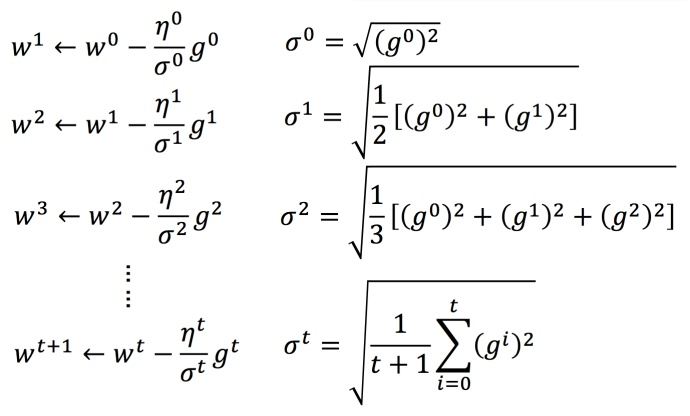
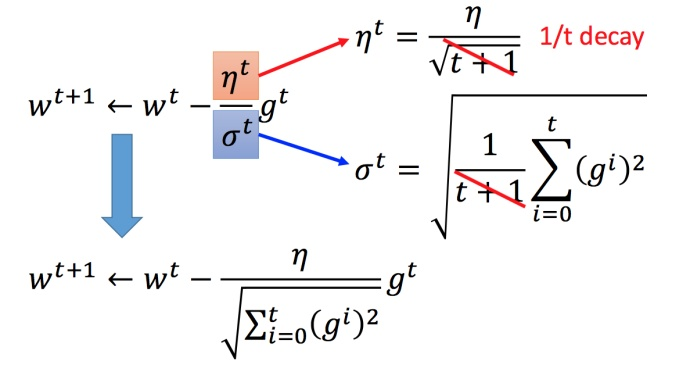
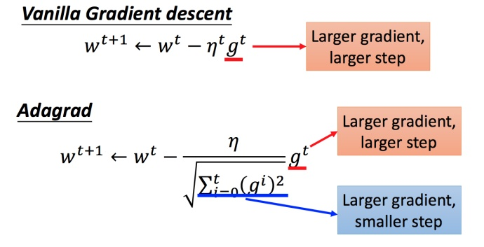
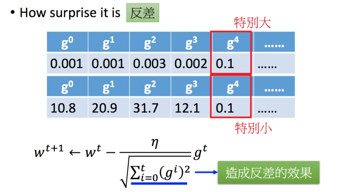
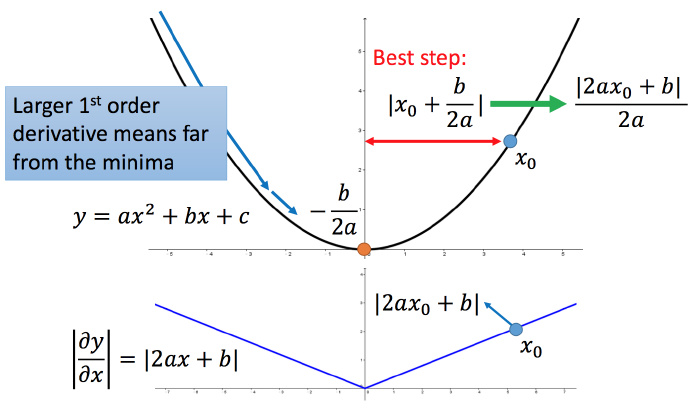
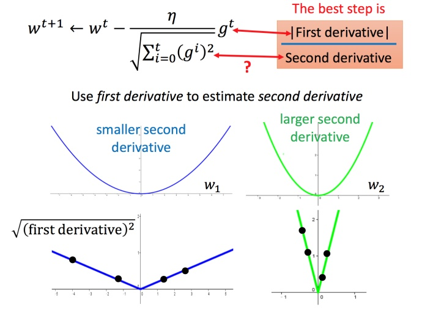
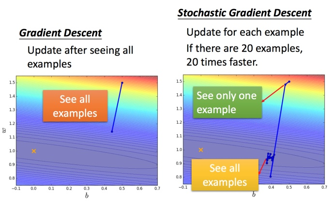
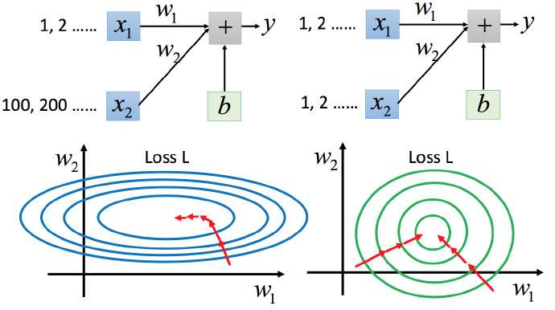
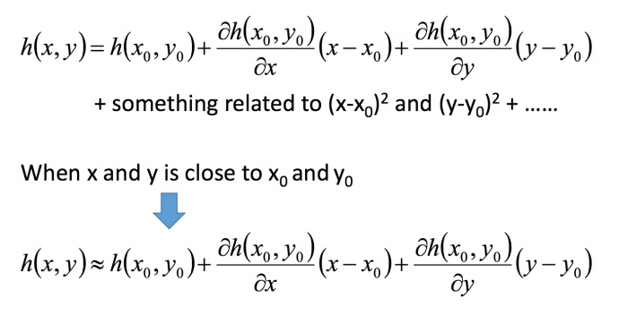
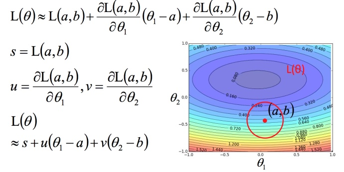

# 什么是梯度下降法？

在第二篇文章中有介绍到梯度下降法的做法，传送门：机器学习入门系列02，Regression 回归：案例研究

## Review: 梯度下降法
在回归问题的第三步中，需要解决下面的最优化问题：

$$\theta^∗= \underset{ \theta }{\operatorname{arg\ max}}  L(\theta) \tag1$$
- $L$ :lossfunction（损失函数）
- $\theta$ :parameters（参数）

这里的parameters是复数，即 $\theta$ 指代一堆参数，比如上篇说到的 $w$ 和 $b$ 。

我们要找一组参数 $\theta$ ，让损失函数越小越好，这个问题可以用梯度下降法解决：

假设 $\theta$ 有里面有两个参数 $\theta_1, \theta_2$
随机选取初始值

$$
\theta^0 = \begin{bmatrix}
\theta_1^0 \\
\theta_2^0
\end{bmatrix} \tag2
$$

这里可能某个平台不支持矩阵输入，看下图就好。

然后分别计算初始点处，两个参数对 $L$ 的偏微分，然后 $\theta^0$ 减掉 $\eta$ 乘上偏微分的值，得到一组新的参数。同理反复进行这样的计算。黄色部分为简洁的写法，$\triangledown L(\theta)$ 即为梯度。
 > $\eta$ 叫做Learning rates（学习速率）

上图举例将梯度下降法的计算过程进行可视化。

# Tip1：调整 学习速率
## 小心翼翼地调整 学习速率
举例：

上图左边黑色为损失函数的曲线，假设从左边最高点开始，如果 $learning rate$ 调整的刚刚好，比如红色的线，就能顺利找到最低点。如果 $learning rate$ 调整的太小，比如蓝色的线，就会走的太慢，虽然这种情况给足够多的时间也可以找到最低点，实际情况可能会等不及出结果。如果 $learning rate$ 调整的有点大，比如绿色的线，就会在上面震荡，走不下去，永远无法到达最低点。还有可能非常大，比如黄色的线，直接就飞出去了，update参数的时候只会发现损失函数越更新越大。

虽然这样的可视化可以很直观观察，但可视化也只是能在参数是一维或者二维的时候进行，更高维的情况已经无法可视化了。

解决方法就是上图右边的方案，将参数改变对损失函数的影响进行可视化。比如 learning rate 太小（蓝色的线），损失函数下降的非常慢；$learning rate$ 太大（绿色的线），损失函数下降很快，但马上就卡住不下降了；$learning rate$ 特别大（黄色的线），损失函数就飞出去了；红色的就是差不多刚好，可以得到一个好的结果。

## 自适应 学习速率
举一个简单的思想：随着次数的增加，通过一些因子来减少 $learning rate$
- 通常刚开始，初始点会距离最低点比较远，所以使用大一点的 $learning rate$
- update好几次参数之后呢，比较靠近最低点了，此时减少 $learning rate$
- 比如 $\eta^t =\frac{\eta^t}{\sqrt{t+1}}$，$t$ 是次数。随着次数的增加，$\eta^t$ 减小

但 $learning rate$ 不能是 one-size-fits-all ，不同的参数需要不同的 $learning rate$

## Adagrad 算法
### Adagrad 是什么？
每个参数的学习率都把它除上之前微分的均方根。解释：

普通的梯度下降为：

$$w^{t+1} \leftarrow  w^t -η^tg^t \tag3$$
$$\eta^t =\frac{\eta^t}{\sqrt{t+1}} \tag4$$
- $w$ 是一个参数

Adagrad 可以做的更好：
$$w^{t+1} \leftarrow  w^t -\frac{η^t}{\sigma}g^t \tag5$$
$$g^t =\frac{\partial L(\theta^t)}{\partial w} \tag6$$
- $\sigma^t$ :之前参数的所有微分的均方根，对于每个参数都是不一样的。

### Adagrad举例
下图是一个参数的更新过程

将 Adagrad 的式子进行化简：

### Adagrad 存在的矛盾？

在 Adagrad 中，当梯度越大的时候，步伐应该越大，但下面分母又导致当梯度越大的时候，步伐会越小。

下图是一个直观的解释：

下面给一个正式的解释：

比如初始点在 $x_0$，最低点为 $−\frac{b}{2a}$，最佳的步伐就是 $x0$ 到最低点之间的距离 $\left | x_0+\frac{b}{2a} \right |$，也可以写成 $\left | \frac{2ax_0+b}{2a} \right |$。而刚好 $|2ax_0+b|$ 就是方程绝对值在 $x_0$ 这一点的微分。

这样可以认为如果算出来的微分越大，则距离最低点越远。而且最好的步伐和微分的大小成正比。所以如果踏出去的步伐和微分成正比，它可能是比较好的。

结论1-1：梯度越大，就跟最低点的距离越远。

这个结论在多个参数的时候就不一定成立了。

### 多参数下结论不一定成立
对比不同的参数

上图左边是两个参数的损失函数，颜色代表损失函数的值。如果只考虑参数 $w_1$，就像图中蓝色的线，得到右边上图结果；如果只考虑参数 $w_2$，就像图中绿色的线，得到右边下图的结果。确实对于 $a$ 和 $b$，结论1-1是成立的，同理 $c$ 和 $b$ 也成立。但是如果对比$a$ 和 $c$，就不成立了，$c$ 比 $a$ 大，但 $c$ 距离最低点是比较近的。

所以结论1-1是在没有考虑跨参数对比的情况下，才能成立的。所以还不完善。

之前说到的最佳距离 $\left | \frac{2ax_0+b}{2a} \right |$，还有个分母 $2a$ 。对function进行二次微分刚好可以得到：
$$\frac{\partial ^2y}{\partial x^2} = 2a \tag7$$
所以最好的步伐应该是：
$$\frac{一次微分}{二次微分}$$
即不止和一次微分成正比，还和二次微分成反比。最好的step应该考虑到二次微分：

### Adagrad 进一步的解释
再回到之前的 Adagrad

对于 $\sqrt{\sum_{i=0}^t(g^i)^2}$ 就是希望再尽可能不增加过多运算的情况下模拟二次微分。（如果计算二次微分，在实际情况中可能会增加很多的时间消耗）

# Tip2：随机梯度下降法
之前的梯度下降：

$$L=\sum_n(\hat y^n-(b+\sum w_ix_i^n))^2 \tag8$$
$$\theta^i =\theta^{i-1}- \eta\triangledown L(\theta^{i-1}) \tag9$$

而Stochastic Gradient Descent（更快）：

损失函数不需要处理训练集所有的数据，选取一个例子 $x^n$

$$L=(\hat y^n-(b+\sum w_ix_i^n))^2 \tag{10}$$
$$\theta^i =\theta^{i-1}- \eta\triangledown L^n(\theta^{i-1}) \tag{11}$$

此时不需要像之前那样对所有的数据进行处理，只需要计算某一个例子的损失函数Ln，就可以赶紧update 梯度。

对比：

常规梯度下降法走一步要处理到所有二十个examples，但Stochastic 此时已经走了二十步（没处理一个example就更新）

# Tip3：特征缩放
比如有个function：

$$y=b+w_1x_1+w_2x_2 \tag{12}$$
两个输入的分布的范围很不一样，建议把他们的范围缩放，使得不同输入的范围是一样的。

## 为什么要这样做？

上图左边是 $x_1$ 的scale比 $x_2$ 要小很多，所以当 $w_1$ 和 $w_2$ 做同样的变化时，$w_1$ 对 $y$ 的变化影响是比较小的，$x_2$ 对 $y$ 的变化影响是比较大的。

坐标系中是两个参数的error surface（现在考虑左边蓝色），因为 $w_1$ 对 $y$ 的变化影响比较小，所以 $w_1$ 对损失函数的影响比较小，$w_1$ 对损失函数有比较小的微分，所以 $w_1$ 方向上是比较平滑的。同理 $x_2$ 对 $y$ 的影响比较大，所以 $x_2$ 对损失函数的影响比较大，所以在 $x_2$ 方向有比较尖的峡谷。

上图右边是两个参数scaling比较接近，右边的绿色图就比较接近圆形。

对于左边的情况，上面讲过这种狭长的情形不过不用Adagrad的话是比较难处理的，两个方向上需要不同的学习率，同一组学习率会搞不定它。而右边情形更新参数就会变得比较容易。左边的梯度下降并不是向着最低点方向走的，而是顺着等高线切线法线方向走的。但绿色就可以向着圆心（最低点）走，这样做参数更新也是比较有效率。

## 怎么做缩放？
方法非常多，这里举例一种常见的做法：

上图每一列都是一个例子，里面都有一组feature。

对每一个维度 $i$（绿色框）都计算平均数，记做 $m_i$；还要计算标准差，记做 $\sigma _i$。

然后用第 $r$ 个例子中的第 $i$ 个输入，减掉平均数 $m_i$，然后除以标准差 $\sigma _i$，得到的结果是所有的维数都是 $0$，所有的方差都是 $1$

# 梯度下降的理论基础
## 问题
当用梯度下降解决问题：

$$\theta^∗= \underset{ \theta }{\operatorname{arg\ max}}  L(\theta) \tag1$$

每次更新参数 $\theta$，都得到一个新的 $\theta$，它都使得损失函数更小。即：

$$L(\theta^0) >L(\theta^1)>L(\theta^2)>···\tag{13}$$

上述结论正确吗？

结论是不正确的。。。

# 数学理论

比如在 $\theta^0$ 处，可以在一个小范围的圆圈内找到损失函数细小的 $\theta^1$，不断的这样去寻找。

接下来就是如果在小圆圈内快速的找到最小值？

## 泰勒展开式
先介绍一下泰勒展开式

### 定义
若 $h(x)$ 在 $x=x_0$ 点的某个领域内有无限阶导数（即无限可微分，infinitely differentiable），那么在此领域内有：

$$
\begin{aligned}
h(x)  &= \sum_{k=0}^{\infty }\frac{h^k(x_0)}{k!}(x-x_0)^k  \\
& =h(x_0)+{h}'(x_0)(x−x_0)+\frac{h''(x_0)}{2!}(x−x_0)^2+⋯
\tag{14}
\end{aligned} 
$$

当 $x$ 很接近 $x_0$ 时，有 $h(x)≈h(x_0)+{h}'(x_0)(x−x_0)$
式14 就是函数 $h(x)$ 在 $x=x_0$ 点附近关于 $x$ 的幂函数展开式，也叫泰勒展开式。

举例：

图中3条蓝色线是把前3项作图，橙色线是 $sin(x)$。

### 多变量泰勒展开式
下面是两个变量的泰勒展开式

## 利用泰勒展开式简化
回到之前如何快速在圆圈内找到最小值。基于泰勒展开式，在 $(a,b)$ 点的红色圆圈范围内，可以将损失函数用泰勒展开式进行简化：

将问题进而简化为下图：

不考虑s的话，可以看出剩下的部分就是两个向量$(\triangle \theta_1,\triangle \theta_2)$ 和  $(u,v)$ 的内积，那怎样让它最小，就是和向量 $(u,v)$ 方向相反的向量

然后将u和v带入。

$$L(\theta)\approx s+u(\theta_1 - a)+v(\theta_2 - b) \tag{14}$$

发现最后的式子就是梯度下降的式子。但这里用这种方法找到这个式子有个前提，泰勒展开式给的损失函数的估算值是要足够精确的，而这需要红色的圈圈足够小（也就是学习率足够小）来保证。所以理论上每次更新参数都想要损失函数减小的话，即保证式1-2 成立的话，就需要学习率足够足够小才可以。

所以实际中，当更新参数的时候，如果学习率没有设好，是有可能式1-2是不成立的，所以导致做梯度下降的时候，损失函数没有越来越小。

式1-2只考虑了泰勒展开式的一次项，如果考虑到二次项（比如牛顿法），在实际中不是特别好，会涉及到二次微分等，多很多的运算，性价比不好。

# 梯度下降的限制

容易陷入局部极值
还有可能卡在不是极值，但微分值是0的地方
还有可能实际中只是当微分值小于某一个数值就停下来了，但这里只是比较平缓，并不是极值点

