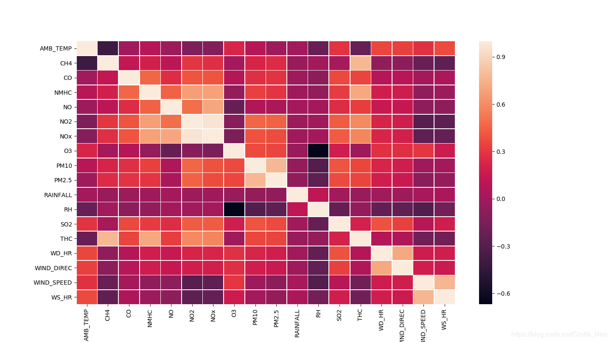
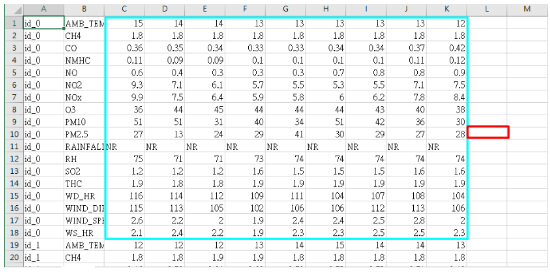
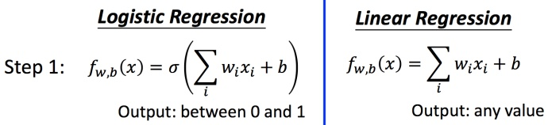
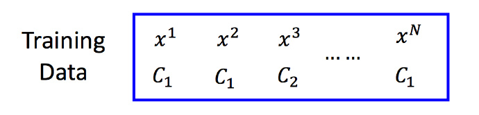
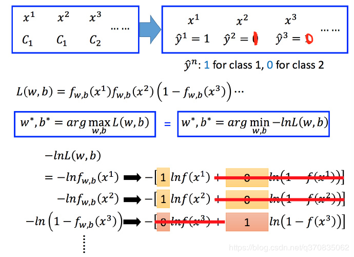
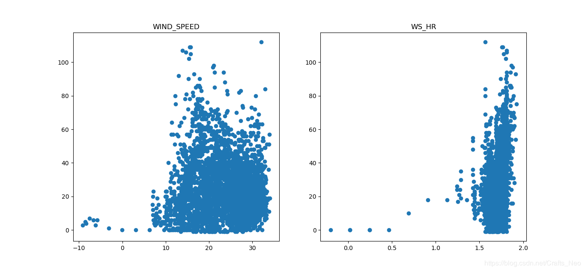

## 作业描述
>  让机器预测到丰原站在下一个小时会观测到的PM2.5。举例来说，现在是2017-09-29 08：00：00 ，那么要预测2017-09-29 09：00：00丰原站的PM2.5值会是多少。

## 任务要求

- 任务要求：**预测PM2.5的值**，我们将用**梯度下降法** (**Gradient Descent**) **预测 PM2.5** 的值 (**Regression** 回归问题)
- 环境要求：
  - 要求 **python3.5+**
  - 只能用
    - numpy
    - scipy
    - pandas
  - 请用梯度下降**手写线性回归**
  - 最好使用 **Public Simple Baseline**
  - 对于想加载模型而并不想运行整个训练过程的人：
    - 请上传训练代码并命名成 `train.py`
    - 只要用梯度下降的代码就行了
- 最佳要求：
  - 要求 **python3.5+** 
  - 任何库都可以用
  - 在 **Kaggle** 上获得你选择的更高的分
- 数据介绍：
  本次作业使用豐原站的觀測記錄，分成 **train set** 跟 **test set**，train set 是豐原站每個月的前20天所有資料，test set則是從豐原站剩下的資料中取樣出來。
  **train.csv**:每個月前20天每個小時的氣象資料(每小時有18種測資)。共12個月。
  **test**.csv:從剩下的資料當中取樣出連續的10小時為一筆，前九小時的所有觀測數據當作feature，第十小時的PM2.5當作answer。一共取出240筆不重複的 test data，請根據feauure預測這240筆的PM2.5。
- 请完成之后参考以下资料：
  - Sample_code:https://ntumlta.github.io/2017fall-ml-hw1/code.html
  - Supplementary_Slide:https://docs.google.com/presentation/d/1WwIQAVI0RRA6tpcieynPVoYDuMmuVKGvVNF_DSKIiDI/edit#slide=id.g1ef6d808f1_2_0
  - 答案参考**answer.csv**

## 任务实现
### 方案1

```python

'''
利用 Linear Regression 线性回归预测 PM2.5 
该方法参考黑桃大哥的优秀作业-|vv|-
'''

# 导入必要的包 numpy、pandas以及scikit-learn归一化预处理
import numpy as np
import pandas as pd
from sklearn.preprocessing import StandardScaler

# 指定相对路径
path = "./Dataset/"

# 利用 pands 进行读取文件操作
train = pd.read_csv(path + 'train.csv', engine='python', encoding='utf-8')
test = pd.read_csv(path + 'test.csv', engine='python', encoding='gbk')
train = train[train['observation'] == 'PM2.5']
# print(train)
test = test[test['AMB_TEMP'] == 'PM2.5']
# 删除无关特征
train = train.drop(['Date', 'stations', 'observation'], axis=1)
test_x = test.iloc[:, 2:]

train_x = []
train_y = []

for i in range(15):
    x = train.iloc[:, i:i + 9]
    # notice if we don't set columns name, it will have different columns name in each iteration
    x.columns = np.array(range(9))
    y = train.iloc[:, i + 9]
    y.columns = np.array(range(1))
    train_x.append(x)
    train_y.append(y)

# review "Python for Data Analysis" concat操作
# train_x and train_y are the type of Dataframe
# 取出 PM2.5 的数据，训练集中一共有 240 天，每天取出 15 组 含有 9 个特征 和 1 个标签的数据，共有 240*15*9个数据
train_x = pd.concat(train_x) # (3600, 9) Dataframe类型
train_y = pd.concat(train_y)

# 将str数据类型转换为 numpy的 ndarray 类型
train_y = np.array(train_y, float)
test_x = np.array(test_x, float)
# print(train_x.shape, train_y.shape)

# 进行标准缩放，即数据归一化
ss = StandardScaler()

# 进行数据拟合
ss.fit(train_x)
# 进行数据转换
train_x = ss.transform(train_x)

ss.fit(test_x)
test_x = ss.transform(test_x)

# 定义评估函数
# 计算均方误差（Mean Squared Error，MSE）
# r^2 用于度量因变量的变异中 可以由自变量解释部分所占的比例 取值一般为 0~1
def r2_score(y_true, y_predict):
    # 计算y_true和y_predict之间的MSE
    MSE = np.sum((y_true - y_predict) ** 2) / len(y_true)
    # 计算y_true和y_predict之间的R Square
    return 1 - MSE / np.var(y_true)

# 线性回归
class LinearRegression:

    def __init__(self):
        # 初始化 Linear Regression 模型
        self.coef_ = None
        self.intercept_ = None
        self._theta = None

    def fit_normal(self, X_train, y_train):
        # 根据训练数据集X_train, y_train训练Linear Regression模型
        assert X_train.shape[0] == y_train.shape[0], \
            "the size of X_train must be equal to the size of y_train"

        # 对训练数据集添加 bias
        X_b = np.hstack([np.ones((len(X_train), 1)), X_train])
        self._theta = np.linalg.inv(X_b.T.dot(X_b)).dot(X_b.T).dot(y_train)

        self.intercept_ = self._theta[0]
        self.coef_ = self._theta[1:]

        return self

    def fit_gd(self, X_train, y_train, eta=0.01, n_iters=1e4):
        '''
        :param X_train: 训练集
        :param y_train: label
        :param eta: 学习率
        :param n_iters: 迭代次数
        :return: theta 模型参数
        '''
        # 根据训练数据集X_train, y_train, 使用梯度下降法训练Linear Regression模型
        assert X_train.shape[0] == y_train.shape[0], \
            "the size of X_train must be equal to the size of y_train"

        # 定义损失函数
        def J(theta, X_b, y):
            try:
                return np.sum((y - X_b.dot(theta)) ** 2) / len(y)
            except:
                return float('inf')
        # 对损失函数求导
        def dJ(theta, X_b, y):
            return X_b.T.dot(X_b.dot(theta) - y) * 2. / len(y)

        def gradient_descent(X_b, y, initial_theta, eta, n_iters=1e4, epsilon=1e-8):
            '''
            :param X_b: 输入特征向量
            :param y: lebel
            :param initial_theta: 初始参数
            :param eta: 步长
            :param n_iters: 迭代次数
            :param epsilon: 容忍度
            :return:theta：模型参数
            '''
            theta = initial_theta
            cur_iter = 0

            while cur_iter < n_iters:
                gradient = dJ(theta, X_b, y)
                last_theta = theta
                theta = theta - eta * gradient
                if (abs(J(theta, X_b, y) - J(last_theta, X_b, y)) < epsilon):
                    break
                cur_iter += 1
            return theta

        X_b = np.hstack([np.ones((len(X_train), 1)), X_train])
        initial_theta = np.zeros(X_b.shape[1]) # 初始化theta
        self._theta = gradient_descent(X_b, y_train, initial_theta, eta, n_iters)
        self.intercept_ = self._theta[0]
        self.coef_ = self._theta[1:]
        return self

    def predict(self, X_predict):
        # 给定待预测数据集X_predict，返回表示X_predict的结果向量
        assert self.intercept_ is not None and self.coef_ is not None, \
            "must fit before predict!"
        assert X_predict.shape[1] == len(self.coef_), \
            "the feature number of X_predict must be equal to X_train"
        X_b = np.hstack([np.ones((len(X_predict), 1)), X_predict])
        return X_b.dot(self._theta)

    def score(self, X_test, y_test):
        # 根据测试数据集 X_test 和 y_test 确定当前模型的准确度
        y_predict = self.predict(X_test)
        return r2_score(y_test, y_predict)

    def __repr__(self):
        return

# 模型训练
LR = LinearRegression().fit_gd(train_x, train_y)
# 评分
LR.score(train_x, train_y)
# 预测
result = LR.predict(test_x)

# 结果保存
sampleSubmission = pd.read_csv(path + 'sampleSubmission.csv', engine='python', encoding='gbk')
sampleSubmission['value'] = result
sampleSubmission.to_csv(path + 'result.csv')
```
### 方案2

```python
#-*- coding:utf-8 -*-
# @File    : Predict_PM2dot5.py
# @Date    : 2019-05-19
# @Author  : 追风者
# @Software: PyCharm
# @Python Version: python 3.6

import numpy as np
import pandas as pd
import matplotlib.pyplot as plt
import seaborn as sns

# 数据读取与预处理
train_data = pd.read_csv("./Dataset/train.csv")
train_data.drop(['Date', 'stations'], axis=1, inplace=True)
column = train_data['observation'].unique()
# print(column)
new_train_data = pd.DataFrame(np.zeros([24*240, 18]), columns=column)

for i in column:
    train_data1 = train_data[train_data['observation'] == i]
    # Be careful with the inplace, as it destroys any data that is dropped!
    train_data1.drop(['observation'], axis=1, inplace=True)
    train_data1 = np.array(train_data1)
    train_data1[train_data1 == 'NR'] = '0'
    train_data1 = train_data1.astype('float')
    train_data1 = train_data1.reshape(1, 5760)
    train_data1 = train_data1.T
    new_train_data[i] = train_data1

label = np.array(new_train_data['PM2.5'][9:], dtype='float32')

# 探索性数据分析 EDA
# 最简单粗暴的方式就是根据 HeatMap 热力图分析各个指标之间的关联性
f, ax = plt.subplots(figsize=(9, 6))
sns.heatmap(new_train_data.corr(), fmt="d", linewidths=0.5, ax=ax)
plt.show()

# 模型选择
# a.数据归一化
# 使用前九个小时的 PM2.5 来预测第十个小时的 PM2.5，使用线性回归模型
PM = new_train_data['PM2.5']
PM_mean = int(PM.mean())
PM_theta = int(PM.var()**0.5)
PM = (PM - PM_mean) / PM_theta
w = np.random.rand(1, 10)
theta = 0.1
m = len(label)
for i in range(100):
    loss = 0
    i += 1
    gradient = 0
    for j in range(m):
        x = np.array(PM[j : j + 9])
        x = np.insert(x, 0, 1)
        error = label[j] - np.matmul(w, x)
        loss += error**2
        gradient += error * x

    loss = loss/(2*m)
    print(loss)
    w = w+theta*gradient/m
```


		  **热力图分析**  由热力图可直接看出，与**PM2.5**相关性较高的指标有**PM10**、**NO2**、**SO2**、**NOX**、**O3**、**THC**.

```python
# 打印损失函数
[301.76621466]
[228.34845921]
[189.62343004]
[159.73518205]
[135.63649698]
[116.10717244]
[100.25294032]
[87.36170872]
[76.8617656]
[68.2934691]
[61.28698881]
[55.54453984]
[50.82617376]
[46.93840439]
[43.72509587]
......
[22.17827769]
[22.1427191]
[22.10786632]
[22.07369828]
[22.04019474]
[22.00733629]
[21.97510423]
[21.94348063]
[21.91244821]
[21.88199035]
[21.85209108]
[21.822735]
[21.79390728]
```


### 方案3																			   

**模型设计**

- 数据预处理

  处理训练样本为 (18*9) 的矩阵
  

```python
#-*- coding:utf-8 -*-
# @File    : PM2.5Prediction.py
# @Date    : 2019-05-19
# @Author  : 追风者
# @Software: PyCharm
# @Python Version: python 3.6

'''
利用线性回归Linear Regression模型预测 PM2.5

特征工程中的特征选择与数据可视化的直观分析
通过选择的特征进一步建立回归模型
'''
import numpy as np
import pandas as pd
import matplotlib.pyplot as plt
import seaborn as sns

'''数据读取与预处理'''
# DataFrame类型
train_data = pd.read_csv("./Dataset/train.csv")
train_data.drop(['Date', 'stations', 'observation'], axis=1, inplace=True)

ItemNum=18
#训练样本features集合
X_Train=[]
#训练样本目标PM2.5集合
Y_Train=[]

for i in range(int(len(train_data)/ItemNum)):
    observation_data = train_data[i*ItemNum:(i+1)*ItemNum] #一天的观测数据
    for j in range(15):
        x = observation_data.iloc[:, j:j + 9]
        y = int(observation_data.iloc[9,j+9])
        # 将样本分别存入X_Train、Y_Train中
        X_Train.append(x)
        Y_Train.append(y)
# print(X_Train)
# print(Y_Train)
```

- 数据可视化

  绘制散点图，预测各特征与 PM2.5 的关系
  

```python
'''绘制散点图'''
x_AMB=[]
x_CH4=[]
x_CO=[]
x_NMHC=[]

# x_NO=[]
# x_NO2=[]
# x_NOX=[]
# x_O3=[]

# x_PM10=[]
# x_PM2Dot5=[]
# x_RAINFALL=[]
# x_RH=[]

# x_SO2=[]
# x_THC=[]
# x_WD_HR=[]
# x_WIND_DIREC=[]

# x_WIND_SPEED=[]
# x_WS_HR=[]
#
y=[]
#
# for i in range(len(Y_Train)):
#     y.append(Y_Train[i])
#     x=X_Train[i]
#     # print(type(x.iloc[0,0]))
#     # 求各测项的平均值
#     x_WIND_SPEED_sum = 0
#     x_WS_HR_sum = 0
#     for j in range(9):
#         x_WIND_SPEED_sum = x_WIND_SPEED_sum + float(x.iloc[0, j])
#         x_WS_HR_sum = x_WS_HR_sum + float(x.iloc[1, j])
#     x_WIND_SPEED.append(x_WIND_SPEED_sum / 9)
#     x_WS_HR.append(x_WS_HR_sum / 9)
# plt.figure(figsize=(10, 6))
# plt.subplot(1, 2, 1)
# plt.title('WIND_SPEED')
# plt.scatter(x_WIND_SPEED, y)
# plt.subplot(1, 2, 2)
# plt.title('WS_HR')
# plt.scatter(x_WS_HR, y)
# plt.show()
#     x_SO2_sum = 0
#     x_THC_sum = 0
#     x_WD_HR_sum = 0
#     x_WIND_DIREC_sum = 0
#     for j in range(9):
#         x_SO2_sum = x_SO2_sum + float(x.iloc[0, j])
#         x_THC_sum = x_THC_sum + float(x.iloc[1, j])
#         x_WD_HR_sum = x_WD_HR_sum + float(x.iloc[2, j])
#         x_WIND_DIREC_sum = x_WIND_DIREC_sum + float(x.iloc[3, j])
#     x_SO2.append(x_SO2_sum / 9)
#     x_THC.append(x_THC_sum / 9)
#     x_WD_HR.append(x_WD_HR_sum / 9)
#     x_WIND_DIREC.append(x_WIND_DIREC_sum / 9)
# plt.figure(figsize=(10, 6))
# plt.subplot(2, 2, 1)
# plt.title('SO2')
# plt.scatter(x_SO2, y)
# plt.subplot(2, 2, 2)
# plt.title('THC')
# plt.scatter(x_THC, y)
# plt.subplot(2, 2, 3)
# plt.title('WD_HR')
# plt.scatter(x_WD_HR, y)
# plt.subplot(2, 2, 4)
# plt.title('WIND_DIREC')
# plt.scatter(x_WIND_DIREC, y)
# plt.show()
#     x_PM10_sum = 0
#     x_PM2Dot5_sum = 0
#     x_RAINFALL_sum = 0
#     x_RH_sum = 0
#     for j in range(9):
#         x_PM10_sum = x_PM10_sum + float(x.iloc[0, j])
#         x_PM2Dot5_sum = x_PM2Dot5_sum + float(x.iloc[1, j])
#         x_RAINFALL_sum = x_RAINFALL_sum + float(x.iloc[2, j])
#         x_RH_sum = x_RH_sum + float(x.iloc[3, j])
#     x_PM10.append(x_PM10_sum / 9)
#     x_PM2Dot5.append(x_PM2Dot5_sum / 9)
#     x_RAINFALL.append(x_RAINFALL_sum / 9)
#     x_RH.append(x_RH_sum / 9)
# plt.figure(figsize=(10, 6))
# plt.subplot(2, 2, 1)
# plt.title('PM10')
# plt.scatter(x_PM10, y)
# plt.subplot(2, 2, 2)
# plt.title('PM2.5')
# plt.scatter(x_PM2Dot5, y)
# plt.subplot(2, 2, 3)
# plt.title('RAINFALL')
# plt.scatter(x_RAINFALL, y)
# plt.subplot(2, 2, 4)
# plt.title('RH')
# plt.scatter(x_RH, y)
# plt.show()
    x_AMB_sum=0
    x_CH4_sum=0
    x_CO_sum=0
    x_NMHC_sum=0
    for j in range(9):
        x_AMB_sum = x_AMB_sum + float(x.iloc[0,j])
        x_CH4_sum = x_CH4_sum + float(x.iloc[1, j])
        x_CO_sum = x_CO_sum + float(x.iloc[2, j])
        x_NMHC_sum = x_NMHC_sum + float(x.iloc[3, j])
    x_AMB.append(x_AMB_sum / 9)
    x_CH4.append(x_CH4_sum / 9)
    x_CO.append(x_CO_sum / 9)
    x_NMHC.append(x_NMHC_sum / 9)
plt.figure(figsize=(10, 6))
plt.subplot(2, 2, 1)
plt.title('AMB')
plt.scatter(x_AMB, y)
plt.subplot(2, 2, 2)
plt.title('CH4')
plt.scatter(x_CH4, y)
plt.subplot(2, 2, 3)
plt.title('CO')
plt.scatter(x_CO, y)
plt.subplot(2, 2, 4)
plt.title('NMHC')
plt.scatter(x_NMHC, y)
plt.show()
```
  

  




  



- 特征选择

  选择最具代表性的特征：**PM10**、**PM2.5**、**SO2**

- 模型建立

  建立线性回归模型
  $$
  y=b+\sum_{i=1}^{27} \mathcal{W}_{i} \times \mathcal{X}_{i} \\
  等价于 \\
  \mathrm{y}=b+w_{1} \times x_{1}+w_{2} \times x_{2}+\cdots+w_{27} \times x_{27}
  $$
  其中x1到x9是前九个时间点的PM10值，x10到x18是前9个时间点的PM2.5值，x19到x27是前9个时间点的SO2值，w为对应参数，b为偏移量

- 定义损失函数 (Gradient Descent)
  $$
  L \mathrm{oss}=\frac{1}{2} \sum_{i=1}^{m}\left(y_{i}-y_{\text {ireal}}\right)^{2}
  $$
  其中m为每次更新参数时使用的样本数,yi为预测值，yireal为真实值

  采用小批量梯度下降算法，并且设定批量样本大小为50，即每次随机在训练样本中选取50个用来更新参数

  设定学习率learning rate分别为0.000000001、0.0000001、0.000001时，比较不同的learning rate对损失函数收敛速度的影响

- 模型评估
  $$
  \mathrm{Model_-Evaluation}=\frac{1}{n} \sum_{i=1}^{n}\left(y_{i}-y_{\text {ireal}}\right)^{2}
  $$

## 总结

- 小批量梯度下降算法中，初始参数的选择很重要，不同的初始参数，其对应损失函数收敛速度也不一样
- learning rate 采用递减的方式选取的，根据经验的选择也很重要，说起来挺轻松的一件事，但实际操作起来，却四处碰壁，希望大家在实验中，多积累、多总结，机器学习不就是坑起坑落，挖坑、填坑、再挖坑、再填坑的反复训练过程么~v_v~

## 参考代码
https://github.com/datawhalechina/Leeml-Book/tree/master/docs/Homework/HW-1