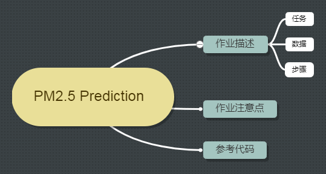

# 课程简介
> 本作业主要是使用Regression来预测丰原站下一个小时的PM2.5值

# PM2.5 Prediction
## 作业描述
让机器预测到丰原站在下一个小时会观测到的PM2.5。举例来说，现在是2017-09-29 08：00：00 ，那么要预测2017-09-29 09：00：00丰原站的PM2.5值会是多少。
### 任务
- 预测A年B月C日N时的PM2.5
	- 每个时间点以一个ID表示，共240个时间点。即没有给定确定时间，防止直接捞出数据。
	- 评比标准：预测值和实际值的平方误差平均值
- 预测根据：让机器根据前九个小时观测到的所有数据去预测下一个小时的PM2.5。
	- 假设要预测A年B月C日N时的PM2.5，给出的数据有A年B月C日（N-1，N-2,N-3,...,N-9）时的观测数据PM2.5,CH4,NO,NO2,O3...

根据前面所讲的机器学习，本次任务是找到一个function，使得 
$$f(前九个小时的所有数据)=A年B月C日N时的PM2.5 $$
### 数据
使用丰原的观测记录，分成train set跟test set，train set是丰原站每个月的前20天所有资料。test set则是从丰原站剩下的资料中取样出来。

Data含有18项观测数据AMB_TEMP, CH4, CO, NHMC, NO, NO2, NOx, O3, PM10, PM2.5, RAINFALL, RH, SO2, THC, WD_HR, WIND_DIREC, WIND_SPEED, WS_HR。

- train.csv: 每个月前20天的完整资料。

图2：

	
- test.csv : 从剩下的资料中取样出连续的10小时为一例，前九个小时的所有观测数据当做feature，第十个小时的PM2.5当做answer。一共取出240例不重复的test data,然后根据feature预测这240例的PM2.5。
图3：

第一个column是id,每个id代表一个时间点N，比如id_0代表一个时间点，id_1代表另一个时间点，第二个column代表各个不同的指标，接下来的这些数字是不同时间点观测到的不同值，最后一个column是N-1时观测到的值，倒数第二个是N-2，以此类推。你要做的事情就是让Machine用这些数字值去预测出id_0这个时间点的PM2.5

### 步骤
那么要怎么解这个问题呢？我们说Machine Learning就是三个Step。
 
- Step 1. 定义函数集（模型）

	第一个Step就是要定好你的function set,设好你的model。假设y是我们要找的值PM2.5,X下标K,M代表N-K这个时间点的M这个指标的观测值
	$\mathbf{y}$:A年B月C日N时的PM2.5
	$\mathbf{x_{K,M}}$:A年B月C日N-k时的M观测值，M=PM2.5,NO,O3,CH4,NO2...(共18种)

	现在我们要把function set写出来，那到底function长什么样子，需要进行多方尝试，比如如果PM2.5只与过去的PM2.5有关，那么function如下：
	$\mathbf{y}=b+W_{1,PM}X_{1,PM}+W_{2,PM}X_{2,PM}+...+W_{9,PM}X_{9,PM}$
	也许考虑前九个小时太多，会导致overfiting,这样可以考虑少一些，比如只考虑前5个小时：
	$\mathbf{y}=b+W_{1,PM}X_{1,PM}+W_{2,PM}X_{2,PM}+...+W_{5,PM}X_{5,PM}$
	当然，如果具有一些行业专业知识，可能会说PM2.5不是只有跟过去的PM2.5有关，它可能也跟其他指标有关，至于它跟哪些指标有关，这个你可以多方尝试了，当然如果你没有其他想法的话，可以把18种全部扔进去，比如跟NO,O3等有关，同时可以加入regrazation
	$\mathbf{y}=b+W_{1,PM}X_{1,PM}+W_{2,PM}X_{2,PM}+...+W_{5,PM}X_{5,PM}+W_{1,NO}X_{1,NO}+W_{2,NO}X_{2,NO}+...+W_{5,NO}X_{5,PM}+W_{1,O3}X_{1,O3}+W_{2,O3}X_{2,O3}+...+W_{5,O3}X_{5,O3}....+\lambda (所有w的平方和相加)$

- Step 2. 定义loss function

 	根据train数据定出loss function,可以第0-8小时的数据预测第9小时，第1-9小时预测第10小时的值，以此类推。线性回归采用均方误差即可

- Step 2. 寻找最优function

	方法：梯度下降法
	Tips:(1)不管采用什么特征，通过梯度下降法误差总会收敛
		(2)可以通过closed-form solution（解析解）来验证梯度下降法的结果，如果两者偏差比较大，可以通过调节学习率、检查代码或者加上Adam小技巧来改善。
	
	
# 注意点
- 如何处理非数值数据

	某些指标它不是数值，你要怎么表示它？比如RAINFALL=NR，表示not rain，用数值如何表示呢？设为0，还是-1，都可以试试看
- 善于利用训练数据

	不要只用第0-8小时预测第9小时，还需要加入1-9小时预测第10小时，2-10小时预测第11小时，这样训练数据量会增大，得到更好的结果
- validation data划分

	从train set中切分validation data,切记同分布，不能白天的数据都用于train,晚上的数据都用于validate

# 参考代码
https://github.com/maplezzz/ML2017S_Hung-yi-Lee_HW

